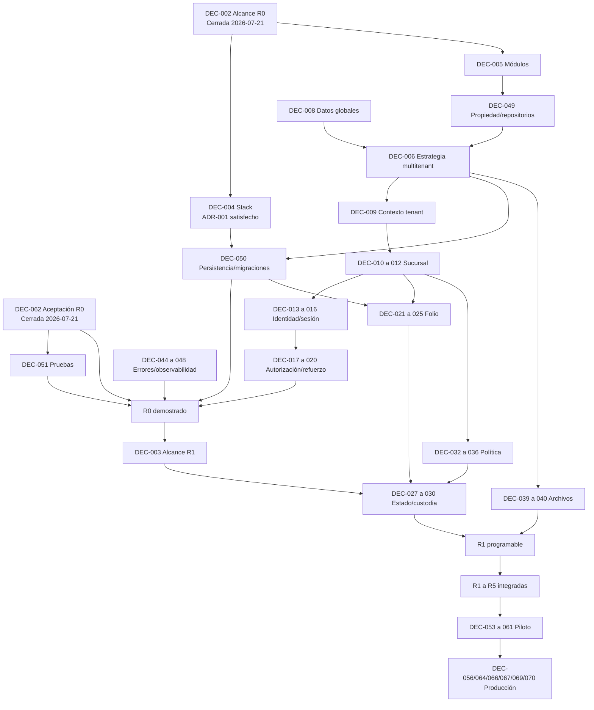

# Dependencias entre decisiones

## Mapa principal

## Dependencias de autoridad

`DEC-002` y `DEC-062` ya aportan la autoridad de Producto sobre alcance y contrato de salida de R0. No aportan autorización para implementar, selección tecnológica, Definition of Done ni aceptación de una demostración futura.

| Decisión técnica | Respuesta previa de producto |
| --- | --- |
| Lenguaje y runtime inicial | ADR-001 aceptado por Arquitectura + Ingeniería: TypeScript y Node.js `24.x`; no acepta framework ni tooling |
| ADR multitenant | Datos globales, tenant-wide, branch-scoped, ciclo del tenant |
| ADR de contexto operativo | Cerrado por ADR-010: estación vinculada, sucursal derivada, rotación y cambio explícito |
| ADR de identidad/PIN | Cerrado por ADR-011: usuario de tenant, acceso por PIN, sesión, inactividad y atribución mínima |
| ADR de roles/permisos | Cerrado por ADR-012: roles tenant-scoped, capacidades, unión, alcance y denegación por defecto |
| ADR de acciones sensibles | Cerrado por ADR-013: niveles, reautenticación, segundo aprobador, segregación, un solo uso e invalidación |
| ADR de folio | Alcance visible y transferencias entre sucursales |
| ADR de política | Campos, autoridad, precedencia y vigencia |
| ADR de tiempo | Zona por tenant/sucursal y significado operativo |
| ADR de archivos | Evidencia requerida, propósito, acceso y retención |
| ADR de custodia/estados | Catálogos, entrega y autoridad de excepciones |
| ADR de convivencia | Unidad de corte, datos a preservar y fuente de verdad |

## Dependencias técnicas condicionadas

- ADR-005 ya tiene satisfecha su dependencia de lenguaje/runtime por ADR-001, pero requiere su comparación y evidencia propias antes de aceptarse.
- SPIKE-002 parte de la estrategia shared-schema aceptada y depende de un contrato representativo y un mecanismo técnico autorizado para demostrar aislamiento.
- SPIKE-003 depende del resultado de SPIKE-002, PostgreSQL candidato y acceso de datos/pooling.
- SPIKE-005 parte del propósito y sesión aceptados por ADR-011; debe acotarse a protección técnica, intentos, revocación y relación con acciones sensibles.
- La prueba concurrente de folio depende de alcance del folio y persistencia candidata.
- Restore por tenant depende de estrategia multitenant, backups y clasificación de datos.
- Observabilidad de producción depende de recorridos y SLOs, no de elegir primero una herramienta.

## Decisiones que pueden cerrarse juntas

- `DEC-002` y `DEC-062`: cerradas para R0 el 2026-07-21; la implementación, las pruebas ejecutadas y la aceptación formal siguen pendientes.
- `DEC-007` a `DEC-012`: cerradas conceptualmente por ADR-004/010; su aplicación y pruebas se verifican juntas.
- `DEC-013` a `DEC-016`: cerradas conceptualmente por ADR-011; su aplicación y pruebas se coordinan con auditoría.
- `DEC-017` y `DEC-018`: cerradas conceptualmente por ADR-012; faltan composición por rebanada, aplicación y pruebas.
- `DEC-019` y `DEC-020`: cerradas conceptualmente por ADR-013; faltan clasificación concreta por rebanada, mecanismos, aplicación y pruebas.
- `DEC-021` a `DEC-025`: folio, concurrencia e idempotencia.
- `DEC-032` a `DEC-035`: política efectiva, snapshot, vigencia y campos.
- `DEC-044` a `DEC-048`: contrato transversal de errores, auditoría y señales.
- `DEC-053`, `DEC-054` y `DEC-061`: recuperación y rollback.

## Dependencias que no deben fusionarse

- estrategia multitenant de ADR-004, contexto operativo de ADR-010, identidad/sesión de ADR-011 y autorización ordinaria de ADR-012;
- autenticación primaria y autorización de acciones;
- estado de negocio y ubicación física;
- pago y entrega;
- recomendación técnica y cotización;
- auditoría de negocio y logs técnicos;
- backup exitoso y restauración demostrada.
