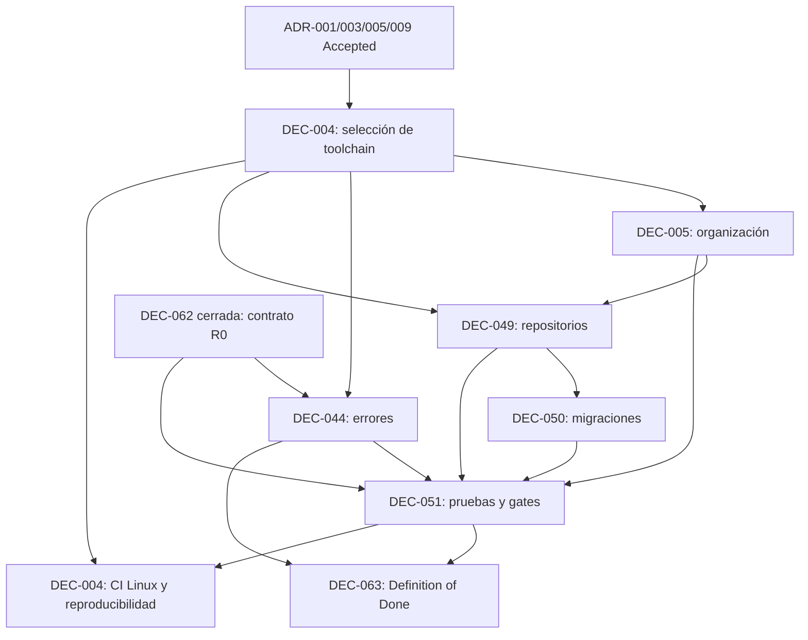

# Mapa de dependencias para desbloquear DEC-004

## Propósito y autoridad

Este documento analiza dependencias; no acepta, cierra ni cambia el estado de ninguna decisión. La fuente central de IDs y estados sigue siendo el [inventario consolidado](../blocker-closure/INVENTARIO_DE_BLOQUEANTES.md), y los ADR aceptados prevalecen sobre propuestas anteriores.

## Decisiones analizadas

| Decisión | Estado oficial | Alcance pendiente | Dependencias entrantes | Qué bloquea | ¿Resolución independiente? |
| --- | --- | --- | --- | --- | --- |
| `DEC-004` | Abierta/parcial | Package manager y versión, lockfile, scripts/supply chain, pinning, ESM/CommonJS, compilación TypeScript, compatibilidad integrada, CI Linux y reproducibilidad | `DEC-001`, `DEC-002`; ADR-001/003/005/009 aceptados | Toolchain reproducible; primer cambio ejecutable junto con los demás H0 | Parcialmente: la selección puede resolverse primero; la evidencia final necesita un gate mínimo de `DEC-051` |
| `DEC-005` | Abierta; parcialmente resuelta | Agrupación física inicial, ownership, APIs internas, imports permitidos, excepciones y enforcement | `DEC-001`, `DEC-002`; ADR-002/005/009 | Estructura de producto, `DEC-049`, pruebas arquitectónicas | No por completo; debe coordinarse con `DEC-049` y verificarse mediante `DEC-051` |
| `DEC-044` | Propuesta | Taxonomía, resultados seguros, mapeo entre capas, exposición externa, retryability y pruebas | Stack y casos de uso; ADR-004/005; `DEC-062` | Logs/correlación/observabilidad y contrato seguro de R0 | Sí en semántica; su gate se integra con `DEC-051/063` |
| `DEC-049` | Abierta; parcialmente resuelta | Puertos propietarios, repositorios tenant-aware, ownership de tablas, transacciones, accesos administrativos y herramienta de acceso a PostgreSQL | ADR-002/003/004/005/009; `DEC-005`; `DEC-007` materialmente respondida por ADR-004 | Persistencia real, `DEC-050`, aislamiento integrado y pruebas de repositorio | No; necesita la agrupación de `DEC-005` y la baseline tecnológica de `DEC-004` |
| `DEC-050` | Abierta; principios parciales aceptados | Migrador, naming, locking, ejecución, compatibilidad, rollback/roll-forward y evidencia | ADR-003/004; `DEC-004`, `DEC-049`; estrategia de pruebas aplicable | Migraciones reproducibles, fixtures e integración PostgreSQL | No; debe seguir a `DEC-049` y coordinarse con `DEC-051` |
| `DEC-051` | Propuesta | Runner, capas, gates, cobertura, checker arquitectónico, integración PostgreSQL, aislamiento, CI y cuarentena | `DEC-002`, `DEC-062`, riesgos; ADR-004/005; toolchain de `DEC-004`; límites de `DEC-005/049` | Evidencia de CI para DEC-004, pruebas de R0, `DEC-052` y `DEC-063` | No completamente; el contrato mínimo puede prepararse con `DEC-004`, pero el gate final necesita estructura y persistencia decididas |
| `DEC-063` | Propuesta | Subconjuntos obligatorios por cambio, autoridades, umbrales, excepciones y evidencia | `DEC-051`, `DEC-062`; contratos de `DEC-044` | Declaración verificable de terminado y liberación del primer cambio | No; debe cerrar después de `DEC-051` y usar `DEC-062` como contrato de producto |

## Dependencias aceptadas que ya no deben reabrirse

| Autoridad aceptada | Contenido que aporta |
| --- | --- |
| [ADR-001](../../decisions/proposed/ADR-001-typescript-as-primary-language.md) — secciones “Decisión”, “Runtime oficial inicial” y “Seguridad de tipos” | TypeScript, Node.js `24.x`, validación runtime y gobierno de excepciones |
| [ADR-002](../../decisions/proposed/ADR-002-modular-monolith-first.md) — “Decisión”, “Reglas arquitectónicas obligatorias” y “Propiedad de datos” | Monolito modular, un artefacto, dominio independiente, dependencias acíclicas y ownership lógico |
| [ADR-003](../../decisions/proposed/ADR-003-postgresql-primary-database.md) — “Baseline técnica de R0”, “Principios de persistencia”, “Migraciones” y “ORM, query builder, driver y repositorios” | PostgreSQL `18.x`/`18.4`, principios de persistencia y migración; tooling explícitamente pendiente |
| [ADR-004](../../decisions/proposed/ADR-004-shared-schema-multitenancy.md) — “Decisión”, “Matriz de propiedad lógica”, “Contexto confiable”, “Módulos y repositorios” y “Controles y pruebas requeridos” | Base/esquema compartidos, discriminación tenant/sucursal, contexto server-side y pruebas negativas |
| [ADR-005](../../decisions/proposed/ADR-005-nestjs-backend.md) — “Decisión”, “NestJS es shell”, “Persistencia y lifecycle”, “Pruebas arquitectónicas obligatorias” y “Condiciones de aceptación” | NestJS `11.x`, Express, REST/JSON, límites de capas y precondiciones para el primer recorrido |
| [ADR-009](../../decisions/proposed/ADR-009-monorepo-strategy.md) — “Decisión”, “Dependencias”, “Tooling deliberadamente diferido” y relaciones con DEC-005/049 | Repositorio único, una app/artefacto, sin workspaces ni packages anticipatorios |
| [ADR-010](../../decisions/proposed/ADR-010-station-bound-operational-context.md) — “Decisión”, “Resolución del contexto” y “Reglas obligatorias” | Tenant/sucursal derivados de estación vinculada; contexto inmutable y fail closed |
| [ADR-011](../../decisions/proposed/ADR-011-tenant-user-pin-authentication-and-operational-session.md) — “Contrato conceptual del PIN”, “Sesión operativa” y “Decisiones diferidas” | PIN tenant-scoped, una sesión activa por estación y mecanismos técnicos aún abiertos |
| [ADR-012](../../decisions/proposed/ADR-012-tenant-roles-capabilities-and-contextual-authorization.md) — “Modelo de roles”, “Modelo de capacidades”, “Asignaciones y alcance” y “Evaluación de autorización” | Roles tenant-scoped, unión de capacidades, alcance y denegación server-side |
| [ADR-013](../../decisions/proposed/ADR-013-sensitive-actions-and-reinforced-authorization.md) — “Clasificación conceptual mínima”, “Reautenticación”, “Segundo usuario” y “Decisiones diferidas” | Niveles 1–4, un solo uso, segregación y política concreta pendiente por acción |

## Tabla de dependencias entre las siete decisiones

Las relaciones distinguen una dependencia normativa de una dependencia de evidencia. Esta distinción evita un ciclo falso entre `DEC-004` y `DEC-051`.

| Desde | Hacia | Tipo | Razón |
| --- | --- | --- | --- |
| `DEC-004` — selección | `DEC-005` | Técnica | La organización física y su enforcement necesitan módulos, compilación y scripts conocidos |
| `DEC-004` — selección | `DEC-049` | Técnica | Driver/ORM/query builder deben ser compatibles con Node.js, TypeScript y PostgreSQL aceptados |
| `DEC-004` — selección | `DEC-044` | Técnica menor | El contrato es agnóstico, pero la adaptación exterior usa NestJS/REST aceptados |
| `DEC-004` — selección | `DEC-051` | Técnica | Runner, scripts y CI dependen del package manager, módulos y compilación |
| `DEC-005` | `DEC-049` | Arquitectónica | Ownership de módulos y datos determina dónde viven puertos y adaptadores |
| `DEC-005` | `DEC-051` | Evidencia | Las reglas de imports, ciclos y capas deben convertirse en gates |
| `DEC-049` | `DEC-050` | Técnica | El migrador debe convivir con la estrategia y propiedad de acceso a datos |
| `DEC-049` | `DEC-051` | Evidencia | Las pruebas de integración necesitan contratos de repositorio y persistencia real |
| `DEC-044` | `DEC-051` | Evidencia | La taxonomía y no divulgación deben probarse |
| `DEC-044` | `DEC-063` | Calidad | La DoD debe exigir errores seguros cuando apliquen |
| `DEC-050` | `DEC-051` | Evidencia bidireccional acotada | `DEC-050` define qué probar; `DEC-051` define el gate que ejecuta migraciones |
| `DEC-051` | `DEC-004` — evidencia final | Evidencia | El cierre de DEC-004 exige primera ejecución real del gate CI en Linux |
| `DEC-051` | `DEC-063` | Gobierno de calidad | La DoD consume gates y evidencia aprobados, no inventa otra suite |

## Grafo

`DEC-004: selección` y `DEC-004: evidencia` son fases analíticas de la misma decisión, no IDs ni decisiones nuevas.

## Bloqueantes directos e indirectos de DEC-004

### Para cerrar estrictamente la decisión de plataforma

Son directos:

- escoger y fijar package manager y versión;
- decidir política de lockfile y scripts de instalación;
- fijar Node.js `24.x` a una versión efectiva reproducible;
- decidir ESM/CommonJS y compilación/ejecución TypeScript;
- revalidar versiones alineadas de NestJS `11.x`;
- definir instalación reproducible y supply chain mínima;
- ejecutar compatibilidad integrada y el gate real sobre Linux.

`DEC-051` es una dependencia de evidencia para el último punto. No debe absorber el resto de DEC-004.

### Para construir la fundación ejecutable R0 que motivó el intento anterior

Además son bloqueantes:

- `DEC-005` y `DEC-049`, para estructura y persistencia tenant-aware;
- `DEC-044`, para resultados seguros;
- `DEC-050`, para migraciones reproducibles;
- `DEC-051` y `DEC-063`, para evidencia y criterio de terminado;
- mecanismos H1 de estación, PIN, sesión y revocación;
- composición concreta de roles/capacidades y clasificación de acciones;
- threat model, secretos, auditoría mínima y autorización organizacional.

Por tanto, **cerrar DEC-004 no equivale a declarar R0 programable o completo**.

## Lectura de la ruta crítica

La dependencia real empieza por el remanente de `DEC-004`, no porque tenga el número más bajo, sino porque fija las herramientas que `DEC-005`, `DEC-049` y `DEC-051` deben organizar y verificar. Después, `DEC-005` y `DEC-049` forman el núcleo estructural; `DEC-044` puede trabajarse en paralelo; `DEC-050` sigue a la decisión de acceso a datos; `DEC-051` consolida los gates; `DEC-063` consume esos gates. La evidencia Linux y de reproducibilidad vuelve finalmente a DEC-004 para recomendar su cierre.
