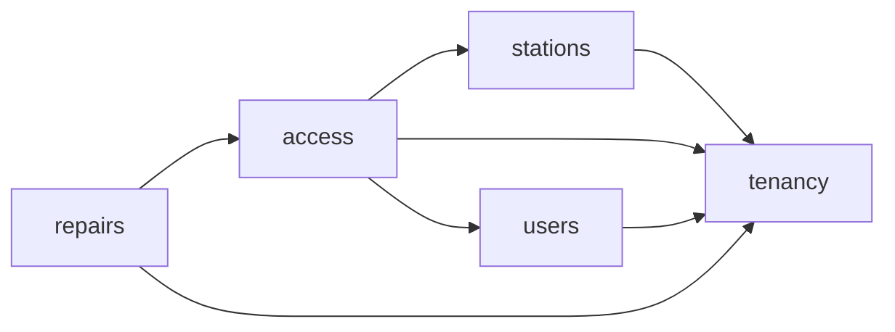

# Grafo de dependencias materializado

## Grafo aprobado



La flecha va del consumidor al productor.

## Grafo observado

| Consumidor | Productor | Archivo consumidor | Superficie consumida | Tipo runtime |
| --- | --- | --- | --- | --- |
| `stations` | `tenancy` | `src/modules/stations/index.ts` | `TenancyModuleContract` desde `tenancy/index.ts` | Ninguno; `import type` |
| `access` | `stations` | `src/modules/access/index.ts` | `StationsModuleContract` desde `stations/index.ts` | Ninguno; `import type` |
| `access` | `stations` | `src/modules/access/access.module.ts` | `StationsModule` más `TRUSTED_STATION_CONTEXT_RESOLVER`/`TrustedStationContextResolver` y `TRUSTED_STATION_ADMISSION_VALIDATOR`/`TrustedStationAdmissionValidator` registrados | Sí; composición dirigida Option A y contexto transaccional opaco |
| `access` | `tenancy` | `src/modules/access/index.ts` | `TenancyModuleContract` desde `tenancy/index.ts` | Ninguno; `import type` |
| `access` | `users` | `src/modules/access/index.ts` | `UsersModuleContract` desde `users/index.ts` | Ninguno; `import type` |
| `access` | `users` | `src/modules/access/access.module.ts` | `UsersModule` más `AUTHENTICATION_USER_READER`/`AuthenticationUserReader` y `AUTHENTICATION_USER_ADMISSION_VALIDATOR`/`AuthenticationUserAdmissionValidator` registrados | Sí; composición dirigida Option A y contexto transaccional opaco |
| `repairs` | `access` | `src/modules/repairs/application/repair-protected-operations.ts` | `AuthorizedOperationalContext`, `ContextualAuthorizationExecutor` y `ProtectedRequestEvidence` desde `access/index.ts` | Sí; ejecución de autorización contextual por operación con requirement fijo del servidor |
| `repairs` | `access` | `src/modules/repairs/repairs.module.ts` | `AccessModule` más `CONTEXTUAL_AUTHORIZATION_EXECUTOR`/`ContextualAuthorizationExecutor` registrados | Sí; composición dirigida Option A |
| `repairs` | `tenancy` | `src/modules/repairs/application/ports/repair-repository.port.ts` | `TenantId` desde `tenancy/index.ts` | Ninguno; `import type` |
| `users` | `tenancy` | `src/modules/users/index.ts` | `TenancyModuleContract` desde `tenancy/index.ts` | Ninguno; `import type` |

El checker local ejecutado reportó exactamente:

```text
access->stations, access->tenancy, access->users, repairs->access, repairs->tenancy, stations->tenancy, users->tenancy
```

## Composición exterior

`src/app.module.ts` importa directamente:

- `repairs/repairs.module.ts`;
- `access/access.module.ts`;
- `stations/stations.module.ts`;
- `tenancy/tenancy.module.ts`;
- `users/users.module.ts`.

`AppModule` conserva la composición exterior exacta de esos módulos. Además,
la policy v5 registra tres imports de composición interna dirigidos:

- `AccessModule` importa `StationsModule` porque existe `access->stations`;
- `AccessModule` importa `UsersModule` porque existe `access->users`;
- `RepairsModule` importa `AccessModule` porque existe `repairs->access`.

El import de una clase `<module>.module.ts` no sustituye el contrato funcional:
los tokens e interfaces se consumen desde el `index.ts` público del productor.
La presencia de un edge en el grafo tampoco basta por sí sola; D5-R024 exige un
registro exacto de consumer/producer, módulos, specifier, tokens, interfaces y
bindings. Cualquier otra composición interna falla cerrada.

## Invariantes

- El grafo es acíclico.
- No existen edges inversos.
- Todo contrato intermodular termina en el `index.ts` productor; sólo las tres
  clases Nest registradas cruzan como superficies de composición.
- No hay acceso a internals, adapters, repositories o persistencia ajena.
- Un edge nuevo exige actualizar y aprobar la policy antes del import; un nuevo
  import de módulo requiere además su registro de composición dirigida.

La inspección acotada de las primeras dos aristas para PBI-034 se registra en
[PBI-034 Option A Verification](PBI_034_OPTION_A_VERIFICATION.md); checker,
fixtures y mutaciones, candidate CI y exact-main CI están verdes. La tercera
arista y su boundary de PBI-026 se registran en
[PBI-026 Option A Verification](PBI_026_OPTION_A_VERIFICATION.md); candidate,
focused review, merge funcional y exact-main CI también están verdes.
