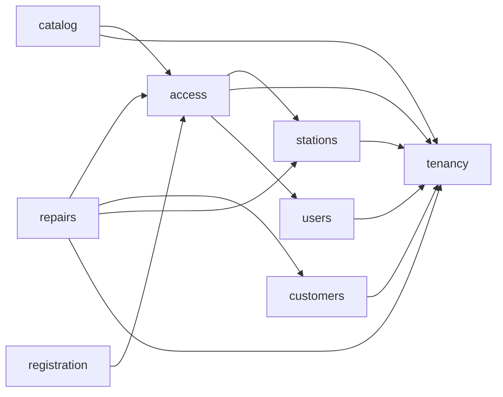

# Grafo de dependencias materializado

## Grafo aprobado



La flecha va del consumidor al productor.

## Grafo observado

| Consumidor | Productor | Archivo consumidor | Superficie consumida | Tipo runtime |
| --- | --- | --- | --- | --- |
| `stations` | `tenancy` | `src/modules/stations/index.ts` | `TenancyModuleContract` desde `tenancy/index.ts` | Ninguno; `import type` |
| `access` | `stations` | `src/modules/access/index.ts` | `StationsModuleContract` desde `stations/index.ts` | Ninguno; `import type` |
| `access` | `stations` | `src/modules/access/access.module.ts` | `StationsModule` más `BRANCH_ADMINISTRATION_RUNTIME`/`BranchAdministrationRuntime`, `BRANCH_SETTINGS_RUNTIME`/`BranchSettingsRuntime`, `TRUSTED_STATION_CONTEXT_RESOLVER`/`TrustedStationContextResolver` y `TRUSTED_STATION_ADMISSION_VALIDATOR`/`TrustedStationAdmissionValidator` registrados | Sí; composición dirigida Option A y contexto transaccional opaco |
| `stations` | `tenancy` | `src/modules/stations/stations.module.ts` | `TenancyModule` más `TENANT_LIFECYCLE_COMMIT_RUNTIME`/`TenantLifecycleCommitRuntime` registrados | Sí; activación Tenant dentro de la transacción Branch mediante contexto opaco |
| `access` | `tenancy` | `src/modules/access/index.ts` | `TenancyModuleContract` desde `tenancy/index.ts` | Ninguno; `import type` |
| `access` | `tenancy` | `src/modules/access/access.module.ts` | `TENANT_BOOTSTRAP_PERSISTENCE`/`TenantBootstrapPersistence` desde `tenancy/index.ts` | Sí; bootstrap atómico mediante contrato público |
| `access` | `users` | `src/modules/access/index.ts` | `UsersModuleContract` desde `users/index.ts` | Ninguno; `import type` |
| `access` | `users` | `src/modules/access/access.module.ts` | `UsersModule` más `AUTHENTICATION_USER_READER`/`AuthenticationUserReader`, `AUTHENTICATION_USER_ADMISSION_VALIDATOR`/`AuthenticationUserAdmissionValidator`, `USER_PRODUCT_RUNTIME`/`UserProductRuntime` y `USER_PREFERENCES_RUNTIME`/`UserPreferencesRuntime` registrados | Sí; composición dirigida Option A y contexto transaccional opaco |
| `registration` | `access` | `src/modules/registration/registration.module.ts` | `REGISTRATION_PASSWORD_PROTECTOR`/`RegistrationPasswordProtector` y `TENANT_BOOTSTRAP_EXECUTOR`/`TenantBootstrapExecutor` | Sí; password protegido y bootstrap sólo desde Attempt verificado server-side |
| `customers` | `tenancy` | `src/modules/customers/infrastructure/persistence/kysely-customer-intake.repository.ts` | `parseTenantId` desde `tenancy/index.ts` | Sí; validación de identidad Tenant sin aceptar scope del cliente |
| `catalog` | `access` | `src/modules/catalog/catalog.module.ts` y `src/modules/catalog/application/catalog-protected-operations.ts` | `CONTEXTUAL_AUTHORIZATION_EXECUTOR` y `TENANT_WIDE_AUTHORIZATION_EXECUTOR` con contratos públicos | Sí; autorización por capability, alcance Branch o Tenant-wide y guard transaccional según la operación |
| `catalog` | `tenancy` | `src/modules/catalog/catalog.module.ts` | `TENANT_SETTINGS_RUNTIME`/`TenantSettingsRuntime` | Sí; lectura de moneda operativa Tenant sin duplicar ownership de configuración |
| `repairs` | `access` | `src/modules/repairs/application/repair-protected-operations.ts` | `AuthorizedOperationalContext`, `ContextualAuthorizationExecutor` y `ProtectedRequestEvidence` desde `access/index.ts` | Sí; ejecución de autorización contextual por operación con requirement fijo del servidor |
| `repairs` | `access` | `src/modules/repairs/repairs.module.ts` | `AccessModule` más `CONTEXTUAL_AUTHORIZATION_EXECUTOR`/`ContextualAuthorizationExecutor` registrados | Sí; composición dirigida Option A |
| `repairs` | `customers` | `src/modules/repairs/application/use-cases/create-repair.use-case.ts` y `src/modules/repairs/repairs.module.ts` | `CustomerIntakeRuntime`/`CUSTOMER_INTAKE_RUNTIME` desde `customers/index.ts` | Sí; búsqueda y selección/alta Customer dentro del Intake autorizado |
| `repairs` | `stations` | `src/modules/repairs/application/repair-protected-operations.ts` y `src/modules/repairs/repairs.module.ts` | `BranchTimeZone`, límites de calendario local y `BRANCH_SETTINGS_RUNTIME`/`BranchSettingsRuntime` desde `stations/index.ts` | Sí; composición dirigida para obtener la zona IANA de la Branch ya autorizada; no recibe scope del cliente |
| `repairs` | `tenancy` | `src/modules/repairs/application/ports/repair-repository.port.ts` | `TenantId` desde `tenancy/index.ts` | Ninguno; `import type` |
| `users` | `tenancy` | `src/modules/users/index.ts` | `TenancyModuleContract` desde `tenancy/index.ts` | Ninguno; `import type` |

El checker local ejecutado reportó exactamente:

```text
access->stations, access->tenancy, access->users, catalog->access, catalog->tenancy, customers->tenancy, registration->access, repairs->access, repairs->customers, repairs->stations, repairs->tenancy, stations->tenancy, users->tenancy
```

## Composición exterior

`src/app.module.ts` importa directamente:

- `repairs/repairs.module.ts`;
- `access/access.module.ts`;
- `customers/customers.module.ts`;
- `stations/stations.module.ts`;
- `tenancy/tenancy.module.ts`;
- `users/users.module.ts`.
- `catalog/catalog.module.ts`.
- `registration/registration.module.ts`.

`AppModule` conserva la composición exterior exacta de esos módulos. Además,
la policy v10 registra diez imports de composición interna dirigidos:

- `AccessModule` importa `StationsModule` porque existe `access->stations`;
- `StationsModule` importa `TenancyModule` porque existe `stations->tenancy`;
- `AccessModule` importa `UsersModule` porque existe `access->users`;
- `AccessModule` importa `TenancyModule` porque existe `access->tenancy` y
  consume la persistencia pública de bootstrap.
- `RepairsModule` importa `AccessModule` porque existe `repairs->access`.
- `RepairsModule` importa `CustomersModule` porque existe `repairs->customers`.
- `RepairsModule` importa `StationsModule` porque existe `repairs->stations` y
  consume únicamente el runtime de timezone de la Branch ya autorizada.
- `CatalogModule` importa `AccessModule` porque existe `catalog->access` y
  consume únicamente los dos executors públicos de autorización.
- `CatalogModule` importa `TenancyModule` porque existe `catalog->tenancy` y
  consume únicamente la configuración pública de moneda Tenant.
- `RegistrationModule` importa `AccessModule` porque existe
  `registration->access` y consume sólo password protection y bootstrap.

El import de una clase `<module>.module.ts` no sustituye el contrato funcional:
los tokens e interfaces se consumen desde el `index.ts` público del productor.
La presencia de un edge en el grafo tampoco basta por sí sola; D5-R024 exige un
registro exacto de consumer/producer, módulos, specifier, tokens, interfaces y
bindings. Cualquier otra composición interna falla cerrada.

## Invariantes

- El grafo es acíclico.
- No existen edges inversos.
- Todo contrato intermodular termina en el `index.ts` productor; sólo las nueve
  clases Nest registradas cruzan como superficies de composición.
- No hay acceso a internals, adapters, repositories o persistencia ajena.
- Un edge nuevo exige actualizar y aprobar la policy antes del import; un nuevo
  import de módulo requiere además su registro de composición dirigida.

La inspección acotada de las primeras dos aristas para PBI-034 se registra en
[PBI-034 Option A Verification](PBI_034_OPTION_A_VERIFICATION.md); checker,
fixtures y mutaciones, candidate CI y exact-main CI están verdes. La tercera
arista y su boundary de PBI-026 se registran en
[PBI-026 Option A Verification](PBI_026_OPTION_A_VERIFICATION.md); candidate,
focused review, merge funcional y exact-main CI también están verdes.
