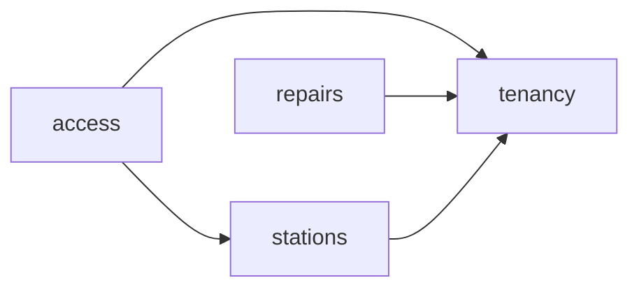

# Grafo de dependencias materializado

## Grafo aprobado



La flecha va del consumidor al productor.

## Grafo observado

| Consumidor | Productor | Archivo consumidor | Superficie consumida | Tipo runtime |
| --- | --- | --- | --- | --- |
| `stations` | `tenancy` | `src/modules/stations/index.ts` | `TenancyModuleContract` desde `tenancy/index.ts` | Ninguno; `import type` |
| `access` | `stations` | `src/modules/access/index.ts` | `StationsModuleContract` desde `stations/index.ts` | Ninguno; `import type` |
| `access` | `tenancy` | `src/modules/access/index.ts` | `TenancyModuleContract` desde `tenancy/index.ts` | Ninguno; `import type` |
| `repairs` | `tenancy` | `src/modules/repairs/application/ports/repair-repository.port.ts` | `TenantId` desde `tenancy/index.ts` | Ninguno; `import type` |

El resultado del checker es exactamente:

```text
access->stations, access->tenancy, repairs->tenancy, stations->tenancy
```

## Composición exterior

`src/app.module.ts` importa directamente:

- `repairs/repairs.module.ts`;
- `access/access.module.ts`;
- `stations/stations.module.ts`;
- `tenancy/tenancy.module.ts`.

Esta composición no agrega edges funcionales al grafo. Ningún archivo distinto
de `AppModule` importa una superficie `<module>.module.ts`.

## Invariantes

- El grafo es acíclico.
- No existen edges inversos.
- Todo consumo intermodular termina en el `index.ts` productor.
- No hay acceso a internals, adapters, repositories o persistencia ajena.
- Un edge nuevo exige actualizar y aprobar la policy antes del import.
`users->tenancy`
