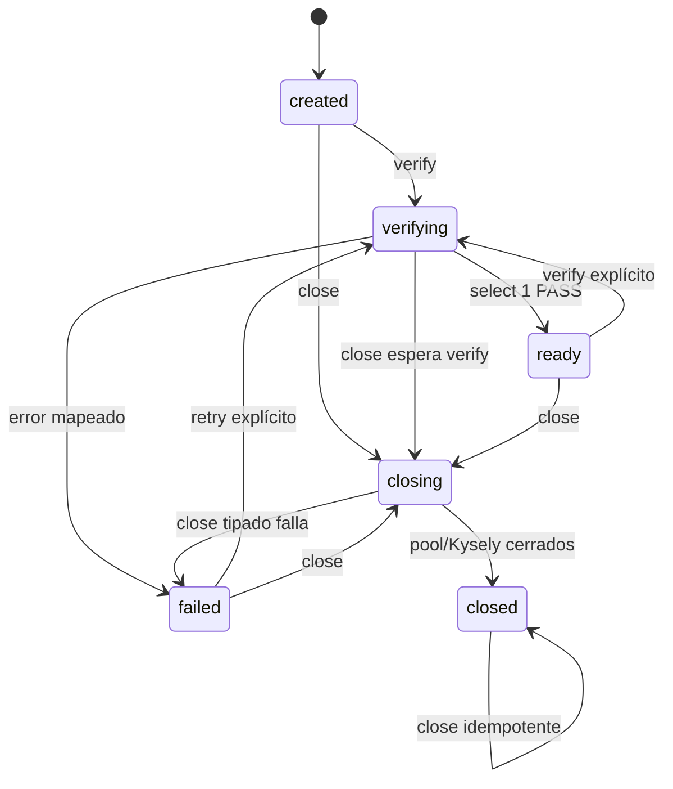

# Lifecycle

## Estados

| Estado | Significado | Operaciones |
|---|---|---|
| `created` | pool/Kysely locales, cero socket/query | `verify`, `close` |
| `verifying` | un único verify compartido está activo | verify comparte promise; close espera |
| `ready` | último probe terminó y cliente fue liberado | `verify`, `close` |
| `closing` | cierre único activo | close comparte promise; verify falla cerrado |
| `closed` | pool cerrado y conteos en cero | close resuelve; verify devuelve `CLOSED` |
| `failed` | verify o close falló de forma tipada | verify explícito puede reintentar; close es seguro |

## Transiciones

No existe auto-retry ni auto-connect. Una falla de conexión no impide liberar
el recurso. La carrera verify/close conserva `closing`, espera el promise
activo, libera el cliente y termina en `closed`.
