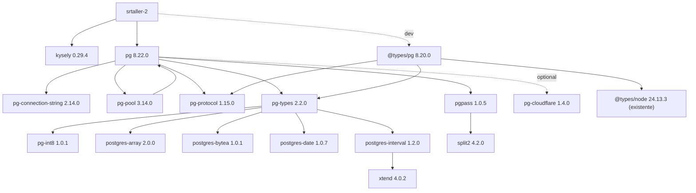

# Grafo de dependencias

## Resumen

El lockfile agregó tres paquetes directos y trece paquetes transitivos. No
actualizó ni eliminó una versión preexistente. `pnpm why` confirmó una sola
versión de `kysely`, `pg` y `@types/pg`.

`pg-native` es un peer opcional y no quedó instalado.

## Cierre transitivo nuevo

| Paquete | Versión | Padre/razón | Clasificación | Scripts de instalación | Licencia | Riesgo |
|---|---:|---|---|---|---|---|
| `pg-cloudflare` | `1.4.0` | optional de `pg` | runtime optional | ninguno | MIT | bajo |
| `pg-connection-string` | `2.14.0` | parseo de configuración de `pg` | runtime | ninguno | MIT | bajo |
| `pg-int8` | `1.0.1` | parser de `pg-types` | runtime/dev compartida | ninguno | ISC | bajo |
| `pg-pool` | `3.14.0` | pooling expuesto por `pg` | runtime | ninguno | MIT | medio por capacidad de conexión futura |
| `pg-protocol` | `1.15.0` | protocolo de `pg` y tipos | runtime/dev compartida | ninguno | MIT | medio por protocolo de red futuro |
| `pg-types` | `2.2.0` | conversión de tipos de `pg` | runtime/dev compartida | ninguno | MIT | bajo |
| `pgpass` | `1.0.5` | soporte de credenciales estándar de `pg` | runtime | ninguno | MIT | medio; uso futuro debe respetar redaction |
| `postgres-array` | `2.0.0` | parser de `pg-types` | runtime/dev compartida | ninguno | MIT | bajo |
| `postgres-bytea` | `1.0.1` | parser de `pg-types` | runtime/dev compartida | ninguno | MIT | bajo |
| `postgres-date` | `1.0.7` | parser de `pg-types` | runtime/dev compartida | ninguno | MIT | bajo |
| `postgres-interval` | `1.2.0` | parser de `pg-types` | runtime/dev compartida | ninguno | MIT | bajo |
| `split2` | `4.2.0` | lectura lineal usada por `pgpass` | runtime | ninguno | ISC | bajo |
| `xtend` | `4.0.2` | composición usada por `postgres-interval` | runtime/dev compartida | ninguno | MIT | bajo |

## Reproducibilidad

- paquetes instalados totales del proyecto: `121`;
- hash SHA-256 de la salida completa de `pnpm list --json --depth Infinity`
  antes de las reinstalaciones y después de la segunda:
  `b1d7235ae9909ceee9fff81e850e5ab899996963cf8ec2915bbdf8d769fcf8dc`;
- hash del mismo grafo normalizado sin path local:
  `6e988641709da6c0175bf8b3bff324c1bc5593ffd1b66c9ca0c787b37eee8927`;
- dependencias huérfanas observadas: ninguna;
- duplicados de las tres dependencias directas: ninguno.
