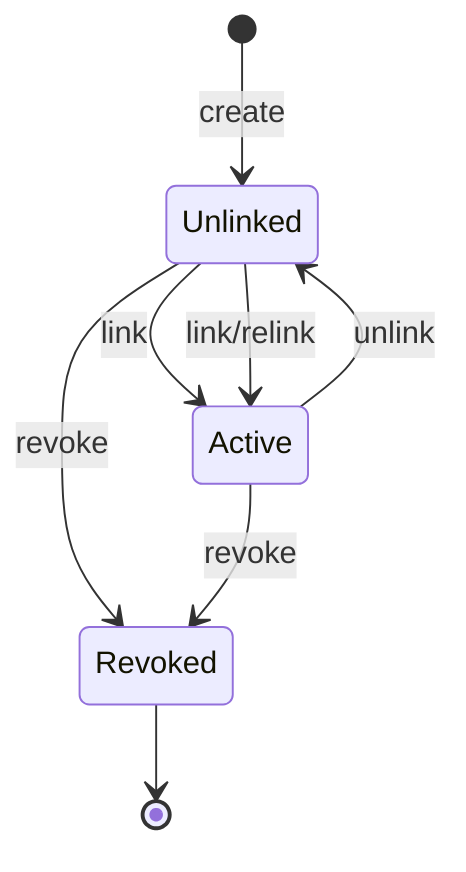

# Lifecycle mínimo de Station

## Estados

| Estado | Binding abierto | Operación ordinaria | Regla |
| --- | ---: | ---: | --- |
| `Unlinked` | 0 | Deny | Sólo espera vinculación autorizada futura |
| `Active` | 1 | Allow tras resolución completa | Branch y tenant deben ser coherentes |
| `Revoked` | 0 | Deny terminal | Estado local/credencial no restaura confianza |

No se agregan `Pending`, `Blocked`, `Retired` o `Disabled`: no hay consumidor
autorizado y ADR-010 sólo exige distinguir confianza válida de estados que no
operan.

## Transiciones

| Transición | Precondiciones | Resultado persistente | Error esperado | Concurrencia |
| --- | --- | --- | --- | --- |
| create | ID server-issued, tenant existente, station inexistente | `Unlinked`, revision 1 | Conflict/NotFound | unique + expected absence |
| link | `Unlinked`, revision esperada, branch del mismo tenant existe | binding abierto, `Active`, revision +1 | NotFound/Conflict/Concurrency | compare-and-swap + unique binding |
| unlink | `Active`, revision esperada, binding abierto | binding cerrado, `Unlinked`, revision +1 | NotFound/Concurrency | misma transacción |
| relink | unlink confirmado y luego link explícito | dos revisiones y nueva fila histórica | Conflict/Concurrency | nunca update directo de branch |
| revoke | `Unlinked` o `Active`, revision esperada | binding abierto se cierra, `Revoked`, revision +1, `revokedAt` | NotFound/Concurrency | misma transacción |
| resolve | `Active`, un binding, branch/tenant coherentes | contexto inmutable, sin mutación | Authentication/Unexpected | snapshot + guard de revision |

## Autoridad

ADR-010 exige capacidad administrativa para create/link/unlink/revoke y
ADR-012/013 gobiernan autorización y refuerzo. PBI-024 no puede inventarlos.
Por tanto:

- las transiciones de dominio y persistencia se materializan y prueban;
- no se exponen controller, endpoint, CLI o provider administrativo;
- no se exporta un use case mutante por el barrel público;
- PBI-026 deberá componer la autorización y recién entonces publicar comandos;
- fixtures PostgreSQL usan builders sintéticos de test, no un bypass runtime.

Este límite no deja una decisión de lifecycle abierta: define qué ocurre y qué
precondiciones existen. Sólo difiere quién puede invocarlo productivamente.

## Relink

Relink está permitido como secuencia explícita `unlink → link`. Está prohibido:

- editar `branch_id` sobre el binding abierto;
- saltar el estado `Unlinked`;
- conservar la misma revision;
- reusar un contexto anterior;
- mover datos de negocio entre branches;
- relink entre tenants.

Un cambio de tenant no es relink. Se revoca la station y una incorporación
posterior requiere identidad nueva y decisión fuera de PBI-024.

## Revocación

Revocación:

1. es terminal dentro de PBI-024;
2. cierra cualquier binding abierto;
3. aumenta revision;
4. invalida toda resolución posterior;
5. vuelve stale todo contexto anterior;
6. no borra historia;
7. no revela motivo ni existencia al cliente;
8. no implica borrar station, usuario o datos históricos.

Reactivar una station revocada está **Rejected** para esta slice. Una necesidad
real exigiría nueva vinculación con identidad nueva o revisión formal.

## Fallos estructurales

Los siguientes estados no se reparan con fallback:

- `Active` sin binding abierto;
- más de un binding abierto;
- binding a branch inexistente;
- branch de tenant distinto;
- revision no positiva;
- `Revoked` con binding abierto;
- `Unlinked` con binding abierto.

El resolver los clasifica internamente como `Unexpected`/integridad, publica
error sanitizado y no produce contexto.

## Historia

Cada fila cerrada de `station_bindings` conserva station, tenant, branch,
revision de vinculación, `linkedAt` y `unlinkedAt`. PBI-028 podrá añadir actor,
motivo, correlación y retención sin reescribir la historia base.

## Fuera de alcance

- mecanismo de aprobación;
- reautenticación/segundo aprobador;
- UI de administración;
- secreto o credential rotation;
- auditoría completa;
- cierre de sesiones de usuario;
- operaciones de negocio abiertas;
- offline o cierre remoto.
