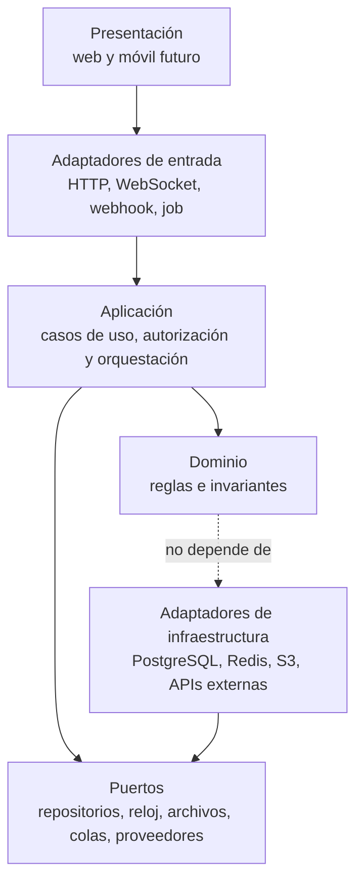
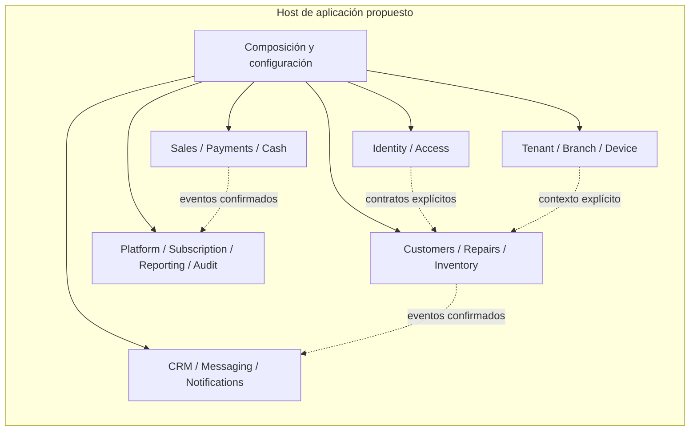

# Arquitectura de aplicaciones

## Estado del documento

- **Estado:** Borrador conceptual.
- **Naturaleza:** Propuesta de responsabilidades y reglas de dependencia; no es diseño implementable.
- **Alcance:** Clientes propios, API, módulos de aplicación y dominio, persistencia, workers y tiempo real.

## Objetivo

Evitar que presentación, HTTP, reglas de negocio y acceso a datos vuelvan a mezclarse. La propuesta conserva una unidad de despliegue simple al inicio, con límites internos verificables y contratos reutilizables por web y clientes móviles futuros.

## Aplicaciones previstas

| Aplicación o proceso | Audiencia o función | Estado |
|---|---|---|
| Web de operación del taller | Personal que atiende clientes, reparaciones, inventario, ventas, pagos y caja | Capacidad conocida; alcance de primera versión pendiente |
| Web de administración del tenant | Propietarios y administradores configuran organización, sucursales, usuarios y dispositivos | Hipótesis de aplicación separada |
| Web de administración de plataforma | Personal autorizado administra tenants, planes, soporte y operación SaaS | Capacidad conocida; límites pendientes |
| API central | Contrato autoritativo para clientes propios e integraciones controladas | Responsabilidad de la aplicación backend inicial |
| Procesamiento diferible | Trabajos, reintentos, archivos, notificaciones e integraciones | Responsabilidad lógica dentro de la aplicación inicial |
| Tiempo real | Conexiones y entrega de eventos confirmados | Responsabilidad lógica interna; no desplegable inicial separado |
| Apps móviles | Clientes iOS y Android que consumirán la API | Futuro, no parte de la fundación |

No se presupone que cada fila sea un repositorio, servicio o despliegue distinto. Conforme a [ADR-002](../decisions/proposed/ADR-002-modular-monolith-first.md), existe una sola aplicación backend y un único artefacto/despliegue iniciales.

## Capas conceptuales

Las flechas representan conocimiento permitido, no el flujo completo de datos. La infraestructura implementa contratos internos; no introduce tipos del proveedor en el dominio.

## Responsabilidades por capa

### Presentación

- Renderiza estados y recopila intención del usuario.
- Puede realizar validación de experiencia, pero no autorización definitiva.
- Consume contratos públicos de la API; no accede directamente a persistencias.
- Reutiliza tokens y componentes del design system sin duplicar reglas de negocio.

### Adaptadores de entrada

- Traducen HTTP, WebSocket, webhook o job a una solicitud de aplicación.
- Validan forma, tamaño y versión del contrato.
- Establecen correlación y entregan contexto autenticado, sin inventarlo.
- Mapean errores internos a respuestas externas estables.

### Aplicación

- Orquesta un caso de uso y su límite transaccional.
- Resuelve autorización contextual antes de acceder o mutar datos.
- Coordina dominios mediante interfaces o eventos explícitos.
- Decide qué tareas son síncronas y cuáles se delegan a workers.

### Dominio

- Protege reglas, estados e invariantes de cada módulo.
- No depende de HTTP, componentes de UI, ORM, Redis ni SDKs externos.
- Usa lenguaje del [glosario de dominio](../product/DOMAIN_GLOSSARY.md).
- Produce hechos de dominio; la publicación técnica ocurre después de persistir.

### Puertos y adaptadores

- Un puerto expresa una necesidad interna, por ejemplo repositorio con alcance de tenant o almacenamiento de archivos.
- Un adaptador traduce esa necesidad a PostgreSQL, Redis, S3 o una API externa propuesta.
- Los adaptadores concentran timeouts, reintentos, mapeo de errores y observabilidad técnica.

## Modularidad

El [mapa preliminar de módulos](../product/MODULE_MAP.md) define candidatos y ownership conceptual. Se proponen estas reglas:

1. Un módulo no consulta ni modifica directamente el almacenamiento interno de otro.
2. Una dependencia síncrona requiere una interfaz de aplicación estable.
3. Un evento expresa algo ya ocurrido; no es una orden disfrazada.
4. Un contrato compartido contiene sólo tipos deliberadamente públicos.
5. Las dependencias entre módulos deben ser explícitas, justificadas y preferentemente acíclicas.
6. Utilidades comunes no pueden convertirse en un módulo sin ownership que concentre reglas de todos.
7. Los límites se comprueban con reglas estáticas y pruebas cuando exista implementación.

## Estructura conceptual del backend

Las agrupaciones sólo facilitan lectura. No sustituyen el análisis de dependencias módulo por módulo ni autorizan acceso general entre ellas.

## Contratos de API

- La API se versionará mediante una estrategia por definir; los cambios incompatibles requieren migración deliberada.
- Los contratos no deben reflejar automáticamente entidades de persistencia.
- Listados deben tener paginación y ordenamiento determinista; límites máximos se definirán después.
- Los errores deben distinguir autenticación, autorización, conflicto, validación, límite y dependencia externa sin filtrar internals.
- Las mutaciones sensibles o reintentables deberían aceptar mecanismos de idempotencia cuando el caso lo requiera.
- Toda operación tenant-scoped deriva su contexto de fuentes confiables y rechaza discrepancias.
- La documentación del contrato debe generarse o verificarse desde una fuente única cuando se implemente.

No se definen endpoints en esta etapa.

## Consistencia y transacciones

- Una transacción local protege invariantes dentro de un límite coherente.
- Efectos externos no deberían ocurrir antes de confirmar el cambio que los origina.
- La entrega confiable de eventos entre persistencia y cola requiere evaluar un patrón como transactional outbox; no está aceptado.
- Procesos que cruzan módulos pueden usar coordinación de aplicación y consistencia eventual explícita.
- No se proponen transacciones distribuidas.
- El usuario debe poder distinguir estado pendiente, confirmado y fallido cuando un flujo sea asíncrono.

## API, workers y tiempo real

La tabla distingue tipos de ejecución, no procesos desplegables iniciales. Todos residen en la aplicación backend única hasta que una revisión de ADR autorice otra topología.

| Aspecto | API | Worker | Tiempo real |
|---|---|---|---|
| Disparador | Solicitud autenticada o webhook validado | Trabajo versionado en cola | Conexión y evento confirmado |
| Duración esperada | Breve y acotada | Puede ser diferida | Conexión prolongada |
| Fuente de verdad | Persistencia | Persistencia | Nunca la conexión |
| Reintento | Cliente/idempotencia según contrato | Política acotada y dead-letter operable | Reconexión y resincronización |
| Contexto | Tenant, actor, sucursal, dispositivo, correlación según aplique | Tenant y correlación obligatorios | Tenant, identidad y autorización de room |

## Configuración y feature flags

- La configuración por ambiente se valida al iniciar y no se incrusta en artefactos.
- Los secretos se suministran mediante un mecanismo dedicado, por decidir.
- La configuración por tenant pertenece a un módulo con esquema y auditoría, no a variables de ambiente.
- Feature flags son una opción futura; requerirán ownership, valor por defecto seguro, caducidad y observabilidad.

## Calidad arquitectónica verificable

Cuando comience la implementación, se proponen verificaciones para:

- impedir imports desde infraestructura hacia dominio en dirección incorrecta;
- detectar ciclos y accesos entre módulos no permitidos;
- comprobar que repositorios tenant-scoped exigen contexto;
- probar contratos de API y adaptadores externos;
- cubrir autorización en la API aunque la UI oculte una acción;
- validar idempotencia, reintentos y comportamiento ante dependencias fallidas;
- demostrar que ningún cliente accede directamente a base, Redis o almacenamiento.

La estrategia completa está en [Testing Strategy](../quality/TESTING_STRATEGY.md).

## Alternativas y decisiones relacionadas

- [ADR-002: monolito modular orientado al dominio](../decisions/proposed/ADR-002-modular-monolith-first.md) — `Accepted`
- [ADR-005: NestJS para backend](../decisions/proposed/ADR-005-nestjs-backend.md)
- [ADR-006: Next.js para clientes web](../decisions/proposed/ADR-006-nextjs-web-clients.md)
- [ADR-009: estrategia de monorepo](../decisions/proposed/ADR-009-monorepo-strategy.md)

ADR-002 está `Accepted`; ADR-005, ADR-006 y ADR-009 permanecen `Proposed` hasta su aprobación explícita.

## Riesgos

- Capas nominales sin límites de dependencias comprobables.
- Modelo de persistencia filtrado a contratos públicos y UI.
- Módulo “shared” convertido en acoplamiento transversal.
- Casos de uso largos que mezclen transacciones con APIs externas.
- Reglas duplicadas entre web, API y worker.
- Dividir aplicaciones antes de entender audiencias y ownership.

## Preguntas abiertas

- ¿Cuáles módulos necesitan interacción síncrona y cuáles aceptan consistencia eventual?
- ¿Qué contratos deben compartirse entre web, móvil futuro y API sin acoplarlos al framework?
- ¿Conviene separar desde el inicio las webs de operación, tenant y plataforma?
- ¿Qué mecanismo verificará límites modulares dentro del monorepo propuesto?
- ¿Qué patrón garantizará publicación confiable de eventos después de una transacción?
- ¿Qué política de compatibilidad de API necesitarán los clientes móviles cuando existan?

## Próxima revisión

- **Momento:** tras validar el mapa de módulos y antes de aprobar scaffolding o estructura de paquetes.
- **Evidencia esperada:** dependencias permitidas, primeros recorridos verticales, contratos conceptuales y ADRs resueltos.
- **Responsable:** TBD.
