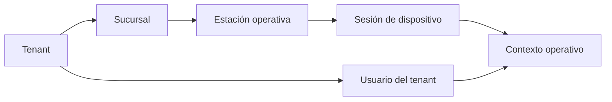
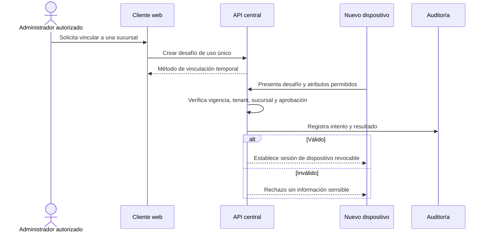

# Modelo de sucursal y dispositivo

## Estado del documento

- **Estado:** Base conceptual aceptada por ADR-010/011; mecanismos pendientes.
- **Naturaleza:** Las invariantes de contexto, vinculación, usuario activo y sesión son autoritativas; estados detallados de estación, protocolo e interfaz siguen como propuesta.
- **Alcance:** Pertenencia, vinculación, activación, uso, transferencia, revocación y pérdida de dispositivos.

## Objetivo

Definir cómo un equipo físico adquiere un contexto operativo limitado sin confundirse con la identidad del empleado. Conforme a [ADR-010](../decisions/proposed/ADR-010-station-bound-operational-context.md), la vinculación establece tenant y sucursal efectivos; [ADR-011](../decisions/proposed/ADR-011-tenant-user-pin-authentication-and-operational-session.md) gobierna usuario, PIN y sesión; [ADR-012](../decisions/proposed/ADR-012-tenant-roles-capabilities-and-contextual-authorization.md) gobierna la autorización ordinaria por capacidad y alcance.

## Modelo conceptual

### Invariantes aceptadas

- Una sucursal pertenece a un único tenant.
- Una estación mantiene una única vinculación vigente con una sucursal activa.
- El tenant de la estación deriva de esa sucursal.
- El usuario ordinario pertenece al tenant, no a una sucursal permanente, y puede identificarse desde cualquier estación autorizada de ese tenant.
- El contexto operativo combina tenant, sucursal, estación, usuario y sesión validados.
- Una estación mantiene como máximo una sesión operativa activa.
- Cerrar, expirar, sustituir o invalidar la sesión del usuario no modifica la vinculación de la estación.

Los mecanismos técnicos, la composición de capacidades por rebanada y las excepciones administrativas reforzadas permanecen pendientes.

## Estados conceptuales del dispositivo

| Estado | Significado | Operación permitida |
|---|---|---|
| Registrado | Existe una solicitud o registro inicial, aún sin confianza operativa | Completar o cancelar vinculación |
| Pendiente de activación | Vinculación iniciada y esperando comprobación autorizada | Activar bajo flujo controlado |
| Activo | Tenant y sucursal confirmados; puede establecer sesión de dispositivo | Operar dentro de políticas |
| Bloqueado | Uso temporalmente impedido sin eliminar el registro | Diagnóstico o desbloqueo autorizado |
| Revocado | La confianza fue retirada | No operar; requerir nueva vinculación |
| Retirado | Equipo fuera de servicio y retenido para historial | Consulta administrativa auditada |

**Decisión pendiente:** nombres, transiciones detalladas y posibilidad de reactivar una estación revocada. ADR-010 sólo exige distinguir una vinculación válida de estados sin capacidad operativa normal.

## Vinculación conceptual

### Restricciones aceptadas y mecanismo pendiente

1. La inicia o autoriza un usuario con capacidad administrativa explícita y, posiblemente, autenticación reforzada.
2. El actor administrativo autoriza una sucursal concreta; el tenant deriva de ella y no se elige independientemente desde el equipo.
3. El desafío es temporal, de uso único y no equivale a una credencial permanente.
4. La API registra iniciador, tenant, sucursal, dispositivo, resultado y correlación.
5. La activación crea confianza revocable y limitada; no crea un usuario compartido.
6. El material de sesión no se muestra ni se registra en claro.
7. Identificadores de hardware pueden ser señales, no la única prueba de posesión o autorización.

La capacidad administrativa se rige por ADR-012; su composición exacta y el mecanismo concreto —QR, código, enlace, aprobación cercana u otro— quedan pendientes de las decisiones de vinculación y autorización reforzada.

## Sesión de dispositivo y último acceso

- La sesión de dispositivo prueba que el equipo continúa vinculado; se valida en cada renovación o solicitud relevante.
- “Último acceso” debe distinguir al menos último intento y última actividad exitosa para no ocultar abuso; el detalle final está pendiente.
- Deben registrarse versión de cliente y señales operativas mínimas, con límites de privacidad.
- Una sesión de estación puede expirar, rotarse o revocarse sin cambiar usuarios del tenant.
- El backend no confía en un reloj local para vigencia o auditoría autoritativa.
- La ausencia prolongada de conexión puede disparar revisión, no una eliminación automática sin política.

## PIN y cambio de turno

### Flujo conceptual aceptado

1. El equipo activo solicita únicamente el PIN durante la operación cotidiana, sin pedir tenant, sucursal u otro identificador del usuario.
2. El empleado introduce su PIN mediante un canal protegido.
3. El servidor valida estación, vinculación, tenant/sucursal derivados y el PIN únicamente dentro de ese tenant; los límites técnicos de intentos permanecen pendientes.
4. Si el conjunto es válido, finaliza como sustituida la sesión anterior y establece una nueva como única sesión activa de la estación.
5. La UI obtiene capacidades efectivas; no deriva permisos del cargo mostrado.
6. El cambio y su resultado quedan auditados.

Un PIN no permite operar desde una estación no vinculada, no selecciona sucursal y no identifica fuera del tenant derivado. Véase [Identidad, acceso y permisos](IDENTITY_ACCESS_AND_PERMISSIONS.md).

### Cambio de turno

- Debe existir una acción explícita de cerrar o cambiar operador.
- Datos temporales del operador anterior se limpian de la interfaz y almacenamiento local.
- Operaciones en curso deben asociarse al actor que las inició y definir quién puede continuarlas.
- La caja, venta o reparación abierta no cambia automáticamente de ownership sin regla de negocio.
- La inactividad expira la sesión y conserva la vinculación; sólo su duración y experiencia concreta permanecen pendientes.

## Acciones que podrían requerir supervisor

La lista es una hipótesis para discovery, no una regla confirmada:

- vincular, transferir, desbloquear o revocar un dispositivo;
- autorizar a un empleado fuera de su sucursal habitual;
- recuperar o cambiar un PIN;
- reabrir o cerrar operaciones financieras de otro turno;
- anular pagos, movimientos o entregas según umbrales por definir;
- continuar una operación después de una inconsistencia de sincronización;
- acceder a configuración local sensible.

La supervisión debe ser una autorización trazable y acotada a la acción; no debe convertirse en compartir PIN o dejar una sesión privilegiada abierta.

## Cambio de sucursal

No se trata como una edición ordinaria. ADR-010 exige este flujo conceptual:

1. Un actor autorizado solicita la transferencia e indica motivo.
2. Se desvincula explícitamente de la sucursal anterior y se invalidan sus contextos operativos.
3. Se evalúan trabajos, cajas o procesos locales en curso conforme a sus decisiones propias.
4. Se registra la desvinculación, su actor, momento y resultado.
5. Se inicia una vinculación nueva y autorizada con la sucursal destino.
6. Se deriva nuevamente el tenant, se registra la nueva historia y se establece un contexto nuevo.
7. El dispositivo debe volver a sincronizar configuración y permisos aplicables sin tratar datos locales como autoridad.

Mover un dispositivo entre tenants no se propone como transferencia; requeriría revocación, limpieza segura y una vinculación nueva.

## Pérdida, compromiso y cierre remoto

Ante pérdida o sospecha de compromiso se propone:

- permitir al actor autorizado identificar el equipo sin exponer secretos;
- revocar inmediatamente la sesión de dispositivo desde el backend;
- invalidar sesiones operativas asociadas;
- desconectar conexiones en tiempo real cuando sea posible;
- impedir renovaciones y nuevos jobs originados por ese equipo;
- registrar actor, motivo, hora autoritativa y alcance;
- mostrar la revocación en inventario de dispositivos;
- evaluar notificaciones a administradores;
- requerir nueva vinculación después de recuperar y limpiar el equipo.

El cierre remoto depende de conectividad. La denegación server-side sí debe aplicar en la siguiente interacción aunque el cliente no reciba el aviso inmediato.

## Funcionamiento sin conexión

**Pregunta futura, no requisito confirmado.** Operación offline cambia de forma material el threat model y la consistencia: implicaría credenciales locales, datos en reposo, expiración, conflictos, revocación diferida y sincronización idempotente.

No se debe implementar caché offline operativa hasta definir:

- recorridos imprescindibles sin red y duración esperada;
- datos que pueden residir localmente;
- cifrado y borrado del dispositivo;
- qué acciones están prohibidas offline;
- resolución de conflictos y orden de eventos;
- comportamiento de PIN, permisos y revocaciones sin servidor;
- evidencia de sincronización y auditoría.

## Privacidad y minimización en el equipo

- Guardar sólo datos necesarios y por el menor tiempo posible.
- No conservar PIN, tokens en claro ni listados completos de empleados cuando no sean indispensables.
- Limpiar estado del operador al cambiar turno o revocar sesión.
- Evitar usar fingerprints invasivos de hardware sin evaluación legal y de privacidad.
- Proteger logs locales y no incluir datos de clientes o secretos.
- Considerar modos kiosco o controles del sistema operativo como opciones, no supuestos.

## Auditoría

Eventos candidatos:

- solicitud, activación, rechazo y expiración de vinculación;
- bloqueo, desbloqueo, revocación y retiro;
- cambio de sucursal;
- apertura, cambio y cierre de sesión operativa;
- fallos de PIN y bloqueos de seguridad sin registrar el PIN;
- cierre remoto y desconexión;
- autorización de supervisor y acción exacta aprobada.

## Pruebas futuras

- desafío reutilizado, vencido, manipulado o de otro tenant;
- dispositivo activo intentando operar en otra sucursal;
- usuario válido de otro tenant o usuario del mismo tenant sin permiso para la acción;
- revocación con sesión HTTP, WebSocket y job activos;
- cambio de turno sin residuos de datos o permisos;
- transferencia con operación local en curso;
- cierre remoto con equipo online y offline;
- concurrencia de dos intentos de activación;
- rate limiting sin bloquear injustamente todo un tenant.

## Riesgos

- Tratar el dispositivo como identidad compartida e impedir atribución individual.
- Confiar exclusivamente en identificadores de hardware clonables o inestables.
- Dejar credenciales o datos del turno anterior en el almacenamiento local.
- Transferir equipo sin cerrar sesiones o resolver procesos en curso.
- Prometer offline antes de entender revocación, conflicto y seguridad local.
- Diseñar aprobación de supervisor mediante intercambio informal de PIN.

## Documentos relacionados

- [Identidad, acceso y permisos](IDENTITY_ACCESS_AND_PERMISSIONS.md)
- [Modelo de multitenancy](MULTITENANCY_MODEL.md)
- [Línea base de seguridad](SECURITY_BASELINE.md)
- [Estrategia de observabilidad](OBSERVABILITY_STRATEGY.md)
- [ADR-011 — Identidad, autenticación por PIN y sesión operativa](../decisions/proposed/ADR-011-tenant-user-pin-authentication-and-operational-session.md)
- [ADR-012 — Roles de tenant, capacidades y autorización contextual](../decisions/proposed/ADR-012-tenant-roles-capabilities-and-contextual-authorization.md)

## Preguntas abiertas

- ¿Qué tipos de equipos pueden vincularse: computadoras, tablets, teléfonos, terminales compartidas?
- ¿Qué capacidades administrativas separadas pueden operar sin contexto ordinario de estación?
- ¿Quién puede vincular, desvincular y revocar, y qué acciones requieren doble aprobación?
- ¿Cómo se implementa la captura de sólo PIN sin facilitar enumeración?
- ¿Qué ocurre con operaciones abiertas durante cambio de turno o revocación?
- ¿Cuánto tiempo puede permanecer una sesión de usuario inactiva y cómo se reanuda sin alterar la vinculación?
- ¿Existe una necesidad real y prioritaria de operación offline?
- ¿Qué información del dispositivo puede recopilarse legalmente y con qué retención?

## Próxima revisión

- **Momento:** antes de componer capacidades de vinculación o definir su mecanismo reforzado y antes de implementar PIN/sesión.
- **Evidencia esperada:** modelo de amenazas del PIN/vinculación y decisiones sobre estados detallados, supervisión y revocación compatibles con ADR-010/011.
- **Responsable:** TBD.
