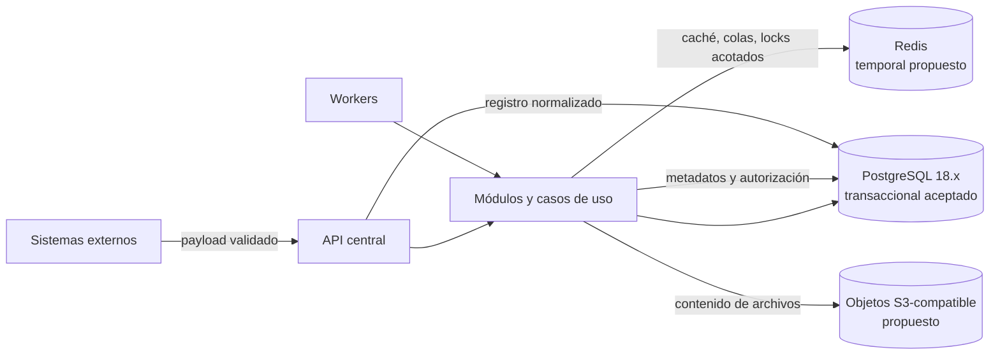

# Arquitectura de datos

## Estado del documento

- **Estado:** Contrato conceptual con foundation física materializada.
- **Naturaleza:** Define ownership, consistencia y ciclo de vida; la foundation ejecutable de tenants/sucursales y su migración viven en código, no en este documento.
- **Dirección aceptada:** PostgreSQL como persistencia transaccional primaria, con PostgreSQL 18.x como baseline de R0 y 18.4 en Preview; Redis y almacenamiento S3-compatible permanecen como propuestas.
- **Decisiones relacionadas:** [ADR-003](../decisions/proposed/ADR-003-postgresql-primary-database.md), [ADR-004](../decisions/proposed/ADR-004-shared-schema-multitenancy.md) y [ADR-010](../decisions/proposed/ADR-010-station-bound-operational-context.md) están `Accepted`.

## Objetivo

Definir qué datos son autoritativos, cómo se aíslan, quién puede modificarlos y
cómo evolucionan sin mezclar la lógica del dominio con detalles de
almacenamiento. Este documento no sustituye el esquema, migraciones ni adapters
ejecutables actuales basados en Kysely sobre `pg`.

## Principios

1. Cada dato tiene un owner conceptual y una fuente de verdad explícita.
2. Los datos tenant-scoped siempre conservan `tenant_id`; `sucursal_id` añade alcance cuando corresponde.
3. PostgreSQL conserva el estado transaccional autoritativo; Redis no está seleccionado ni se usa como fuente canónica.
4. Los archivos se guardan como objetos, mientras autorización y metadatos autoritativos permanecen en la plataforma.
5. Las integraciones se normalizan; los payloads crudos no sustituyen al modelo interno.
6. Retención, minimización, auditoría, backup y eliminación se diseñan como ciclo de vida.
7. Un módulo no modifica datos propiedad de otro por acceso directo.
8. Toda evolución de esquema debe ser compatible con el despliegue y recuperable.

## Clasificación conceptual

| Clase | Ejemplos preliminares | Tratamiento esperado |
|---|---|---|
| Datos de plataforma | Planes, tenants, estado de suscripción, configuración SaaS | Acceso administrativo separado y auditado |
| Datos de tenant | Configuración, usuarios, catálogos personalizados, precios base y reportes consolidados | `tenant_id` obligatorio y aislamiento transversal |
| Datos de sucursal | Clientes operativos, Órdenes y relacionados, estación operativa, ubicaciones, pagos y caja | `tenant_id` más `sucursal_id` obligatorios; inventario se clasifica por su ADR de dominio |
| Datos financieros | Pagos, movimientos, cierres y referencias externas | Integridad, permisos reforzados y retención por definir |
| Datos personales | Identidad, contactos, contenido de mensajes, adjuntos | Minimización, acceso contextual y políticas legales pendientes |
| Datos operativos temporales | Caché, rate limits, presencia, locks | Expiración; reconstruibles; no canónicos |
| Auditoría | Usuario, estación, tenant, sucursal, acción, objetivo, contexto y resultado | Protección contra alteración y retención definida |
| Telemetría | Logs, métricas y trazas | Redacción, muestreo, retención y acceso operacional |

La clasificación normativa final depende de países, proveedores y obligaciones aún no confirmadas.

## Ownership por módulo

El [mapa de módulos](../product/MODULE_MAP.md) es la referencia preliminar. Ownership significa que:

- el módulo define invariantes y semántica del dato;
- sólo sus casos de uso autorizados lo modifican;
- otros módulos consumen interfaces, proyecciones o eventos explícitos;
- una vista o reporte combinado no transfiere ownership;
- las correcciones administrativas siguen un proceso auditable del owner.

Compartir esquema físico no elimina estos límites. Las claves foráneas u otras garantías entre módulos deben equilibrar integridad y acoplamiento mediante una decisión documentada.

## Almacenes propuestos

### PostgreSQL actual

ADR-003 lo acepta por sus transacciones, constraints, índices y ecosistema.
ADR-004 gobierna la estrategia shared-schema. La foundation física actual
materializa tenants/sucursales y el journal de migraciones; cada ampliación del
diseño deberá evaluar:

- patrones reales de consulta y concurrencia;
- constraints multitenant compuestos;
- índices que comiencen por tenant cuando corresponda;
- aislamiento de transacciones y bloqueos por caso de uso;
- RLS sólo mediante spike previo y como defensa adicional opcional;
- búsqueda, reporting y archivado;
- backups, restauración y capacidad.

### Redis propuesto

Usos permitidos conceptualmente:

- caché derivada y descartable;
- rate limiting;
- colas y coordinación de workers;
- presencia y coordinación de conexiones;
- locks distribuidos sólo si el caso y sus fallos están comprendidos.

No se debe conservar exclusivamente en Redis un pago, reparación, mensaje confirmado, permiso ni auditoría. Toda clave tenant-scoped incluye namespace, versión y tenant.

### Almacenamiento compatible con S3 propuesto

- La clave del objeto no se utiliza como autorización; la API valida el acceso mediante metadatos autoritativos.
- Namespaces separan ambiente y tenant; la estructura final no debe exponer datos sensibles.
- Uploads consideran tamaño, tipo declarado/real, malware, expiración y estado de procesamiento.
- Las URLs de acceso son temporales cuando corresponda y no sustituyen la política de permisos.
- Retención, versionado, cuarentena, eliminación y replicación son decisiones pendientes.

## Modelo multitenant

La propuesta de esquema compartido se detalla en [Multitenancy](MULTITENANCY_MODEL.md). Implicaciones para datos:

- `tenant_id` no nulo en todo agregado tenant-scoped;
- constraints e índices incluyen tenant donde preserve el límite;
- `sucursal_id` se valida contra el mismo tenant;
- las operaciones globales usan interfaces y credenciales separadas;
- si se propone RLS, se evalúa previamente en pools, jobs, migraciones y soporte; no bloquea toda persistencia de R0;
- exports, búsquedas, backups y réplicas se incluyen en las pruebas de aislamiento.

## Identificadores y referencias

### Propuestas

- Usar identificadores internos opacos, sin semántica de tenant, fecha o estado.
- Tratar IDs externos como referencias calificadas por proveedor, cuenta y ambiente.
- No asumir que un UUID o equivalente garantiza autorización.
- Definir unicidad en el alcance correcto: global, tenant o sucursal.
- No reciclar identificadores eliminados cuando pueda romper auditoría o idempotencia.

La tecnología y formato exactos de ID quedan pendientes.

## Consistencia y eventos

- Las invariantes del agregado se protegen en una transacción local.
- La respuesta exitosa sólo se emite después de confirmar el cambio autoritativo.
- Efectos externos y trabajos se disparan de forma recuperable después de la confirmación.
- Se evaluará transactional outbox para reducir la brecha entre commit y publicación; aún no está aceptado.
- Los consumidores son idempotentes y registran su progreso cuando el costo de duplicado sea relevante.
- Un evento incluye ID, tipo, versión, momento, tenant, correlación y referencia al actor cuando aplique; evita copiar datos sensibles innecesarios.
- El orden sólo se garantiza en el alcance que pueda sostenerse; cada agregado podría usar versión o secuencia.

## Lecturas, reportes y búsqueda

La primera opción es consultar modelos propios con índices adecuados. Proyecciones o almacenes especializados sólo se justifican con evidencia.

- Una vista de lectura puede combinar datos sin conceder permisos de escritura cruzada.
- Paginación requiere orden total estable.
- Reportes largos y exports se ejecutan como trabajos asíncronos con contexto y expiración.
- El resultado de un reporte queda aislado como archivo tenant-scoped.
- Métricas de plataforma se agregan para evitar exposición de datos identificables.
- Búsqueda global de soporte requiere permiso de plataforma y auditoría; no es una consulta ordinaria sin tenant.

## Ciclo de vida

| Etapa | Control conceptual |
|---|---|
| Creación | Validación, ownership, tenant, actor y fuente establecidos |
| Uso | Menor privilegio, minimización y contexto autorizado |
| Actualización | Concurrencia e invariantes; historial cuando el negocio lo exija |
| Archivo | Retirar de recorridos activos sin perder obligaciones de auditoría |
| Retención | Política por clase de dato, país y contrato; periodos `TBD` |
| Eliminación | Borrado o anonimización verificable, considerando backups e integraciones |
| Exportación | Clasificación conforme a ADR-013, autorización reforzada cuando aplique, job aislado, archivo temporal y auditoría |

No se adopta soft delete de forma universal: puede complicar unicidad, privacidad y consultas. Cada módulo debe justificarlo.

## Concurrencia e idempotencia

- Cambios concurrentes que puedan sobrescribirse requieren versión, condición o locking explícito.
- Procesos financieros, webhooks y comandos reintentables necesitan idempotency key con alcance definido.
- La deduplicación conserva el resultado suficiente para responder consistentemente sin ejecutar de nuevo.
- Locks no reemplazan constraints y deben tener timeout, ownership y recuperación.
- La estrategia se valida con condiciones de carrera, no sólo recorridos secuenciales.

## Migraciones y compatibilidad

La política completa vive en [Migration Policy](../operations/MIGRATION_POLICY.md). Para despliegues sin reconstruir artefactos:

1. Cambios de expansión compatibles se aplican antes de que el código los requiera.
2. Lecturas/escrituras transitorias se coordinan sólo cuando sean necesarias.
3. Backfills son jobs observables, reiniciables y con límites de carga.
4. Cambios destructivos esperan hasta retirar todas las versiones dependientes.
5. Cada migración tiene evaluación multitenant, bloqueo, capacidad y recuperación.
6. El rollback de aplicación no presupone revertir datos automáticamente.

No se crean migraciones durante esta tarea.

## Backup, recuperación y restauración

- Backups se separan por ambiente y se protegen como datos de producción.
- Objetivos RPO/RTO, frecuencia, retención y región están `TBD`.
- La restauración se prueba; crear un backup sin prueba no demuestra recuperabilidad.
- Se define consistencia entre PostgreSQL, objetos y proveedores externos.
- Restaurar un tenant individual en un esquema compartido requiere diseño específico y puede implicar extracción/reconciliación.
- Los procesos se vinculan a [Backup and Recovery](../operations/BACKUP_AND_RECOVERY.md).

## Datos del sistema anterior

- No se copiarán estructuras ni complejidad automáticamente.
- Cada conjunto migrable requiere mapping semántico, calidad, owner, consentimiento y reconciliación.
- Se conserva trazabilidad entre origen, transformación y resultado.
- Ensayos usan datos anonimizados o sintéticos cuando sea posible.
- La migración coexistente, corte y rollback necesitan una estrategia aparte.

Véanse [Lecciones de SR Taller anterior](../product/LEGACY_SR_TALLER_LESSONS.md) y [Migration Policy](../operations/MIGRATION_POLICY.md).

## Privacidad y seguridad

- Cifrado en tránsito y en reposo es requisito conceptual; mecanismos se seleccionarán por ambiente/proveedor.
- Secretos y credenciales no residen en registros de dominio, logs ni archivos exportados.
- Campos sensibles se minimizan y pueden requerir protección adicional, por decidir.
- Acceso administrativo directo a datos es excepcional, temporal y auditado.
- Entornos no productivos no usan datos reales salvo proceso aprobado y controlado.
- Se mantendrá un inventario de clases de datos y sus destinos externos.

## Pruebas futuras

- constraints y referencias cruzadas entre tenants;
- concurrencia e idempotencia en operaciones críticas;
- caché fría y pérdida de Redis sin perder estado canónico;
- upload malicioso, acceso cruzado y expiración de archivos;
- migración adelante con versiones anterior y nueva de aplicación;
- backfill reanudable y sin saturar un tenant o la plataforma;
- restauración y reconciliación de base y objetos;
- eliminación/retención en almacenes, backups y derivados;
- payload externo duplicado, tardío o fuera de orden.

## Riesgos

- Compartir esquema sin constraints ni pruebas de aislamiento suficientes.
- Duplicar datos entre módulos sin owner ni estrategia de reconciliación.
- Usar Redis como persistencia accidental.
- Ejecutar migraciones destructivas incompatibles con rollback de aplicación.
- Retener payloads, adjuntos o telemetría indefinidamente.
- Crear reportes o exports que eludan permisos y límites de tenant.
- Suponer que backup equivale a recuperación demostrada.

## Preguntas abiertas

- ¿Qué datos son legal o contractualmente sensibles y en qué jurisdicciones?
- ¿Qué retención necesita cada módulo, especialmente mensajes, pagos, auditoría y archivos?
- ¿Qué volumen, concurrencia y crecimiento se esperan por tenant y sucursal?
- ¿Qué capacidades de búsqueda y reporting son prioritarias?
- ¿Qué datos del sistema anterior deben migrarse y con qué calidad verificable?
- ¿Se necesita restaurar un tenant individual y con qué RPO/RTO?
- ¿Qué eventos requieren orden estricto y en qué alcance?
- ¿Qué estrategia de IDs e idempotencia satisface operación e integraciones?

## Próxima revisión

- **Momento:** antes de crear un esquema o seleccionar ORM/query builder.
- **Evidencia esperada:** ownership validado, clasificación inicial, patrones de consulta, evaluación RLS y objetivos de recuperación.
- **Responsable:** TBD.
