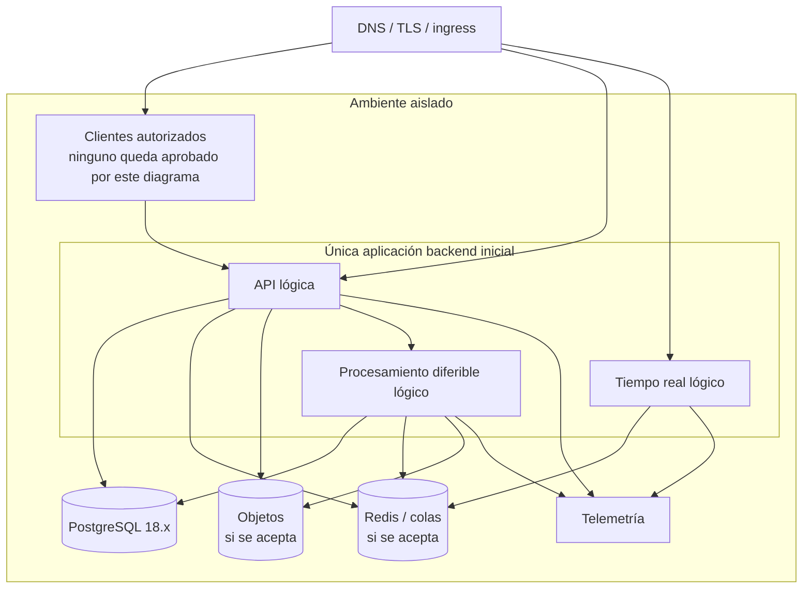
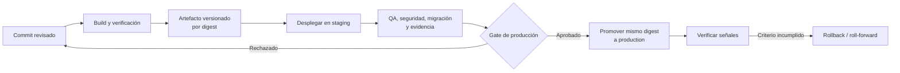

# Estrategia de despliegue

## Estado del documento

- **Estado:** Borrador conceptual.
- **Naturaleza:** Propuesta; no se crean contenedores, pipelines ni infraestructura en esta etapa.
- **Candidatos:** contenedores Docker, GitHub Actions e imágenes versionadas, pendientes de ADR y evaluación.
- **ADR relacionado:** [ADR-007: despliegues contenerizados](../decisions/proposed/ADR-007-containerized-deployments.md), estado `Proposed`.
- **Baseline de runtime aceptada:** [ADR-001](../decisions/proposed/ADR-001-typescript-as-primary-language.md) fija TypeScript y Node.js `24.x`; no acepta contenedores, CI/CD ni plataforma de ejecución.
- **Baseline de persistencia aceptada:** [ADR-003](../decisions/proposed/ADR-003-postgresql-primary-database.md) fija PostgreSQL 18.x; no acepta proveedor, contenedor, HA, pooler ni servicio administrado.
- **Baseline de repositorio aceptada:** [ADR-009](../decisions/proposed/ADR-009-monorepo-strategy.md) fija un repositorio único y un solo flujo coordinado de versión para R0; no acepta workspaces, orquestador, caché, CI/CD ni múltiples artefactos.

## Objetivo

Lograr despliegues repetibles, trazables y recuperables entre local development, staging y production. El artefacto probado debe promoverse sin reconstrucción, con configuración y secretos propios de cada ambiente.

## Ambientes obligatorios

| Ambiente | Propósito | Datos | Credenciales | Expectativa |
|---|---|---|---|---|
| Local development | Desarrollo y pruebas rápidas en una máquina | Sintéticos o fixtures; base local | Sólo locales, sin acceso a production | Conveniencia reproducible, no equivalencia operativa |
| Staging | Validación integrada, QA, migraciones y release candidate | Sintéticos/anonimizados; reales sólo mediante proceso controlado | Exclusivas de staging/sandboxes | Parecido suficiente para validar, sin ser production |
| Production | Servicio real y datos reales | Datos operativos sujetos a políticas | Exclusivas, mínimas y gestionadas | Controles, monitoreo, backup y respuesta formales |

**Regla:** local no es staging. Cada ambiente tiene PostgreSQL separado; Redis/colas y objetos sólo se incorporarán si se aceptan. Credenciales, dominios y telemetría permanecen separados por ambiente. Véase [Ambientes](../delivery/ENVIRONMENTS.md).

## Topología conceptual por ambiente

El diagrama separa responsabilidades para facilitar lectura. [ADR-002](../decisions/proposed/ADR-002-modular-monolith-first.md) establece un único artefacto y despliegue de aplicación, con una sola aplicación backend inicial; [ADR-009](../decisions/proposed/ADR-009-monorepo-strategy.md) la aloja en un repositorio único sin exigir workspaces. La separación física o un cliente adicional requieren autorización y evidencia. La topología no implica Kubernetes ni un proveedor específico.

## Unidad desplegable inicial

- **Aplicación:** un único artefacto desplegable y una sola aplicación backend inicial.
- **API, procesamiento diferible y tiempo real:** responsabilidades lógicas alojadas en la misma aplicación; no son desplegables iniciales separados.
- **Configuración:** unificada por ambiente y suministrada al despliegue sin fijar proveedor.
- **Persistencia:** una sola base de datos física inicial, cuya tecnología y organización lógica requieren decisiones separadas.
- **Migraciones futuras:** asociadas y coordinadas con la misma release; no constituyen un servicio permanente.
- **Repositorio:** único para R0; no convierte packages futuros en artefactos ni habilita versionado independiente.

La compatibilidad entre responsabilidades, contratos y datos sigue siendo obligatoria dentro del artefacto único. Separar una unidad en el futuro requiere los disparadores y el nuevo ADR definidos en ADR-002.

## Baseline de runtime

El backend inicial se compila y ejecuta con Node.js `24.x`. La versión minor/patch se fijará reproduciblemente al autorizar el scaffold y podrá actualizarse dentro de la misma línea con pruebas de compatibilidad. No se iniciarán releases sobre una versión EOL y cualquier migración de línea LTS seguirá el gobierno de ADR-001.

Esta baseline no determina si la aplicación corre en contenedor, VM o plataforma administrada, ni selecciona package manager, herramienta de build o pipeline.

## Artefactos inmutables y promoción

### Reglas propuestas

- Build una vez en un entorno controlado.
- Versionar por commit y digest inmutable; una tag legible no sustituye el digest.
- Adjuntar metadatos de procedencia, checks y componentes cuando la herramienta se seleccione.
- Promover exactamente los artefactos validados en staging.
- Inyectar configuración al desplegar; no reconstruir para cambiar ambiente.
- Registrar qué versión del artefacto y del esquema existe en cada ambiente.
- No modificar un contenedor o servidor en vivo para “arreglar” production.

## Pipeline conceptual

### Integración continua

Cuando exista código, el pipeline candidato verificará:

- formato/lint y type checking;
- pruebas unitarias, integración y contratos;
- aislamiento multitenant y permisos según impacto;
- seguridad de dependencias, secretos e imagen según política;
- build reproducible del artefacto inicial;
- documentación y trazabilidad PBI/ADR/PR;
- publicación de artefactos sólo desde ramas/eventos autorizados.

### Entrega a staging

- Despliegue automatizado del release candidate.
- Configuración y credenciales propias de staging.
- Migraciones compatibles y backfills controlados.
- Smoke tests, recorridos críticos y QA evidence.
- Verificación de logs, métricas, trazas, alertas y rollback.

### Promoción a production

- Gate explícito con aprobadores y criterios `TBD`.
- Mismos digests validados; sin rebuild.
- Ventana y estrategia según riesgo, no necesariamente manual.
- Migraciones y checks pre/post definidos.
- Monitoreo de señales y criterio de abortar.
- Registro de release y comunicación correspondiente.

GitHub Actions es el candidato preliminar para orquestar CI/CD; su aceptación, permisos y runners necesitan revisión.

## Estrategia local

- Dependencias locales mediante Docker Compose es una propuesta de conveniencia, no un artefacto creado ahora.
- La aplicación puede ejecutarse fuera o dentro de contenedores según decisión futura.
- Fixtures y servicios falsos no usan credenciales ni datos reales.
- Configuración local se documenta y valida; defaults inseguros no se trasladan a otros ambientes.
- Desarrollo local debe poder reiniciarse sin depender de staging.
- Emuladores no garantizan equivalencia con proveedores productivos.

## Configuración y secretos

- Configuración no secreta y secretos se separan.
- La aplicación declara su configuración requerida y falla de forma clara si falta.
- Secretos provienen de un mecanismo administrado por seleccionar.
- Credenciales de servicio tienen mínimo privilegio y son distintas por ambiente.
- Rotación y revocación se ensayan antes de production.
- Variables públicas de frontend se tratan como visibles; nunca contienen secretos.
- Cambios de configuración quedan trazados y sujetos a revisión acorde al riesgo.

## DNS, routing y subdominios

El routing wildcard por tenant es [propuesto en ADR-008](../decisions/proposed/ADR-008-wildcard-subdomain-routing.md). Antes de aceptarlo se requiere:

- separar hostnames de tenant, plataforma, API y assets;
- emisión y renovación automática de certificados;
- protección contra Host header no autorizado y subdomain takeover;
- comportamiento seguro para tenant desconocido, suspendido o renombrado;
- dominios distintos o inequívocos por ambiente;
- política de dominios personalizados, si llegaran a existir;
- monitoreo de DNS y expiración.

El hostname produce un tenant candidato; la API lo contrasta con identidad conforme a [Multitenancy](MULTITENANCY_MODEL.md).

## Migraciones hacia adelante

### Patrón propuesto expand–migrate–contract

1. **Expand:** agregar estructuras compatibles sin retirar las existentes.
2. **Deploy:** publicar código capaz de coexistir con ambas representaciones cuando sea necesario.
3. **Migrate:** ejecutar backfill observable, limitado, idempotente y reanudable.
4. **Switch:** cambiar lecturas/escrituras con evidencia y, opcionalmente, flag controlado.
5. **Contract:** retirar lo anterior en una release posterior, al confirmar que ninguna unidad depende de ello.

Reglas:

- Las versiones anterior y nueva de la aplicación, incluido su procesamiento diferible, deben tolerar el esquema expandido durante rollback.
- Las migraciones se prueban con volumen representativo y dos o más tenants.
- Bloqueos, duración, capacidad adicional y recuperación se revisan antes de production.
- Una migración destructiva no se revierte automáticamente si perdería datos.
- Backfill y migración tienen correlación, progreso, logs y criterio de pausa.

Véase [Migration Policy](../operations/MIGRATION_POLICY.md).

## Estrategias de rollout

| Estrategia | Ventaja | Riesgo / condición | Estado |
|---|---|---|---|
| Rolling | Simple para cambios compatibles | Versiones coexistentes deben ser compatibles | Candidata |
| Blue/green | Cambio y reversión rápidos de tráfico | Duplica capacidad y complica migraciones | A evaluar |
| Canary | Limita exposición inicial | Requiere routing, métricas y cohortes seguras | A evaluar |
| Recreate | Simple pero interrumpe | Sólo si downtime fue aprobado | No asumida |

La estrategia puede variar por release y nivel de riesgo, pero se aplica al único artefacto inicial. No se promete zero-downtime hasta definir SLO y topología.

## Rollback y roll-forward

- Cada release define criterio observable de éxito y reversión.
- Rollback de aplicación usa un artefacto anterior conocido y compatible con el esquema actual.
- Migraciones destructivas pueden exigir roll-forward o restauración/reconciliación, no rollback automático.
- Workers y jobs pendientes deben tolerar consumidores de versiones compatibles o pausarse de forma controlada.
- Conexiones WebSocket esperan desconexiones y reconexión con jitter.
- Configuración, flags y secretos también tienen historial y plan de recuperación.
- El procedimiento y evidencia se detallan en [Rollback Policy](../operations/ROLLBACK_POLICY.md).

## Feature flags

Son una opción futura para separar despliegue de activación, no una decisión ni sustituto de branches mantenidas indefinidamente.

Si se adoptan, cada flag requiere:

- owner, propósito y fecha/condición de retiro `TBD`;
- default seguro por ambiente;
- evaluación multitenant y de permisos;
- auditoría para cambios sensibles;
- observabilidad por variante sin cardinalidad excesiva;
- pruebas con ambos estados;
- plan para eliminar código y configuración obsoletos.

No se usarán flags para ocultar migraciones incompatibles o controles de seguridad incompletos.

## Disponibilidad durante despliegues

- Readiness retira una réplica antes de recibir trabajo nuevo.
- Shutdown graceful da tiempo acotado a requests y jobs; los trabajos deben ser reintentables.
- La API no conserva sesión autoritativa sólo en memoria local.
- Redis coordina conexiones/colas si se acepta, pero su caída tiene comportamiento definido.
- El cliente tolera versión compatible de API y reconecta tiempo real.
- Cambios incompatibles de eventos mantienen consumidores compatibles durante transición.

Los tiempos y garantías quedan `TBD`.

## Backups y recuperación

- Verificar backup exitoso antes de cambios de alto riesgo cuando la política lo requiera.
- Restauraciones se prueban en un ambiente aislado.
- PostgreSQL y objetos necesitan puntos de consistencia/reconciliación.
- Redis no es el único almacén de estado de negocio.
- RPO/RTO son decisiones de producto y operación aún pendientes.
- Véase [Backup and Recovery](../operations/BACKUP_AND_RECOVERY.md).

## Seguridad del despliegue

- Runners y credenciales de CI con mínimo privilegio y separación por ambiente.
- Production requiere identidad y gate distintos de staging.
- Secret scanning y revisión de dependencias antes de publicar.
- Imágenes ejecutan sin privilegios innecesarios y se actualizan mediante rebuild, no parche manual.
- Registro de artefactos con acceso, retención e inmutabilidad definidos.
- Acceso de emergencia se limita, audita y revisa.
- Ningún despliegue manual por FTP.

## Observabilidad y evidencia de release

Cada despliegue debería registrar:

- versión y digest del artefacto desplegado;
- commit, PBI, PR, ADR y release relacionados;
- checks y QA evidence aprobados;
- configuración/versiones de contrato relevantes sin secretos;
- migraciones/backfills ejecutados y resultado;
- actor o automatización que promovió;
- tiempos, señales pre/post y decisión de continuar o revertir.

La [Estrategia de observabilidad](OBSERVABILITY_STRATEGY.md) define señales y la [trazabilidad](../delivery/TRACEABILITY_MODEL.md) relaciona artefactos.

## Pruebas futuras

- construir una vez y comparar digest entre staging/production;
- desplegar una versión de aplicación cuyas responsabilidades internas y esquema sean compatibles;
- migración expandida con rollback de aplicación;
- job en ejecución durante shutdown/restart;
- reconexión WebSocket sin tormenta ni pérdida canónica;
- rotación de secreto sin rebuild;
- fallo parcial del despliegue y recuperación;
- restauración de backup y reconciliación de objetos;
- hostnames/certificados separados por ambiente;
- bloqueo de cualquier ruta de FTP o mutación manual no trazada.

## Riesgos

- Reconstruir para production y publicar bits distintos a los probados.
- Permitir que el artefacto único erosione las fronteras internas o impida aislar fallos lógicamente.
- Ejecutar migración incompatible antes de poder revertir aplicación.
- Compartir datos o credenciales entre staging y production.
- Asumir que contenedor equivale a reproducibilidad o seguridad.
- Adoptar Kubernetes antes de que complejidad y escala lo justifiquen.
- Usar feature flags sin retiro, ownership ni pruebas.
- Corregir servidores manualmente y perder trazabilidad.

## Documentos relacionados

- [Arquitectura objetivo](TARGET_ARCHITECTURE.md)
- [Arquitectura de aplicaciones](APPLICATION_ARCHITECTURE.md)
- [Arquitectura de datos](DATA_ARCHITECTURE.md)
- [Línea base de seguridad](SECURITY_BASELINE.md)
- [Ambientes](../delivery/ENVIRONMENTS.md)
- [Proceso de release](../delivery/RELEASE_PROCESS.md)
- [Operations Overview](../operations/OPERATIONS_OVERVIEW.md)

## Preguntas abiertas

- ¿Qué proveedor de hosting y servicios administrados satisface costo, región y operación?
- ¿Qué evidencia futura justificaría separar una responsabilidad de la unidad inicial aceptada?
- ¿Qué SLO, RPO, RTO y ventanas de mantenimiento requiere el negocio?
- ¿Qué gates y roles aprobarán staging y production?
- ¿Qué estrategia de rollout corresponde a cada nivel de riesgo del artefacto inicial?
- ¿Cómo se gestionarán certificados wildcard y posibles dominios personalizados?
- ¿Qué mecanismo administrará secretos, artefactos y procedencia?
- ¿Qué nivel de automatización y acceso de emergencia se permitirá?

## Próxima revisión

- **Momento:** después de resolver ADR-007 y los ambientes, antes de crear Dockerfiles o pipelines.
- **Evidencia esperada:** proveedor candidato, topology draft, matriz de compatibilidad, flujo de promoción y escenarios de rollback.
- **Responsable:** TBD.
