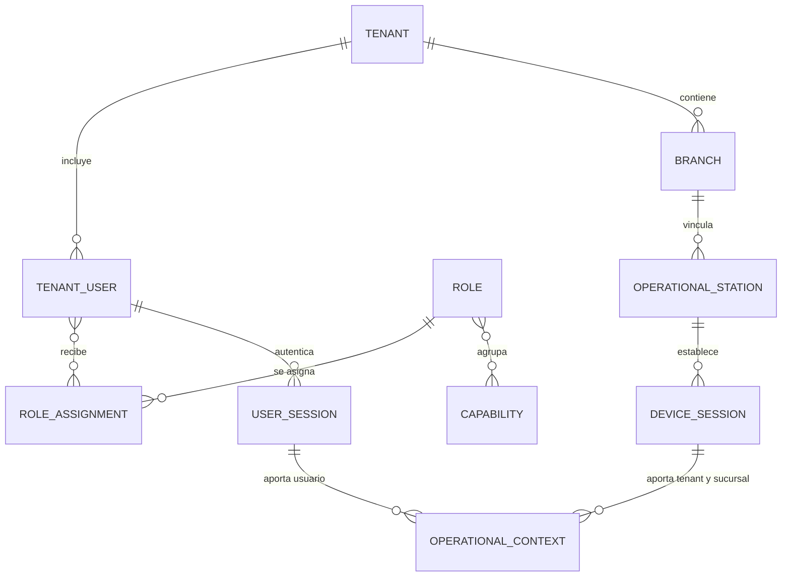
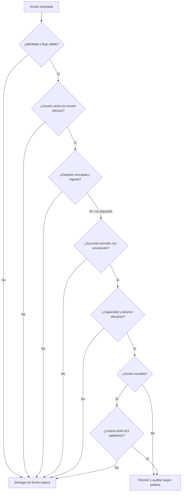

# Identidad, acceso y permisos

## Estado del documento

- **Estado:** Identidad operativa, sesiones concurrentes, autorización ordinaria
  y autorización reforzada conceptuales aceptadas. La identidad/sesión
  administrativa de Tenant Lifecycle está aceptada en ADR-015.
- **Naturaleza:** ADR-004/010/011/012/013/014 son autoritativos para contexto,
  identidad, sesión, capacidades, alcance, sensibilidad, reautenticación y
  segundo aprobador; ADR-014 sustituye sólo la exclusividad station-wide de
  ADR-011. ADR-015 acepta una audiencia administrativa separada sin sustituir
  esos contratos operativos.
- **Alcance:** Usuario de tenant, identidad de plataforma/correlación futura, roles, permisos, estaciones y sesiones.
- **Fuera de alcance:** Seleccionar proveedor, algoritmos criptográficos, formatos de token o políticas numéricas definitivas.

## Objetivo

Separar con claridad quién es el usuario del tenant, desde qué estación/sucursal opera y qué puede hacer. Ni el rol mostrado, ni la estación vinculada, ni el PIN por sí solos otorgan autorización completa.

## Conceptos y relaciones

El diagrama es conceptual: no prescribe tablas, cardinalidades definitivas ni que una sesión se persista como entidad independiente.

## Distinciones obligatorias

| Concepto | Significado conceptual | No debe confundirse con |
|---|---|---|
| Usuario ordinario | Identidad operativa perteneciente exactamente a un tenant | Rol, sucursal activa o cuenta de plataforma |
| Pertenencia de tenant | Invariante estructural del usuario ordinario | Selección temporal o asignación de sucursal |
| Rol | Agrupación administrable de capacidades perteneciente a un tenant | Puesto laboral, sucursal o autorización directa |
| Asignación de rol | Concesión vigente de un rol a un usuario del mismo tenant, tenant-wide o restringida por sucursal | Identidad, sesión o sucursal efectiva |
| Capacidad | Facultad concreta para solicitar una operación protegida dentro de un alcance | Módulo, pantalla o elemento de navegación |
| Estación operativa | Equipo vinculado a una sucursal cuyo tenant se deriva de ella | Identidad de la persona |
| Sesión de dispositivo | Evidencia vigente de vinculación del equipo | Sesión de usuario u operación |
| Sesión de usuario | Periodo aceptado en que un usuario autenticado es el actor de los requests que presentan esa Session dentro del contexto resuelto | Identidad, sucursal efectiva, permiso o actor global de la Station |
| Contexto operativo | Tenant–sucursal–estación–usuario resueltos para una operación | Autenticación primaria o autorización |
| PIN | Credencial operativa que identifica al usuario dentro del tenant ya resuelto | Identidad, selector de tenant/sucursal o permiso de supervisor |
| Credencial administrativa | Password no reversible asociado al Tenant User y email verificado para Tenant Administration | PIN, Role, capability o identidad de plataforma |
| Admin Session | Sesión revocable de la superficie administrativa cuyo Tenant/User se derivan server-side | Operational Session, Station o permiso operativo |

## Usuario ordinario y pertenencia

ADR-004, ADR-010 y ADR-011 establecen:

- un usuario ordinario pertenece exactamente a un tenant;
- no pertenece permanentemente a una sucursal;
- no se duplica por sucursal;
- puede identificarse con el mismo usuario/PIN desde cualquier estación autorizada de su tenant;
- la estación, no el usuario, determina la sucursal efectiva;
- las identidades de plataforma permanecen separadas del usuario ordinario.
- la identidad no depende del PIN, de la sesión, de la estación ni de la sucursal efectiva.

Recovery administrativo usa email verificado. Para MVP, un email/identidad
administrativa pertenece a un solo Tenant; una identidad multi-Tenant futura
requiere una decisión posterior. Recovery sólo restaura credenciales de un
User válido activo, nunca lo reactiva ni cambia Tenant, Roles o capabilities.

## Capacidades y alcance

ADR-012 acepta que los roles pertenecen al tenant y agrupan capacidades orientadas a operaciones. Un usuario puede tener varios roles y sus capacidades efectivas se obtienen por unión de asignaciones vigentes tenant-wide y de las restringidas a la sucursal efectiva. Roles y capacidades no establecen la sucursal ni reemplazan la vinculación.

Toda evaluación debe:

- ejecutarse en el servidor para el caso de uso;
- recibir el contexto de ADR-010 y la sesión de ADR-011;
- denegar por defecto cuando falte una capacidad;
- evitar cuentas o roles duplicados por sucursal;
- distinguir contexto válido de autorización concedida;
- validar pertenencia y alcance del recurso;
- no permitir que el usuario seleccione otra sucursal.

## Roles y permisos

### Modelo aceptado para R0

- Las capacidades son estables y orientadas a acciones, no a pantallas.
- Los roles pertenecen al tenant y agrupan capacidades para facilitar administración.
- Un usuario puede recibir uno o varios roles vigentes.
- Las capacidades de varios roles se combinan por unión.
- Una asignación es tenant-wide por defecto y sólo se restringe por sucursal ante una necesidad explícita.
- R0 no admite permisos ni denegaciones directas por usuario, herencia de roles o reglas condicionales generales.
- La ausencia de capacidad suficiente produce denegación.
- Los nombres y composición concretos de roles se validan por rebanada sin convertir actores o puestos en roles automáticamente.
- El servidor es la autoridad de autorización. Web y móvil sólo reflejan capacidades obtenidas de manera segura.

### Evaluación conceptual de una acción

Los flujos ordinarios se rigen por el contexto completo de ADR-010/011. Tenant
Administration sin Station pertenece al contexto separado aceptado por
[ADR-015](../decisions/proposed/ADR-015-tenant-administrative-control-plane.md);
no se infiere por ausencia de datos ni vuelve opcionales las invariantes
operativas.

## Tenant Administration

El contrato de [Tenant Lifecycle MVP](TENANT_LIFECYCLE_MVP.md) mantiene una
sola identidad Tenant User, pero separa sus credenciales y sesiones:

- email verificado + password crean exclusivamente una Admin Session;
- Admin Sessions son stateful, concurrentes, revocables individual/globalmente,
  sin remember-me, con idle 30 minutos y lifetime absoluto 12 horas;
- PIN crea exclusivamente una Operational Session dentro de una Station;
- ambos planos recalculan Roles/capabilities vigentes server-side;
- una Admin Session deriva Tenant desde la relación persistida con el User y
  nunca acepta `tenantId`, Role o capabilities como autoridad del cliente;
- administrar Branch, Users, Roles o Stations requiere capacidades explícitas,
  no `isAdmin`;
- el starter Tenant Admin Role es system-managed, protegido y versionado;
- nunca puede retirarse el último Tenant Admin efectivo activo;
- Admins adicionales requieren invitación a email verificado, aceptación
  explícita y Role assignment autorizado;
- operar Repairs, Catalog u otra actividad de Branch sigue requiriendo el
  contexto completo ADR-010/011/014.

Esta sección y ADR-015 no autorizan implementación por sí mismas. Cada Work
Unit de Tenant Lifecycle requiere autorización y gates propios.

## Dispositivo y sesiones

- Vincular una estación establece confianza limitada en una sucursal y deriva su tenant.
- La sesión de dispositivo puede sobrevivir a cambios de operador, pero debe revocarse de forma independiente.
- ADR-011/014 establecen que la sesión de usuario representa el periodo de operación de una persona autenticada dentro del tenant ya determinado por la estación.
- Una estación mantiene cero o más sesiones operativas activas independientes.
- Cada sesión liga Tenant, Branch, Station, StationCredential, User y SessionId; no existe un usuario activo global de la Station.
- El contexto operativo de cada request combina Station/Branch persistentes con el User de la Session solicitante.
- Cambiar usuario reemplaza sólo la Session del perfil solicitante después de autenticación satisfactoria; no modifica otras Sessions de la Station.
- Cerrar, expirar, sustituir o invalidar la sesión de usuario no desvincula la estación.
- Una sesión inválida no acepta nuevas acciones. Revocación de Station, User o credencial es efectiva para la siguiente operación mediante los epochs vigentes, aunque la fila se materialice después.

Véase [Modelo de sucursal y dispositivo](BRANCH_AND_DEVICE_MODEL.md).

## Acceso con PIN

### Decisión conceptual aceptada

ADR-011/014 establecen que el PIN es una credencial que identifica al usuario únicamente dentro del tenant de una estación autorizada. El servidor valida el intento y, si el usuario puede operar, establece una Session nueva independiente o reemplaza sólo la Session solicitante durante switch. PBI-043 materializó la cardinalidad concurrente sin convertir la Station en un actor humano global.

Controles conceptuales:

- el PIN se asocia a un usuario dentro de un tenant, no es identidad global reutilizable;
- nunca se almacena en texto plano o de forma reversible ni se conserva en interfaces, logs o analítica;
- intentos fallidos se limitan y auditan sin revelar qué personas existen;
- la estación debe estar activa y vinculada; no existe sucursal solicitada libremente por el usuario;
- el contexto de usuario expira tras 60 minutos de inactividad y tiene lifetime absoluto de 12 horas; administración remota permanece pendiente;
- cambios de PIN y recuperaciones requieren un flujo distinto y suficientemente autenticado;
- acciones sensibles exigen el control nivel 2, 3 o 4 resuelto conforme a ADR-013, aunque el PIN haya iniciado la sesión y exista capacidad ordinaria;
- un empleado que rota de sucursal usa una estación vinculada del mismo tenant y no requiere otra cuenta.

**Decisión pendiente:** algoritmo de protección, longitud, tiempo concreto de inactividad, límites, recuperación y factor reforzado se seleccionarán mediante un modelo de amenazas; no se fijan aquí.

## Acciones sensibles y autorización reforzada

ADR-013 acepta cuatro niveles: operación ordinaria, reautenticación del actor, segundo aprobador diferente y acción no permitida en R0. Reautenticación confirma al actor; aprobación independiente exige capacidad específica y no sustituye la sesión principal. Ambas son de un solo uso por defecto y se invalidan por cambio de turno, expiración, revocación o cambio material.

Candidatas que cada rebanada debe clasificar:

- cambiar roles o permisos;
- vincular, desvincular o revocar estaciones;
- cerrar caja, anular pagos o aprobar descuentos excepcionales;
- exportar datos o acceder a información extensa;
- modificar integraciones, credenciales o destinos de webhook;
- operar como soporte sobre un tenant;
- cambiar factores de autenticación o recuperar acceso.

Una candidata sin política concreta permanece en nivel 4. La rebanada define nivel 2 o 3, motivo y evidencia adicional; factor, duración exacta, persistencia y auditoría técnica continúan diferidos.

## Ciclo de vida, bloqueo y revocación

| Evento | Efecto conceptual esperado | Decisión pendiente |
|---|---|---|
| Lockout de PIN | Impedir nuevas autenticaciones durante cooldown; no terminar Sessions autenticadas | Observabilidad operacional futura |
| Desactivación de usuario | Impedir nuevas sesiones e invalidar efectivamente todas las existentes | Flujo administrativo y materialización física posterior |
| Revocación de usuario | Impedir nuevas sesiones e invalidar efectivamente todas las existentes | Flujo administrativo y materialización física posterior |
| Desvinculación de estación | Invalidar sus contextos y denegar operación ordinaria | Manejo de trabajos en curso |
| Cambio de rol, capacidad o asignación | Aplicar la composición vigente en la siguiente operación protegida conforme a ADR-012 | Estrategia técnica de propagación e invalidación |
| Revocación de dispositivo | Invalidar todas sus Sessions operativas | Comportamiento offline y materialización física |
| Compromiso/reemplazo de credencial | Invalidar todas las Sessions dependientes y forzar recuperación segura | Señales y automatización |

La revocación debe ser verificable por la autoridad del servidor; una interfaz cerrada no es evidencia suficiente. ADR-012 exige que la capacidad retirada no autorice la siguiente operación protegida, sin fijar tecnología de propagación.

## Administración de plataforma

- Una identidad de plataforma no obtiene acceso por pertenecer a un tenant especial.
- Permisos de plataforma y usuarios ordinarios de tenant permanecen separados.
- Acceso de soporte a un tenant se concede con propósito, alcance y duración explícitos.
- La suplantación silenciosa no se propone; toda vista o acción en contexto ajeno debe ser distinguible y auditada.
- Operaciones masivas o destructivas requieren controles reforzados y, cuando corresponda, aprobación adicional.

## Auditoría

Se registran según riesgo:

- autenticaciones, cierres, fallos y recuperaciones;
- creación, suspensión y revocación de usuarios;
- cambios de roles y permisos;
- vinculación, desvinculación y revocación de estaciones;
- inicio y cierre de sesiones operativas;
- intentos y resultados de acciones sensibles;
- accesos excepcionales de plataforma o soporte.

La auditoría registra usuario, sesión, tenant, sucursal, estación, acción, objetivo, resultado, fecha/hora, correlación y motivo cuando corresponda. No registra contraseñas, PIN, tokens ni secretos.

## Amenazas y controles de diseño

| Amenaza | Control conceptual |
|---|---|
| Escalada por modificar tenant o sucursal en la solicitud | Contexto derivado de la estación vinculada; comprobación del lado del servidor |
| Autorización sólo en UI | Política aplicada en casos de uso de API |
| PIN observado o adivinado | Alcance local, rate limit, almacenamiento no recuperable, step-up y auditoría |
| Permisos obsoletos en una sesión larga | Revalidación e invalidación con objetivo definido |
| Dispositivo perdido | Revocación y cierre remoto independientes de la persona |
| Soporte con privilegios excesivos | Elevación explícita, mínima, temporal y auditada |
| Enumeración de usuarios | Respuestas y tiempos que no revelen usuarios de otros tenants |

## Pruebas requeridas en una fase futura

- matriz usuario–permiso–contexto con casos permitidos y denegados;
- usuarios distintos en dos tenants con PIN/identificadores deliberadamente similares;
- estación válida con usuario del mismo tenant y con usuario de otro tenant;
- revocación durante una sesión activa y durante un job;
- cambio de rol sin conservar autorización antigua;
- manipulación de tenant, branch, actor o room;
- límites y bloqueo de PIN sin filtración de datos;
- acciones sensibles sin y con autenticación reforzada;
- soporte de plataforma sin privilegio o motivo suficiente.

## Riesgos

- Modelar puestos laborales como permisos rígidos y difíciles de cambiar.
- Combinar dispositivo, usuario y sesión en una sola credencial revocable sólo en conjunto.
- Hacer del PIN un sustituto débil de la autenticación para acciones de alto impacto.
- Mantener permisos completos en tokens de larga vida sin invalidación.
- Permitir overrides difíciles de explicar o auditar.
- Crear un superadministrador omnipotente sin controles contextuales.

## Documentos relacionados

- [Modelo de multitenancy](MULTITENANCY_MODEL.md)
- [Modelo de sucursal y dispositivo](BRANCH_AND_DEVICE_MODEL.md)
- [Línea base de seguridad](SECURITY_BASELINE.md)
- [ADR-011 — Identidad, autenticación por PIN y sesión operativa](../decisions/proposed/ADR-011-tenant-user-pin-authentication-and-operational-session.md)
- [ADR-012 — Roles de tenant, capacidades y autorización contextual](../decisions/proposed/ADR-012-tenant-roles-capabilities-and-contextual-authorization.md)
- [ADR-013 — Acciones sensibles y autorización reforzada](../decisions/proposed/ADR-013-sensitive-actions-and-reinforced-authorization.md)
- [ADR-014 — Sesiones operativas concurrentes](../decisions/proposed/ADR-014-concurrent-operational-sessions.md)
- [Arquitectura de Concurrent Operational Sessions](CONCURRENT_OPERATIONAL_SESSIONS.md)
- [Glosario de dominio](../product/DOMAIN_GLOSSARY.md)
- [Actores y personas](../product/ACTORS_AND_PERSONAS.md)

## Preguntas abiertas

- ¿Qué identificadores de acceso, recuperación y correlación de persona se permiten sin convertir al usuario ordinario en multi-tenant?
- ¿Quién crea, recupera, suspende y elimina usuarios de tenant?
- ¿Qué composición mínima de roles/capacidades necesita cada rebanada?
- ¿Qué nivel 1–4 corresponde a cada operación de la primera rebanada?
- ¿Cómo se recupera el acceso cuando no hay otro administrador del tenant?
- ¿Qué observabilidad y retención necesitará el futuro Device/Session Admin?
- ¿Qué acciones financieras o administrativas requieren nivel 3 en su política concreta?

## Próxima revisión

- **Momento:** antes de componer y clasificar la primera rebanada o diseñar mecanismos técnicos de PIN, sesión y refuerzo.
- **Evidencia esperada:** composición conforme a ADR-012, clasificación conforme a ADR-013 y modelo de amenazas compatible con ADR-010/011.
- **Responsable:** TBD.
