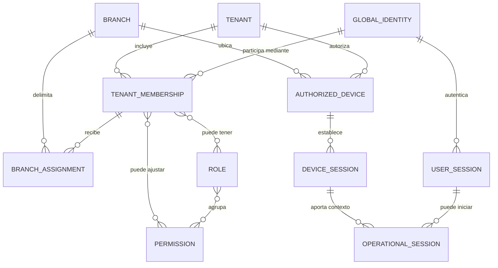
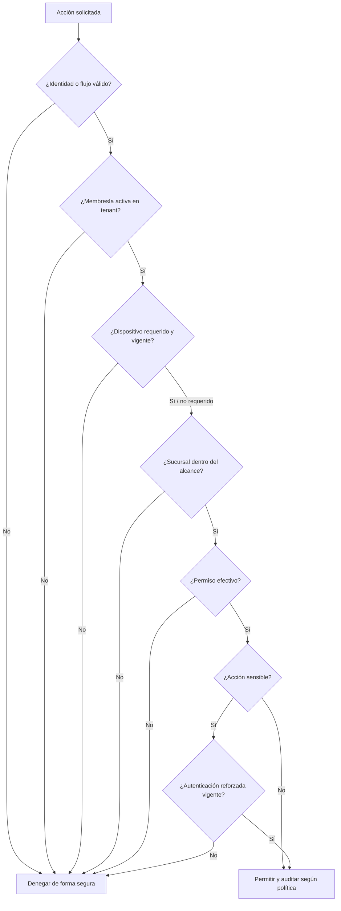

# Identidad, acceso y permisos

## Estado del documento

- **Estado:** Borrador conceptual de seguridad.
- **Naturaleza:** Propuesta; las reglas de negocio y mecanismos concretos requieren validación.
- **Alcance:** Identidad global, membresías, asignaciones, roles, permisos, dispositivos y sesiones.
- **Fuera de alcance:** Seleccionar proveedor, algoritmos criptográficos, formatos de token o políticas numéricas definitivas.

## Objetivo

Separar con claridad quién es una persona, a qué tenant pertenece, desde dónde opera y qué puede hacer. Ni el rol mostrado en la interfaz, ni el dispositivo vinculado, ni el PIN por sí solos deben otorgar autorización completa.

## Conceptos y relaciones

El diagrama es conceptual: no prescribe tablas, cardinalidades definitivas ni que una sesión se persista como entidad independiente.

## Distinciones obligatorias

| Concepto | Significado conceptual | No debe confundirse con |
|---|---|---|
| Identidad global | Representa a una persona autenticable en la plataforma | Membresía, rol o tenant activo |
| Membresía de tenant | Vincula una identidad con un tenant y un estado | Cuenta global o asignación de sucursal |
| Asignación a sucursal | Delimita dónde puede operar una membresía | Permiso para ejecutar cualquier acción |
| Rol | Conjunto administrable de permisos dentro de un alcance | Puesto laboral inmutable o autorización directa |
| Permiso | Capacidad atómica o contextual evaluada por la API | Elemento de navegación visible |
| Dispositivo autorizado | Equipo vinculado a un tenant y, normalmente, sucursal | Identidad de la persona |
| Sesión de dispositivo | Evidencia vigente de vinculación del equipo | Sesión de usuario u operación |
| Sesión de usuario | Resultado de autenticación de identidad | Tenant efectivo o turno de trabajo |
| Sesión operativa | Contexto temporal persona–tenant–sucursal–dispositivo | Autenticación primaria permanente |
| PIN | Mecanismo ágil para seleccionar o revalidar identidad en un dispositivo autorizado | Contraseña universal o permiso de supervisor |

## Identidad global

### Propuesta

- Una persona tendría una identidad global y una o más membresías de tenant.
- El identificador global no contiene tenant ni rol.
- Los datos de perfil global y los datos específicos de una membresía mantienen ownership distinto.
- El acceso a un tenant exige una membresía activa además de autenticación válida.
- La posibilidad de usar un mismo correo, teléfono u otro identificador en varias identidades requiere una regla explícita.
- La fusión, transferencia o eliminación de identidades es un proceso sensible y auditado, no una edición ordinaria.

### Hipótesis por validar

Una identidad podría pertenecer a varios tenants. Si producto rechaza ese escenario, se preservará aun así la separación conceptual para no hacer del tenant un atributo implícito de la autenticación.

## Membresía y asignación de sucursal

Una membresía propuesta contiene conceptualmente:

- tenant al que concede participación;
- estado, por ejemplo invitada, activa, bloqueada o revocada; vocabulario pendiente;
- roles y posibles ajustes de permisos;
- alcance tenant-wide o asignaciones a sucursales;
- vigencia opcional cuando el negocio lo requiera;
- metadatos de auditoría.

Una asignación a sucursal no concede automáticamente permisos. La autorización efectiva combina membresía activa, permiso requerido, alcance del permiso y sucursal objetivo.

## Roles y permisos

### Modelo propuesto

- Los permisos se expresan como capacidades estables orientadas a acciones, no como nombres de pantallas.
- Los roles agrupan permisos para facilitar administración.
- Los roles predeterminados pueden existir como plantilla, pero sus nombres y composición necesitan validación del negocio.
- Los permisos personalizados no deben permitir una combinación insegura sin advertencia o separación de funciones cuando aplique.
- Todo permiso declara alcance: plataforma, tenant, sucursal, recurso propio u otro contexto explícito.
- Las denegaciones tienen prioridad cuando exista una regla explícita de bloqueo; el modelo exacto de overrides está pendiente.
- La API es la autoridad de autorización. Web y móvil sólo reflejan capacidades obtenidas de manera segura.

### Evaluación conceptual de una acción

No todos los flujos requieren dispositivo o sucursal. Esa excepción debe estar definida por el caso de uso, no inferida por ausencia de datos.

## Dispositivo y sesiones

- Vincular un dispositivo establece confianza limitada dentro de tenant y sucursal.
- La sesión de dispositivo puede sobrevivir a cambios de operador, pero debe revocarse de forma independiente.
- La sesión de usuario autentica a una persona; su tenant efectivo se valida para cada contexto.
- Una sesión operativa puede facilitar cambio de turno mediante PIN en un dispositivo ya autorizado.
- Cerrar una sesión operativa no necesariamente desvincula el dispositivo ni cierra otras sesiones de usuario.
- Revocar membresía, dispositivo o permiso debe invalidar el acceso afectado con una latencia objetivo todavía `TBD`.

Véase [Modelo de sucursal y dispositivo](BRANCH_AND_DEVICE_MODEL.md).

## Acceso con PIN

### Propuesta

El PIN es un factor local de conveniencia para un dispositivo autorizado y una membresía previamente habilitada. El backend valida el intento y crea o renueva un contexto operativo acotado.

Controles conceptuales:

- el PIN se asocia a una membresía dentro de un tenant, no es una identidad global reutilizable;
- no se transmite ni conserva de forma recuperable en interfaces, logs o analítica;
- intentos fallidos se limitan y auditan sin revelar qué personas existen;
- el dispositivo debe estar activo y pertenecer a la sucursal solicitada;
- el contexto operativo expira y puede cerrarse remotamente;
- cambios de PIN y recuperaciones requieren un flujo distinto y suficientemente autenticado;
- acciones sensibles exigen autenticación reforzada, aunque el PIN haya iniciado la sesión;
- un empleado que cambia de sucursal necesita asignación vigente además de conocer su PIN.

**Decisión pendiente:** algoritmo de derivación, longitud, expiración, límites, recuperación y factor reforzado se seleccionarán mediante threat modeling; no se fijan aquí.

## Acciones sensibles y autenticación reforzada

Posibles candidatos, todos pendientes de validación:

- cambiar roles, permisos o asignaciones;
- vincular o transferir dispositivos;
- cerrar caja, anular pagos o aprobar descuentos excepcionales;
- exportar datos o acceder a información extensa;
- modificar integraciones, credenciales o destinos de webhook;
- operar como soporte sobre un tenant;
- cambiar factores de autenticación o recuperar acceso.

La política deberá definir qué significa reforzar, cuánto dura esa comprobación y qué evidencia queda en auditoría.

## Ciclo de vida, bloqueo y revocación

| Evento | Efecto conceptual esperado | Decisión pendiente |
|---|---|---|
| Bloqueo de identidad | Impedir nuevas autenticaciones y evaluar cierre de sesiones globales | Alcance y latencia |
| Suspensión de membresía | Denegar acceso a ese tenant, sin afectar otros tenants | Manejo de trabajos en curso |
| Remoción de sucursal | Denegar operaciones branch-scoped en esa sucursal | Sesiones operativas activas |
| Cambio de rol o permiso | Recalcular autorización y evitar tokens obsoletos prolongados | Estrategia de invalidación |
| Revocación de dispositivo | Cerrar sesión de dispositivo y operativas asociadas | Comportamiento offline |
| Compromiso de credencial | Revocar sesiones relevantes y forzar recuperación segura | Señales y automatización |

La revocación debe ser verificable en API y tiempo real; una interfaz cerrada no es evidencia suficiente.

## Administración de plataforma

- Una identidad de plataforma no obtiene acceso por pertenecer a un tenant especial.
- Permisos de plataforma y membresías de tenant permanecen separados.
- Acceso de soporte a un tenant se concede con propósito, alcance y duración explícitos.
- La suplantación silenciosa no se propone; toda vista o acción en contexto ajeno debe ser distinguible y auditada.
- Operaciones masivas o destructivas requieren controles reforzados y, cuando corresponda, aprobación adicional.

## Auditoría

Se registran según riesgo:

- autenticaciones, cierres, fallos y recuperaciones;
- creación, suspensión y revocación de membresías;
- cambios de roles, permisos y asignaciones;
- vinculación, transferencia y revocación de dispositivos;
- inicio y cierre de sesiones operativas;
- intentos y resultados de acciones sensibles;
- accesos excepcionales de plataforma o soporte.

La auditoría registra actor, tenant, sucursal, dispositivo, acción, objetivo, resultado, correlación y motivo cuando corresponda. No registra contraseñas, PIN, tokens ni secretos.

## Amenazas y controles de diseño

| Amenaza | Control conceptual |
|---|---|
| Escalada por modificar tenant o branch en el request | Contexto derivado de hostname e identidad; comprobación server-side |
| Autorización sólo en UI | Política aplicada en casos de uso de API |
| PIN observado o adivinado | Alcance local, rate limit, almacenamiento no recuperable, step-up y auditoría |
| Permisos obsoletos en una sesión larga | Revalidación e invalidación con objetivo definido |
| Dispositivo perdido | Revocación y cierre remoto independientes de la persona |
| Soporte con privilegios excesivos | Elevación explícita, mínima, temporal y auditada |
| Enumeración de usuarios | Respuestas y tiempos que no revelen membresías innecesariamente |

## Pruebas requeridas en una fase futura

- matriz actor–permiso–sucursal con casos permitidos y denegados;
- identidad con dos tenants y permisos diferentes;
- sesión de dispositivo válida con usuario no asignado a su sucursal;
- revocación durante una sesión activa y durante un job;
- cambio de rol sin conservar autorización antigua;
- manipulación de tenant, branch, actor o room;
- límites y bloqueo de PIN sin filtración de datos;
- acciones sensibles sin y con autenticación reforzada;
- soporte de plataforma sin privilegio o motivo suficiente.

## Riesgos

- Modelar puestos laborales como permisos rígidos y difíciles de cambiar.
- Combinar dispositivo, usuario y sesión en una sola credencial revocable sólo en conjunto.
- Hacer del PIN un sustituto débil de la autenticación para acciones de alto impacto.
- Mantener permisos completos en tokens de larga vida sin invalidación.
- Permitir overrides difíciles de explicar o auditar.
- Crear un superadministrador omnipotente sin controles contextuales.

## Documentos relacionados

- [Modelo de multitenancy](MULTITENANCY_MODEL.md)
- [Modelo de sucursal y dispositivo](BRANCH_AND_DEVICE_MODEL.md)
- [Línea base de seguridad](SECURITY_BASELINE.md)
- [Glosario de dominio](../product/DOMAIN_GLOSSARY.md)
- [Actores y personas](../product/ACTORS_AND_PERSONAS.md)

## Preguntas abiertas

- ¿Puede una identidad global pertenecer a varios tenants y usar el mismo identificador de acceso?
- ¿Quién crea, invita, recupera, suspende y elimina membresías?
- ¿Qué roles iniciales necesita el negocio y cuáles permisos no pueden delegarse?
- ¿Los overrides personalizados serán aditivos, restrictivos o ambos?
- ¿Qué acciones requieren dispositivo autorizado, sucursal o autenticación reforzada?
- ¿Cómo se recupera el acceso cuando no hay otro administrador del tenant?
- ¿Qué latencia máxima de revocación es aceptable para cada tipo de sesión?
- ¿Debe existir aprobación dual para acciones financieras o de plataforma?

## Próxima revisión

- **Momento:** después de talleres con Product Owner sobre actores y operaciones sensibles, antes de elegir autenticación o diseñar tokens.
- **Evidencia esperada:** matriz preliminar de capacidades y alcance, ciclo de vida de membresía y threat model del PIN.
- **Responsable:** TBD.
