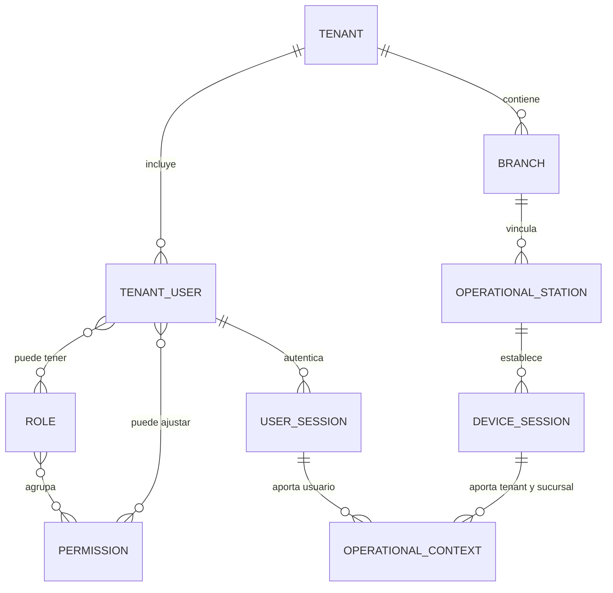
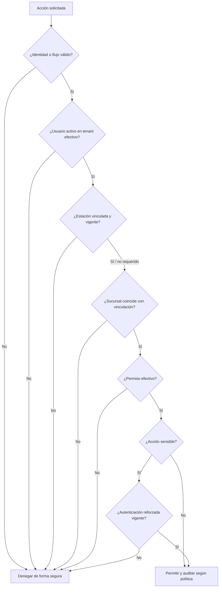

# Identidad, acceso y permisos

## Estado del documento

- **Estado:** Identidad, autenticación por PIN y sesión conceptual aceptadas; autorización y mecanismos pendientes.
- **Naturaleza:** ADR-004/010/011 son autoritativos para usuario por tenant, contexto por estación, PIN y sesión; roles, permisos y mecanismos técnicos siguen como propuesta.
- **Alcance:** Usuario de tenant, identidad de plataforma/correlación futura, roles, permisos, estaciones y sesiones.
- **Fuera de alcance:** Seleccionar proveedor, algoritmos criptográficos, formatos de token o políticas numéricas definitivas.

## Objetivo

Separar con claridad quién es el usuario del tenant, desde qué estación/sucursal opera y qué puede hacer. Ni el rol mostrado, ni la estación vinculada, ni el PIN por sí solos otorgan autorización completa.

## Conceptos y relaciones

El diagrama es conceptual: no prescribe tablas, cardinalidades definitivas ni que una sesión se persista como entidad independiente.

## Distinciones obligatorias

| Concepto | Significado conceptual | No debe confundirse con |
|---|---|---|
| Usuario ordinario | Identidad operativa perteneciente exactamente a un tenant | Rol, sucursal activa o cuenta de plataforma |
| Pertenencia de tenant | Invariante estructural del usuario ordinario | Selección temporal o asignación de sucursal |
| Rol | Conjunto administrable de permisos dentro de un alcance | Puesto laboral inmutable o autorización directa |
| Permiso | Capacidad atómica o contextual evaluada por la API | Elemento de navegación visible |
| Estación operativa | Equipo vinculado a una sucursal cuyo tenant se deriva de ella | Identidad de la persona |
| Sesión de dispositivo | Evidencia vigente de vinculación del equipo | Sesión de usuario u operación |
| Sesión de usuario | Periodo aceptado en que un usuario autenticado es actor activo dentro del contexto resuelto | Identidad, sucursal efectiva o permiso |
| Contexto operativo | Tenant–sucursal–estación–usuario resueltos para una operación | Autenticación primaria o autorización |
| PIN | Credencial operativa que identifica al usuario dentro del tenant ya resuelto | Identidad, selector de tenant/sucursal o permiso de supervisor |

## Usuario ordinario y pertenencia

ADR-004, ADR-010 y ADR-011 establecen:

- un usuario ordinario pertenece exactamente a un tenant;
- no pertenece permanentemente a una sucursal;
- no se duplica por sucursal;
- puede identificarse con el mismo usuario/PIN desde cualquier estación autorizada de su tenant;
- la estación, no el usuario, determina la sucursal efectiva;
- las identidades de plataforma permanecen separadas del usuario ordinario.
- la identidad no depende del PIN, de la sesión, de la estación ni de la sucursal efectiva.

Siguen pendientes recuperación, detalles administrativos de bloqueo/revocación, datos de perfil y posible correlación de una misma persona entre tenants. Esa correlación futura no puede convertir al usuario ordinario en una membresía multi-tenant ni permitir cambio de tenant dentro de una sesión operativa.

## Capacidades y alcance

Roles y permisos pueden limitar qué acciones realiza un usuario, pero no establecen la sucursal efectiva ni reemplazan la vinculación. Su modelo detallado permanece pendiente. Cualquier restricción contextual futura debe:

- evaluarse en servidor para el caso de uso;
- recibir el contexto de ADR-010;
- evitar cuentas duplicadas por sucursal;
- distinguir contexto válido de autorización concedida;
- no permitir que el usuario seleccione otra sucursal.

## Roles y permisos

### Modelo propuesto

- Los permisos se expresan como capacidades estables orientadas a acciones, no como nombres de pantallas.
- Los roles agrupan permisos para facilitar administración.
- Los roles predeterminados pueden existir como plantilla, pero sus nombres y composición necesitan validación del negocio.
- Los permisos personalizados no deben permitir una combinación insegura sin advertencia o separación de funciones cuando aplique.
- Todo permiso declara alcance: plataforma, tenant, sucursal, recurso propio u otro contexto explícito.
- Las denegaciones tienen prioridad cuando exista una regla explícita de bloqueo; el modelo exacto de overrides está pendiente.
- La API es la autoridad de autorización. Web y móvil sólo reflejan capacidades obtenidas de manera segura.

### Evaluación conceptual de una acción

No todos los flujos requieren dispositivo o sucursal. Esa excepción debe estar definida por el caso de uso, no inferida por ausencia de datos.

## Dispositivo y sesiones

- Vincular una estación establece confianza limitada en una sucursal y deriva su tenant.
- La sesión de dispositivo puede sobrevivir a cambios de operador, pero debe revocarse de forma independiente.
- ADR-011 establece que la sesión de usuario representa el periodo de operación de una persona autenticada dentro del tenant ya determinado por la estación.
- Una estación mantiene como máximo una sesión operativa activa.
- El contexto operativo combina estación/sucursal persistentes con el usuario activo y cambia de usuario sólo mediante autenticación satisfactoria.
- Cerrar, expirar, sustituir o invalidar la sesión de usuario no desvincula la estación.
- Una sesión inválida no acepta nuevas acciones; la política exacta y latencia de bloqueo/revocación siguen `TBD`.

Véase [Modelo de sucursal y dispositivo](BRANCH_AND_DEVICE_MODEL.md).

## Acceso con PIN

### Decisión conceptual aceptada

ADR-011 establece que el PIN es una credencial que identifica al usuario únicamente dentro del tenant de una estación autorizada. El servidor valida el intento y, si el usuario puede operar, establece una sesión nueva como única sesión activa de la estación. Protección y fuerza de autenticación se decidirán mediante un modelo de amenazas.

Controles conceptuales:

- el PIN se asocia a un usuario dentro de un tenant, no es identidad global reutilizable;
- nunca se almacena en texto plano o de forma reversible ni se conserva en interfaces, logs o analítica;
- intentos fallidos se limitan y auditan sin revelar qué personas existen;
- la estación debe estar activa y vinculada; no existe sucursal solicitada libremente por el usuario;
- el contexto de usuario expira por inactividad; cierre remoto y representación técnica permanecen pendientes;
- cambios de PIN y recuperaciones requieren un flujo distinto y suficientemente autenticado;
- acciones sensibles exigen autenticación reforzada, aunque el PIN haya iniciado la sesión;
- un empleado que rota de sucursal usa una estación vinculada del mismo tenant y no requiere otra cuenta.

**Decisión pendiente:** algoritmo de protección, longitud, tiempo concreto de inactividad, límites, recuperación y factor reforzado se seleccionarán mediante un modelo de amenazas; no se fijan aquí.

## Acciones sensibles y autenticación reforzada

Posibles candidatos, todos pendientes de validación:

- cambiar roles o permisos;
- vincular, desvincular o revocar estaciones;
- cerrar caja, anular pagos o aprobar descuentos excepcionales;
- exportar datos o acceder a información extensa;
- modificar integraciones, credenciales o destinos de webhook;
- operar como soporte sobre un tenant;
- cambiar factores de autenticación o recuperar acceso.

La política deberá definir qué significa reforzar, cuánto dura esa comprobación y qué evidencia queda en auditoría.

## Ciclo de vida, bloqueo y revocación

| Evento | Efecto conceptual esperado | Decisión pendiente |
|---|---|---|
| Bloqueo de usuario | Impedir nuevas sesiones mientras la condición aplique | Causas, duración y efecto sobre sesiones existentes |
| Desactivación de usuario | Impedir nuevas sesiones dentro de su tenant | Flujo administrativo y efecto sobre sesiones existentes |
| Revocación de usuario | Impedir nuevas sesiones; una sesión invalidada no acepta acciones | Alcance, propagación y latencia |
| Desvinculación de estación | Invalidar sus contextos y denegar operación ordinaria | Manejo de trabajos en curso |
| Cambio de rol o permiso | Recalcular autorización y evitar tokens obsoletos prolongados | Estrategia de invalidación |
| Revocación de dispositivo | Cerrar sesión de dispositivo y operativas asociadas | Comportamiento offline |
| Compromiso de credencial | Revocar sesiones relevantes y forzar recuperación segura | Señales y automatización |

La revocación debe ser verificable por la autoridad del servidor; una interfaz cerrada no es evidencia suficiente. ADR-011 no fija la tecnología ni la latencia.

## Administración de plataforma

- Una identidad de plataforma no obtiene acceso por pertenecer a un tenant especial.
- Permisos de plataforma y usuarios ordinarios de tenant permanecen separados.
- Acceso de soporte a un tenant se concede con propósito, alcance y duración explícitos.
- La suplantación silenciosa no se propone; toda vista o acción en contexto ajeno debe ser distinguible y auditada.
- Operaciones masivas o destructivas requieren controles reforzados y, cuando corresponda, aprobación adicional.

## Auditoría

Se registran según riesgo:

- autenticaciones, cierres, fallos y recuperaciones;
- creación, suspensión y revocación de usuarios;
- cambios de roles y permisos;
- vinculación, desvinculación y revocación de estaciones;
- inicio y cierre de sesiones operativas;
- intentos y resultados de acciones sensibles;
- accesos excepcionales de plataforma o soporte.

La auditoría registra usuario, sesión, tenant, sucursal, estación, acción, objetivo, resultado, fecha/hora, correlación y motivo cuando corresponda. No registra contraseñas, PIN, tokens ni secretos.

## Amenazas y controles de diseño

| Amenaza | Control conceptual |
|---|---|
| Escalada por modificar tenant o sucursal en la solicitud | Contexto derivado de la estación vinculada; comprobación del lado del servidor |
| Autorización sólo en UI | Política aplicada en casos de uso de API |
| PIN observado o adivinado | Alcance local, rate limit, almacenamiento no recuperable, step-up y auditoría |
| Permisos obsoletos en una sesión larga | Revalidación e invalidación con objetivo definido |
| Dispositivo perdido | Revocación y cierre remoto independientes de la persona |
| Soporte con privilegios excesivos | Elevación explícita, mínima, temporal y auditada |
| Enumeración de usuarios | Respuestas y tiempos que no revelen usuarios de otros tenants |

## Pruebas requeridas en una fase futura

- matriz usuario–permiso–contexto con casos permitidos y denegados;
- usuarios distintos en dos tenants con PIN/identificadores deliberadamente similares;
- estación válida con usuario del mismo tenant y con usuario de otro tenant;
- revocación durante una sesión activa y durante un job;
- cambio de rol sin conservar autorización antigua;
- manipulación de tenant, branch, actor o room;
- límites y bloqueo de PIN sin filtración de datos;
- acciones sensibles sin y con autenticación reforzada;
- soporte de plataforma sin privilegio o motivo suficiente.

## Riesgos

- Modelar puestos laborales como permisos rígidos y difíciles de cambiar.
- Combinar dispositivo, usuario y sesión en una sola credencial revocable sólo en conjunto.
- Hacer del PIN un sustituto débil de la autenticación para acciones de alto impacto.
- Mantener permisos completos en tokens de larga vida sin invalidación.
- Permitir overrides difíciles de explicar o auditar.
- Crear un superadministrador omnipotente sin controles contextuales.

## Documentos relacionados

- [Modelo de multitenancy](MULTITENANCY_MODEL.md)
- [Modelo de sucursal y dispositivo](BRANCH_AND_DEVICE_MODEL.md)
- [Línea base de seguridad](SECURITY_BASELINE.md)
- [ADR-011 — Identidad, autenticación por PIN y sesión operativa](../decisions/proposed/ADR-011-tenant-user-pin-authentication-and-operational-session.md)
- [Glosario de dominio](../product/DOMAIN_GLOSSARY.md)
- [Actores y personas](../product/ACTORS_AND_PERSONAS.md)

## Preguntas abiertas

- ¿Qué identificadores de acceso, recuperación y correlación de persona se permiten sin convertir al usuario ordinario en multi-tenant?
- ¿Quién crea, recupera, suspende y elimina usuarios de tenant?
- ¿Qué roles iniciales necesita el negocio y cuáles permisos no pueden delegarse?
- ¿Los overrides personalizados serán aditivos, restrictivos o ambos?
- ¿Qué acciones requieren estación operativa y autenticación reforzada además del contexto ordinario?
- ¿Cómo se recupera el acceso cuando no hay otro administrador del tenant?
- ¿Qué latencia máxima de revocación es aceptable para cada tipo de sesión?
- ¿Debe existir aprobación dual para acciones financieras o de plataforma?

## Próxima revisión

- **Momento:** antes de aceptar roles/permisos o diseñar mecanismos técnicos de PIN y sesión.
- **Evidencia esperada:** matriz preliminar de capacidades y modelo de amenazas del PIN/sesión compatibles con ADR-010/011.
- **Responsable:** TBD.
