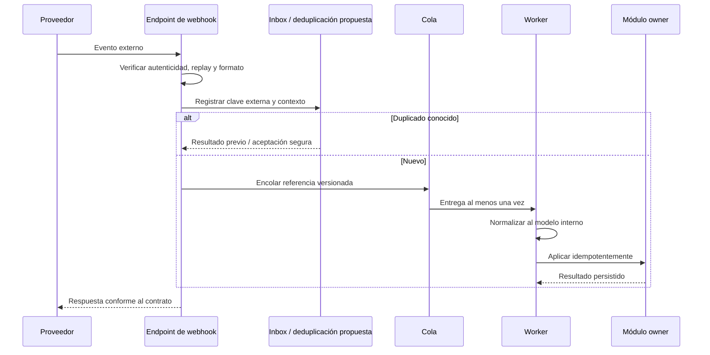

# Arquitectura de integraciones

## Estado del documento

- **Estado:** Borrador conceptual.
- **Naturaleza:** Propuesta de límites, patrones y controles; no selecciona proveedores ni contratos finales.
- **Alcance:** APIs externas, webhooks, archivos intercambiados, jobs, credenciales y normalización.

## Objetivo

Permitir que SR Taller 2.0 se conecte con mensajería, pagos, notificaciones, suscripciones y futuros servicios sin incorporar el modelo o la disponibilidad de un proveedor al núcleo del dominio.

## Principios

1. El dominio habla su propio lenguaje; cada proveedor se traduce en un adaptador.
2. Ningún webhook se considera confiable por llegar a una URL no pública o difícil de adivinar.
3. Los efectos entrantes y salientes son idempotentes cuando puedan repetirse.
4. Los procesos largos o reintentables se ejecutan fuera de la solicitud síncrona.
5. La configuración y credenciales se aíslan por ambiente y, cuando corresponda, por tenant.
6. Un fallo externo se representa de forma explícita; no debe corromper la transacción interna.
7. Los contratos se versionan, observan y prueban en sus límites.
8. La plataforma conserva la fuente de verdad de sus decisiones, aun si una referencia externa participa.

## Vista conceptual

```mermaid
flowchart LR
    subgraph Core[SR Taller 2.0]
        UseCase[Casos de uso]
        Port[Puertos de integración]
        Ingress[Webhook ingress]
        Normalize[Normalización / anti-corruption layer]
        Queue[Colas y workers propuestos]
        Store[(Persistencia canónica)]
    end

    subgraph Adapters[Adaptadores sustituibles]
        Msg[Mensajería / WAHA futuro]
        Pay[Pagos]
        Notify[Correo / push]
        Billing[Suscripción y billing]
        Other[Otros canales]
    end

    UseCase --> Port
    Port --> Queue
    Queue --> Adapters
    Adapters --> External[Proveedores externos]
    External --> Ingress
    Ingress --> Normalize
    Normalize --> Store
    Store --> UseCase
```

La anti-corruption layer evita que estados, IDs, errores y payloads de un proveedor se conviertan directamente en entidades internas.

## Tipos de integración

| Tipo | Uso esperado | Tratamiento conceptual |
|---|---|---|
| API saliente síncrona | Consultas breves indispensables para responder | Timeout estricto, error explícito y fallback sólo si es correcto |
| Comando saliente asíncrono | Mensaje, notificación, conciliación o proceso diferible | Persistir intención, encolar, reintentar e informar estado |
| Webhook entrante | Cambio iniciado o confirmado por proveedor | Verificar, deduplicar, registrar y procesar idempotentemente |
| Polling/reconciliación | Recuperar eventos perdidos o resolver estado ambiguo | Job acotado, checkpoint y límites de proveedor |
| Importación/exportación de archivo | Intercambio por lote | Cuarentena, validación, mapping, reporte y reconciliación |
| Callback de usuario | Retorno desde flujo externo | Correlacionar con estado server-side; no confiar sólo en parámetros del navegador |

No se asume que todos los proveedores soporten todos estos mecanismos.

## Límites y ownership

### Módulo de negocio

- Decide cuándo una integración es necesaria y qué resultado de negocio acepta.
- Conserva el estado canónico propio.
- No importa SDKs ni tipos específicos del proveedor.

### Puerto de integración

- Expresa una capacidad interna, por ejemplo “solicitar envío” o “consultar estado de pago”.
- Usa tipos y errores del dominio/aplicación.
- Define idempotencia, timeout y semántica esperada.

### Adaptador

- Traduce credenciales, requests, respuestas, estados y errores.
- Aísla SDK, versión y peculiaridades del proveedor.
- Instrumenta latencia, límites y resultado sin registrar secretos.
- Conserva referencias externas calificadas por proveedor, cuenta y ambiente.

### Ingress de webhooks

- Verifica autenticidad, replay, tamaño y versión.
- Resuelve configuración y tenant mediante una referencia confiable.
- Registra deduplicación y responde según el contrato del proveedor.
- Delega procesamiento prolongado a una cola.

## Configuración de integración

Una configuración conceptual podría relacionar:

- tenant propietario o alcance de plataforma;
- tipo de capacidad y proveedor;
- cuenta/canal externo y ambiente;
- estado: pendiente, activa, degradada, revocada u otro vocabulario por validar;
- referencia segura a credenciales, nunca secreto en claro;
- capacidades negociadas y versión de contrato;
- destinos de webhook y reglas permitidas;
- límites, health y última sincronización observada;
- metadatos de auditoría.

Un tenant sólo puede usar configuraciones de su propio contexto. La administración de plataforma no debe reutilizar una credencial entre tenants salvo que el modelo comercial y de seguridad lo autorice explícitamente.

## Flujo entrante

### Controles

- No confiar en `tenant_id` enviado libremente por el proveedor; resolverlo desde una configuración propia.
- Evitar resolver DNS o descargar URLs arbitrarias sin protección SSRF.
- Conservar payload crudo sólo si existe propósito, acceso y retención definidos.
- Separar el momento reportado por el proveedor del momento de recepción/procesamiento.
- Aislar eventos desconocidos o incompatibles para investigación.
- Reconciliar eventos perdidos cuando el proveedor ofrezca API adecuada.

## Flujo saliente

1. El caso de uso autoriza y persiste la intención o estado pendiente.
2. Se agenda un trabajo con tenant, referencia, versión, correlación e idempotency key.
3. El worker resuelve la configuración vigente desde almacenamiento seguro.
4. El adaptador aplica timeout, rate limit y contrato específico.
5. El resultado o ambigüedad se persiste antes de notificar.
6. Errores reintentables usan backoff; los permanentes quedan accionables.
7. Una reconciliación consulta al proveedor si el resultado no puede determinarse.

La publicación confiable entre commit y cola requiere evaluar outbox; no se da por resuelta.

## Idempotencia, orden y reconciliación

- Una clave entrante se califica por proveedor, cuenta, ambiente y tipo de evento.
- Una clave saliente se limita por tenant, operación y vigencia adecuada.
- Se conserva resultado suficiente para no repetir el efecto.
- Los consumidores toleran duplicados y verifican versión o estado actual.
- No se promete orden global; se define por recurso o conversación cuando sea necesario.
- Un evento tardío no sobrescribe estado posterior sin una regla explícita.
- La reconciliación compara referencias y estados, produce diferencias y no corrige silenciosamente datos de alto impacto.

## Errores y resiliencia

| Clase de resultado | Acción conceptual |
|---|---|
| Éxito confirmado | Persistir referencia y avanzar estado |
| Aceptado/pending | Persistir estado intermedio y esperar webhook o polling |
| Error reintentable | Backoff acotado, observabilidad y respeto a `Retry-After` |
| Error permanente | Detener reintentos, informar acción requerida |
| Respuesta ambigua | No repetir a ciegas; consultar o reconciliar usando idempotencia |
| Rate limit | Limitar concurrencia por proveedor/cuenta y reprogramar |
| Proveedor caído | Circuit breaker cuando proceda; degradación explícita |
| Contrato desconocido | Cuarentena y alerta; evitar aplicar payload no comprendido |

Cada integración define su clasificación; no se comparte una política genérica que trate pagos y notificaciones como equivalentes.

## Versionado de contratos

- Registrar versión del adaptador y del payload/evento procesado.
- Mantener fixtures contractuales sanitizados y pruebas del mapping.
- Tolerar campos adicionales cuando el contrato lo permita, sin aceptar tipos inválidos.
- Un cambio incompatible requiere periodo de transición o adaptadores paralelos.
- Los eventos internos se versionan por significado, no por la versión del proveedor.
- Los cambios de webhook se prueban en staging o sandbox sin usar credenciales de producción.

## Seguridad

- Credenciales en un secret manager o mecanismo equivalente por seleccionar; nunca en repositorio, logs o artefactos.
- Rotación, revocación y ownership definidos por integración y ambiente.
- Verificación de webhook conforme a la capacidad del proveedor; algoritmos y ventanas se decidirán después.
- Egress restringido cuando la infraestructura lo permita.
- Least privilege en cuentas externas y separación entre staging/production.
- Callbacks y redirects se validan contra destinos permitidos.
- Archivos y media pasan validación y cuarentena acorde al riesgo.
- Operaciones de conexión, cambio de destino, reenvío o reconciliación se auditan.

## Observabilidad

Por integración se necesitan:

- volumen, latencia y tasa de resultado;
- profundidad y edad de trabajos pendientes;
- reintentos, dead letters y reconciliaciones;
- versión de contrato y errores de mapping;
- rate limits y circuit breaker;
- correlación entre operación interna y referencia externa;
- health técnico separado de disponibilidad de negocio.

No se usan tenant, mensaje o referencia externa como etiqueta métrica sin controlar cardinalidad. El detalle vive en logs/traces con acceso restringido. Véase [Observabilidad](OBSERVABILITY_STRATEGY.md).

## WAHA y otros canales

WAHA se mantiene como candidato futuro dentro de un adaptador de mensajería. Antes de seleccionarlo se evaluarán términos de uso, aislamiento de sesiones, confiabilidad, webhooks, media, operación, seguridad y ruta de reemplazo. La arquitectura no debe hacer de WAHA la fuente de verdad de conversaciones.

La incorporación de WhatsApp no implica soporte automático para todos los canales. Cada canal necesita capabilities, mapping, límites y experiencia de degradación.

## Pagos y suscripciones

- Una redirección del navegador no confirma por sí sola un pago.
- El monto, moneda y referencia esperados se contrastan server-side.
- Webhook y consulta de reconciliación determinan el estado confirmado según el proveedor.
- Reintentar nunca debe duplicar un cargo por falta de idempotencia.
- Pagos del taller y cobro de suscripción SaaS pueden tener owners y proveedores distintos.
- Contracargos, reembolsos, impuestos y países soportados requieren discovery.

## Pruebas futuras

- contrato válido y cambios compatibles/incompatibles;
- firma ausente, inválida, replay y timestamp fuera de ventana;
- mismo evento para tenants/configuraciones distintas;
- duplicado concurrente, tardío y fuera de orden;
- timeout después de que el proveedor ejecutó la acción;
- rate limit, caída, respuesta corrupta y estado ambiguo;
- rotación o revocación de credenciales durante un job;
- SSRF, archivo malicioso y payload sobredimensionado;
- despliegue de adaptador nuevo con eventos de versión anterior;
- reconciliación sin cambios silenciosos ni cruces de tenant.

## Riesgos

- Fijar el dominio al vocabulario o IDs de un proveedor.
- Mezclar credenciales y webhooks de tenants o ambientes.
- Ejecutar efectos externos dentro de transacciones largas.
- Reintentar un resultado ambiguo y duplicar mensajes o cargos.
- Retener payloads o media sin propósito ni política.
- Suponer que sandbox reproduce comportamiento productivo.
- Crear un “módulo de integraciones” dueño de reglas que pertenecen a pagos, mensajería u otros dominios.

## Documentos relacionados

- [Tiempo real y mensajería](REALTIME_AND_MESSAGING.md)
- [Arquitectura de aplicaciones](APPLICATION_ARCHITECTURE.md)
- [Arquitectura de datos](DATA_ARCHITECTURE.md)
- [Línea base de seguridad](SECURITY_BASELINE.md)
- [Mapa de módulos](../product/MODULE_MAP.md)

## Preguntas abiertas

- ¿Qué integraciones son imprescindibles para la primera capacidad validada?
- ¿Cada tenant aportará sus credenciales o la plataforma operará cuentas compartidas?
- ¿Qué proveedores ofrecen sandbox, idempotencia, firma y reconciliación suficientes?
- ¿Qué límites, costos y términos legales aplican por canal y país?
- ¿Cuánto tiempo deben conservarse payloads, referencias y resultados?
- ¿Quién puede conectar, rotar, pausar y eliminar una integración?
- ¿Qué experiencia se ofrece cuando un proveedor está degradado?
- ¿Qué integraciones requieren certificación o revisión de seguridad previa?

## Próxima revisión

- **Momento:** al priorizar una integración concreta, antes de elegir SDK o definir endpoints.
- **Evidencia esperada:** capability matrix, contrato sandbox, threat model, modelo de errores y criterios de sustitución.
- **Responsable:** TBD.
