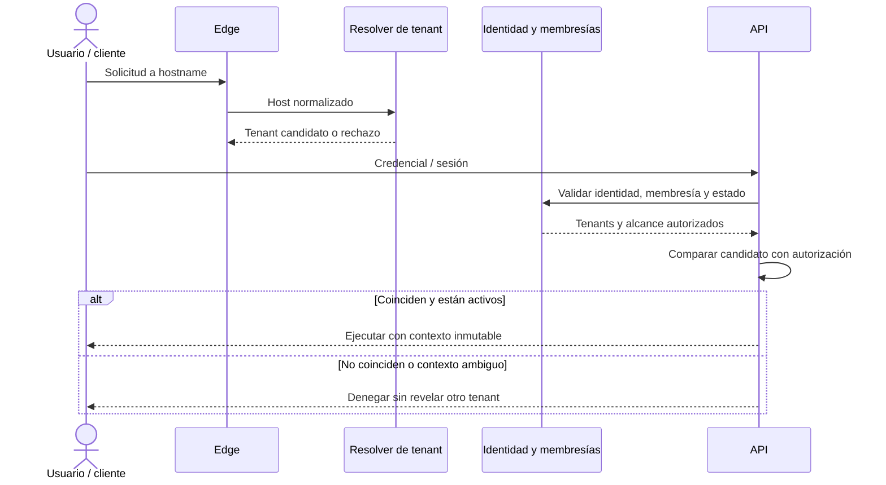

# Modelo preliminar de multitenancy

## Estado del documento

- **Estado:** Borrador conceptual de alto riesgo.
- **Naturaleza:** Propuesta sujeta a validación y pruebas; no es una decisión aceptada.
- **Dirección evaluada:** Base PostgreSQL compartida, esquema compartido y `tenant_id`, con Row-Level Security (RLS) como defensa adicional a evaluar.
- **ADR relacionado:** [ADR-004: multitenancy con esquema compartido](../decisions/proposed/ADR-004-shared-schema-multitenancy.md), estado `Proposed`.

## Objetivo de seguridad

Una operación de un tenant no debe leer, modificar, inferir, publicar, cachear ni entregar datos de otro tenant, incluso ante errores de programación comunes. El aislamiento abarca persistencia, API, jobs, WebSockets, archivos, caché, logs, reportes, integraciones y operación de soporte.

## Separación de conceptos

- **Tenant candidato:** resultado de resolver el hostname; todavía no concede acceso.
- **Tenant efectivo:** tenant autorizado después de contrastar hostname, identidad, membresía y estado.
- **Contexto de tenant:** valor inmutable que acompaña una operación una vez autorizada.
- **Contexto de sucursal:** restricción operativa adicional dentro de un tenant; no reemplaza `tenant_id`.
- **Contexto de plataforma:** operación administrativa global excepcional, separada del flujo de tenant y auditada.

## Resolución del tenant

### Reglas propuestas

1. El hostname normalizado resuelve un tenant candidato mediante un identificador estable, no mediante datos suministrados en el cuerpo.
2. La identidad autenticada debe tener membresía vigente en ese tenant, salvo un flujo público explícitamente diseñado.
3. Un `tenant_id` recibido en body, query o header no prevalece sobre el contexto resuelto.
4. Hostnames desconocidos, suspendidos o ambiguos fallan de forma cerrada.
5. Dominios de API, plataforma y recursos públicos requieren reglas explícitas; no caen en un tenant por defecto.
6. Cambiar de tenant crea o valida un contexto nuevo; no se muta silenciosamente el actual.
7. El subdominio wildcard sigue siendo una [propuesta](../decisions/proposed/ADR-008-wildcard-subdomain-routing.md), no una decisión aceptada.

## Propagación del contexto

Un contexto mínimo conceptual contiene:

- `tenant_id` efectivo;
- identidad y membresía que lo autorizan;
- `branch_id` cuando la operación esté limitada a sucursal;
- sesión de usuario y/o dispositivo, según el flujo;
- identificador de correlación;
- tipo de contexto: tenant o plataforma.

Debe construirse una vez en un borde confiable y pasarse explícitamente. No se propone una variable global mutable ni se admite que un repositorio lo deduzca del payload.

## Persistencia compartida

### Reglas propuestas

- Toda entidad propiedad de un tenant incluye `tenant_id` obligatorio y no nulo.
- `branch_id` sólo aparece donde el concepto tenga alcance de sucursal y siempre se valida que pertenezca al mismo tenant.
- Referencias entre datos tenant-scoped incluyen o comprueban el tenant común; una coincidencia de ID aislada no basta.
- Claves naturales y restricciones de unicidad se definen con alcance explícito: típicamente `(tenant_id, valor)` y, si corresponde, `(tenant_id, branch_id, valor)`.
- Índices de consultas tenant-scoped comienzan normalmente por `tenant_id`; el orden final depende de patrones medidos.
- Relaciones globales legítimas —por ejemplo catálogo de planes— se modelan y autorizan como globales, no omitiendo accidentalmente `tenant_id`.
- El identificador no debe cambiar de tenant; una transferencia requiere un proceso de negocio explícito o recreación controlada.

Este documento no define tablas, columnas físicas ni migraciones.

## Repositorios conscientes del tenant

La interfaz de un repositorio tenant-scoped debe hacer difícil o imposible consultar sin contexto:

- recibe un `TenantContext` validado o queda construida con ese alcance;
- no ofrece métodos globales genéricos al código operativo;
- aplica `tenant_id` tanto en lectura como en actualización y eliminación;
- valida `branch_id` dentro del mismo tenant;
- rechaza resultados cuyo contexto sea incoherente;
- mantiene separadas las interfaces administrativas globales;
- registra pruebas de contrato de aislamiento.

No basta con recordar añadir un filtro manual en cada consulta.

## Prevención de consultas globales accidentales

Se propone defensa en profundidad:

1. Tipos e interfaces distintas para datos globales y tenant-scoped.
2. Contexto obligatorio en casos de uso y repositorios.
3. Linting o reglas arquitectónicas que impidan usar adaptadores sin alcance.
4. Constraints compuestos que prevengan referencias cruzadas.
5. Pruebas automáticas con al menos dos tenants y datos deliberadamente similares.
6. Revisión de código con checklist multitenant.
7. Evaluación de PostgreSQL RLS como barrera adicional.
8. Credenciales y paths distintos para tareas administrativas excepcionales.

## Evaluación de Row-Level Security

RLS podría limitar filas por una variable de sesión/transacción y reducir el impacto de una consulta que omita el filtro. Antes de aceptarlo se necesita un spike documental/técnico controlado que evalúe:

- propagación segura del tenant en pools de conexiones;
- limpieza del contexto al reutilizar conexiones;
- políticas para lecturas, escrituras, joins y datos globales;
- comportamiento de migraciones, workers y tareas administrativas;
- privilegios que puedan omitir RLS y uso de `FORCE ROW LEVEL SECURITY`;
- compatibilidad con el ORM o query builder propuesto;
- pruebas que demuestren denegación cruzada;
- costo de operación y diagnóstico.

**Decisión pendiente:** RLS no sustituye el contexto en la aplicación ni los filtros conscientes del tenant. Su adopción, alcance y configuración requieren ADR.

## Contexto en superficies no SQL

| Superficie | Regla de aislamiento propuesta |
|---|---|
| Jobs | `tenant_id`, versión, correlación e idempotency key en el envelope; el worker revalida antes de actuar |
| WebSockets | Autorización al conectar y al unirse a cada room; namespace de tenant y conversación/sucursal |
| Caché | Claves con namespace versionado y tenant; nunca una clave sólo por ID de entidad |
| Redis pub/sub | Canales con tenant y tipo de evento; payload mínimo y autorización antes de entrega |
| Archivos | Prefijo o namespace no predecible por tenant más metadatos autoritativos; acceso mediante autorización, no sólo URL |
| Búsqueda y reportes | Índices, exportaciones y consultas siempre particionados por tenant; operaciones globales separadas |
| Logs y trazas | `tenant_id` como contexto controlado, sin incluir secretos ni contenido sensible |
| Webhooks salientes | Destino pertenece al tenant; firma/credencial y cuotas se resuelven desde ese contexto |

## Alcance de sucursal

- Una sucursal pertenece exactamente a un tenant según la hipótesis inicial.
- `branch_id` restringe un subconjunto de operaciones; no crea una frontera equivalente a tenant.
- Un usuario puede tener asignaciones a una o varias sucursales; el permiso debe indicar si es tenant-wide o branch-scoped.
- Un dispositivo se vincula a tenant y sucursal conforme al [modelo de sucursal y dispositivo](BRANCH_AND_DEVICE_MODEL.md).
- Transferir datos entre sucursales requiere una regla de negocio por módulo; no se asume permitido.
- Agregados tenant-wide —por ejemplo ciertos reportes— requieren permiso explícito y no eliminan el filtro de tenant.

## Administración de plataforma y soporte

No se propone un “supertenant”. Las operaciones globales deben:

- usar identidad y permisos de plataforma separados de las membresías de tenant;
- requerir justificación y autenticación reforzada para acciones sensibles;
- seleccionar explícitamente el tenant objetivo;
- limitar alcance y duración de la elevación;
- producir auditoría inmutable o protegida según la política futura;
- evitar consultas masivas por defecto;
- impedir que la suplantación de soporte sea invisible para auditoría.

## Pruebas automáticas de aislamiento

La estrategia dedicada está en [Pruebas de aislamiento multitenant](../quality/MULTITENANT_ISOLATION_TESTING.md). Como mínimo, cada superficie debería comprobar:

- mismo ID lógico o datos similares en tenants A y B;
- lectura, búsqueda, paginación, actualización y eliminación cruzadas denegadas;
- referencias de sucursal de otro tenant rechazadas;
- discrepancia hostname–membresía rechazada;
- job y room manipulados no cruzan contexto;
- caché no devuelve resultados de otro tenant;
- archivo o URL de otro tenant no se revela;
- rutas administrativas requieren contexto separado;
- errores y métricas no filtran contenido ajeno.

## Observabilidad del aislamiento

- Métricas agregadas de discrepancias y denegaciones, sin etiquetas de cardinalidad no controlada.
- Logs estructurados con tenant, actor, operación, correlación y resultado, sujeto a minimización.
- Alertas por patrones de autorización anómalos, no por cada error esperado.
- Auditoría de accesos excepcionales de plataforma.
- Trazas que permitan seguir API, job e integración conservando el contexto autorizado.

## Riesgos

- Una consulta sin filtro en esquema compartido puede tener impacto transversal.
- Un pool de conexiones mal configurado puede conservar contexto RLS anterior.
- IDs globalmente únicos pueden dar falsa sensación de aislamiento.
- Caché, archivos, exports y rooms suelen quedar fuera de pruebas centradas sólo en SQL.
- Herramientas de reporting o soporte pueden eludir repositorios seguros.
- Alta cardinalidad de tenant en métricas puede elevar costo o degradar observabilidad.
- Un hostname controlado por el cliente podría usarse como autoridad única.

## Decisiones pendientes

- Aceptar o rechazar esquema compartido con `tenant_id`.
- Definir si RLS será obligatoria, selectiva o descartada.
- Aprobar subdominios wildcard y estrategia para dominios personalizados.
- Definir alcance de unicidad y retención por agregado.
- Diseñar acceso de soporte y exportaciones globales.
- Definir estrategia futura de partición o extracción para tenants excepcionales.

## Preguntas abiertas

- ¿Una identidad puede pertenecer a varios tenants y alternar entre ellos?
- ¿Qué roles pueden operar múltiples sucursales simultáneamente?
- ¿Existirán usuarios, clientes o catálogos compartidos entre tenants?
- ¿Se permitirán dominios personalizados además de subdominios?
- ¿Qué requisitos regulatorios podrían exigir aislamiento físico o residencia regional?
- ¿Cómo se gestionarán backups, restauraciones o exportaciones de un solo tenant?
- ¿Qué límites de volumen justificarían partición, archivado o estrategia híbrida?

Las respuestas deben consolidarse en [preguntas abiertas](../product/OPEN_QUESTIONS.md) y, cuando cambien la dirección, en un ADR.

## Próxima revisión

- **Momento:** antes de definir cualquier esquema ejecutable o repositorio.
- **Evidencia esperada:** threat model multitenant, prototipo controlado de RLS si se evalúa, pruebas negativas y decisión del ADR-004.
- **Responsable:** TBD.
