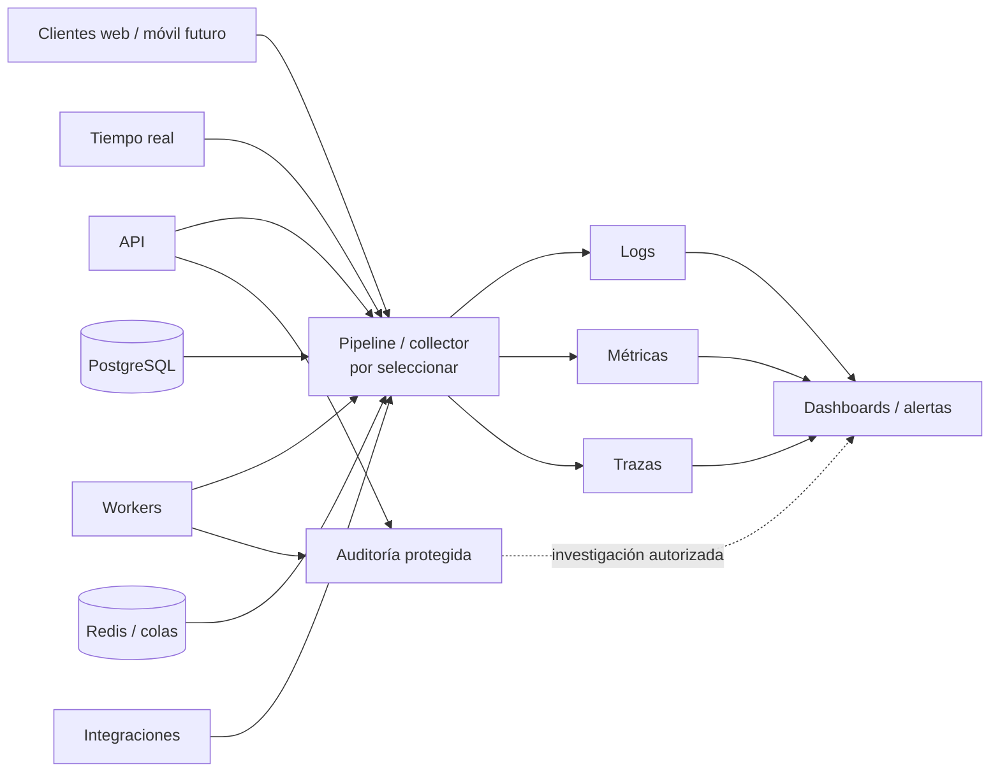
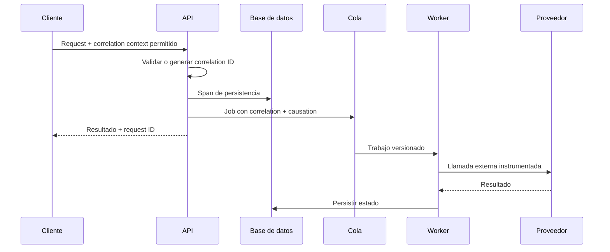

# Estrategia de observabilidad

## Estado del documento

- **Estado:** Borrador conceptual.
- **Naturaleza:** Propuesta de señales, contexto y prácticas; no selecciona un stack ni proveedor.
- **Alcance:** API, web, workers, tiempo real, integraciones, datos e infraestructura por ambiente.

## Objetivo

Poder responder con evidencia qué ocurrió, a quién afectó, en qué ambiente y cómo recuperar el servicio, sin exponer datos de tenants ni depender de acceso manual a servidores.

## Principios

1. Instrumentar recorridos completos, no sólo procesos aislados.
2. Correlacionar solicitud, transacción, evento, job, webhook y entrega.
3. Separar telemetría operativa de auditoría de negocio/seguridad.
4. Minimizar datos sensibles y controlar cardinalidad y costo.
5. Definir objetivos antes de crear alertas.
6. Alertar sobre síntomas accionables, no sobre cada evento individual.
7. Mantener observabilidad consistente entre local, staging y production con retención y destinos distintos.
8. Tratar pérdidas o retrasos de telemetría como fallos visibles, sin hacer que detengan el negocio salvo requisito de auditoría.

## Señales fundamentales

| Señal | Responde | Ejemplos conceptuales |
|---|---|---|
| Logs estructurados | ¿Qué evento discreto ocurrió y con qué contexto? | Request denegado, job agotado, integración degradada |
| Métricas | ¿Cómo cambia el sistema agregado en el tiempo? | Latencia, error rate, saturación, queue lag |
| Trazas distribuidas | ¿Dónde se consumió tiempo o falló un recorrido? | API → DB → cola → worker → proveedor |
| Eventos de auditoría | ¿Quién hizo qué sobre qué recurso y con qué resultado? | Cambio de permiso, export, revocación de dispositivo |
| Eventos de producto | ¿La capacidad produce el resultado esperado? | Definición futura; no debe mezclarse con secretos ni auditoría |

La analítica de producto necesita consentimiento y métricas definidas; no se crea automáticamente a partir de logs.

## Flujo conceptual

El diagrama no implica que auditoría use el mismo almacén, retención o permisos que logs.

## Contexto común

### Campos candidatos

- ambiente, servicio/unidad desplegable y versión del artefacto;
- timestamp autoritativo y nivel/severidad;
- trace ID, span ID, correlation ID y causation ID cuando apliquen;
- request ID, job ID o event ID;
- tenant ID y branch ID controlados;
- usuario, tenant, sucursal, estación o sesión mediante identificadores no sensibles;
- módulo, operación, resultado y clase de error;
- proveedor y tipo de integración, sin credenciales;
- versión del contrato o mensaje.

### Reglas

- No registrar PIN, contraseña, token, cookie, authorization header, secreto ni clave de firma.
- No registrar cuerpos completos, contenido de mensajes, archivos o datos personales por defecto.
- Tenant y branch provienen del contexto validado, no del payload sin verificar.
- Los nombres de campos y niveles son consistentes entre API y worker.
- Identificadores de alta cardinalidad se usan en logs/traces, no indiscriminadamente como labels métricos.
- Los errores conservan causa técnica internamente sin filtrarla a clientes.

## Correlación de recorridos

El sistema acepta sólo formatos de propagación permitidos y genera su propio contexto cuando el recibido sea inválido. Un ID de correlación no concede acceso a telemetría ni a datos.

## Señales por componente

### API

- volumen, latencia y resultados por ruta lógica/operación, evitando paths con IDs;
- autenticación, autorización y rate limiting agregados;
- conexiones y tiempos de pool de base de datos;
- tamaño de request/response y rechazos por límites;
- dependencia externa en paths síncronos;
- versión desplegada y readiness.

### Workers y colas

- profundidad, edad del trabajo más antiguo y throughput;
- tiempo de espera y ejecución;
- éxito, reintento, agotamiento, cancelación y dead letters;
- concurrencia, locks obsoletos y jobs atascados;
- fairness entre tenants observada sin labels ilimitados;
- versión de payload y consumidor.

### Tiempo real

- conexiones, handshakes, rechazos y reconexiones;
- joins/leaves autorizados y fallidos agregados;
- eventos publicados, entregados técnicamente y descartados;
- backpressure, tamaño y latencia de entrega;
- salud del adapter Redis/coordinación;
- desconexiones por revocación o despliegue.

### Integraciones

- latencia, disponibilidad observada y resultados por proveedor/capacidad;
- webhooks válidos, inválidos, duplicados y desconocidos;
- rate limit, circuit breaker y próxima ventana;
- drift de contrato o mapping;
- reconciliaciones y resultados ambiguos;
- expiración/rotación de credenciales sin revelar su valor.

### Datos y almacenamiento

- conexiones, latencia, bloqueos, deadlocks y consultas lentas agregadas;
- capacidad, crecimiento, replicación y backup;
- hit/miss y evictions de caché;
- errores, latencia y capacidad de objetos;
- migraciones y backfills con progreso y carga;
- restauraciones ensayadas y su evidencia.

### Clientes web y móvil futuro

- versión y compatibilidad de cliente;
- errores no manejados y fallos de carga;
- Web Vitals u objetivos de experiencia por definir;
- fallos de API correlacionables sin capturar contenido sensible;
- estado de actualización del design system cuando sea útil.

La telemetría del cliente requiere política de privacidad, sampling y consentimiento conforme al contexto.

## SLIs, SLOs y presupuesto de error

Los objetivos cuantitativos están `TBD`; se definirán por recorrido, no como un único porcentaje para toda la plataforma.

| Recorrido candidato | Indicadores posibles | Necesita definición de producto |
|---|---|---|
| Acceso operativo | Éxito y latencia de autenticación/PIN | Horarios críticos y tolerancia |
| Crear/actualizar reparación | Tasa de éxito y latencia end-to-end | Qué cuenta como disponible |
| Registrar pago/caja | Integridad, éxito y reconciliación | Riesgo y ventana de recuperación |
| Enviar/recibir mensaje | Tiempo hasta persistencia y entrega | Canal y expectativa del usuario |
| Trabajo asíncrono | Edad, éxito final y tiempo a recuperación | Deadline por clase |
| Exportar/reporte | Tiempo a resultado y fallo recuperable | Tamaño y prioridad |

Una vez aprobados SLOs, los presupuestos de error pueden orientar release pace, capacidad y priorización. No se inventan umbrales en Sprint 00.

## Health, readiness y synthetic checks

- **Liveness:** indica si el proceso puede seguir ejecutándose; no consulta todas las dependencias.
- **Readiness:** indica si debe recibir trabajo nuevo, considerando dependencias indispensables.
- **Startup:** opción para procesos con inicialización prolongada; necesidad pendiente.
- **Synthetic check:** valida un recorrido seguro desde fuera de la unidad, con datos dedicados y sin afectar tenants reales.

No se debe declarar todo sano sólo porque el proceso responde, ni reiniciar en bucle por una dependencia externa no esencial.

## Dashboards propuestos

- salud de plataforma por ambiente y versión;
- experiencia de recorridos críticos;
- API y dependencias de datos;
- workers, colas y jobs agotados;
- tiempo real y conexiones;
- integraciones por capacidad/proveedor;
- seguridad y denegaciones agregadas;
- despliegue, migración y rollback;
- capacidad, costos y crecimiento.

Un dashboard tiene audiencia, owner y pregunta operacional. No se crea sólo para acumular gráficas.

## Alertas

### Criterios

- Señal vinculada a impacto o riesgo real.
- Ventana y severidad que evitan ruido por fallos transitorios normales.
- Runbook y owner antes de habilitar paging.
- Deduplicación y agrupación por incidente.
- Información suficiente: ambiente, versión, servicio, síntoma y enlaces de investigación.
- Sin datos personales, secretos ni contenido del tenant en notificaciones.

### Candidatos

- consumo sostenido de presupuesto de error;
- backlog/edad de cola que incumple un deadline;
- tasa anómala de fallos o denegaciones;
- dependencia crítica degradada sin fallback;
- migración, backup o restauración fallidos;
- capacidad próxima a agotarse;
- certificados/credenciales próximos a expirar;
- dead letters o reconciliaciones pendientes por encima de umbral.

Umbrales y canales quedan `TBD`.

## Auditoría frente a logs

| Aspecto | Auditoría | Log operativo |
|---|---|---|
| Propósito | Responsabilidad y reconstrucción de acciones | Diagnóstico de comportamiento técnico |
| Productor | Caso de uso consciente | Componente o infraestructura |
| Retención | Según riesgo/legalidad, por definir | Según necesidad operativa/costo |
| Mutabilidad | Protección reforzada | Almacén de telemetría normal |
| Acceso | Muy restringido y justificable | Equipos operativos autorizados |
| Contenido | Tenant, sucursal, estación, usuario, sesión, fecha/hora, acción, objetivo, resultado y motivo aplicable | Estado técnico minimizado |

Una caída del pipeline de logs no debe descartar silenciosamente una auditoría obligatoria. Su consistencia y fallback requieren diseño específico.

## Privacidad, acceso y retención

- Clasificar telemetría como dato potencialmente sensible.
- Redactar en origen cuando sea posible; no depender sólo del backend de logs.
- Definir acceso por rol, ambiente y propósito.
- Staging y production usan proyectos/destinos o controles claramente separados.
- Retención y sampling por señal; valores `TBD`.
- Atender eliminación/privacidad sin destruir evidencia legal requerida, según política futura.
- Auditar acceso a logs sensibles y exportaciones de telemetría.

## Control de cardinalidad y costo

- Evitar labels métricos de tenant, user, conversation, request o error libre.
- Normalizar rutas y códigos de error.
- Aplicar sampling consciente a trazas, preservando errores y recorridos críticos según política.
- Limitar stack traces repetidos y payloads grandes.
- Establecer presupuestos de volumen por componente antes de producción.
- Medir pérdida/drop del propio pipeline.
- Revisar instrumentación en PR cuando añada dimensiones o contenido sensible.

## Ambientes

- Local debe permitir inspección simple sin simular que es staging.
- Staging valida dashboards, alertas y trazas con credenciales y datos separados.
- Production tiene retención, acceso, alertamiento y on-call acordes al impacto.
- Cada señal incluye ambiente y versión del mismo artefacto promovido.
- No mezclar alertas de pruebas con producción.

Véanse [Estrategia de despliegue](DEPLOYMENT_STRATEGY.md) y [Ambientes](../delivery/ENVIRONMENTS.md).

## Relación con incidentes y releases

- Cada release queda visible por versión y momento en dashboards.
- Se comparan señales antes/después del despliegue y migración.
- Rollback se decide con síntomas y criterios predefinidos.
- Un incidente conserva timeline, consultas, decisiones y evidencia.
- La revisión posterior actualiza alertas, runbooks, pruebas y backlog.
- Se mide tiempo de detección y recuperación sólo cuando sus definiciones sean aprobadas.

## Pruebas futuras

- propagación de correlación API → job → proveedor → evento;
- redacción de secretos, PIN, tokens y payloads sensibles;
- caída o saturación del collector sin detener casos de uso indebidos;
- alerta sintética y enlace a runbook;
- cardinalidad bajo múltiples tenants/conversaciones;
- revocación visible en logs y auditoría sin filtrar credencial;
- versión de artefacto correcta tras promoción/rollback;
- diferencia clara entre readiness y liveness;
- acceso y separación de telemetría entre ambientes.

## Riesgos

- Confundir tener muchos logs con poder diagnosticar recorridos.
- Crear métricas de cardinalidad ilimitada por tenant o recurso.
- Exponer contenido sensible a equipos o proveedores de observabilidad.
- Alertar sin owner/runbook y producir fatiga.
- Usar logs como auditoría mutable o incompleta.
- Instrumentar sólo happy paths y perder jobs/webhooks.
- Elegir herramientas antes de definir preguntas, SLOs y costos.

## Documentos relacionados

- [Arquitectura objetivo](TARGET_ARCHITECTURE.md)
- [Tiempo real y mensajería](REALTIME_AND_MESSAGING.md)
- [Arquitectura de integraciones](INTEGRATION_ARCHITECTURE.md)
- [Línea base de seguridad](SECURITY_BASELINE.md)
- [ADR-011 — Identidad, autenticación por PIN y sesión operativa](../decisions/proposed/ADR-011-tenant-user-pin-authentication-and-operational-session.md)
- [Incident Management](../operations/INCIDENT_MANAGEMENT.md)
- [Runbook Template](../operations/RUNBOOK_TEMPLATE.md)

## Preguntas abiertas

- ¿Cuáles recorridos tienen impacto operativo suficiente para definir los primeros SLOs?
- ¿Qué retención, residencia y acceso aplican a logs, trazas y auditoría?
- ¿Quién recibe alertas fuera de horario y con qué severidades?
- ¿Qué stack satisface costos, privacidad, OpenTelemetry u otros requisitos por validar?
- ¿Qué campos de tenant/actor pueden registrarse y quién puede consultarlos?
- ¿Qué auditorías deben persistir aunque el pipeline operacional falle?
- ¿Qué synthetic checks son seguros y representativos?
- ¿Qué presupuesto de telemetría y cardinalidad puede sostenerse?

## Próxima revisión

- **Momento:** al definir los primeros recorridos implementables y antes de seleccionar herramientas de observabilidad.
- **Evidencia esperada:** catálogo de señales, campos redactados, SLI candidatos, dashboards/alertas con owner y estimación de volumen.
- **Responsable:** TBD.
