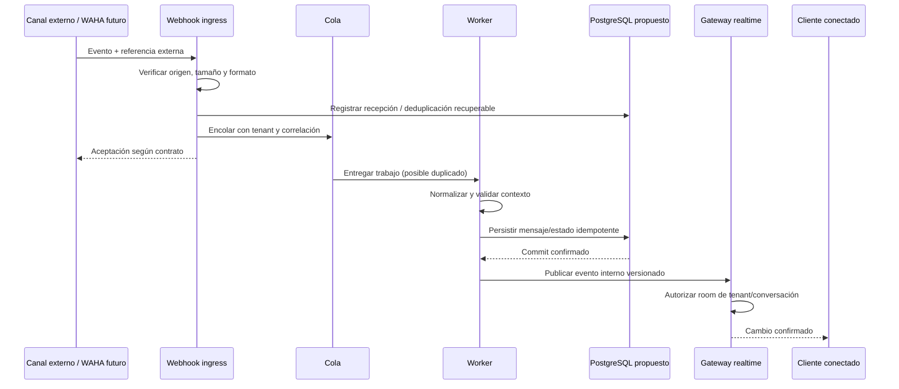
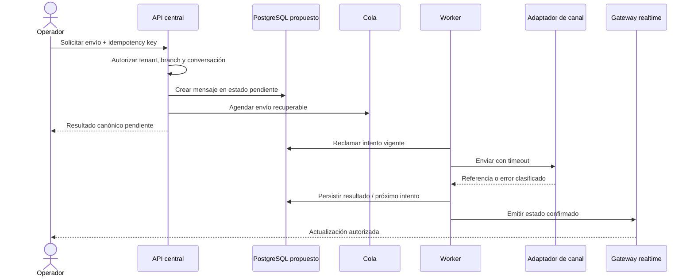

# Tiempo real y mensajería

## Estado del documento

- **Estado:** Borrador conceptual.
- **Naturaleza:** Propuesta de flujo y responsabilidades; tecnología y proveedores no están aceptados.
- **Candidatos:** Redis para coordinación, BullMQ para jobs y Socket.IO o WebSockets para conexiones.
- **Integración futura:** WAHA es una opción a evaluar, no una dependencia confirmada.

## Objetivo

Diseñar mensajería y actualizaciones en tiempo real como capacidades coherentes del backend, no como parches de interfaz. La persistencia autoritativa precede a la notificación y todo flujo conserva tenant, conversación, idempotencia y trazabilidad.

## Separación de responsabilidades

| Responsabilidad | Propósito | Fuente de verdad |
|---|---|---|
| API / webhook ingress | Aceptar comandos y eventos externos validados | No por sí solo |
| Módulo Messaging | Normalizar conversaciones, mensajes y estados | Persistencia de plataforma |
| Cola / worker | Diferir envíos, reintentar y procesar webhooks | Estado persistido + envelope del job |
| Adaptador de canal | Traducir modelo interno al contrato del proveedor | Proveedor para su referencia; plataforma para el modelo canónico |
| Gateway realtime | Entregar eventos confirmados a conexiones autorizadas | Nunca la conexión |
| Cliente | Renderizar, confirmar recepción técnica y resincronizar | API central |

## Flujo entrante

### Reglas

- Se valida autenticidad del webhook según capacidad del proveedor, sin fijar aún algoritmo.
- La respuesta rápida al proveedor no depende de completar todo el procesamiento cuando el contrato lo permita.
- Se conserva una referencia de deduplicación con alcance de proveedor, cuenta/canal y ambiente.
- El payload se normaliza a un modelo interno versionado; conservar el crudo requiere propósito y retención.
- No se notifica como confirmado un mensaje que todavía no se persistió.
- Eventos desconocidos se aíslan y hacen observables; no se descartan silenciosamente.

## Flujo saliente

El mecanismo para garantizar atomicidad entre persistencia y enqueue —por ejemplo outbox— es una decisión pendiente.

## Modelo canónico preliminar

Sin definir tablas, el dominio podría distinguir:

- **Conversación:** contenedor tenant-scoped vinculado a un canal y participantes normalizados.
- **Canal:** configuración de integración y capacidad, no sólo nombre de proveedor.
- **Mensaje:** contenido o referencia a archivo, dirección, autor/origen y timestamps diferenciados.
- **Entrega:** intento y resultado por destino o proveedor.
- **Estado externo:** hecho reportado por el canal y mapeado a vocabulario interno.
- **Evento de conversación:** cambios no necesariamente representados como mensaje visible.

El [glosario](../product/DOMAIN_GLOSSARY.md) debe validar estos significados.

## Estados de mensaje

**Hipótesis para discovery:** `pendiente`, `enviado al proveedor`, `entregado`, `leído`, `fallido` y `cancelado` podrían ser estados útiles. No todos los canales soportan todos ni sus significados son equivalentes.

Reglas propuestas:

- conservar el estado interno y la evidencia externa sin fingir mayor certeza;
- no retroceder por un webhook tardío salvo regla de reconciliación;
- diferenciar fallo reintentable, permanente y desconocido;
- mostrar al usuario estados honestos y permitir recuperación autorizada;
- almacenar tiempos del proveedor y de recepción por separado;
- evitar que “emitido por WebSocket” signifique “entregado al destinatario”.

## Deduplicación e idempotencia

- Webhooks pueden repetirse, llegar tarde o fuera de orden.
- La clave externa se califica por proveedor, cuenta/canal, ambiente y tipo de evento.
- Comandos salientes reciben idempotency key con tenant y actor/contexto.
- Un reintento devuelve o continúa el resultado anterior; no crea un mensaje adicional silencioso.
- Los consumidores de eventos internos toleran entrega al menos una vez.
- La deduplicación tiene retención definida según ventana real del proveedor.
- Efectos secundarios —notificación, archivo, evento— también deben ser idempotentes.

## Colas, reintentos y fallos

### Envelope mínimo propuesto

- identificador y versión del trabajo;
- `tenant_id` obligatorio;
- tipo y referencia al recurso, evitando copiar contenido sensible;
- correlación y causation ID;
- idempotency key;
- número de intento y momento permitido;
- configuración/canal resuelto de forma segura por referencia.

### Política conceptual

- Backoff, máximo de intentos y timeout se definen por clase de error y proveedor.
- Errores permanentes no consumen reintentos inútiles.
- Agotamiento lleva a un estado visible y una cola de fallo operable, no a pérdida silenciosa.
- Reprocesar exige permiso, motivo, idempotencia y auditoría.
- Circuit breakers y límites de concurrencia se evalúan para proteger API propia y externa.
- Un tenant ruidoso no debería agotar toda la capacidad; fairness y cuotas quedan por diseñar.

## Rooms y aislamiento

### Namespace conceptual

- room de tenant para eventos amplios autorizados;
- room de sucursal cuando el evento tenga ese alcance;
- room de conversación para participantes con permiso;
- room de usuario o sesión para resultados privados.

Reglas:

1. El servidor construye el nombre o identificador de room; no acepta uno arbitrario como autorización.
2. Autentica la conexión y revalida usuario, contexto de estación y permisos al unirse.
3. Incluye tenant en todo namespace, incluso si el ID de conversación parece globalmente único.
4. Revoca usuarios o estaciones desconectando o retirando rooms afectadas.
5. Cada evento se autoriza para su audiencia; publicar a una room amplia por comodidad no es aceptable.
6. Redis pub/sub o adapter, si se usa, conserva namespaces y no sustituye la comprobación de acceso.

## Conexión, reconexión y resincronización

- El handshake usa credenciales vigentes y contexto compatible con hostname.
- La conexión tiene duración limitada o revalidación periódica por definir.
- Un cliente desconectado recupera estado mediante API; el socket no garantiza historial completo.
- Eventos llevan ID/versión suficientes para detectar huecos cuando el caso lo requiera.
- Después de reconectar, el cliente consulta cambios o estado actual desde una fuente autoritativa.
- Backpressure, tamaño máximo, frecuencia y número de suscripciones se limitan.
- Un despliegue puede cerrar conexiones; los clientes deben reconectar con jitter sin tormenta.

## Indicadores efímeros

### Escritura

- Es señal temporal, no dato de negocio ni mensaje persistente.
- Se limita por tenant, conversación y actor; expira automáticamente.
- Sólo se entrega a participantes autorizados.
- No contiene texto escrito ni datos sensibles.

### Presencia

- “Conectado” sólo significa conexión técnica reciente, no disponibilidad laboral.
- Puede derivarse de sesiones activas con TTL y coordinación en Redis propuesta.
- Visibilidad por rol, privacidad y alcance necesitan definición de producto.
- No debe usarse para decisiones financieras, auditoría o asignación automática sin una regla adicional.

## Ordenamiento

- El tiempo del cliente o proveedor no es un orden autoritativo único.
- Se propone versión o secuencia por conversación para cambios persistidos.
- La UI usa un orden estable y puede marcar pendientes locales separadamente.
- Eventos fuera de orden se aplican sólo si su versión es posterior o mediante regla específica.
- No se promete orden global entre tenants, conversaciones o colas.

## WAHA como integración futura

WAHA podría ser un adaptador de WhatsApp, sujeto a evaluación técnica, legal y operativa:

- términos de uso y estabilidad del mecanismo;
- aislamiento de sesiones por tenant/canal;
- autenticación de webhooks y seguridad de credenciales;
- límites, reconexión y estado de sesión;
- mapping de mensajes, media, receipts y errores;
- operación, actualizaciones y soporte;
- estrategia de reemplazo sin migrar el modelo del proveedor al dominio.

No se confirma WAHA ni WhatsApp para la primera entrega.

## Extracción futura de mensajería

Mensajería puede permanecer como módulo del monolito modular. Una extracción a servicio independiente sólo se reconsiderará si existe evidencia de:

- escalado o disponibilidad sustancialmente distintos;
- aislamiento de fallos frente al núcleo;
- ownership y ciclo de entrega independiente;
- múltiples consumidores con contrato estable;
- carga de conexiones o workers que no pueda resolverse separando procesos;
- costos y observabilidad distribuida asumibles.

La extracción requeriría nuevo ADR, contratos versionados, estrategia de datos y tolerancia a consistencia eventual.

## Observabilidad

- Correlación desde webhook/comando hasta job, proveedor, persistencia y WebSocket.
- Métricas de lag, profundidad, intentos, fallos, deduplicación, latencia y conexiones.
- Estado por proveedor/canal sin exponer secretos ni contenido.
- Alertas accionables por backlog sostenido, fallos agotados o desconexión anómala.
- Auditoría separada para reenvíos, cambios de canal y accesos a conversaciones.
- Cardinalidad controlada: tenant o conversación detallados se investigan en logs/traces, no siempre como labels métricos.

## Seguridad y privacidad

- Validar firmas/credenciales, origen, replay, tamaño y tipo de contenido.
- Escanear o poner en cuarentena adjuntos según riesgo.
- Minimizar payloads en jobs, logs y eventos.
- Autorizar lectura y envío por conversación y alcance.
- Proteger secretos de canal por ambiente y tenant.
- Definir retención y eliminación de mensajes y payloads crudos.
- Evitar SSRF al recuperar media o URLs externas.
- Aplicar rate limits a envío, conexión, join y eventos efímeros.

## Pruebas futuras

- webhook válido, inválido, duplicado, tardío y fuera de orden;
- commit exitoso con fallo de enqueue y recuperación posterior;
- worker ejecutado dos veces sin duplicar mensaje;
- aislamiento de rooms y pub/sub entre tenants;
- revocación mientras existe conexión;
- reconexión con huecos y resincronización por API;
- caída de Redis sin perder estado canónico;
- proveedor lento, caído, limitado o con respuesta ambigua;
- media maliciosa o sobredimensionada;
- fairness entre tenant ruidoso y tenants pequeños.

## Riesgos

- Emitir antes de persistir y mostrar estados que luego desaparecen.
- Usar rooms proporcionadas por el cliente sin autorización server-side.
- Depender del orden o unicidad garantizados sólo por el proveedor.
- Reintentar errores permanentes y generar duplicados o bloqueos.
- Guardar contenido sensible en cola, log o telemetría.
- Acoplar el dominio a WAHA u otro proveedor.
- Separar mensajería demasiado pronto y aumentar fallos distribuidos.

## Documentos relacionados

- [Arquitectura de integraciones](INTEGRATION_ARCHITECTURE.md)
- [Arquitectura de aplicaciones](APPLICATION_ARCHITECTURE.md)
- [Modelo de multitenancy](MULTITENANCY_MODEL.md)
- [Estrategia de observabilidad](OBSERVABILITY_STRATEGY.md)
- [Línea base de seguridad](SECURITY_BASELINE.md)

## Preguntas abiertas

- ¿Qué canales y recorridos de mensajería producen valor en la primera etapa?
- ¿Quién puede iniciar, ver, reasignar o cerrar una conversación?
- ¿Qué estados soporta cada canal y cuál será el vocabulario canónico?
- ¿Qué retención necesitan mensajes, adjuntos, receipts y payloads crudos?
- ¿Qué garantía de orden y latencia exige la operación?
- ¿Cómo se distribuye capacidad de workers entre tenants?
- ¿Qué experiencia necesita el usuario ante envío pendiente, ambiguo o fallido?
- ¿WAHA cumple requisitos legales, técnicos y de soporte del proyecto?

## Próxima revisión

- **Momento:** cuando producto priorice canales y journeys, antes de seleccionar protocolo o proveedor.
- **Evidencia esperada:** contratos de eventos conceptuales, threat model de webhook, matriz de estados y prueba de idempotencia propuesta.
- **Responsable:** TBD.
