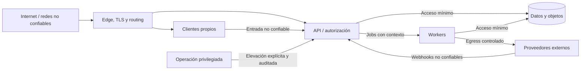

# Línea base de seguridad

## Estado del documento

- **Estado:** Borrador conceptual de controles mínimos.
- **Naturaleza:** Propuesta y conjunto de hitos; ADR-004/010/011 son autoritativos para aislamiento, contexto e identidad/sesión conceptuales y no constituyen certificación ni diseño criptográfico final.
- **Alcance:** Producto, aplicaciones, datos, dependencias, entrega y operación.
- **Referencia de verificación:** [Estrategia de pruebas de seguridad](../quality/SECURITY_TESTING.md).

## Objetivo

Establecer controles mínimos antes de implementar para reducir exposición entre tenants, abuso de privilegios, pérdida de datos y compromiso operativo. Seguridad se aplica en cada límite, no como módulo añadido al final.

## Principios

1. Denegar por defecto y conceder el menor privilegio necesario.
2. Tratar toda entrada y contexto del cliente como no confiables.
3. Separar usuario, tenant, sucursal, estación, sesión y permiso.
4. Aislar tenant en todas las superficies, no sólo en SQL.
5. Proteger secretos y datos sensibles durante todo su ciclo de vida.
6. Aplicar defensa en profundidad a errores probables.
7. Mantener trazabilidad sin registrar credenciales o contenido innecesario.
8. Diseñar revocación, recuperación e incidentes antes de necesitarlos.
9. Automatizar controles verificables y revisar excepciones.
10. No fijar algoritmos, proveedores o umbrales sin threat model y ADR cuando corresponda.

## Activos prioritarios

- datos de clientes, reparaciones, inventario y conversaciones;
- usuarios, identidades de plataforma, roles, permisos y sesiones;
- PIN, factores de autenticación y mecanismos de recuperación;
- pagos, cajas, suscripciones y referencias financieras;
- archivos, adjuntos y exportaciones;
- credenciales de integraciones y secretos de infraestructura;
- auditoría, backups y capacidad de recuperación;
- disponibilidad e integridad de API, workers y canales;
- separación entre tenants, sucursales y ambientes.

## Límites de confianza

Cada flecha exige autenticación o verificación, autorización, validación, límites, observabilidad y manejo de fallos acorde al riesgo.

## Amenazas prioritarias iniciales

| Amenaza | Ejemplo | Controles conceptuales |
|---|---|---|
| Exposición entre tenants | Filtro omitido, cache key compartida, room amplia | Contexto obligatorio, namespaces, constraints/RLS a evaluar, pruebas negativas |
| Escalada de privilegio | UI oculta pero API permite; override incorrecto | Autorización server-side contextual, deny by default, matriz de permisos |
| Secuestro de sesión | Token robado o dispositivo perdido | Sesiones acotadas, revocación, step-up y protección de almacenamiento |
| Adivinación de PIN | Intentos automatizados en terminal compartida | Rate limit, bloqueo proporcional, auditoría y factor reforzado |
| Inyección | SQL, comandos, plantillas o logs | APIs parametrizadas, validación, encoding y pruebas |
| SSRF/carga maliciosa | Media externa o webhook con URL interna | Allowlist/egress, validación, cuarentena y límites |
| Duplicación/replay | Webhook o pago repetido | Firma cuando exista, ventana, nonce/idempotencia y reconciliación |
| Compromiso de proveedor | SDK o paquete vulnerable | Pinning/lockfile, scanning, procedencia y actualización controlada |
| Fuga operacional | Secretos en logs, CI o staging | Secret manager, redacción, acceso mínimo y ambientes separados |
| Abuso administrativo | Soporte accede sin motivo | Elevación temporal, purpose binding y auditoría protegida |

Un threat model por recorrido crítico debe refinar esta lista antes de implementación.

## Identidad y autenticación

- El usuario ordinario pertenece a un tenant y se autentica cotidianamente por PIN conforme a ADR-011; el mecanismo técnico, la identidad de plataforma y la correlación de persona permanecen separados.
- Tenant/sucursal/estación efectivos se comprueban conforme a ADR-010 antes de autenticar al usuario dentro del tenant.
- Una estación mantiene como máximo una sesión operativa activa; una sesión inválida no acepta acciones nuevas.
- El PIN nunca se almacena en texto plano ni de forma reversible.
- Tokens o cookies se almacenan y transportan con controles apropiados al cliente; formato pendiente.
- Recuperación de cuenta no puede ser más débil que el acceso que protege.
- Cambios de factores y recuperaciones producen notificación y auditoría según riesgo.
- Protección ante enumeración, credential stuffing y automatización se diseña sin bloquear indebidamente tenants completos.
- Acciones sensibles requieren autenticación reforzada o aprobación según una política por validar.

Véase [Identidad, acceso y permisos](IDENTITY_ACCESS_AND_PERMISSIONS.md).

## Autorización

- La API autoriza cada caso de uso y recurso; la interfaz no es una frontera.
- Se evalúan usuario, tenant, sucursal, estación, permiso y estado del recurso según corresponda.
- Los objetos se cargan dentro del contexto autorizado para evitar IDOR.
- Operaciones de plataforma usan permisos y flujos separados de tenant.
- Los cambios de permisos se hacen efectivos con una latencia definida y comprobable.
- Los exports, reportes, archivos, sockets y jobs reciben el mismo nivel de autorización que una pantalla.
- Las denegaciones no revelan existencia ni datos de otro tenant.

## Aislamiento multitenant

La línea base exige:

- `tenant_id` obligatorio en datos tenant-scoped;
- resolución ordinaria por estación vinculada contrastada con usuario del mismo tenant; nombre de host sólo como señal adicional;
- repositorios conscientes del tenant y ausencia de consultas globales operativas;
- constraints e índices compuestos cuando corresponda;
- namespaces en caché, colas, pub/sub, rooms, objetos y exports;
- contextos de tenant inmutables en API y jobs;
- acceso global excepcional, separado y auditado;
- pruebas con tenants A/B en toda superficie;
- evaluación documentada de PostgreSQL RLS.

Véase [Modelo de multitenancy](MULTITENANCY_MODEL.md).

## Seguridad de API y aplicaciones

- TLS obligatorio fuera del desarrollo local; terminación y re-encryption se decidirán por topología.
- CORS, cookies, CSRF y headers se configuran según el modelo real de clientes, no con comodines de conveniencia.
- Validación de esquema, tamaño, tipo y profundidad en todo input.
- Consultas parametrizadas y encoding contextual de salida.
- Rate limits por superficie con claves que no permitan evasión o afectación masiva injusta.
- Paginación y límites máximos para evitar extracción y agotamiento.
- Errores estables sin stack traces, SQL, secretos ni existencia ajena.
- Uploads directos o firmados mantienen autorización, límites y verificación server-side.
- WebSockets autentican handshake y cada suscripción relevante; origen y reconexión se controlan.
- Redirects y callbacks sólo aceptan destinos autorizados.

## Sesiones de dispositivo y PIN

- Vinculación mediante desafío temporal y aprobación autorizada.
- Sesión de dispositivo revocable e independiente de la sesión humana.
- PIN limitado al tenant y contexto autorizado; nunca recuperable ni observable.
- Protección de intentos, cierre por inactividad y cambio de turno.
- Limpieza de datos locales al cambiar operador, revocar o retirar equipo.
- Cierre remoto y denegación server-side ante pérdida.
- Operación offline permanece fuera de requisitos hasta completar su threat model.

Véase [Modelo de sucursal y dispositivo](BRANCH_AND_DEVICE_MODEL.md).

## Datos y privacidad

- Inventario y clasificación inicial de datos antes de elegir retención o protección adicional.
- Minimización en dominio, eventos, jobs, logs, analítica y proveedores.
- Cifrado en tránsito y en reposo; mecanismos y gestión de claves pendientes de arquitectura de infraestructura.
- Acceso a producción restringido, temporal, atribuible y revisable.
- Datos reales no llegan a staging salvo proceso controlado, aprobado y sanitizado.
- Backups reciben controles equivalentes a producción y restauraciones se prueban.
- Eliminación, anonimización, exportación y legal hold se definen según jurisdicción y contrato.
- Datos sensibles no se usan como identificadores en URLs, métricas o nombres de archivos.

## Archivos y contenido no confiable

- Validar tamaño, extensión, tipo detectado y contexto antes de aceptar.
- Usar nombres internos y metadatos separados del nombre aportado por usuario.
- Poner en cuarentena o escanear según riesgo antes de disponibilidad.
- Evitar ejecución y active content en previews.
- Generar accesos temporales y autorizados; no buckets públicos por conveniencia.
- Proteger contra path traversal, zip bombs, SSRF y contenido sobredimensionado.
- Definir retención, versión, borrado y respuesta ante malware.

## Integraciones y webhooks

- Credenciales de menor privilegio por ambiente y tenant/cuenta cuando aplique.
- Verificar autenticidad y replay conforme al proveedor, sin fijar algoritmo aquí.
- Resolver tenant desde configuración interna, no desde payload libre.
- Deduplicar e implementar idempotencia en efectos.
- Limitar egress y validar URLs/redirects.
- Rotar y revocar secretos con operación documentada.
- Mapear errores sin exponer payloads completos en logs.

Véase [Arquitectura de integraciones](INTEGRATION_ARCHITECTURE.md).

## Secretos y configuración

- Ningún secreto en repositorio, imagen, bundle de cliente, logs, tickets o documentos.
- Valores públicos y secretos se distinguen explícitamente.
- Secretos se inyectan en runtime desde un mecanismo controlado por seleccionar.
- Credenciales únicas por ambiente; producción no se reutiliza en local/staging.
- Acceso basado en rol de servicio y persona, con rotación y revocación.
- Rotación se ensaya y permite coexistencia breve sólo cuando sea indispensable.
- Los clientes web/móvil nunca reciben secretos del backend.
- Las fallas de configuración segura impiden iniciar en vez de usar defaults inseguros.

## Supply chain y CI/CD

- Dependencias con lockfile, fuentes autorizadas y revisión de cambios.
- Scanning de vulnerabilidades, secretos y licencias en política por definir.
- Acciones de CI y herramientas fijadas a versiones/procedencia verificable.
- Build en entorno controlado; artefacto versionado, trazable e inmutable.
- El mismo artefacto probado se promueve a producción sin reconstrucción.
- Credenciales de CI con mínimo privilegio, expiración/identidad federada cuando sea viable.
- Branch protection, revisión y gates obligatorios según criticidad.
- SBOM, firma y attestations son opciones a evaluar antes de producción, no decisiones aceptadas.

## Infraestructura y red

- Bases, Redis, objetos y colas no se exponen públicamente salvo necesidad justificada.
- Separación de red y credenciales por ambiente.
- Egress y acceso administrativo restringidos y observables.
- Servicios ejecutan con identidad propia y mínimo privilegio.
- Imágenes mínimas, no privilegiadas y actualizables; política concreta pendiente.
- DNS, certificados wildcard y renovación necesitan ownership y monitoreo.
- Protección DDoS/WAF es una evaluación basada en riesgo, no sustituto de validación de aplicación.

## Logging, auditoría y monitoreo de seguridad

- Logs estructurados con correlación, actor y tenant controlados; sin PIN, tokens, secretos ni contenido completo.
- Auditoría de autenticación, permisos, dispositivos, exports, pagos y acceso de soporte según riesgo.
- Alertas por patrones sostenidos: fallos, escalada, revocación, cambios de integración y acceso anómalo.
- Hora sincronizada y fuente autoritativa para reconstruir eventos.
- Acceso a telemetría limitado porque también puede contener datos sensibles.
- Retención y protección de auditoría se definen separadamente de logs de diagnóstico.

## Respuesta y recuperación

- Clasificación y canales de incidentes se documentan antes de producción.
- Capacidad de revocar sesiones, dispositivos, credenciales e integraciones.
- Procedimiento para aislar tenant, proveedor o despliegue sin acciones improvisadas.
- Evidencia preservada con acceso controlado.
- Comunicación y obligaciones de notificación dependen de jurisdicción y contrato.
- Post-incident review genera acciones trazables, no culpabilización.

Véase [Incident Management](../operations/INCIDENT_MANAGEMENT.md).

## Gates antes de implementación y producción

### Antes de implementación funcional

- threat model inicial de multitenancy, identidad, PIN y primera integración;
- decisiones críticas registradas en ADRs;
- matriz preliminar de permisos y alcance;
- estrategia de secretos y ambientes;
- criterios de pruebas negativas.

### Antes de producción

- revisión de arquitectura y superficies expuestas;
- pruebas de aislamiento, autorización, API, webhook y archivos;
- scanning de dependencias, secretos e imágenes según política;
- backups/restauración y revocación ensayados;
- observabilidad, alertas y runbooks mínimos;
- vulnerabilidades críticas tratadas mediante umbral aprobado;
- riesgos residuales aceptados explícitamente por el rol competente.

Los umbrales y responsables están `TBD`; no se inventan en este documento.

## Riesgos

- Tratar controles propuestos como implementados o certificados.
- Resolver seguridad sólo con RLS o sólo con middleware.
- Crear excepciones administrativas sin duración ni auditoría.
- Registrar secretos o datos personales para facilitar diagnóstico.
- Habilitar offline, integraciones o uploads sin threat model específico.
- Bloquear usuarios legítimos con controles globales que ignoran tenant/dispositivo.
- Acumular dependencias y excepciones de CI sin ownership.

## Documentos relacionados

- [Modelo de multitenancy](MULTITENANCY_MODEL.md)
- [Identidad, acceso y permisos](IDENTITY_ACCESS_AND_PERMISSIONS.md)
- [ADR-011 — Identidad, autenticación por PIN y sesión operativa](../decisions/proposed/ADR-011-tenant-user-pin-authentication-and-operational-session.md)
- [Arquitectura de datos](DATA_ARCHITECTURE.md)
- [Estrategia de despliegue](DEPLOYMENT_STRATEGY.md)
- [Estrategia de observabilidad](OBSERVABILITY_STRATEGY.md)
- [Pruebas de seguridad](../quality/SECURITY_TESTING.md)

## Preguntas abiertas

- ¿Qué jurisdicciones, regulaciones y obligaciones contractuales aplican?
- ¿Qué proveedor y modelo de autenticación satisfacen los recorridos de usuario?
- ¿Qué acciones exigen step-up, aprobación dual o segregación de funciones?
- ¿Qué objetivos de revocación, retención y notificación de incidentes se requieren?
- ¿Qué clasificación y protección adicional necesitan mensajes, pagos y archivos?
- ¿Qué threat actors y capacidades son prioritarios para el Product Owner?
- ¿Qué herramientas y umbrales formarán los gates de CI/CD?
- ¿Quién acepta riesgo residual y administra accesos de emergencia?

## Próxima revisión

- **Momento:** antes de aprobar scaffolding de identidad, persistencia o primera integración, y nuevamente antes de producción.
- **Evidencia esperada:** threat models, matriz de controles, decisiones de autenticación/secretos y plan de pruebas.
- **Responsable:** TBD.
