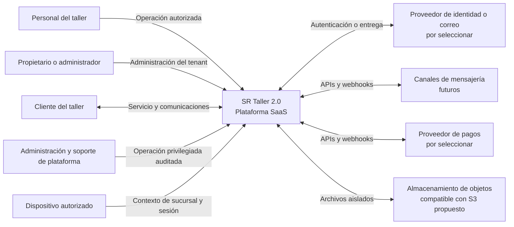

# Contexto del sistema

## Estado del documento

- **Estado:** Borrador conceptual.
- **Naturaleza:** Hechos conocidos, hipótesis y propuestas; no constituye una decisión arquitectónica aceptada.
- **Alcance:** Límites de SR Taller 2.0, actores, sistemas externos y flujos de información de alto nivel.
- **Fuente de producto:** [Visión del producto](../product/PRODUCT_VISION.md) y [actores y personas](../product/ACTORS_AND_PERSONAS.md).

## Propósito

Este documento ubica a SR Taller 2.0 en su entorno. No define módulos internos ni contratos implementables; esos temas se desarrollan en la [arquitectura de aplicaciones](APPLICATION_ARCHITECTURE.md) y la [arquitectura de integraciones](INTEGRATION_ARCHITECTURE.md).

## Hechos conocidos

- SR Taller 2.0 será una plataforma SaaS para la operación de talleres de reparación de celulares.
- Un tenant podrá tener varias sucursales, usuarios y dispositivos autorizados.
- La plataforma deberá servir a clientes web y, en el futuro, a clientes móviles mediante una API central.
- El alcance contempla clientes, reparaciones, inventario, CRM, mensajería, pagos, cajas, notificaciones, auditoría, administración de plataforma, planes y suscripciones.
- La separación de datos entre tenants es una restricción de seguridad, no una conveniencia de interfaz.

## Actores y sistemas externos

| Elemento | Relación conceptual con la plataforma | Estado |
|---|---|---|
| Personal del taller | Opera sucursales según su membresía, asignaciones y permisos | Hecho conocido; reglas detalladas pendientes |
| Propietario o administrador del tenant | Administra configuración, usuarios y alcance operativo autorizado | Hipótesis por validar |
| Cliente del taller | Recibe servicio y comunicaciones; su acceso directo futuro no está confirmado | Discovery required |
| Administrador y soporte de plataforma | Gestionan capacidades SaaS bajo controles reforzados y auditados | Hecho conocido; alcance pendiente |
| Dispositivo autorizado | Establece un contexto de tenant y sucursal antes de una sesión operativa | Propuesta |
| Proveedor de identidad o correo | Puede apoyar autenticación, recuperación o entrega transaccional | Proveedor no seleccionado |
| Proveedor de mensajería | Intercambia mensajes y estados mediante APIs o webhooks | Integración futura; WAHA es una posibilidad |
| Proveedor de pagos | Informa intentos, confirmaciones, rechazos o contracargos | Discovery required |
| Almacenamiento de objetos | Conserva archivos y adjuntos con aislamiento lógico | Propuesta: interfaz compatible con S3 |
| Operador de suscripciones | Puede intervenir en cobro recurrente o facturación de la plataforma | Discovery required |

## Diagrama de contexto

## Límite del sistema

Dentro del límite de SR Taller 2.0 quedan:

- las reglas de negocio de la plataforma y de los talleres;
- la resolución y propagación del contexto de tenant y sucursal;
- la autorización de acciones y el registro de auditoría;
- la persistencia canónica de datos propios;
- la normalización y deduplicación de información recibida desde integraciones;
- la API consumida por clientes propios;
- los procesos asíncronos y la entrega en tiempo real.

Fuera del límite quedan los sistemas de terceros, sus garantías de disponibilidad, las redes y dispositivos físicos, y los datos cuya fuente de verdad sea explícitamente externa. La plataforma sí es responsable de validar, aislar y auditar lo que acepta de esos límites.

## Límites de confianza

1. **Internet a clientes propios:** toda solicitud se considera no confiable hasta autenticarla, resolver el tenant y autorizar la acción.
2. **Cliente a API:** la interfaz no determina permisos; la API vuelve a comprobarlos.
3. **Proveedor externo a webhook:** se verifican autenticidad, vigencia, idempotencia y formato antes de producir efectos.
4. **API a procesos asíncronos:** cada trabajo transporta contexto de tenant y un identificador de correlación verificables.
5. **Operación de plataforma a datos de tenants:** el acceso excepcional requiere privilegio explícito, motivo y auditoría.
6. **Archivos:** nombre, metadatos y contenido recibido no se consideran confiables; el acceso se autoriza en cada operación.

## Flujos principales de alto nivel

- El usuario accede por un hostname; la plataforma propone resolver un tenant candidato y lo contrasta con la identidad autenticada.
- Un dispositivo vinculado aporta contexto operativo de sucursal, pero no sustituye identidad, permisos ni controles de acciones sensibles.
- Los clientes propios usan la API central como fuente de verdad; los eventos en tiempo real notifican cambios, no reemplazan la persistencia.
- Un webhook externo se valida, normaliza, deduplica y persiste antes de distribuirse a clientes conectados.
- Los trabajos en segundo plano se procesan con contexto explícito y resultados idempotentes cuando sea necesario.

## Supuestos que requieren validación

- **Hipótesis:** el tenant se identificará principalmente mediante subdominios wildcard.
- **Hipótesis:** una misma identidad global podría pertenecer a más de un tenant.
- **Hipótesis:** habrá más de una aplicación web separable, por ejemplo operación del taller y administración de plataforma.
- **Hipótesis:** ciertos proveedores externos serán sustituibles mediante adaptadores.
- **Hipótesis:** el cliente del taller no operará directamente en la primera entrega.

## Riesgos iniciales

- Confundir hostname, sesión de dispositivo o datos enviados por el cliente con autorización suficiente.
- Convertir el modelo de un proveedor externo en el modelo de dominio interno.
- Exponer datos entre tenants mediante API, eventos, archivos, caché, logs o soporte privilegiado.
- Depender de disponibilidad externa en recorridos críticos sin degradación o reintentos definidos.
- Expandir el alcance a clientes móviles o canales antes de estabilizar contratos y reglas del núcleo.

## Documentos relacionados

- [Arquitectura objetivo](TARGET_ARCHITECTURE.md)
- [Modelo de multitenancy](MULTITENANCY_MODEL.md)
- [Identidad, acceso y permisos](IDENTITY_ACCESS_AND_PERMISSIONS.md)
- [Tiempo real y mensajería](REALTIME_AND_MESSAGING.md)
- [Línea base de seguridad](SECURITY_BASELINE.md)
- [Mapa preliminar de módulos](../product/MODULE_MAP.md)

## Preguntas abiertas

- ¿Qué actores podrán acceder desde fuera de una sucursal y con qué controles adicionales?
- ¿El cliente del taller tendrá portal propio, enlaces de seguimiento o sólo comunicaciones salientes?
- ¿Qué proveedores externos son necesarios para la primera capacidad operativa validada?
- ¿Qué dominios y subdominios se reservarán para tenant, administración central, API y recursos públicos?
- ¿Qué operaciones de soporte de plataforma sobre datos de tenants estarán permitidas y quién las aprobará?

Estas preguntas deben consolidarse en el [registro central de preguntas](../product/OPEN_QUESTIONS.md) antes de transformarse en decisiones.

## Próxima revisión

- **Momento:** cuando el Product Owner valide actores, alcance inicial y recorridos operativos prioritarios.
- **Evidencia esperada:** límites confirmados, integraciones de primera etapa identificadas y preguntas críticas vinculadas al backlog.
- **Responsable:** TBD.
