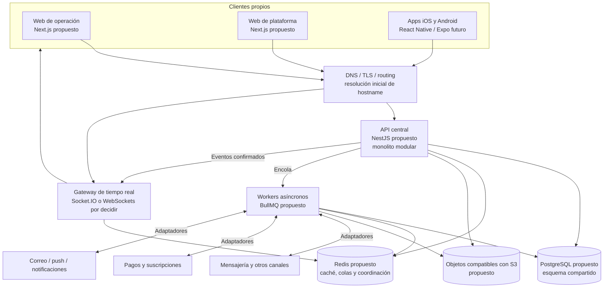

# Arquitectura objetivo preliminar

## Estado del documento

- **Estado:** Borrador conceptual.
- **Naturaleza:** Dirección conceptual; ADR-002 acepta la forma modular inicial, mientras las selecciones tecnológicas permanecen pendientes.
- **Horizonte:** Dirección escalable para 1,000 o más tenants, sujeta a validación con carga, costos y necesidades reales.
- **Decisiones relacionadas:** [ADR-002](../decisions/proposed/ADR-002-modular-monolith-first.md), [ADR-004](../decisions/proposed/ADR-004-shared-schema-multitenancy.md), [ADR-010](../decisions/proposed/ADR-010-station-bound-operational-context.md), [ADR-011](../decisions/proposed/ADR-011-tenant-user-pin-authentication-and-operational-session.md) y [ADR-012](../decisions/proposed/ADR-012-tenant-roles-capabilities-and-contextual-authorization.md) están `Accepted`; los demás ADRs conservan el estado del [registro](../decisions/README.md).

## Objetivo

Definir una dirección coherente para construir SR Taller 2.0 sin implementar todavía aplicaciones, infraestructura ni esquemas. La arquitectura busca aislamiento multitenant, límites claros, una API reutilizable, despliegues repetibles y evolución gradual.

## Principios rectores

1. Aislamiento de tenant antes que conveniencia.
2. La API central aplica reglas y es fuente de verdad para clientes propios.
3. El dominio se organiza en módulos con ownership explícito.
4. Un monolito modular orientado al dominio es el punto de partida aceptado; los microservicios no forman parte del MVP.
5. Procesos síncronos, asíncronos y tiempo real tienen responsabilidades distintas.
6. API, trabajos diferibles y tiempo real son responsabilidades lógicas dentro de una sola aplicación y despliegue iniciales; cualquier separación futura requiere evidencia y ADR.
7. Seguridad, observabilidad y trazabilidad se diseñan desde el inicio.
8. Las decisiones reversibles se mantienen simples; las irreversibles requieren evidencia y ADR.

## Vista objetivo

El diagrama expresa responsabilidades lógicas, no unidades desplegables iniciales. API, trabajos diferibles y tiempo real se alojan inicialmente en una sola aplicación backend y un único artefacto; una separación posterior sólo se justificaría con evidencia operativa y ADR.

## Bloques de la solución

| Bloque | Responsabilidad | Propuesta preliminar | No implica todavía |
|---|---|---|---|
| Clientes web | Experiencias específicas por audiencia | Next.js, React, Tailwind y design system propio | Número final de aplicaciones ni estrategia de renderizado |
| Cliente móvil | Consumir contratos centrales cuando exista necesidad validada | React Native con Expo | Construcción durante la fundación |
| API central | Autenticación, autorización, casos de uso y contratos | NestJS con TypeScript | Framework aceptado ni endpoints definidos |
| Módulos de dominio | Encapsular reglas, datos y eventos por capacidad | Monolito modular | Microservicios ni tablas por módulo |
| Trabajos diferibles | Ejecutar procesos diferibles, reintentos e integraciones dentro de la aplicación inicial | Mecanismo pendiente | Worker o despliegue independiente |
| Tiempo real | Entregar cambios confirmados a clientes conectados | Socket.IO o WebSockets | Protocolo aceptado |
| Datos transaccionales | Persistencia canónica y consistencia | Esquema compartido con aislamiento tenant aceptado; PostgreSQL propuesto | Motor, diseño físico y RLS pendientes |
| Coordinación temporal | Caché, colas y coordinación de conexiones | Redis | Uso como fuente de verdad |
| Archivos | Guardar objetos y metadatos de acceso | API compatible con S3 | Proveedor, regiones o retención final |
| Integraciones | Aislar contratos externos y normalizar eventos | Adaptadores y anti-corruption layer | Proveedores comprometidos |

## Responsabilidades lógicas y unidad desplegable

- **Unidad inicial aceptada:** un único artefacto y despliegue de aplicación con una sola aplicación backend.
- **API:** responsabilidad síncrona dentro de esa aplicación; valida contexto y ejecuta casos de uso breves.
- **Trabajos diferibles:** responsabilidad interna para reintentos e integraciones; no constituyen un desplegable independiente inicial.
- **Clientes:** su topología permanece pendiente y no autoriza otro backend ni reglas autoritativas fuera de la aplicación.
- **Tiempo real:** responsabilidad lógica interna; no es una unidad desplegable inicial.
- **Persistencias y servicios de soporte:** son dependencias por ambiente, no módulos de negocio.

Compartir monorepo no autoriza dependencias arbitrarias. Compartir base de datos no autoriza a un módulo a modificar datos de otro sin contrato.

## Límites de módulos

Los módulos preliminares están descritos en el [mapa de módulos](../product/MODULE_MAP.md). Cada uno debería:

- poseer sus invariantes y su modelo conceptual;
- exponer capacidades mediante interfaces de aplicación;
- producir eventos con significado de negocio cuando corresponda;
- evitar acceso directo a internals de otro módulo;
- declarar dependencias permitidas y mantenerlas acíclicas;
- transportar tenant, sucursal, estación, usuario, sesión y correlación en operaciones ordinarias.

La extracción futura de un módulo sólo se evaluará por presión demostrable: escalado independiente, aislamiento de fallos, ownership organizacional o ciclo de despliegue distinto.

## Flujos de ejecución

### Solicitud síncrona

1. El borde recibe la conexión y normaliza señales no autoritativas como el nombre de host.
2. La API reconoce la estación y valida su vinculación del lado del servidor.
3. La sucursal y el tenant se derivan de la estación; el PIN se valida conforme a ADR-011, la operación se autoriza por ADR-012 y, si es sensible, se refuerza conforme a ADR-013.
4. La API construye el contexto inmutable tenant/sucursal/estación/usuario/sesión y rechaza discrepancias.
5. El caso de uso autoriza la acción y opera dentro del límite del módulo.
6. La persistencia confirma el cambio.
7. Se registra auditoría y/o se publica un evento preservando el contexto de origen.

### Trabajo asíncrono

1. Un caso de uso persiste el estado necesario.
2. Se agenda un trabajo con contexto de origen tenant/sucursal/estación/usuario/sesión, tipo, versión, idempotency key y correlación.
3. Un worker vuelve a validar el contexto y ejecuta con reintentos acotados.
4. El resultado se persiste antes de notificarlo.
5. Fallos agotados se hacen visibles para operación; no se descartan silenciosamente.

### Integración y tiempo real

Los webhooks se verifican y normalizan; la plataforma persiste su interpretación canónica y sólo entonces emite eventos hacia rooms aisladas. Véanse [tiempo real y mensajería](REALTIME_AND_MESSAGING.md) e [integraciones](INTEGRATION_ARCHITECTURE.md).

## Evolución prevista, no comprometida

| Etapa | Objetivo arquitectónico | Condición de avance |
|---|---|---|
| Fundación documental | Validar límites, riesgos, ADRs y backlog | Aprobación explícita para prototipos técnicos |
| Monolito modular inicial | Demostrar recorridos de negocio y aislamiento | Métricas, pruebas y contratos suficientes |
| Escalado horizontal | Aumentar réplicas sin estado local autoritativo | Demanda y pruebas de capacidad |
| Separación selectiva | Extraer sólo responsabilidades con presión real | ADR nuevo con evidencia y costo operativo |

## Atributos de calidad

- **Seguridad:** denegación por defecto, aislamiento transversal y acciones sensibles clasificadas/reforzadas conforme a ADR-013.
- **Modificabilidad:** módulos y contratos con dependencias visibles.
- **Confiabilidad:** idempotencia, reintentos acotados, recuperación y rollback planificados.
- **Escalabilidad:** servicios de aplicación sin estado autoritativo local y trabajos desacoplados.
- **Portabilidad de clientes:** contratos centrales independientes de la interfaz web.
- **Operabilidad:** logs estructurados, métricas, trazas, health checks y artefactos versionados.
- **Accesibilidad y consistencia:** design system común, sujeto a su estrategia específica.

Los objetivos cuantitativos de capacidad, disponibilidad, latencia y recuperación están en `TBD`; no deben inferirse del objetivo de tenants.

## Alternativas que permanecen abiertas

- La forma inicial de monolito modular ya está aceptada; su agrupación interna concreta permanece abierta.
- PostgreSQL como motor y RLS como defensa adicional; la topología compartida ya está aceptada por ADR-004.
- NestJS frente a alternativas TypeScript para la API.
- Next.js frente a otras estrategias para cada cliente web.
- Socket.IO frente a WebSockets nativos u otras soluciones administradas.
- Redis/BullMQ frente a servicios de cola administrados cuando la operación lo justifique.
- Proveedor S3-compatible y estrategia de distribución de archivos.
- Monorepo con pnpm/Turborepo frente a repositorios separados.

Las selecciones todavía abiertas se documentan en ADRs `Proposed`; ADR-002 establece la unidad arquitectónica, ADR-004 la topología multitenant, ADR-010 el contexto operativo, ADR-011 la identidad/sesión, ADR-012 la autorización ordinaria y ADR-013 la autorización reforzada conceptual.

## Restricciones y no objetivos

- No se diseña una arquitectura de microservicios durante esta fase.
- No se implementan aplicaciones, esquemas, migraciones, contenedores ni infraestructura.
- No se promete personalización ilimitada, base de datos por tenant, Kubernetes ni operación offline.
- No se migrará automáticamente toda la complejidad del sistema anterior.
- No se asumirá que 1,000 tenants equivalen a una carga uniforme o conocida.

## Riesgos

- Que los límites lógicos no se apliquen y el monolito vuelva a acoplar presentación, negocio y datos.
- Que la base compartida amplifique una omisión de contexto de tenant.
- Que Redis o WebSockets se conviertan accidentalmente en fuentes de verdad.
- Que la separación desplegable se confunda con servicios distribuidos desde el primer día.
- Que se optimice para una escala nominal sin escenarios de carga representativos.

## Documentos relacionados

- [Contexto del sistema](SYSTEM_CONTEXT.md)
- [Arquitectura de aplicaciones](APPLICATION_ARCHITECTURE.md)
- [Arquitectura de datos](DATA_ARCHITECTURE.md)
- [Estrategia de despliegue](DEPLOYMENT_STRATEGY.md)
- [Línea base de seguridad](SECURITY_BASELINE.md)
- [Estrategia de observabilidad](OBSERVABILITY_STRATEGY.md)
- [Principios de producto](../product/PRODUCT_PRINCIPLES.md)

## Preguntas abiertas

- ¿Cuáles son los primeros recorridos verticales que validarán los límites modulares?
- ¿Qué objetivos de disponibilidad, latencia, recuperación y volumen necesita cada tipo de operación?
- ¿Cuántas aplicaciones web requiere la primera etapa y qué audiencias comparten experiencia?
- ¿Qué presión justificaría separar el gateway de tiempo real o mensajería?
- ¿Qué restricciones de residencia, retención o soberanía de datos existen?
- ¿Qué ADRs propuestos deben resolverse antes de un prototipo técnico?

## Próxima revisión

- **Momento:** después de validar el mapa de módulos, los recorridos críticos y las ADRs propuestas.
- **Evidencia esperada:** escenarios de calidad priorizados, dependencias permitidas y decision gates explícitos.
- **Responsable:** TBD.
