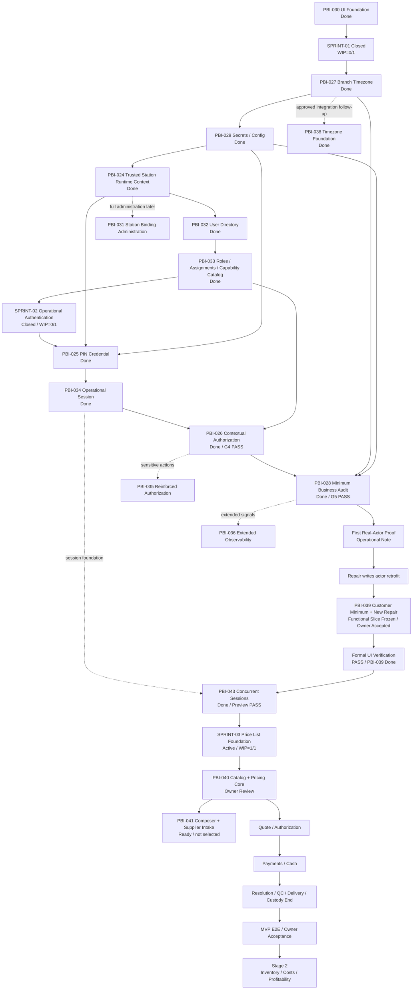

# Mapa de dependencias del MVP Operativo

## Estado del documento

- **Estado:** Reconciliado con el roadmap Owner aprobado.
- **Baseline Git local:** `main`/`origin/main` observados en
  `5be5cd60acb0865da57aff76740a1330896b1cd1`; CI exacta `34732201476`
  GREEN verificada.
- **Regla de ejecución:** WIP=1; el grafo expresa dependencia, no autorización
  ni paralelismo de implementación.

## Camino vigente

## Dependencias críticas

- PBI-030 ya no bloquea técnicamente timezone: su cierre sustantivo es PASS;
  la activación de Sprint 01 depende de readiness y autorización de PBI-027.
- PBI-027 resuelve la autoridad temporal por Branch antes de auditoría y
  futuros días operativos.
- PBI-029 precede bootstrap sensible y PIN; ningún secreto se hardcodea.
- PBI-024 entrega Tenant/Branch/Station server-side y un bootstrap mínimo. La
  administración completa vive en PBI-031.
- PBI-032 crea identidad estable; PBI-033 compone roles/capabilities y está
  `Done`; PBI-025 verifica PIN; PBI-034 mantiene sesión;
  PBI-026 intersecta grants/contexto y autoriza.
- PBI-028 registra actor/contexto/correlación. Sólo entonces Operational Note
  puede probar el stack real y comenzar el retrofit de Repairs.
- PBI-037 materializa la administración local de Users/Roles sobre las
  foundations cerradas y se endurece como slice explícito del candidato
  PBI-028; no altera la secuencia ni añade WIP.
- PBI-035 se incorpora cuando una acción concreta necesita reautenticación o
  segundo aprobador; no bloquea capacidades ordinarias.
- PBI-036 no bloquea el MVP mientras PBI-028 entregue auditoría mínima.
- PBI-043 depende de PBI-034, sustituye su exclusividad station-wide conforme
  ADR-014 y está `Done`.
- PBI-040 depende de contexto/identidad/access/audit/persistencia/UI ya
  disponibles y materializa `catalog` sólo con el slice vertical completo.
- PBI-041 depende de PBI-040; su arquitectura/DoR están Ready, pero selección e
  implementación esperan Owner Acceptance/closure de PBI-040 y autorización
  explícita. Bulk no bloquea el primer valor visible.
- Inventory, Procurement, Repair Concepts, Caja, Pedidos y Solicitudes no son
  dependencias de PBI-040 ni reciben ownership por consumir contratos futuros.

## Estados de transición

- PBI-030: `Done`; `Released: NO`.
- Riesgo AT/cross-browser de PBI-030: `Bajo (LOW) — ACCEPTED RESIDUAL QUALITY RISK`.
- Sprint 01: `Closed`; cinco PBIs committed `Done`; ninguno `Released`.
- Sprint 02: `Closed`; PBI-039/PBI-043 están `Done`; WIP=`0/1`.
- Sprint 03: `Active`; PBI-040 Owner Review, PBI-041 Candidate/Ready no
  seleccionado, WIP=`1/1`;
  falta Owner Acceptance.
- PBI-027: `Done`; `Released: NO`.
- PBI-029: `Done`; threat model/DoR, riesgo `CRITICAL`, focused security
  review, merge, CI de `main`, Owner Acceptance, cierre documental integrado y
  CI post-cierre PASS; `Released: NO`.
- PBI-024: `Done` canónico; `Released: NO`.
- PBI-032: `Done`; focused review, merge funcional, CI exacto de `main`, Owner
  Acceptance, cierre PR #27 y CI post-cierre `34074457695` PASS;
  `Released: NO`.
- PBI-033: `Done`; cierre PR #29 merge
  `d1a98c6d158cf53e1718a75c82f8eafbc3aafaf1` y CI post-cierre
  `34084930812` GREEN; `Released: NO`. G2 está `PASS`.
- PBI-025: `Done`; alcance funcional y remediación integrados,
  riesgo `Critical` sin downgrade, DoR `PASS`, ratificación Owner acotada
  para PR #30 y Owner Acceptance APPROVED; cierre PR #32 merge
  `ccdd7e243265c0f4d19e9798b8ddfa90d97e8c9e`, CI `34124746317` GREEN.
- PBI-034: `Done`; cierre PR #34 merge
  `54ddc251cda8ec7465b7913786c647f8d3ccbeac` y CI post-cierre
  `34153470560` GREEN. G3 es `PASS`.
- PBI-026: `Done`; candidate/review, PR #35 merge funcional
  `4db5d9384d13c200eb2031dceb32dd89efcca64d`, exact-main CI `34158203438` y
  Owner Acceptance, cierre PR #36 merge
  `0b39e3794a97c22d5471c0b6dfa278026f237b03` y CI `34161029937` completos.
  G4 es `PASS`. PBI-028 tiene PR #37 integrado, CI exacto `34193770228` GREEN,
  PR #38 de foco integrado, CI exacto `34197268832` GREEN, y cierre PR #39
  merge `2b712fc3a3842f197324e8870011bf170846ddb8` con CI `34249869167` GREEN;
  está `Done` y G5 es `PASS`.
- PBI-038: `Done`; PR #40 merge
  `5973f355a5e9dfc7ae562a688ded04e7eba8bc34` y CI exacta `34280510716`
  GREEN; `Released: NO`.
- PBI-043: `Done`; ADR-014, 24 pruebas, revisión Critical, PR #47/#48,
  CI candidata/exact-main y Preview PASS; `Released: NO`.

## Stage 2

Inventory, Purchases, Costs, Expenses, Margins y Profitability no condicionan
el Revenue Checkpoint ni el MVP operativo inicial. Permanecen explícitamente
diferidos.

## Próxima revisión

El siguiente gate es Owner Review/Acceptance de PBI-040 sobre la rama
reconciliada. PBI-041/PBI-042, push, integración y deploy conservan autoridad
separada.
