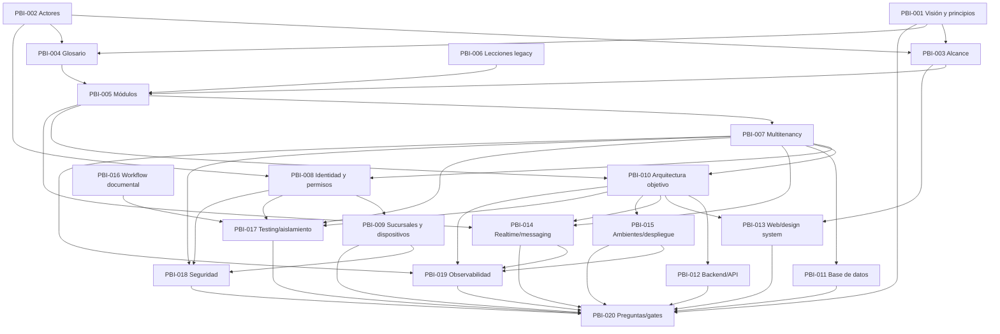

# Mapa inicial de dependencias

## Estado del documento

**Estado:** Hipótesis de secuencia documental; no representa calendario ni dependencias de código.

El grafo incluye las dependencias documentales directas declaradas por los PBIs y algunas relaciones transitivas necesarias para leer la secuencia. No representa dependencias de runtime ni sustituye el detalle de cada PBI.

## Dependencias críticas

- Visión, actores y alcance dan significado al glosario y mapa modular.
- Multitenancy condiciona datos, identidad, realtime, archivos, cachés, observabilidad y pruebas.
- Identidad y permisos preceden la validación del acceso por dispositivo/PIN.
- Arquitectura objetivo enmarca evaluaciones de backend, web, despliegue y observabilidad.
- PBI-020 consolida gates; no puede cerrarse hasta que entradas críticas sean revisadas.

## Bloqueos conocidos

- PBI-013 requiere confirmar superficies web, audiencias y necesidades visuales; hasta entonces permanece bloqueado para una recomendación final.
- PBI-008, PBI-009 y PBI-020 requieren decisiones de producto/operación.
- Ninguna dependencia técnica propuesta puede convertirse en implementación hasta aceptar ADRs relacionados.

## Preguntas abiertas

- ¿Qué dependencias son obligatorias para revisión y cuáles pueden explorarse en paralelo?
- ¿Qué producto de PBI-020 constituye autorización formal para prototipos?

## Próxima revisión

Cuando cambie el estado de un PBI o una pregunta crítica; fecha: TBD.
