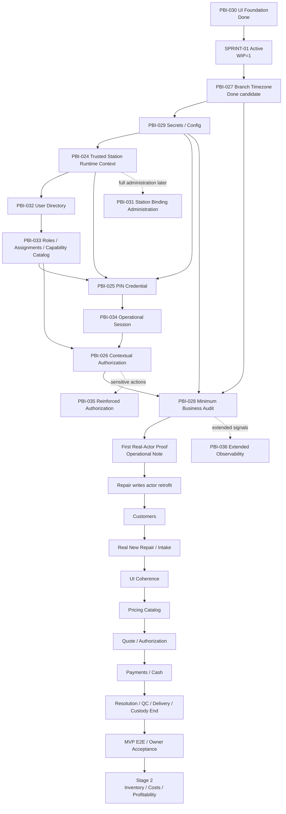

# Mapa de dependencias del MVP Operativo

## Estado del documento

- **Estado:** Reconciliado con el roadmap Owner aprobado.
- **Baseline:** `main` en
  `4a74d46021be2a7b0ae482a88c6cd90a4c968e30`; CI `33825176423` GREEN.
- **Regla de ejecución:** WIP=1; el grafo expresa dependencia, no autorización
  ni paralelismo de implementación.

## Camino vigente

## Dependencias críticas

- PBI-030 ya no bloquea técnicamente timezone: su cierre sustantivo es PASS;
  la activación de Sprint 01 depende de readiness y autorización de PBI-027.
- PBI-027 resuelve la autoridad temporal por Branch antes de auditoría y
  futuros días operativos.
- PBI-029 precede bootstrap sensible y PIN; ningún secreto se hardcodea.
- PBI-024 entrega Tenant/Branch/Station server-side y un bootstrap mínimo. La
  administración completa vive en PBI-031.
- PBI-032 crea identidad estable; PBI-033 compone roles/capabilities; PBI-025
  verifica PIN; PBI-034 mantiene sesión; PBI-026 autoriza.
- PBI-028 registra actor/contexto/correlación. Sólo entonces Operational Note
  puede probar el stack real y comenzar el retrofit de Repairs.
- PBI-035 se incorpora cuando una acción concreta necesita reautenticación o
  segundo aprobador; no bloquea capacidades ordinarias.
- PBI-036 no bloquea el MVP mientras PBI-028 entregue auditoría mínima.

## Estados de transición

- PBI-030: `Done`; `Released: NO`.
- Riesgo AT/cross-browser de PBI-030: `Bajo (LOW) — ACCEPTED RESIDUAL QUALITY RISK`.
- Sprint 01: `Active`; WIP=1.
- PBI actual: NONE.
- PBI-027: `Done candidate`; merge, CI de `main` y Owner Acceptance PASS;
  pendiente sólo de integrar su PR documental.
- PBI-029/PBI-024/PBI-032/PBI-033: candidatos ordenados, no iniciados.

## Stage 2

Inventory, Purchases, Costs, Expenses, Margins y Profitability no condicionan
el Revenue Checkpoint ni el MVP operativo inicial. Permanecen explícitamente
diferidos.

## Próxima revisión

En Owner merge review del cierre documental PBI-027 o si cambia una
dependencia aprobada.
