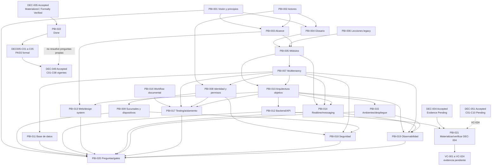

# Mapa inicial de dependencias

## Estado del documento

**Estado:** Hipótesis de secuencia documental; no representa calendario ni dependencias de código.

El grafo incluye las dependencias documentales directas declaradas por los PBIs y algunas relaciones transitivas necesarias para leer la secuencia. No representa dependencias de runtime ni sustituye el detalle de cada PBI.

## Dependencias críticas

- Visión, actores y alcance dan significado al glosario y mapa modular.
- Multitenancy condiciona datos, identidad, realtime, archivos, cachés, observabilidad y pruebas.
- Identidad y permisos preceden la validación del acceso por dispositivo/PIN.
- Arquitectura objetivo enmarca evaluaciones de backend, web, despliegue y observabilidad.
- PBI-020 consolida gates; no puede cerrarse hasta que entradas críticas sean revisadas.
- PBI-021 consume la selección aceptada de DEC-004 y el shell seleccionado mediante ADR-005/PBI-012; puede comenzar su materialización técnica sin habilitar funcionalidad.
- PBI-021 no puede quedar `Done` ni producir un PASS final sin VC-024; la ejecución CI de ese caso depende de materializar la [DEC-051 aceptada](../decisions/dec-051-testing-ci-strategy/FORMAL_REVIEW.md).
- PBI-022 consumió la selección aceptada de DEC-005 y materializó sólo estructura, ownership, checker local, fixtures y evidencia; está `Done` y no habilita funcionalidad.
- PBI-022 no resolvió por sí mismo DEC-044, DEC-049 ni DEC-051. Su `PASS`
  formal satisfizo la dependencia de frontera de
  [DEC-049](../decisions/dec-049-persistence-ownership/FORMAL_REVIEW.md),
  aceptada después el 2026-07-24 por el Responsable del Proyecto con
  DEC049-C01 a C08 vigentes.
  [DEC-044](../decisions/dec-044-error-strategy/FORMAL_REVIEW.md) también fue
  aceptada el 2026-07-24 con DEC044-C01 a C08 vigentes.
  [DEC-051](../decisions/dec-051-testing-ci-strategy/FORMAL_REVIEW.md) fue
  aceptada el mismo día y convierte documentalmente esos contratos en gates;
  C01 a C10 permanecen pendientes.
- [DEC-063](../decisions/dec-063-definition-of-done/FORMAL_REVIEW.md) fue
  aceptada el 2026-07-24 con base común más checklists por tipo/riesgo;
  DEC063-C01 a C08 permanecen `Pending`. Su aceptación no materializa los
  gates ni cierra VC-024.

## Bloqueos conocidos

- PBI-013 requiere confirmar superficies web, audiencias y necesidades visuales; hasta entonces permanece bloqueado para una recomendación final.
- PBI-008, PBI-009 y PBI-020 requieren decisiones de producto/operación.
- PBI-021 está `Ready` y autorizado, pero `Unassigned`; VC-024 conserva la dependencia explícita de la materialización y evidencia de DEC-051.
- PBI-022 está `Done` y `Unassigned`; DEC005-C01 a C05 tienen `PASS` formal en la sexta reverificación independiente.
- Ninguna dependencia técnica propuesta puede convertirse en implementación hasta aceptar ADRs relacionados.

## Preguntas abiertas

- ¿Qué dependencias son obligatorias para revisión y cuáles pueden explorarse en paralelo?
- ¿Qué producto de PBI-020 constituye autorización formal para prototipos?

## Próxima revisión

Cuando cambie el estado de un PBI o una pregunta crítica; fecha: TBD.
