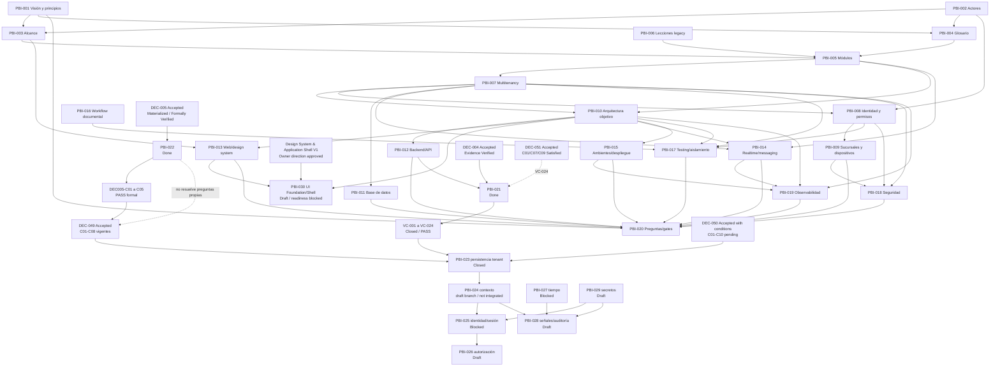

# Mapa inicial de dependencias

## Estado del documento

**Estado:** Hipótesis de secuencia documental; no representa calendario ni dependencias de código.

El grafo incluye las dependencias documentales directas declaradas por los PBIs y algunas relaciones transitivas necesarias para leer la secuencia. No representa dependencias de runtime ni sustituye el detalle de cada PBI.

## Dependencias críticas

- Visión, actores y alcance dan significado al glosario y mapa modular.
- Multitenancy condiciona datos, identidad, realtime, archivos, cachés, observabilidad y pruebas.
- Identidad y permisos preceden la validación del acceso por dispositivo/PIN.
- Arquitectura objetivo enmarca evaluaciones de backend, web, despliegue y observabilidad.
- PBI-020 consolida gates; no puede cerrarse hasta que entradas críticas sean revisadas.
- PBI-021 consumió la selección aceptada de DEC-004 y el shell seleccionado
  mediante ADR-005/PBI-012. Está `Done` después de VC-024 `Closed / PASS`; no
  habilita funcionalidad.
- PBI-022 consumió la selección aceptada de DEC-005 y materializó sólo estructura, ownership, checker local, fixtures y evidencia; está `Done` y no habilita funcionalidad.
- PBI-022 no resolvió por sí mismo DEC-044, DEC-049 ni DEC-051. Su `PASS`
  formal satisfizo la dependencia de frontera de
  [DEC-049](../decisions/dec-049-persistence-ownership/FORMAL_REVIEW.md),
  aceptada después el 2026-07-24 por el Responsable del Proyecto con
  DEC049-C01 a C08 vigentes.
  [DEC-044](../decisions/dec-044-error-strategy/FORMAL_REVIEW.md) también fue
  aceptada el 2026-07-24 con DEC044-C01 a C08 vigentes.
  [DEC-051](../decisions/dec-051-testing-ci-strategy/FORMAL_REVIEW.md) fue
  aceptada el mismo día y convierte documentalmente esos contratos en gates;
  VC-024 satisfizo C01/C07/C09; C02–C06/C08/C10 permanecen pendientes.
- [DEC-063](../decisions/dec-063-definition-of-done/FORMAL_REVIEW.md) fue
  aceptada el 2026-07-24 con base común más checklists por tipo/riesgo.
  VC-024 satisfizo C01/C03/C04; C02/C05–C08 permanecen `Pending`.
- [PBI-023](pbis/PBI-023.md) cerró su alcance y fue integrado con evidencia
  post-merge.
- [PBI-024](pbis/PBI-024.md) tiene implementación sólo en una rama/PR draft
  divergente. No forma parte de `main` y el primer merge funcional sigue
  bloqueado por DEC051-C02.
- PBI-025–PBI-029 descomponen el resto de los 24 contratos H1; sus estados
  `Draft` o `Blocked` impiden tratarlos como compromiso o autorización.
- [PBI-030](pbis/PBI-030.md) consume la dirección visual Owner aprobada y la
  baseline React/Vite. No depende de PBI-024/PBI-025 para usar fixtures
  honestos, pero cualquier contexto confiable, identidad o permisos reales sí
  requiere esos trabajos. PBI-024 es una dependencia blanda. Su estado
  `Draft — readiness blocked` no autoriza implementación.

## Bloqueos conocidos

- PBI-013 resolvió parcialmente la dirección visual del cliente React/Vite;
  rendering, número de aplicaciones y estrategia web futura permanecen
  diferidos.
- PBI-006, PBI-013, PBI-014 y PBI-018–PBI-020 fueron diferidos con remanente,
  owner por rol e hito explícitos; no bloquean el objetivo documental del
  Sprint 00.
- PBI-021 está `Done` y `Unassigned`; VC-024 está `Closed / PASS`.
- PBI-022 está `Done` y `Unassigned`; DEC005-C01 a C05 tienen `PASS` formal en la sexta reverificación independiente.
- PBI-025 y PBI-027 están bloqueados por decisiones de mecanismo/producto.
- PBI-023 está cerrado.
- PBI-024 requiere decisión de recuperación/revalidación o descarte; no puede
  integrarse mientras DEC051-C02 siga `Pending`.
- Los demás PBIs H1 requieren revisión y autorización propias.
- PBI-030 tiene resueltos iconografía, accent, catálogo, compatibilidad y
  partición. Requiere estimación acordada y CI autoritativo verde del arreglo
  local antes de `Ready`; después todavía requiere autorización explícita para
  iniciar.

## Preguntas abiertas

- SPIKE-002 confirmó el patrón sin bypass cross-tenant observado y con cleanup
  completo; la implementación productiva debe repetir sus controles.
- Los mecanismos de PIN/sesión y la autoridad temporal siguen requiriendo
  decisiones dentro de PBI-025/PBI-027.

## Próxima revisión

Reconciliación de PBI-024 y cierre de los dos bloqueantes de PBI-030 sin
iniciar implementación.
