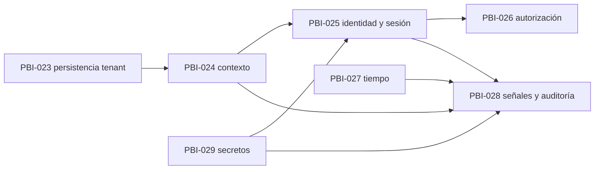

# Plan de ejecución de contratos H1 para R0

## Estado

- **Estado:** Proposed / trazabilidad completa.
- **Fecha:** 2026-07-24.
- **H0:** 9/0, `Complete`.
- **H1:** 24 contratos abiertos para aplicación, mecanismo o prueba.
- **R0:** `Authorized`, limitado a PBI-023.
- **Regla:** agrupar por capacidad no acepta ni cierra una DEC.

## Inventario H1

| DEC | Título | Estado | Categoría | Dependencia principal | Aplica R0 | Bloquea PBI-023 | Resoluble en R0 | Autoridad | PBI | Orden |
|---|---|---|---|---|:---:|:---:|:---:|---|---|---:|
| DEC-006 | Estrategia multitenant | Aceptada en ADR-004; falta aplicar/probar | Tenancy | DEC-008/009, DEC-049 | Sí | Sí | Sí | Arquitectura + Seguridad | [PBI-023](pbis/PBI-023.md) | 1 |
| DEC-007 | Propiedad de datos por tenant | Aceptada en ADR-004; falta aplicar/probar | Datos | DEC-006/008/049 | Sí | Sí | Sí | Arquitectura + Producto | PBI-023 | 1 |
| DEC-008 | Datos globales SaaS | Aceptada en ADR-004; falta aplicar/probar | Datos | ciclo tenant, DEC-006 | Sí | Sí | Sí | Producto + Arquitectura | PBI-023 | 1 |
| DEC-009 | Contexto explícito de tenant | Aceptada en ADR-004/010; falta aplicar/probar | Contexto | DEC-006, identidad | Sí | No: PBI-023 usa scope explícito de prueba sin resolver request context | Sí | Arquitectura + Seguridad | [PBI-024](pbis/PBI-024.md) | 2 |
| DEC-010 | Sucursal activa | Aceptada en ADR-010; falta aplicar/probar | Contexto | DEC-007, estación | Sí | No | Sí | Producto + Arquitectura | PBI-024 | 2 |
| DEC-011 | Usuario multisucursal | Aceptada en ADR-010; falta aplicar/probar | Contexto | DEC-010/017 | Sí | No | Sí | Producto + Seguridad | PBI-024 | 2 |
| DEC-012 | Cambio de sucursal | Aceptada en ADR-010; falta aplicar/probar | Contexto | DEC-010/011/sesión | Sí | No | Sí | Producto + Seguridad + Arquitectura | PBI-024 | 2 |
| DEC-013 | Identidad tradicional | Aceptada conceptualmente en ADR-011; falta aplicar/probar | Identidad | DEC-006/008 | Sí | No | Sí | Seguridad + Arquitectura | [PBI-025](pbis/PBI-025.md) | 3 |
| DEC-014 | Acceso por PIN | Aceptado conceptualmente en ADR-011; faltan mecanismo/threat model | Identidad | DEC-013/010/019 | Sí | No | Sí | Producto + Seguridad + Operaciones | PBI-025 | 3 |
| DEC-015 | Cierre por inactividad | Aceptado conceptualmente; faltan duración/prueba | Sesión | DEC-014 | Sí | No | Sí | Producto + Seguridad + Operaciones | PBI-025 | 3 |
| DEC-016 | Atribución de acciones | Aceptada conceptualmente; falta aplicar/probar | Atribución | DEC-013–015/046 | Sí | No | Sí | Producto + Seguridad + Arquitectura | PBI-025 | 3 |
| DEC-017 | Roles mínimos | Aceptada conceptualmente en ADR-012; falta componer/probar | Autorización | actores R0, DEC-013 | Sí | No | Sí | Producto + Seguridad | [PBI-026](pbis/PBI-026.md) | 4 |
| DEC-018 | Permisos mínimos | Aceptada conceptualmente; falta matriz/prueba | Autorización | DEC-017, alcance R0 | Sí | No | Sí | Producto + Seguridad + Arquitectura | PBI-026 | 4 |
| DEC-019 | Acciones sensibles | Aceptada conceptualmente; falta clasificar/aplicar | Refuerzo | DEC-018 | Sí | No | Sí | Producto + Seguridad | PBI-026 | 4 |
| DEC-020 | Reautenticación | Aceptada conceptualmente; falta mecanismo/prueba | Refuerzo | DEC-014/019 | Sí | No | Sí | Producto + Seguridad | PBI-026 | 4 |
| DEC-037 | Zona horaria tenant/sucursal | Requiere decisión de Producto | Tiempo | DEC-010 | Sí | No | Sí | Producto + Operaciones + Arquitectura | [PBI-027](pbis/PBI-027.md) | 5 |
| DEC-038 | Almacenamiento/presentación de fechas | Propuesta | Tiempo | DEC-037 | Sí | No | Sí | Arquitectura + Ingeniería | PBI-027 | 5 |
| DEC-045 | Logs técnicos | Propuesta; DEC-044 aporta límites | Señales | DEC-044/047 | Sí | No | Sí | Ingeniería + Operaciones + Seguridad | [PBI-028](pbis/PBI-028.md) | 6 |
| DEC-046 | Auditoría de negocio | Parcialmente resuelta | Auditoría | DEC-016/019 | Sí | No | Sí, mínimo R0 | Producto + Seguridad + Arquitectura | PBI-028 | 6 |
| DEC-047 | Correlation ID | Propuesta | Señales | DEC-044/045 | Sí | No | Sí | Arquitectura + Ingeniería | PBI-028 | 6 |
| DEC-048 | Observabilidad mínima | Propuesta | Operación | DEC-045–047 | Sí | No | Sí | Operaciones + Ingeniería | PBI-028 | 6 |
| DEC-050 | Migraciones/versionado | Accepted with conditions; C01–C10 pendientes | Persistencia | DEC-004/006/049 | Sí | Sí por materialización | Sí | Arquitectura + Ingeniería + Operaciones | PBI-023 | 1 |
| DEC-052 | Fixtures/datos semilla | Propuesta | Calidad/datos | DEC-006/051 | Sí | Sí | Sí | Ingeniería + Calidad | PBI-023 | 1 |
| DEC-055 | Cifrado y secretos | Propuesta | Seguridad/operación | stack/ambientes | Sí | No si PBI-023 usa sólo credencial efímera sintética; sí antes de ambiente compartido | Sí | Seguridad + Operaciones + Ingeniería | [PBI-029](pbis/PBI-029.md) | 7 |

## Descomposición propuesta

| PBI | Capacidad | DEC | Estado | Dependencia |
|---|---|---|---|---|
| [PBI-023](pbis/PBI-023.md) | Persistencia tenant-scoped, migraciones y fixtures mínimos | 006–008, 050, 052 | `Blocked`; planificación completa, SPIKE-002 ejecutable pendiente | H0, ADR-003/004, DEC-049/050/051/063 |
| [PBI-024](pbis/PBI-024.md) | Contexto tenant/sucursal/estación confiable | 009–012 | `Draft` | PBI-023 |
| [PBI-025](pbis/PBI-025.md) | Identidad, PIN, sesión e inactividad | 013–016 | `Blocked` | PBI-024, threat model y mecanismos |
| [PBI-026](pbis/PBI-026.md) | Capacidades y autorización reforzada | 017–020 | `Draft` | PBI-025 y composición por operación |
| [PBI-027](pbis/PBI-027.md) | Modelo temporal de R0 | 037–038 | `Blocked` | decisión de Producto sobre autoridad de zona |
| [PBI-028](pbis/PBI-028.md) | Logs, auditoría, correlación y observabilidad | 045–048 | `Draft` | PBI-024/025, DEC-044 |
| [PBI-029](pbis/PBI-029.md) | Secretos y configuración externa | 055 | `Draft` | ambiente compartido y threat model |

## Regla del primer PBI

PBI-023 es el menor slice técnico que puede demostrar valor fundacional sin
crear Reparaciones: migrations gobernadas, ownership, dos tenants sintéticos y
denegación cross-tenant en PostgreSQL real. Incluye dentro de su alcance los
gates que debe cerrar antes de materializar persistencia:

- decisión/materialización de DEC-050;
- SPIKE-002 acotado; RLS queda fuera;
- DEC051-C03/C04/C06;
- DEC063-C02/C05/C06;
- condiciones aplicables DEC049-C01–C08;
- fixtures deterministas de DEC-052.

Su `Ready` significa que resultado, límites, secuencia, evidencia y owners por
rol son verificables. La
[revisión final](../architecture-readiness/R0_AUTHORIZATION.md) autorizó
únicamente este PBI; no lo marcó iniciado ni comprometido a sprint. Su
estimación sigue siendo obligatoria antes del compromiso.

## Dependencias entre PBIs

## Riesgos

- PBI-023 es de riesgo alto: la clasificación DEC063-C02 debe materializarse
  antes de integrar.
- Agrupar contratos no permite aceptar decisiones pendientes por código.
- Una credencial de test efímera no satisface DEC-055 para ambientes
  compartidos.
- PBI-025/027 permanecen bloqueados para no inventar mecanismo de PIN,
  inactividad o autoridad temporal.
- Ningún PBI puede omitir pruebas negativas de tenant, autorización o
  sanitización cuando su trigger aplique.

## Próxima revisión

Preparar el compromiso de PBI-023 y ejecutar primero sus gates internos. No
iniciar PBI-024–PBI-029 antes de su propio dictamen.
