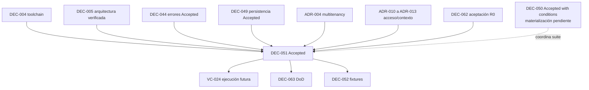

# DEC-051 — Estrategia de pruebas, CI y gates ejecutables

## 1. Identificador

`DEC-051`.

## 2. Título

Estrategia de pruebas, integración continua y gates ejecutables para SR Taller
2.0.

## 3. Estado

**Accepted**.

La [revisión formal](FORMAL_REVIEW.md) registró el 2026-07-24 cinco dictámenes
`PASS WITH CONDITIONS` y el resultado global
`PASS — DEC-051 ACCEPTED WITH CONDITIONS`. La autoridad fue ejercida por el
Responsable del Proyecto en Arquitectura, Ingeniería, Seguridad, Operaciones y
Calidad. DEC051-C01 a DEC051-C10 quedan aceptadas, vigentes y pendientes.

La aceptación define el contrato normativo. No registra materialización, CI
activo, protección aplicada sobre `main`, cumplimiento de VC-024 ni
autorización de R0.

## 4. Fecha

2026-07-24.

## 5. Autoridad

| Función | Responsabilidad en la decisión | Estado |
| --- | --- | --- |
| Arquitectura | Fronteras, reglas ejecutables, excepciones y coherencia con DEC-005 | Conforme; `PASS WITH CONDITIONS` |
| Ingeniería | Factibilidad, composición de comandos, suites y mantenibilidad | Conforme; `PASS WITH CONDITIONS` |
| Seguridad | Aislamiento, pruebas negativas, secretos y anti-enumeración | Conforme; `PASS WITH CONDITIONS` |
| Operaciones | Runner Linux, PostgreSQL real, evidencia, flakiness y continuidad del gate | Conforme; `PASS WITH CONDITIONS` |
| Calidad | Portafolio, trazabilidad, suficiencia por riesgo y criterios de PASS | Conforme; `PASS WITH CONDITIONS` |
| Producto | Participa sólo si cambia riesgo aceptado, alcance/release de R0 o costo relevante | No requerido; sin cambio de alcance o riesgo de producto |

Las cinco conformidades fueron emitidas por el Responsable del Proyecto y se
registran por separado en la [revisión formal](FORMAL_REVIEW.md). No se
atribuyen firmas, revisores externos ni aprobación derivada del historial Git.

## 6. Contexto

Las decisiones vigentes ya establecen:

- Node.js `24.18.0`, pnpm `11.15.1`, TypeScript `6.0.3`, ESM/NodeNext y Linux
  `x86_64` con GNU glibc como plataforma autoritativa en
  [DEC-004](../dec-004-toolchain-contract/DECISION_PROPOSAL.md);
- una aplicación y artefacto, monolito modular, ownership y fronteras
  ejecutables en
  [DEC-005](../dec-005-modular-monolith-organization/DECISION_PROPOSAL.md);
- PostgreSQL `18.x`, versión efectiva inicial `18.4`, en
  [ADR-003](../proposed/ADR-003-postgresql-primary-database.md);
- base y esquema compartidos, contexto confiable y aislamiento tenant/sucursal
  en [ADR-004](../proposed/ADR-004-shared-schema-multitenancy.md);
- NestJS `11.x` como shell técnico, Express y REST/HTTP JSON mínimo en
  [ADR-005](../proposed/ADR-005-nestjs-backend.md);
- contexto operativo, autenticación, autorización y acciones sensibles en
  [ADR-010](../proposed/ADR-010-station-bound-operational-context.md),
  [ADR-011](../proposed/ADR-011-tenant-user-pin-authentication-and-operational-session.md),
  [ADR-012](../proposed/ADR-012-tenant-roles-capabilities-and-contextual-authorization.md)
  y
  [ADR-013](../proposed/ADR-013-sensitive-actions-and-reinforced-authorization.md);
- errores tipados por capa, sanitización, retry y contrato público en
  [DEC-044](../dec-044-error-strategy/DECISION_PROPOSAL.md);
- Kysely sobre `pg`, repositorios explícitos, ownership y transacciones en
  [DEC-049](../dec-049-persistence-ownership/DECISION_PROPOSAL.md).

DEC-005 está `Accepted — Materialized / Formally Verified`. DEC-044 y DEC-049
están `Accepted`, con sus condiciones de materialización todavía pendientes.
Actualización del 2026-07-24: la
[verificación formal de VC-024](../../architecture-readiness/dec-004-linux-verification/vc-024/FORMAL_VERIFICATION.md)
obtuvo `PASS`; DEC051-C01/C07/C09 quedan `Satisfied` y las demás condiciones
permanecen pendientes. R0 no está autorizado y Sprint 00 permanece abierto.

La base ejecutable actual usa `node:test`, un checker arquitectónico AST y los
comandos documentados en `package.json`. No existe todavía un pipeline de CI,
una suite de PostgreSQL real ni protección de `main`. Esta decisión gobierna
su contrato futuro; no los implementa.

## 7. Problema

Una lista genérica de “correr pruebas” no demuestra que el sistema:

- preserve aislamiento entre tenants y sucursales;
- traduzca errores y fallas PostgreSQL de forma segura;
- mantenga ownership modular y una sola conexión por transacción;
- compile, inicie y termine desde el artefacto producido;
- detecte mutaciones críticas y reglas arquitectónicas decorativas;
- sea reproducible en la plataforma autoritativa;
- impida integrar cambios cuando una evidencia obligatoria falta o es flaky;
- conserve una cadena verificable entre commit, comandos, resultados y
  artefactos.

También sería ineficiente ejecutar siempre toda prueba futura sin clasificar
riesgo. DEC-051 necesita un contrato único que combine feedback rápido en cada
cambio con evidencia más profunda cuando la superficie lo exige.

## 8. Drivers

1. Detectar rápido errores ordinarios sin degradar la confianza.
2. Aumentar profundidad según riesgo, no según una métrica global.
3. Demostrar aislamiento multitenant mediante casos negativos.
4. Validar persistencia contra PostgreSQL real, no sólo mocks.
5. Conservar las fronteras verificadas de DEC-005.
6. Materializar DEC044-C08 sin reinterpretar DEC-044.
7. Probar ownership, transacciones y constraints de DEC-049.
8. Producir evidencia trazable, sanitizada y reproducible.
9. Evitar flakiness, retries que oculten defectos y excepciones informales.
10. Mantener un contrato viable para un equipo pequeño.
11. Permitir evolución de suites sin fijar proveedor de CI.
12. Satisfacer VC-024 cuando exista una materialización autorizada.

## 9. Restricciones

- La estrategia DEBE ser compatible con Node.js `24.18.0`, pnpm `11.15.1`,
  TypeScript `6.0.3`, NestJS `11.x`, Kysely, `pg` y PostgreSQL `18.4`.
- `pnpm run verify` conserva el nombre de gate local canónico.
- La instalación reproducible usa `pnpm install --frozen-lockfile`; no forma
  parte de `verify` ni puede regenerar el lockfile.
- Linux gobernado es la autoridad para CI y evidencia de merge.
- macOS local aporta feedback, pero no sustituye Linux ni VC-024.
- El checker de arquitectura se ejecuta en todos los cambios.
- No se admite una cobertura porcentual global como sustituto de contratos,
  casos negativos o mutaciones críticas.
- No se selecciona proveedor de CI, servicio administrado, plataforma de
  contenedores, reporter externo ni herramienta futura de E2E.
- DEC-050 conserva la selección y política de migraciones.
- DEC-052 conserva el catálogo general de fixtures y datos semilla de
  producto; DEC-051 sólo fija sus propiedades de calidad.
- DEC-063 conserva la Definition of Done y consume los gates aquí definidos.
- Esta propuesta no crea workflows, tests, dependencias, SQL, migraciones,
  endpoints, middleware, PBI ni código.

## 10. Hechos conocidos

- El repositorio contiene un lockfile pnpm y toolchain fijado por DEC-004.
- `pnpm run verify` compone hoy toolchain, limpieza, typecheck, build, suite
  `node:test`, estructura y arquitectura.
- `pnpm run architecture` ejecuta el checker de arquitectura.
- `pnpm run test:architecture` ejecuta sus pruebas dedicadas.
- `pnpm run smoke:start` valida el arranque y cierre del artefacto compilado.
- La suite y el checker actuales no requieren PostgreSQL.
- La política DEC-005 gobierna `src/`, aliases, namespaces, shadowing,
  wrappers AST, paths y diagnósticos deterministas.
- D5-R033 exige evidencia negativa para cada regla automatizable.
- DEC-044 define doce categorías, traducciones por capa, contrato público,
  logging seguro, retry y pruebas obligatorias.
- DEC-049 exige PostgreSQL real, scopes explícitos, ownership y transacciones
  completas sobre la misma conexión.
- VC-024 no está ejecutada y no existe evidencia de branch protection.

Ningún hecho anterior debe interpretarse como cumplimiento futuro de
DEC051-C01 a DEC051-C10.

## 11. Opciones

### Opción A — `verify` monolítico para todo cambio

Cada cambio ejecuta siempre todas las suites, integración real, mutación,
smoke y E2E disponibles.

Ventajas:

- regla de activación simple;
- omisión accidental poco probable;
- evidencia uniforme.

Desventajas:

- feedback y costo crecen con cada nueva suite;
- incentiva desactivar o ignorar pruebas lentas;
- flakiness de una superficie no relacionada detiene todo cambio;
- hace difícil distinguir evidencia crítica de redundancia.

### Opción B — Pipeline por capas y riesgo

Todos los cambios ejecutan gates rápidos y arquitectura. Suites más profundas
se activan por clasificación de riesgo, paths, contratos afectados, etapa o
ejecución manual gobernada. Los cambios de riesgo alto no pueden eludir sus
pruebas especializadas.

Ventajas:

- feedback rápido y confianza proporcional;
- hace explícito el owner y trigger de cada suite;
- permite PostgreSQL real, mutación crítica y E2E sin degradar cada edición;
- escala con el producto y produce evidencia diferenciada.

Desventajas:

- requiere clasificación fail-closed y mantenimiento de triggers;
- un mapa de paths incompleto puede omitir una suite;
- necesita revisión periódica de tiempos, riesgos y falsos negativos.

### Opción C — Checklist manual por release

Las pruebas profundas se ejecutan manualmente al final de una iteración o
antes de release.

Ventajas:

- costo técnico inicial bajo;
- flexibilidad durante exploración.

Desventajas:

- evidencia tardía, variable y difícil de reproducir;
- depende de memoria y disponibilidad humana;
- no protege `main`;
- no satisface VC-024 ni los contratos ejecutables de DEC-044/049.

## 12. Comparación

Escala: 1 desfavorable, 3 suficiente y 5 favorable para R0.

| Criterio | A — monolítico | B — por riesgo | C — manual |
| --- | ---: | ---: | ---: |
| Velocidad de feedback | 2 | 5 | 1 |
| Confianza proporcional | 4 | 5 | 2 |
| Simplicidad inicial | 4 | 3 | 5 |
| Mantenimiento sostenible | 2 | 4 | 2 |
| Costo de CI | 1 | 4 | 5 |
| Prevención de omisiones | 5 | 4 | 1 |
| Evidencia trazable | 5 | 5 | 2 |
| Escalabilidad de suites | 1 | 5 | 1 |
| Integración PostgreSQL real | 4 | 5 | 2 |
| Aislamiento multitenant | 4 | 5 | 2 |
| Compatibilidad con VC-024 | 5 | 5 | 1 |
| Manejo de flakiness | 2 | 4 | 1 |
| **Total** | **39/60** | **54/60** | **25/60** |

## 13. Decisión aceptada

Se acepta la **Opción B — pipeline por capas y riesgo**, bajo este
contrato:

1. `pnpm run verify` es el gate local canónico y siempre obligatorio antes de
   someter un cambio.
2. Todo PR ejecuta en Linux instalación congelada, arquitectura, typecheck,
   build, pruebas rápidas y smoke compilado.
3. El checker arquitectónico nunca se omite por clasificación de paths.
4. Persistencia, migraciones, autenticación, autorización, tenant/sucursal,
   transacciones y errores activan suites especializadas.
5. Todo cambio de persistencia o contexto ejecuta PostgreSQL real y pruebas
   negativas de aislamiento.
6. Los contratos críticos usan mutaciones acotadas para demostrar que la suite
   detecta el defecto sembrado.
7. `main` sólo recibe cambios mediante revisión y checks obligatorios, salvo
   excepción de emergencia formal.
8. Linux es la autoridad; el resultado local no reemplaza el de CI.
9. Toda evidencia se vincula al commit exacto y omite secretos o datos reales.
10. No existe bypass informal, retry automático para “poner verde” ni PASS con
    una prueba crítica flaky.

La aceptación no modifica scripts ni activa gates. Sus obligaciones son
normativas y sólo podrán materializarse mediante autorización posterior y
evidencia revisada.

### 13.1 Runner y herramientas por capa

La propuesta selecciona las capacidades ya disponibles como baseline de R0;
no autoriza dependencias nuevas:

| Capa | Runner/herramienta base | Regla |
| --- | --- | --- |
| Unitarias | `node:test` de Node.js `24.18.0` | TypeScript compilado o JavaScript de test compatible con la baseline; sin runtime global |
| Integración/contrato | `node:test` | Adapters y contratos se prueban mediante APIs públicas y dependencias controladas |
| PostgreSQL real | `node:test` + Kysely/`pg` cuando DEC-049 se materialice | La instancia PostgreSQL `18.4` es real; mocks no satisfacen esta capa |
| Arquitectura | `scripts/check-architecture.mjs` + arnés `node:test` | Policy, fixtures, mutaciones y contratos semánticos DEC-005 |
| Smoke | `scripts/smoke-start.mjs` sobre `dist/` | Inicia JavaScript compilado, valida lifecycle y termina |
| Negativas de seguridad | `node:test` en contrato/aplicación/API | Se complementa con PostgreSQL real cuando el vector cruza persistencia |
| Mutación crítica | Arnés controlado sobre copia temporal | No requiere adoptar una plataforma global de mutation testing |
| E2E de API inicial | `node:test` contra el artefacto aislado | Sólo cuando exista una API funcional autorizada |
| E2E de navegador futuro | Herramienta diferida | Se decide con la primera superficie web autorizada |
| Reproducibilidad | Comandos pnpm canónicos y utilidades Node/shell gobernadas | Dos entornos limpios, outputs normalizados e hashes |

Una herramienta especializada futura puede sustituir o complementar una fila
sólo si conserva sus contratos, aporta evidencia superior y recibe la autoridad
correspondiente. No se adopta Jest, Vitest, Playwright, Cypress, un servicio de
coverage ni un mutation runner por esta decisión.

## 14. Clasificación de riesgo

Cada cambio se clasifica por el mayor riesgo aplicable. Una duda se eleva, no
se degrada.

| Riesgo | Superficie mínima | Suites obligatorias adicionales |
| --- | --- | --- |
| Bajo | Documentación sin contratos ejecutables; refactor interno sin cambio observable, de frontera o persistencia | Gates rápidos, enlaces/documentación cuando aplique y arquitectura |
| Medio | API no sensible, comportamiento de módulo sin persistencia crítica, adapter externo no crítico, build/configuración no secreta | Contrato, integración focalizada, smoke y casos negativos aplicables |
| Alto | Autenticación; autorización; tenant/sucursal; estación/sesión; persistencia; transacciones; migraciones; pagos; inventario; folios; garantías; acciones sensibles o administrativas; raw SQL; cross-module; escape hatches; concurrencia; idempotencia; manejo de secretos | Todas las suites relevantes, PostgreSQL real cuando corresponda, negativas de seguridad/aislamiento, mutación crítica, smoke y evidencia reforzada |

Un cambio que altera el checker, sus reglas, el mapa de paths o los triggers de
CI es riesgo alto porque puede desactivar evidencia de manera transversal.

## 15. Portafolio de pruebas

| Tipo | Objetivo | Owner | Velocidad | Entorno/dependencias | Trigger obligatorio | Detecta | No demuestra |
| --- | --- | --- | --- | --- | --- | --- | --- |
| Unitarias | Reglas, invariantes, policies y funciones puras en aislamiento | Módulo/capa owner | Muy rápida | Node.js; sin red ni DB | Todo cambio de lógica | Branches, invariantes, mapping local | SQL, wiring, HTTP o integración |
| Integración | Colaboración entre componentes/adapters reales acotados | Owner del módulo + Ingeniería | Rápida/media | Dependencias locales controladas | Cambio de adapter, wiring o frontera | Mapping, lifecycle, contratos entre piezas | Comportamiento completo ni DB real salvo suite específica |
| Arquitectura | Fronteras DEC-005, grafo, ownership y sintaxis prohibida | Arquitectura + Ingeniería | Rápida | AST, policy, fixtures y mutaciones temporales | Todo cambio sin excepción | Imports, capas, ciclos, composición y bypasses conocidos | Semántica funcional ni consultas ejecutadas |
| Contrato | Compatibilidad de puertos, resultados, HTTP y errores públicos | Owner del contrato + Calidad | Rápida | Dobles tipados o borde controlado | Cambio de contrato, adapter o API | Forma, códigos, exhaustividad y sanitización | Integridad PostgreSQL o recorrido completo |
| Persistencia real | Constraints, consultas, transacciones, concurrencia y traducciones | Owner del módulo + Ingeniería/Calidad | Media | PostgreSQL `18.4`, Kysely y `pg` | Cambio de repositorio, query, schema, migración o transacción | SQL real, FK/unique, rollback, conexiones y SQLSTATE | UX, proveedor productivo o capacidad general |
| Smoke | Confirmar que el artefacto compilado inicia, atiende lo mínimo y termina | Ingeniería + Operaciones | Rápida | `dist/`, Node fijado, config sintética | Todo PR y candidato a `main` | Loader, wiring, startup/shutdown y artefacto | Regla funcional profunda |
| E2E | Recorridos críticos futuros desde interfaz pública hasta persistencia | Calidad + owner funcional | Lenta | Sistema desplegado/aislado y datos sintéticos | Cambios de recorrido crítico; candidato de hito/release | Integración transversal visible | Todas las variantes internas o rendimiento |
| Negativas de seguridad | Denegación, anti-enumeración, scope, redacción y abuso | Seguridad + Calidad | Media | Borde y servicios reales necesarios | Cambio de acceso, contexto, datos o error público | Bypass, fuga, enumeración y fail-open | Ausencia universal de vulnerabilidades |
| Mutación | Demostrar que una prueba/gate detecta un defecto crítico conocido | Owner del contrato + Calidad/Arquitectura | Media/lenta | Copia temporal restaurable | Contratos críticos y nuevas reglas automatizadas | Tests decorativos o insuficientes | Corrección total del producto |
| Reproducibilidad | Equivalencia de install/build/test/evidencia | Ingeniería + Operaciones + Calidad | Lenta | Linux limpio, toolchain fijado | VC-024, cambios de toolchain/build y gate de release | Dependencias implícitas, mutación y output variable | Comportamiento de negocio no incluido |

Ningún tipo reemplaza otro. Mocks y unitarias no sustituyen PostgreSQL real;
E2E no sustituye unitarias, contratos, arquitectura ni pruebas negativas.

## 16. Gates locales

### 16.1 Comandos actuales

| Comando | Obligación propuesta | Observación |
| --- | --- | --- |
| `pnpm install --frozen-lockfile` | En clon/onboarding limpio y ante cambios de manifest/lockfile | No pertenece a `verify`; debe dejar Git sin mutaciones |
| `pnpm run architecture` | Siempre | Gate directo del checker DEC-005 |
| `pnpm run typecheck` | Siempre | Usa TypeScript local y no emite |
| `pnpm run build` | Siempre | Parte de salida limpia |
| `pnpm test` | Siempre | Suite rápida vigente; debe propagar exit code |
| `pnpm run test:architecture` | Siempre como evidencia explícita de arquitectura | Aunque hoy también sea alcanzable por la suite general, conserva salida dedicada |
| `pnpm run verify` | Gate local canónico antes de someter cambios | No se debe sustituir por una lista parcial |
| `pnpm run smoke:start` | Cambios ejecutables y toda validación previa a merge | Se ejecuta después de build sobre `dist/` |

### 16.2 Composición

`pnpm run verify` conserva su composición vigente: toolchain, clean, typecheck,
build, pruebas, estructura y arquitectura. La materialización futura podrá
extender la orquestación sólo mediante cambio autorizado, sin cambiar el
significado de los comandos estables de DEC-004.

El perfil local queda:

```text
base = pnpm run verify
executable = base + pnpm run smoke:start
risk-specific = executable + suites obligatorias por la sección 14
```

La instalación, PostgreSQL real y suites lentas no se ocultan dentro de un
lifecycle ambiguo. Cada comando debe ser no interactivo, fail-fast respecto a
precondiciones, propagar exit code y producir diagnóstico accionable.

### 16.3 Doble ejecución

Los cambios al toolchain, build, checker, fixtures, seeds, snapshots o
normalización de evidencia requieren dos ejecuciones limpias. La equivalencia
compara resultados semánticos, inventario y hashes donde aplique; no exige que
duraciones, PID o puertos efímeros sean idénticos.

## 17. Integración continua

### 17.1 Etapas conceptuales

| Orden | Etapa | Gate |
| ---: | --- | --- |
| 1 | Checkout del commit exacto y estado limpio | Bloqueante |
| 2 | Validación de Linux, Node.js y pnpm fijados | Bloqueante |
| 3 | `pnpm install --frozen-lockfile` | Bloqueante |
| 4 | Arquitectura | Bloqueante en todo cambio |
| 5 | Typecheck | Bloqueante |
| 6 | Build limpio | Bloqueante |
| 7 | Unitarias/contrato rápidas | Bloqueante |
| 8 | Pruebas dedicadas de arquitectura | Bloqueante |
| 9 | Integración y PostgreSQL real según riesgo | Bloqueante cuando el trigger aplica |
| 10 | Negativas de aislamiento/seguridad según riesgo | Bloqueante cuando el trigger aplica |
| 11 | Smoke del artefacto compilado | Bloqueante |
| 12 | Inspección de `dist/` y ausencia de mutación Git | Bloqueante |
| 13 | Mutación crítica/E2E según trigger | Bloqueante para la superficie afectada |
| 14 | Empaquetado y publicación de evidencia | Bloqueante si falta evidencia requerida |

### 17.2 Triggers

| Trigger | Ejecución mínima |
| --- | --- |
| Todo PR | Etapas rápidas, arquitectura, build, unitarias/contrato y smoke |
| Cambio de riesgo medio/alto | Todo PR más suites por riesgo |
| Cambio a persistencia/contexto/acceso | PostgreSQL real y negativas multitenant obligatorias |
| Merge o commit candidato en `main` | Repetición del conjunto requerido sobre el commit integrado |
| Manual gobernado | VC-024, investigación autorizada o evidencia de hito |
| Nightly | Suites largas, flakiness, mutación ampliada y reproducibilidad que no bloqueen cada PR |

Una suite movida a nightly no puede ser la única evidencia de un riesgo alto
introducido por el PR. La suite crítica focalizada sigue bloqueando ese PR.

### 17.3 Proveedor

Esta decisión es agnóstica de proveedor. El workflow futuro debe materializar
este contrato sin cambiarlo silenciosamente. Elegir proveedor, sintaxis,
caching, matrices comerciales o retención exacta requiere el alcance y
autoridad correspondientes.

## 18. Protección de `main`

El contrato objetivo, todavía no materializado, es:

- integración mediante PR;
- checks requeridos según el riesgo del cambio;
- ningún merge con checks fallidos, faltantes, cancelados o stale;
- push directo deshabilitado si la plataforma lo soporta;
- al menos una aprobación de un reviewer distinto del autor y con competencia
  sobre la superficie;
- Seguridad participa en cambios de riesgo alto de seguridad;
- Arquitectura participa en checker, fronteras y escape hatches;
- conversaciones de revisión resueltas;
- rama actualizada respecto a `main` cuando cambió una dependencia o el riesgo
  de integración lo exige;
- **squash merge** como default para cambios ordinarios; una excepción de
  historial requiere justificación; merge commit y rebase merge quedan
  deshabilitados como estrategia ordinaria para que un PR corresponda a un
  commit integrado y su evidencia;
- commits firmados no son requisito inicial de R0 porque aún no existe una
  política de identidad criptográfica aceptada; la procedencia del PR y actor
  debe conservarse;
- administradores no tienen bypass informal. Una emergencia usa la sección 36
  y debe restaurar todos los checks antes del siguiente cambio ordinario.

No se afirma que estas protecciones existan actualmente.

## 19. PostgreSQL real

### 19.1 Alcance mínimo

Las suites aplicables deben ejecutar contra PostgreSQL `18.4` real y cubrir:

- constraints `NOT NULL`, `CHECK`, unique y foreign keys;
- unique y foreign keys compuestas que preserven tenant/sucursal;
- begin, commit, rollback y ausencia de efectos parciales;
- aislamiento concurrente y visibilidad entre transacciones;
- deadlock y `serialization_failure`;
- timeouts con resultado conocido y commit outcome desconocido;
- ownership de tablas/queries por módulo;
- scope tenant/sucursal obligatorio;
- idempotencia de operaciones que puedan reintentarse;
- migración desde cero y desde estado anterior cuando DEC-050 la defina;
- Kysely + `pg` efectivos;
- una misma conexión para toda transacción.

### 19.2 Entorno y lifecycle

- versión de PostgreSQL gobernada y registrada;
- instancia o base aislada de producción;
- creación reproducible desde definición versionada futura;
- nombres de base/schema efímeros y sin identidad real;
- cleanup comprobado aun después de fallo;
- seeds mínimos y sintéticos;
- un scope aislado por worker o serialización explícita;
- concurrencia controlada sin depender de orden accidental;
- timeouts finitos y diagnósticos sanitizados;
- evidencia de versión, migraciones aplicadas, suites y exit codes.

El mecanismo concreto para proveer PostgreSQL en CI queda diferido; puede ser
un servicio aislado o entorno efímero compatible, pero no cambia la versión ni
el contrato. Ninguna suite se conecta a staging o producción.

### 19.3 Migraciones

DEC-051 define que las migraciones deben probarse. DEC-050 definirá herramienta,
naming, locking, rollback/roll-forward y compatibilidad. Hasta aceptar
DEC-050, el gate puede reservar la etapa, pero no inventar esos mecanismos.

## 20. Pruebas multitenant

Todo cambio en persistencia, contexto, autenticación, autorización, API de
datos, jobs o administración debe incluir, cuando aplique:

1. tenant A puede acceder a su dato dentro del alcance autorizado;
2. tenant B no puede leerlo, inferirlo, mutarlo ni referenciarlo;
3. dos sucursales del mismo tenant respetan el alcance definido;
4. un identificador de recurso ajeno no amplía el scope;
5. ausencia, conflicto o manipulación del contexto falla cerrado;
6. joins, búsquedas, paginación, conteos y agregados preservan el filtro;
7. escritura y foreign keys no mezclan tenant/sucursal;
8. errores y tiempos observables no enumeran recursos ajenos;
9. rollback/retry no conserva efectos cross-tenant;
10. interfaces administrativas usan contrato, autorización y evidencia
    separados.

Se requieren al menos dos tenants sintéticos y, cuando la regla incluya
sucursal, dos sucursales del mismo tenant. Una prueba positiva de tenant A no
demuestra aislamiento sin la negativa correspondiente.

## 21. Gates de DEC-044

DEC044-C08 se materializa documentalmente mediante esta matriz:

| Contrato DEC-044 | Evidencia ejecutable requerida |
| --- | --- |
| Resultados tipados esperados | Unitarias/contrato de variantes y códigos |
| Exhaustive matching | Caso que falla al agregar una variante no manejada |
| Fronteras por capa | Arquitectura + contrato de adapter/caso de uso/API |
| Mapeo HTTP | Matriz categoría/código/HTTP y casos de anti-enumeración |
| Sanitización | Negativas contra stack, SQL, SQLSTATE, paths, clases, PII y secretos |
| Anti-enumeración | Misma forma segura para ausente y ajeno cuando aplique |
| Logging seguro | Campos requeridos, allowlist, redacción, correlación y un evento autoritativo |
| PostgreSQL conocido | Unique, FK, `40001`, `40P01`, timeout y rollback traducidos |
| Retry | Retryable/no retryable, agotamiento, idempotencia y outcome desconocido |
| `Unexpected` | `500`/`INTERNAL_ERROR`, causa sólo interna y log sanitizado |
| Servicios externos | Timeout, respuesta inválida e indisponibilidad; sin proveedor, URL, payload o credencial pública |

Ninguna prueba puede comparar texto libre de una excepción para clasificarla.
Persistencia, aplicación y API se prueban por separado y juntas donde la
traducción cruza capas.

La matriz debe cubrir explícitamente `Validation`, `Authentication`,
`Authorization`, `BusinessRule`, `NotFound`, `Conflict`, `Concurrency`,
`Persistence`, `ExternalService`, `Infrastructure`, `Configuration` y
`Unexpected`. Sólo una señal conocida, clasificada como transitoria y asociada
a una operación idempotente admite retry acotado. Una señal desconocida, una
excepción no clasificada o un timeout con resultado de commit desconocido no se
reintenta automáticamente; debe conservar causa interna, normalizarse de forma
segura y producir la evidencia de `Unexpected` o del resultado técnico
allowlisted que corresponda.

## 22. Gates de DEC-049

| Contrato DEC-049 | Verificación estática | Ejecución real |
| --- | --- | --- |
| Ownership de módulo | Imports, policy, paths y superficies públicas | Query sólo mediante owner autorizado |
| Repositorios explícitos | Prohibición de `BaseRepository`/CRUD genérico | Casos de uso sólo ven puertos tipados |
| Scope tenant/sucursal | Firmas/policies donde sea automatizable | Aislamiento positivo y negativo |
| Raw SQL | Registro/allowlist y ubicación en infraestructura owner | Parametrización, scope y resultado esperado |
| Cross-module | Grafo y prohibición de internals | Query service/puerto público autorizado |
| Transaction context | Imports y construcción permitida | Begin/commit/rollback sobre misma conexión |
| Constraints | Definición/migración cuando DEC-050 aplique | Unique/FK/check reales |
| Pool y conexión | Configuración y API permitida | Sin usar `pool.query` dentro de una transacción iniciada en otro client |
| Administración/escape | Registro y interfaz separada | Deny-by-default, autorización, auditoría y alcance explícito |
| Traducción de errores | Dependencias de capa | SQLSTATE conocido y desconocido sanitizado conforme a DEC-044 |

La verificación estática no demuestra SQL correcto. La ejecución real no
reemplaza ownership ni límites de imports.

## 23. Arquitectura

El checker DEC-005 es obligatorio siempre y debe conservar:

- policy versionada y diagnósticos con ID D5;
- análisis AST de imports, exports, decoradores y composición;
- aliases, namespaces, shadowing y wrappers transparentes;
- paths relativos normalizados y roots gobernados;
- detección de ciclos, deep imports y ownership;
- salida ordenada, no interactiva y determinista;
- fixtures positivos y negativos;
- mutaciones sobre copia temporal, nunca sobre producto;
- D5-R032 para doble corrida determinista;
- D5-R033 para suficiencia de reglas automatizadas.

Toda nueva regla automatizada requiere simultáneamente:

1. norma y owner;
2. caso válido cuando exista riesgo de falso positivo;
3. fixture negativo real;
4. mutación controlada del producto o contrato equivalente;
5. diagnóstico exacto y estable;
6. contrato semántico único, no duplicado por cambio cosmético;
7. documentación y trazabilidad;
8. evidencia de restauración y determinismo.

Cambiar paths, aliases, roots, namespaces, wrappers o canonicalización es riesgo
alto. No puede aceptarse sólo porque el checker se ejecute en verde.

## 24. Mutación

Se distinguen tres alcances:

| Alcance | Regla |
| --- | --- |
| Arquitectura | Obligatoria para toda nueva regla automatizada y para contratos D5 críticos |
| Contratos críticos | Obligatoria en aislamiento, autenticación, autorización, errores, transacciones, idempotencia, constraints y controles sensibles |
| Código general | Selectiva; no se exige una campaña global para todo R0 |

Una mutación útil:

- representa un defecto realista y documentado;
- debe ser detectada por la suite correcta;
- no altera el working tree ni artefactos permanentes;
- restaura el estado y vuelve a PASS;
- conserva diagnóstico estable;
- no infla conteos con duplicados semánticos.

El score global de mutación no es gate primario. Una mutación crítica
sobreviviente es `FAIL` para el contrato afectado aunque el porcentaje agregado
sea alto.

## 25. E2E

Los recorridos E2E mínimos futuros, cuando sus capacidades estén autorizadas,
son:

- establecer contexto de estación, autenticar usuario y obtener sesión;
- ejecutar una acción permitida y denegar la misma acción sin capacidad;
- negar acceso a recurso de otro tenant/sucursal sin enumeración;
- crear o modificar un agregado crítico con persistencia y auditoría aplicable;
- repetir una intención idempotente sin duplicar efectos;
- producir un error esperado y uno inesperado con contrato seguro;
- iniciar y cerrar el artefacto en un ambiente aislado.

No se selecciona herramienta de navegador/API ni se implementa un recorrido.
Cada E2E debe usar datos sintéticos, ser repetible y no guardar información en
staging o producción.

## 26. Flakiness

- Un fallo flaky se registra con owner, primer commit observado, frecuencia,
  alcance, riesgo y evidencia.
- No se permite retry automático para convertir un resultado rojo en verde.
- La reproducción puede ejecutar de nuevo para diagnóstico, pero conserva el
  primer fallo y no lo sustituye.
- La cuarentena es excepcional, fechada y autorizada; nunca aplica a una única
  prueba de aislamiento, autenticación, autorización, transacción, migración o
  seguridad crítica.
- Una prueba crítica flaky significa que no existe evidencia confiable de
  `PASS`.
- Una cuarentena debe incluir issue o registro de trabajo, riesgo, owner,
  expiración, trigger alternativo y criterio de restauración.
- Al expirar, la suite vuelve a bloquear o el cambio queda detenido.

## 27. Determinismo

Se exige determinismo semántico para:

- exit codes, orden y contenido estable de diagnósticos;
- checker, fixtures, mutaciones y restauración;
- pruebas, snapshots y builders;
- seeds, IDs y relojes controlables;
- build, inventario y hashes de `dist/`;
- migraciones y orden de aplicación cuando DEC-050 lo defina;
- evidencia y nombres de artefactos;
- repetición en directorios limpios.

Timestamps, UUID, concurrencia, puertos y paths temporales deben inyectarse,
normalizarse o registrarse como campos no comparables. No se ocultan
diferencias materiales. Una prueba no puede depender de orden global, reloj
real, red externa, locale personal o home directory.

## 28. Cobertura

La suficiencia se evalúa en cinco dimensiones:

1. cobertura de líneas como señal secundaria;
2. cobertura de branches para decisiones internas;
3. cobertura por mutación en contratos críticos;
4. cobertura de contrato y estados definidos;
5. cobertura negativa de seguridad y aislamiento.

No se fija un porcentaje global de líneas/branches como gate primario. Cada
riesgo alto debe mapear a casos positivos, negativos, de frontera y de fallo.
Una línea cubierta que no afirma el resultado correcto no cuenta como
evidencia suficiente.

Los umbrales cuantitativos futuros, si resultan útiles por módulo o contrato,
requieren baseline observada, owner y revisión de Calidad; no pueden disminuir
la matriz mínima de esta decisión.

## 29. Evidencia

El pipeline debe conservar, cuando aplique:

- commit, rama, trigger y actor técnico;
- OS, arquitectura, libc y versiones de Node.js/pnpm;
- hashes de `package.json`, lockfile y configuraciones relevantes;
- comandos y exit codes;
- logs sanitizados;
- reportes estructurados de pruebas, por ejemplo JUnit o equivalente;
- cobertura de línea/branch como diagnóstico;
- resultados de mutación crítica;
- inventario y SHA-256 de `dist/`;
- migraciones aplicadas y versión PostgreSQL;
- resultado de smoke y shutdown;
- resultado del checker y versión de policy;
- manifest de fixtures/seeds sintéticos;
- IDs de ejecución y enlaces internos del sistema de CI.

La política exacta de retención se definirá con el proveedor y requisitos
operativos. Como contrato mínimo, la evidencia requerida para un merge debe
seguir accesible durante su revisión; la de un hito, VC-024 o release debe
preservarse junto al registro de aceptación correspondiente.

## 30. Evidencia de VC-024

VC-024 requiere exactamente:

1. runner Linux gobernado, `x86_64` y GNU glibc identificados;
2. Node.js `24.18.0`;
3. pnpm `11.15.1`;
4. checkout limpio del mismo commit;
5. `pnpm install --frozen-lockfile`;
6. typecheck, build, pruebas y arquitectura;
7. smoke del artefacto compilado;
8. inspección e hashes de artefactos;
9. exit codes y logs sanitizados;
10. dos ejecuciones desde entornos limpios;
11. equivalencia de inventarios/hashes y resultados semánticos;
12. IDs de ambas ejecuciones vinculados al commit;
13. repositorio sin mutaciones;
14. revisión por las autoridades de DEC-004.

La aceptación futura de DEC-051 sólo definiría este mecanismo. Después aún
faltaría:

- materializar el pipeline;
- ejecutarlo dos veces;
- recopilar y revisar evidencia;
- resolver cualquier diferencia;
- actualizar la matriz VC de DEC-004;
- decidir por autoridad si DEC-004 puede cerrar su evidencia;
- decidir si PBI-021 puede quedar `Done`.

DEC-051 no declara VC-024 cumplida.

## 31. Entornos

| Entorno | Autoridad | Uso |
| --- | --- | --- |
| macOS local | No autoritativo | Feedback, desarrollo y diagnóstico |
| Linux local/gobernado | Autoritativo si satisface el contrato | Reproducción y evidencia técnica |
| CI Linux | Autoritativo para merge y VC-024 | Gates repetibles del commit |
| PostgreSQL aislado | Autoritativo para persistencia cuando usa `18.4` gobernado | Integración, constraints y concurrencia |
| Staging | No sustituye CI ni DB de pruebas | Validación posterior explícitamente autorizada |
| Producción | Nunca es entorno de prueba | Sólo operación/release bajo otro gate |

Un entorno efímero o contenedor puede ser mecanismo futuro de aislamiento,
pero no cambia la autoridad de Linux/PostgreSQL ni autoriza Docker en esta
tarea. Si macOS y Linux discrepan, Linux gobierna el PASS y la discrepancia se
investiga.

## 32. Datos de prueba

- Sólo datos sintéticos; nunca clientes, PIN, tokens o payloads reales.
- Factories/builders crean estados mínimos y hacen explícitos tenant,
  sucursal, usuario, estación y sesión.
- IDs, fechas y aleatoriedad son deterministas o usan seed registrada.
- Cada suite posee y limpia sus datos.
- Reutilizar fixtures requiere contrato estable; no se comparte estado mutable
  entre pruebas.
- Los seeds de integración son mínimos y no intentan simular producción.
- Los casos negativos incluyen dos tenants y sucursales suficientes.
- Los fixtures de arquitectura viven fuera de producto y se materializan en
  directorios temporales.
- Un snapshot no puede ocultar PII ni convertirse en fuente de verdad de
  negocio.

## 33. Secretos

El CI futuro:

- usa credenciales efímeras y de mínimo privilegio;
- no usa secretos de producción;
- no imprime connection strings, tokens, cookies, PIN, passwords ni API keys;
- entrega secretos sólo a la etapa que los necesita;
- no expone secretos a PRs no confiables;
- redacciona logs y artefactos;
- impide que `.env`, homes, caches o dumps completos entren a evidencia;
- rota/revoca una credencial si se sospecha exposición.

Proveedor, vault y mecanismo exacto pertenecen a decisiones posteriores. La
ausencia de mecanismo no autoriza valores hardcoded.

## 34. Rendimiento

R0 sólo gobierna:

- duración observada por etapa y tendencia, sin SLO inventado;
- tiempo de arranque/cierre del smoke;
- agotamiento o fuga del pool PostgreSQL;
- queries críticas identificadas por una rebanada;
- memoria o handles residuales que impidan terminar;
- paralelismo que no rompa aislamiento ni determinismo.

No se establece un gate general de carga, latencia de producto o escalabilidad.
Una regresión extrema observada se registra y puede bloquear por riesgo, pero
los objetivos cuantitativos requieren perfil real y autoridad posterior.

## 35. Responsabilidades

| Rol | Responsabilidad |
| --- | --- |
| Autor del cambio | Clasificar riesgo, ejecutar local, añadir pruebas y aportar evidencia |
| Reviewer de Ingeniería | Revisar implementación, triggers y suficiencia técnica |
| Arquitectura | Gobernar checker, fronteras, excepciones y cambios de policy |
| Calidad | Gobernar portafolio, trazabilidad, flakiness y criterios de PASS |
| Seguridad | Revisar negativas, aislamiento, secretos y acciones sensibles |
| Operaciones | Gobernar runner, PostgreSQL, confiabilidad y evidencia de CI |
| Owner de módulo/contrato | Definir casos, invariantes y aceptar riesgo residual técnico de su superficie |
| Producto | Intervenir sólo ante cambio de alcance, riesgo/release, costo relevante o aceptación funcional |

Los roles no autorizan merge individualmente fuera del contrato de `main`.

## 36. Excepciones

Toda excepción requiere antes de su uso:

- autoridad competente;
- razón y alcance exacto;
- riesgo y mitigación temporal;
- commit/PR afectado;
- owner;
- fecha y hora de expiración;
- issue, PBI u otro registro trazable cuando proceda;
- evidencia alternativa;
- criterio y fecha de restauración;
- revisión posterior.

Una emergencia puede permitir integrar para restaurar servicio, pero no
convierte un check fallido en PASS. Debe minimizar el diff, evitar nueva
funcionalidad, registrar quién autorizó y ejecutar/restaurar los gates tan
pronto exista un entorno seguro. No hay bypass permanente ni excepción verbal.

## 37. Condiciones de materialización

Todas las condiciones fueron aceptadas junto con DEC-051. La verificación
formal de [VC-024](../../architecture-readiness/dec-004-linux-verification/vc-024/FORMAL_VERIFICATION.md)
del 2026-07-24 satisface DEC051-C01, DEC051-C07 y DEC051-C09. Las demás
condiciones permanecen pendientes; ninguna se satisface por la sola existencia
de este documento o de su revisión formal.

| ID | Condición | Owner | Momento | Evidencia | Dependencia | Estado |
| --- | --- | --- | --- | --- | --- | --- |
| DEC051-C01 | Materializar stages mínimos Linux y triggers por riesgo | Ingeniería + Operaciones + Calidad | Antes del primer merge funcional | Workflow, runs, comandos y artefactos | DEC-004/005/044/049 | Satisfied |
| DEC051-C02 | Aplicar protección de `main` y checks requeridos | Operaciones + Arquitectura | Antes del primer merge funcional | Configuración exportable/capturas seguras y prueba de rechazo | Plataforma de repositorio | Pendiente |
| DEC051-C03 | Proveer PostgreSQL `18.4` real, aislado y reproducible | Ingeniería + Operaciones | Antes de materializar persistencia | Versión, lifecycle, cleanup y suite real | DEC-049; DEC-050 para migraciones | Pendiente |
| DEC051-C04 | Automatizar aislamiento tenant/sucursal positivo y negativo | Seguridad + Calidad + owner | Antes de cualquier merge de contexto/persistencia/acceso | Matriz de dos tenants, resultados y mutaciones críticas | ADR-004/010/011/012/013 | Pendiente |
| DEC051-C05 | Automatizar errores, sanitización y retry de DEC-044 | Ingeniería + Seguridad + Calidad | Antes de exponer la primera API funcional | Contratos, negativos, logs y PostgreSQL real | DEC044-C01 a C08 | Pendiente |
| DEC051-C06 | Automatizar ownership, transacciones y constraints de DEC-049 | Arquitectura + Ingeniería + Calidad | Antes de la primera persistencia funcional | Static gates, integración y rollback/same connection | DEC049-C01 a C08 | Pendiente |
| DEC051-C07 | Ejecutar y revisar VC-024 | Arquitectura + Ingeniería + Seguridad + Operaciones + Calidad | Antes de cerrar evidencia DEC-004/PBI-021 | Dos runs Linux limpios equivalentes | DEC051-C01 y pipeline materializado | Satisfied |
| DEC051-C08 | Aplicar política de flakiness y cuarentena | Calidad + Operaciones | Antes de permitir cuarentena o retries diagnósticos | Registro, owner, expiración y restauración | DEC051-C01 | Pendiente |
| DEC051-C09 | Preservar fixtures, mutaciones, contratos y determinismo del checker | Arquitectura + Ingeniería + Calidad | En todo cambio de regla/checker | Caso válido, negativo, mutación, doble run y trazabilidad | DEC-005/D5-R032/R033 | Satisfied |
| DEC051-C10 | Materializar el escape hatch de emergencia y auditar su restauración | Operaciones + Seguridad + Arquitectura | Antes de habilitar bypass administrativo | Política, prueba controlada y registro de restauración | DEC051-C02 | Pendiente |

Cumplir una condición requiere evidencia ejecutada y revisión; un archivo de
configuración o test sin run no basta.

## 38. Riesgos

| Riesgo | Probabilidad | Impacto |
| --- | --- | --- |
| Clasificación de paths omite una suite crítica | Media | Crítico |
| Pipeline lento incentiva bypasses | Media | Alto |
| PostgreSQL de prueba diverge de la baseline | Media | Alto |
| Mocks producen confianza falsa | Alta | Crítico |
| Flakiness se normaliza mediante retries | Media | Alto |
| Evidencia filtra secretos o PII | Baja/media | Crítico |
| Cobertura porcentual desplaza contratos negativos | Media | Alto |
| Checker verde con regla decorativa | Media | Alto |
| Cuarentena permanente elimina un gate | Media | Crítico |
| VC-024 se declara cumplida sin dos runs equivalentes | Baja/media | Alto |
| Suites concurrentes comparten estado | Media | Alto |
| DEC-050 incompleta deja migraciones sin prueba suficiente | Alta hasta resolverla | Alto |

## 39. Mitigaciones

- clasificación fail-closed y revisión por owner;
- gates rápidos siempre y suites focalizadas por riesgo;
- versión PostgreSQL gobernada y lifecycle reproducible;
- pruebas reales y negativas además de mocks;
- no retries para convertir rojo en verde;
- sanitización y credenciales efímeras;
- matrices de contrato y mutaciones críticas;
- D5-R033 para reglas automatizadas;
- expiración y owner obligatorios en cuarentena;
- checklist exacto de VC-024;
- aislamiento por worker y cleanup comprobado;
- coordinación explícita con DEC-050 sin inventar su herramienta.

## 40. Consecuencias

### Positivas

- feedback rápido con evidencia más profunda donde importa;
- `main` puede convertirse en una rama verificable;
- DEC-044 y DEC-049 tienen ruta concreta de materialización;
- el aislamiento se prueba como propiedad negativa;
- VC-024 queda definido sin elegir proveedor;
- el checker actual conserva valor y evolución controlada.

### Costos

- mantener clasificación, triggers y ownership;
- ejecutar PostgreSQL real y suites críticas;
- investigar flakiness en vez de reintentar;
- almacenar evidencia suficiente;
- revisar cada nueva regla automatizada con fixtures y mutaciones.

### Trade-offs

- el pipeline es más complejo que una lista única;
- no se obtiene un único porcentaje de “calidad”;
- algunas suites largas no correrán en cada edición local;
- E2E y rendimiento general permanecen deliberadamente incompletos.

## 41. Decisiones diferidas

- proveedor y sintaxis de CI;
- herramienta de E2E/navegador;
- reporter y plataforma de cobertura/mutación;
- herramienta y política de migraciones de DEC-050;
- factories/seeds generales de DEC-052;
- umbrales cuantitativos por módulo;
- retención exacta de artefactos;
- cache distribuido;
- matrices multi-OS adicionales;
- performance/load testing general;
- accesibilidad y pruebas visuales de clientes futuros;
- observabilidad distribuida;
- commits firmados obligatorios;
- herramienta de secretos y proveedor PostgreSQL.

Una decisión diferida no puede debilitar los contratos de riesgo alto.

## 42. Dependencias



- DEC-004/005/044/049 y ADR-004/010–013 son entradas; no se reabren.
- DEC-050 puede resolverse después, pero antes de afirmar cobertura real de
  migraciones.
- DEC-052 consume determinismo y aislamiento de datos sin quedar resuelta aquí.
- DEC-063 debe seguir a DEC-051 para usar gates ya definidos.
- VC-024 depende de materializar y ejecutar DEC-051, no sólo de aceptarla.

## 43. Impacto en R0

La aceptación de DEC-051 cerró su gate documental. Posteriormente, la
verificación formal de VC-024 cerró H0 en **9 decisiones cerradas y 0
abiertas** y satisfizo DEC051-C01/C07/C09. El primer cambio funcional sigue
bloqueado por H1 y autorización organizacional; `main` no tiene protección
demostrada, las demás condiciones permanecen `Pending` y R0 continúa no
autorizado.

## 44. Impacto en Sprint 00

Sprint 00 permanece abierto. La decisión:

- acepta el contrato documental de DEC-051;
- no cierra criterios históricos ni PBIs;
- no registra revisión de Producto;
- no cambia el estado de DEC-063;
- no autoriza R0;
- permite continuar con DEC-063;
- mantiene separada la aprobación documental de la materialización técnica.

## 45. Criterios de aceptación

La revisión formal confirmó:

1. una estrategia única por capas y riesgo;
2. clasificación low/medium/high sin rutas de bypass;
3. portafolio con objetivo, owner, trigger y límites;
4. `pnpm run verify` como gate local canónico;
5. Linux como autoridad de CI;
6. arquitectura siempre bloqueante;
7. PostgreSQL `18.4` real para persistencia;
8. aislamiento multitenant negativo obligatorio;
9. gates completos de DEC-044 y DEC-049;
10. smoke del artefacto compilado;
11. flakiness, determinismo, mutación y evidencia gobernados;
12. contrato de protección de `main`;
13. VC-024 definido sin declararlo cumplido por la sola aceptación;
14. condiciones DEC051-C01 a C10 verificables; su estado vigente se conserva
    en la tabla de materialización;
15. compatibilidad sin contradicción con decisiones aceptadas;
16. ausencia de implementación, dependencias, workflow, SQL, migraciones o PBI
    creados por la decisión.

## 46. Próxima acción

Con DEC-063 aceptada y VC-024 `Closed / PASS`, la siguiente acción es resolver
el gate organizacional y los contratos transversales H1. DEC-051 permanece
`Accepted`; C01/C07/C09 están `Satisfied`, las demás condiciones están
`Pending`, R0 continúa no autorizado y Sprint 00 continúa abierto.
