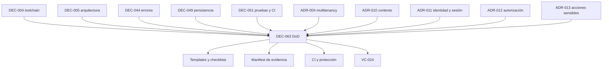

# DEC-063 — Definition of Done por tipo de trabajo y riesgo

## 1. Identificador

`DEC-063`.

## 2. Título

Definition of Ready y Definition of Done ejecutables, proporcionales al riesgo
y diferenciadas por tipo de trabajo para SR Taller 2.0.

## 3. Estado

**Accepted with conditions**.

La [revisión formal](FORMAL_REVIEW.md) registró el 2026-07-24 cinco dictámenes
`PASS WITH CONDITIONS` y el resultado global
`PASS — DEC-063 ACCEPTED WITH CONDITIONS`. La autoridad fue ejercida por el
Responsable del Proyecto en Arquitectura, Ingeniería, Seguridad, Operaciones y
Calidad.

DEC063-C01 a DEC063-C08 quedan aceptadas, vigentes y `Pending`. La aceptación
es documental: no registra materialización de templates, checklists
ejecutables, CI, protección de rama, evidencia VC-024 ni autorización de R0.

## 4. Fecha

2026-07-24.

## 5. Autoridad

| Función | Responsabilidad en la decisión | Dictamen |
| --- | --- | --- |
| Arquitectura | Coherencia de estados, dependencias, riesgo y decisiones aceptadas | Conforme; `PASS WITH CONDITIONS` |
| Ingeniería | Aplicabilidad, gates, revisión, Git y costo de adopción | Conforme; `PASS WITH CONDITIONS` |
| Seguridad | Evidencia negativa, secretos, aislamiento y excepciones | Conforme; `PASS WITH CONDITIONS` |
| Operaciones | Reproducibilidad, persistencia, releases, hotfixes y evidencia | Conforme; `PASS WITH CONDITIONS` |
| Calidad | Criterios verificables, defectos, flakiness y cierre | Conforme; `PASS WITH CONDITIONS` |

Las cinco conformidades fueron emitidas explícitamente por el Responsable del
Proyecto. No se atribuyen revisores externos, firmas independientes ni
aprobación inferida del historial Git.

## 6. Contexto

El gobierno aceptado ya define:

- plataforma reproducible y evidencia Linux en
  [DEC-004](../dec-004-toolchain-contract/DECISION_PROPOSAL.md);
- monolito modular, ownership y enforcement en
  [DEC-005](../dec-005-modular-monolith-organization/DECISION_PROPOSAL.md);
- errores tipados, sanitización y retry en
  [DEC-044](../dec-044-error-strategy/DECISION_PROPOSAL.md);
- ownership de persistencia y transacciones en
  [DEC-049](../dec-049-persistence-ownership/DECISION_PROPOSAL.md);
- pruebas, CI y gates por capas y riesgo en
  [DEC-051](../dec-051-testing-ci-strategy/DECISION_PROPOSAL.md);
- base y esquema compartidos, contexto, identidad, autorización y acciones
  sensibles en [ADR-004](../proposed/ADR-004-shared-schema-multitenancy.md) y
  [ADR-010](../proposed/ADR-010-station-bound-operational-context.md) a
  [ADR-013](../proposed/ADR-013-sensitive-actions-and-reinforced-authorization.md).

DEC-005 está `Accepted — Materialized / Formally Verified`. DEC-044, DEC-049 y
DEC-051 están `Accepted`. Actualización del 2026-07-24: la
[verificación formal de VC-024](../../architecture-readiness/dec-004-linux-verification/vc-024/FORMAL_VERIFICATION.md)
obtuvo `PASS`; DEC063-C01/C03/C04 quedan `Satisfied` y las demás condiciones
permanecen pendientes. R0 no está autorizado y Sprint 00 permanece abierto.

Los documentos de entrega existentes contienen checklists útiles, pero
mezclan por momentos `Done` con despliegue. DEC-063 establece el contrato
autoritativo y separa finalización del trabajo, materialización de decisiones,
verificación formal y release.

## 7. Problema

Una lista universal no determina evidencia suficiente para trabajos
heterogéneos. Tampoco evita que una decisión aceptada sea presentada como
implementada, que un PBI terminado sea confundido con un release, o que una
migración, un cambio de seguridad y una corrección documental reciban el mismo
nivel de control.

Se necesita un contrato que responda, para cada entrega:

1. qué debe existir antes de comenzar;
2. qué significa terminar;
3. qué gates son obligatorios según tipo y riesgo;
4. qué evidencia demuestra cada afirmación;
5. quién acepta una excepción y hasta cuándo;
6. cómo se distingue `Done` de `Released`, `Accepted`, `Materialized`,
   `Formally Verified` y `Closed`.

## 8. Drivers

1. Mantener una base común pequeña y verificable.
2. Elevar controles según superficie y consecuencia del fallo.
3. Fallar cerrado ante clasificación o evidencia ambigua.
4. Preservar autoridad, ownership y trazabilidad.
5. Evitar burocracia que no reduzca riesgo.
6. Hacer compatibles trabajo documental, técnico y operativo.
7. No atribuir materialización a una aceptación documental.
8. Mantener `Done` independiente de `Released`.
9. Exigir evidencia negativa en aislamiento y seguridad.
10. Permitir enforcement gradual sin declarar controles inexistentes.

## 9. Opciones

### Opción A — Checklist universal

Toda entrega usa una lista única.

Ventajas:

- fácil de recordar;
- homogénea en apariencia;
- bajo costo inicial.

Desventajas:

- incluye pasos irrelevantes o insuficientes;
- favorece marcar `N/A` sin análisis;
- no escala desde documentación hasta migraciones y releases;
- oculta diferencias entre aceptación, implementación y operación.

### Opción B — Base común más checklist por tipo y riesgo

Toda entrega cumple un núcleo mínimo. Se añaden controles por naturaleza del
trabajo y por riesgo bajo, medio o alto.

Ventajas:

- proporcional y explícita;
- conserva una base común;
- permite gates especializados;
- integra DEC-044, DEC-049 y DEC-051 sin duplicar sus contratos;
- hace auditable una omisión.

Desventajas:

- exige clasificación fail-closed;
- requiere templates y matrices mantenidas;
- puede crecer sin disciplina editorial.

### Opción C — Juicio del owner

El owner decide caso por caso qué significa terminar.

Ventajas:

- máxima flexibilidad;
- costo documental mínimo.

Desventajas:

- resultados inconsistentes;
- evidencia no reproducible;
- riesgo de autoaprobación;
- imposible proteger gates críticos de forma confiable.

## 10. Comparación

Escala: 1 desfavorable, 3 suficiente y 5 favorable.

| Criterio | A — universal | B — tipo y riesgo | C — owner |
| --- | ---: | ---: | ---: |
| Claridad | 3 | 5 | 2 |
| Proporcionalidad | 1 | 5 | 4 |
| Reproducibilidad | 3 | 5 | 1 |
| Seguridad fail-closed | 2 | 5 | 1 |
| Costo de adopción | 5 | 3 | 5 |
| Capacidad de enforcement | 3 | 5 | 1 |
| Compatibilidad con decisiones aceptadas | 2 | 5 | 2 |
| Riesgo de burocracia | 2 | 4 | 5 |

## 11. Decisión

Se adopta la **Opción B — base común más checklist por tipo y riesgo**.

Reglas normativas:

1. Todo trabajo DEBE satisfacer la base común y su checklist de tipo.
2. Todo trabajo DEBE clasificarse como riesgo bajo, medio o alto antes de
   comenzar.
3. Ambigüedad de tipo, riesgo, alcance o evidencia falla cerrado: el trabajo no
   está `Ready` ni puede declararse `Done`.
4. Un criterio puede ser `N/A` sólo con justificación, owner y revisor
   identificados.
5. La evidencia DEBE demostrar el resultado, no sólo describir una intención.
6. Un gate rojo, omitido o no reproducible impide `Done`.
7. Aceptar una decisión no materializa su contrato.
8. `Done` no implica `Released`; `Released` exige un proceso operativo aparte.
9. El contrato más específico y de mayor riesgo prevalece.
10. Ninguna excepción puede reducir una exigencia de seguridad, aislamiento,
    integridad o recuperación sin waiver explícito de la autoridad competente.

## 12. Estados

| Estado | Significado y criterio de salida |
| --- | --- |
| `Proposed` | Documento o alternativa inicial, todavía no autorizada. Sale al completar su propuesta o ser rechazada. |
| `Ready for formal decision` | Propuesta completa, trazable y lista para dictamen; no equivale a aceptación. |
| `Accepted` | La autoridad aprueba el contrato documental. No afirma implementación. |
| `Ready` | El trabajo cumple Definition of Ready y puede comenzar. |
| `In progress` | Existe ejecución autorizada dentro del alcance. |
| `In review` | La entrega y evidencia están completas para revisión; todavía no es `Done`. |
| `Materialized` | Una decisión aceptada fue implementada en artefactos verificables. |
| `Formally Verified` | Una revisión autorizada reprodujo evidencia y confirmó el contrato materializado. |
| `Done` | El trabajo satisface base, checklist de tipo, nivel de riesgo, criterios y gates aplicables. No implica release. |
| `Released` | El artefacto identificado fue promovido al entorno objetivo y pasó validación operativa requerida. |
| `Closed` | El expediente o ciclo administrativo terminó sin trabajo pendiente dentro de su alcance; puede seguir a `Done`, `Released`, `Rejected` o una resolución documentada. |
| `Rejected` | La autoridad descarta la propuesta conservando razón y evidencia. |
| `Blocked` | Un impedimento identificado evita avanzar; requiere owner, impacto y criterio de desbloqueo. |

No todos los tipos recorren todos los estados. Una decisión usa `Proposed`,
`Ready for formal decision`, `Accepted`, eventualmente `Materialized` y
`Formally Verified`. Un PBI usa `Ready`, `In progress`, `In review` y `Done`.
Un release agrega `Released`. Ningún cambio de nombre puede comprimir esas
semánticas.

## 13. Definition of Ready

Antes de `Ready`, todo trabajo DEBE declarar:

| Campo | Exigencia |
| --- | --- |
| Objetivo | Resultado observable, no una actividad genérica |
| Alcance | Artefactos, dominios y entornos incluidos |
| Exclusiones | Límites explícitos y acciones prohibidas |
| Owner | Responsable de ejecución y resolución |
| Dependencias | Entrantes, salientes y estado |
| Criterios de aceptación | Verificables y vinculados a evidencia |
| Riesgo | Bajo, medio o alto, con justificación |
| Decisiones aplicables | ADR/DEC y contratos vigentes |
| Evidencia esperada | Comandos, reportes, artefactos o revisión |
| Gates | Base, tipo, riesgo y entorno |

Además:

- no puede existir una decisión H0 pendiente que impida el trabajo;
- accesos y entornos requeridos deben estar disponibles o declarados como
  bloqueo;
- los cambios de persistencia, seguridad, infraestructura y release deben
  incluir rollback o recuperación antes de comenzar;
- datos reales, secretos y operaciones destructivas requieren autorización
  específica;
- preguntas que cambien alcance, modelo o riesgo impiden `Ready`.

## 14. Base común de Done

Todo trabajo `Done` DEBE demostrar:

- objetivo y criterios de aceptación cumplidos;
- alcance y exclusiones respetados;
- artefactos exactos inventariados;
- decisiones aplicables respetadas;
- revisión proporcional al riesgo completada;
- gates aplicables verdes, sin omisiones silenciosas;
- defectos, deuda y limitaciones registrados con owner;
- evidencia trazable al cambio evaluado;
- ausencia de secretos o datos sensibles en diff, logs y artefactos;
- enlaces y documentación afectados actualizados;
- estado Git y acciones externas reportados;
- excepción, `N/A` o waiver explícitos cuando existan;
- siguiente estado o acción inequívoco.

## 15. Clasificación de riesgo

| Riesgo | Ejemplos | Revisión mínima | Gates |
| --- | --- | --- | --- |
| Bajo | Corrección editorial, enlace o contenido sin contrato normativo | Owner más revisión editorial o técnica pertinente | Validación de formato, enlaces y diff |
| Medio | Código no crítico, decisión acotada, comportamiento reversible | Owner y una disciplina independiente | Gates base, tests afectados y revisión especializada |
| Alto | Tenant, auth, capacidades, PIN, sesión, persistencia, migración, error público, CI, infraestructura, release o datos | Arquitectura/Ingeniería y disciplinas de riesgo aplicables | Gates completos, pruebas negativas, recuperación y evidencia reproducible |

Un cambio que cruza categorías adopta el nivel mayor. Falta de clasificación o
justificación se trata como riesgo alto. Reducir riesgo requiere dictamen
registrado; no basta la opinión del implementador.

## 16. Done para documentación

Un documento está `Done` cuando:

- tiene propósito, autoridad, audiencia y estado claros;
- usa fuentes autoritativas y enlaces relativos válidos;
- no contradice decisiones aceptadas;
- distingue hecho, propuesta, decisión, evidencia y trabajo futuro;
- actualiza índices y matrices vivos afectados;
- conserva historia y evita duplicar autoridad;
- pasa formato, enlaces, anchors, fences y `git diff --check`;
- un revisor pertinente confirma contenido y trazabilidad.

Una edición documental no materializa el control que describe.

## 17. Done para decisiones

Una decisión:

1. pasa de `Proposed` a `Ready for formal decision` al completar contexto,
   opciones, comparación, contrato, riesgos, dependencias y criterios;
2. pasa a `Accepted` sólo mediante autoridad y dictamen explícitos;
3. pasa a `Materialized` sólo con artefactos implementados y evidencia;
4. pasa a `Formally Verified` sólo tras revisión autorizada y reproducible.

`Accepted`, `Materialized` y `Formally Verified` no son sinónimos ni atajos.
Las condiciones aceptadas conservan ID, owner, momento, evidencia,
dependencia, estado y criterio de cumplimiento.

## 18. Done para PBI técnico

Un PBI técnico está `Done` cuando:

- cumplió su DoR, alcance y criterios;
- implementación, pruebas y documentación necesarias están completas;
- no dejó trabajo obligatorio oculto;
- revisión y gates por riesgo están verdes;
- evidencias están vinculadas al cambio;
- defectos no resueltos tienen tratamiento explícito;
- su estado no depende de un release salvo que desplegar sea parte expresa del
  alcance.

Si el PBI produce una decisión, migración, release o spike, también cumple el
checklist especializado correspondiente.

## 19. Done para código

El código está `Done` cuando:

- compila, typecheckea y respeta arquitectura;
- incluye pruebas del comportamiento nuevo y de regresión;
- conserva ownership, contratos públicos y compatibilidad acordada;
- maneja errores conforme a DEC-044;
- no incluye secretos, logs inseguros ni dependencias no autorizadas;
- pasa `pnpm run verify` y suites especializadas por riesgo;
- documentación y evidencias reflejan el comportamiento real;
- revisión de código confirma legibilidad, mantenibilidad y alcance.

## 20. Done para persistencia

Un cambio de persistencia está `Done` cuando:

- respeta ownership, repositorios, scopes y transacciones de DEC-049;
- aísla tenant y sucursal en lecturas, escrituras y referencias;
- prueba PostgreSQL real cuando el contrato lo exige;
- valida constraints, rollback, concurrencia y traducción de errores;
- no filtra excepciones de driver;
- contiene recuperación, evidencia y observabilidad operativa apropiadas;
- no usa SQL ad hoc fuera del mecanismo gobernado.

## 21. Done para migraciones

Una migración está `Done` cuando:

- tiene ID, orden, ownership, precondiciones y compatibilidad definidos;
- forward y rollback o estrategia de recuperación fueron probados;
- valida datos existentes, locks, tiempo, concurrencia y reejecución;
- no mezcla cambios de dominio no relacionados;
- produce evidencia en PostgreSQL gobernado;
- declara impacto operativo, ventana y abort criteria;
- fue revisada por Ingeniería y Operaciones; Seguridad participa si afecta
  aislamiento o datos sensibles.

DEC-063 no selecciona herramienta ni política de migración; DEC-050 conserva
esa autoridad.

## 22. Done para seguridad

Un cambio de seguridad está `Done` cuando:

- identifica amenaza, activo, actor, frontera y abuso;
- prueba rutas positivas y negativas;
- falla cerrado ante contexto ausente, inválido o inconsistente;
- demuestra no enumeración ni acceso cross-tenant/cross-sucursal;
- no registra PIN, contraseñas, tokens, cookies o secretos;
- aplica mínimo privilegio y autorización contextual;
- incluye revisión de Seguridad y evidencia reproducible;
- registra riesgo residual y respuesta.

ADR-010 a ADR-013 conservan autoridad sobre contexto, PIN, sesión, capacidades
y acciones sensibles.

## 23. Done para estrategia de errores

Todo cambio que crea o traduce fallas DEBE:

- clasificar el error conforme a DEC-044;
- traducirlo sólo en la frontera propietaria;
- sanitizar contrato público y logs;
- mapear HTTP y retry según el catálogo aceptado;
- evitar exponer PostgreSQL, stack, rutas, secretos o nombres internos;
- probar traducción, sanitización, logging, anti-enumeración y `Unexpected`;
- conservar correlación y contexto permitido sin datos sensibles.

DEC-063 consume DEC-044; no redefine categorías ni mappings.

## 24. Done para pruebas

Las pruebas están `Done` cuando:

- trazan riesgo, contrato y criterio de aceptación;
- cubren camino positivo, negativo, frontera y fallo cuando aplique;
- son deterministas, aisladas y reproducibles;
- no dependen de datos reales;
- preservan el primer fallo y no usan retry para fabricar verde;
- demuestran la falla correcta mediante mutación o fixture negativo en
  controles críticos;
- registran omisiones, cuarentenas y limitaciones.

## 25. Done para CI y gates

La materialización futura de CI está `Done` cuando:

- ejecuta el contrato de DEC-051 sobre Linux gobernado;
- instalación es frozen y la toolchain coincide con DEC-004;
- los gates obligatorios no pueden omitirse por paths ambiguos;
- clasificación de riesgo es fail-closed;
- secretos son efímeros, mínimos y no se imprimen;
- resultados, logs y artefactos son trazables y sanitizados;
- branch protection exige los checks seleccionados;
- flakiness, cuarentena, retención y reejecución están gobernadas;
- cambios a workflow, checker o matriz de riesgo reciben riesgo alto.

La aceptación de DEC-063 no afirma que esta CI exista.

## 26. Done para revisión

Una revisión válida:

- identifica revisor, disciplina, alcance y commit/artefacto;
- evalúa criterios y riesgos, no sólo estilo;
- registra `PASS`, `PASS WITH CONDITIONS` o `FAIL`;
- convierte condiciones en obligaciones trazables;
- no permite autoaprobación para riesgo medio o alto;
- confirma que observaciones bloqueantes fueron resueltas o aceptadas por
  waiver autorizado;
- conserva evidencia suficiente sin revelar información sensible.

## 27. Done para Git

Cuando Git forma parte del alcance:

- diff contiene sólo archivos autorizados;
- índice y working tree se reportan;
- `git diff --check` pasa;
- commit es atómico, trazable y usa mensaje acordado;
- push, merge, rebase, tag o PR sólo ocurren con autorización;
- branch protection y checks requeridos se respetan;
- un árbol previamente sucio se preserva y distingue del cambio actual;
- no se reescribe historia compartida sin autorización expresa.

Un trabajo puede estar `Done` sin commit cuando su alcance prohíbe commit; debe
reportarlo explícitamente.

## 28. Done y Released

`Done` afirma que el trabajo cumple su contrato. `Released` afirma que un
artefacto identificado:

- fue autorizado para el entorno objetivo;
- tuvo preflight, backup/rollback y allowlist aplicables;
- fue promovido por el mecanismo gobernado;
- coincide mediante checksum, versión o identidad verificable;
- pasó smoke y validación post-release;
- produjo evidencia operativa;
- no dejó incidentes o desviaciones sin owner.

Un PBI puede estar `Done` y esperar release. Un deploy no validado no es
`Released`. Un release puede agrupar varios PBIs `Done`.

### 28.1 Semántica post-merge del cierre documental

El PR documental de avance se redacta antes de conocer su propio merge; por
ello puede usar `Done candidate` y condicionar el estado a su integración. Ese
wording no crea un gate circular. Un PBI queda canónicamente `Done` cuando se
cierra la conjunción de: DoD material y evidencia, Owner Acceptance, merge
autorizado del PR documental y CI autoritativo GREEN sobre el SHA exacto de
ese merge. La evidencia Git/CI post-merge completa el estado efectivo.

No se crea un PR de cierre-del-cierre sólo para reemplazar wording preventivo
pre-merge. Si una discrepancia excede esa semántica —por ejemplo, falta de
evidencia, aceptación, merge o CI exacto— permanece bloqueante y falla cerrado.

## 29. Done para hotfix

Un hotfix está `Done` cuando, además del DoD de código y riesgo alto:

- documenta incidente, impacto, urgencia y autoridad;
- limita cambios al mínimo;
- incluye prueba de regresión;
- posee rollback inmediato y evidencia pre/post;
- pasa gates que puedan ejecutarse; cualquier omisión requiere waiver
  temporal;
- se reconcilia con la rama y documentación canónicas;
- registra seguimiento de deuda y caducidad de la excepción.

Urgencia no elimina controles; sólo permite diferir los explícitamente
autorizados.

## 30. Done para spikes

Un spike está `Done` cuando:

- responde preguntas y timebox declarados;
- distingue evidencia de recomendación;
- conserva comandos, entorno, resultados y limitaciones reproducibles;
- no presenta prototipo como producción;
- identifica riesgos, alternativas y trabajo pendiente;
- concluye `PASS`, `CONDITIONAL PASS` o `FAIL`;
- elimina o aísla artefactos desechables según alcance;
- no modifica una decisión sin revisión formal posterior.

## 31. Condiciones pendientes

Una entrega con condiciones:

- puede recibir `PASS WITH CONDITIONS` sólo si el núcleo es aceptable y cada
  condición es posterior, acotada y verificable;
- conserva las condiciones como `Pending` hasta evidencia y autoridad;
- no puede usar una condición para ocultar un criterio esencial incumplido;
- no puede declararse `Formally Verified`, `Released` o `Closed` si una
  condición bloquea ese estado;
- debe declarar si la condición bloquea R0, implementación, release u otro
  hito.

## 32. Evidencia

Toda evidencia DEBE registrar, según aplique:

- ID de trabajo y condición;
- commit, árbol o artefacto exacto;
- entorno y toolchain;
- comando y exit code;
- fecha y responsable;
- inputs sintéticos relevantes;
- resultados y hashes;
- logs sanitizados;
- revisión y dictamen;
- desviaciones, riesgos y siguiente acción.

Una captura o narrativa aislada no reemplaza evidencia ejecutable cuando el
contrato exige reproducción. Los manifests deben evitar secretos y normalizar
sólo datos incidentales.

## 33. Defectos, flakiness y deuda

- Un defecto que rompe un criterio, gate o control de riesgo impide `Done`.
- Un defecto no bloqueante requiere severidad, owner, fecha o condición de
  atención y riesgo residual aceptado.
- Una prueba flaky no puede considerarse verde por reejecución.
- La cuarentena requiere owner, expiración, evidencia alternativa y criterio
  de restauración.
- Deuda introducida por la entrega debe ser visible y no puede contradecir una
  decisión aceptada.
- Defectos críticos de aislamiento, auth, integridad o recuperación no admiten
  cierre administrativo.

## 34. Excepciones y waivers

Todo waiver DEBE contener:

- criterio exacto exceptuado;
- razón y evidencia;
- riesgo e impacto;
- autoridad y owner;
- alcance mínimo;
- compensación;
- fecha de expiración;
- criterio de remediación;
- estados que no puede alcanzar mientras siga vigente.

No existe waiver implícito, permanente ni por silencio. Un implementador no
puede aprobar su propia excepción. Seguridad, Operaciones o Producto participan
cuando el riesgo cae en su autoridad.

## 35. Responsabilidades

| Rol | Responsabilidad |
| --- | --- |
| Owner del trabajo | DoR, ejecución, evidencia y resolución |
| Arquitectura | Coherencia, fronteras, decisiones y riesgo arquitectónico |
| Ingeniería | Implementabilidad, código, revisión y gates técnicos |
| Seguridad | Aislamiento, auth, secretos, abuso y riesgo residual |
| Operaciones | Entornos, persistencia, recuperación, release y evidencia operativa |
| Calidad | Suficiencia de criterios, portafolio, defectos y reproducibilidad |
| Producto | Alcance, valor, riesgo de negocio y excepciones que lo cambian |
| Responsable del Proyecto | Autoridad final cuando así lo establezca el expediente |

Una misma persona puede ejercer varias funciones, pero debe registrar cada
dictamen por separado y no inventar independencia externa.

## 36. Checklists ejecutables por tipo

### Documento

- [ ] Estado, autoridad, audiencia y propósito.
- [ ] Fuentes y enlaces válidos.
- [ ] Sin contradicciones ni autoridad duplicada.
- [ ] Índices/matrices vivos reconciliados.
- [ ] Formato, anchors, fences y diff verdes.
- [ ] Revisión pertinente registrada.

### Decisión

- [ ] Contexto, problema, drivers, opciones y comparación.
- [ ] Contrato, consecuencias, riesgos, dependencias y criterios.
- [ ] Autoridad y cinco disciplinas cuando el riesgo lo requiera.
- [ ] Condiciones con ID y estado.
- [ ] `Accepted` separado de `Materialized` y `Formally Verified`.

### PBI técnico

- [ ] DoR completo.
- [ ] Criterios y exclusiones satisfechos.
- [ ] Implementación, pruebas, docs y evidencia.
- [ ] Revisión y gates por riesgo.
- [ ] Defectos/deuda tratados.
- [ ] `Done` separado de release.

### Código

- [ ] Arquitectura, typecheck y build.
- [ ] Pruebas positivas, negativas y regresión aplicables.
- [ ] Errores, seguridad y logs conformes.
- [ ] Sin secretos ni dependencias no autorizadas.
- [ ] `pnpm run verify` y suites especializadas verdes.

### Persistencia y migración

- [ ] Ownership, scopes y transacciones.
- [ ] Aislamiento y constraints.
- [ ] PostgreSQL real cuando aplique.
- [ ] Forward, rollback/recuperación y concurrencia.
- [ ] Error translation y evidencia operativa.

### Seguridad

- [ ] Amenaza y frontera.
- [ ] Positivos, negativos y anti-enumeración.
- [ ] Fail-closed y mínimo privilegio.
- [ ] Secretos/logs sanitizados.
- [ ] Revisión de Seguridad y riesgo residual.

### CI

- [ ] Linux y toolchain gobernados.
- [ ] Install frozen y gates de DEC-051.
- [ ] Riesgo fail-closed.
- [ ] Secrets y artefactos seguros.
- [ ] Protección, flakiness y cambios al pipeline gobernados.

### Release/hotfix

- [ ] Autoridad, artefacto y entorno.
- [ ] Backup/rollback y allowlist.
- [ ] Identidad/checksum.
- [ ] Smoke y validación post-release.
- [ ] Incidentes, reconciliación y evidencia.

### Spike

- [ ] Preguntas y timebox.
- [ ] Entorno/comandos reproducibles.
- [ ] Evidencia separada de recomendación.
- [ ] Limitaciones y riesgos.
- [ ] Dictamen y siguiente decisión.

Todo checkbox no aplicable necesita justificación y revisor. Una lista marcada
sin evidencia no satisface el contrato.

## 37. Enforcement futuro

La materialización puede evolucionar en este orden:

1. templates documentales con campos obligatorios;
2. catálogo y manifest de evidencia;
3. validación de riesgo y checklists;
4. integración con los gates de DEC-051;
5. protección de rama y evidencia Linux;
6. controles especializados de persistencia, seguridad y release.

Cada etapa requiere autorización separada, pruebas y rollback. Esta decisión
no crea templates ejecutables, workflows, branch protection ni automatización.

## 38. Condiciones DEC063-C01 a DEC063-C08

| ID | Condición | Owner | Momento | Evidencia | Dependencia | Estado | Criterio de cumplimiento |
| --- | --- | --- | --- | --- | --- | --- | --- |
| DEC063-C01 | Materializar templates mínimos por tipo | Arquitectura + Calidad | Antes del primer PBI funcional autorizado | Templates versionados y revisión | DEC-063 | `Satisfied` | Todos los tipos obligatorios consumen base, riesgo y checklist sin duplicar autoridad |
| DEC063-C02 | Materializar clasificación fail-closed de riesgo | Arquitectura + Seguridad | Antes de integrar cambios de riesgo medio/alto | Matriz, ejemplos y pruebas/revisión | DEC063-C01 | `Pending` | Ambigüedad eleva riesgo y no existe downgrade unilateral |
| DEC063-C03 | Definir manifest canónico de evidencia | Calidad + Operaciones | Antes de VC-024 | Schema/formato, ejemplo sanitizado y revisión | DEC-051, DEC063-C01 | `Satisfied` | Identifica commit, entorno, comandos, resultados, hashes y dictamen |
| DEC063-C04 | Integrar DoD con CI y protección gobernada | Ingeniería + Operaciones | Antes de declarar materialización CI | Workflow/checks autorizados, fixtures y evidencia Linux | DEC-051, DEC063-C02/C03 | `Satisfied` | Gates obligatorios son fail-closed y no omitibles |
| DEC063-C05 | Materializar checklist de persistencia/migración | Ingeniería + Operaciones | Antes del primer cambio persistente | Checklist, PostgreSQL real y recuperación probada | DEC-049, DEC-050, DEC-051 | `Pending` | Ownership, aislamiento, constraints, forward y recuperación quedan demostrados |
| DEC063-C06 | Materializar checklist de seguridad | Seguridad + Calidad | Antes de auth, tenant o acción sensible funcional | Casos negativos, sanitización y dictamen | ADR-004, ADR-010–013, DEC-044, DEC-051 | `Pending` | Fail-closed, anti-enumeración, mínimo privilegio y secretos quedan cubiertos |
| DEC063-C07 | Materializar checklist de release/hotfix | Operaciones + Calidad | Antes del primer release candidato | Runbook, rollback, smoke y evidencia | DEC-051, proceso de release | `Pending` | `Done`/`Released` y ruta normal/hotfix son inequívocos y reproducibles |
| DEC063-C08 | Gobernar excepciones y waivers | Responsable del Proyecto + disciplinas afectadas | Antes de aprobar la primera excepción | Registro con expiración, compensación y cierre | DEC063-C01/C02 | `Pending` | No existe waiver implícito, permanente ni autoaprobado |

La aceptación por sí sola no materializó ninguna condición. La
[verificación formal de VC-024](../../architecture-readiness/dec-004-linux-verification/vc-024/FORMAL_VERIFICATION.md)
del 2026-07-24 aporta evidencia ejecutada para DEC063-C01, DEC063-C03 y
DEC063-C04; las demás condiciones permanecen `Pending`.

## 39. Riesgos

| Riesgo | Impacto |
| --- | --- |
| Checklist excesivo | Trabajo ceremonial y pérdida de señal |
| Clasificación permisiva | Controles insuficientes en cambios críticos |
| Clasificación siempre alta | Costo y lentitud innecesarios |
| Evidencia narrativa | Imposibilidad de reproducir resultados |
| Confundir estados | Falsa afirmación de implementación o release |
| `N/A` indiscriminado | Omisión silenciosa de obligaciones |
| Automatización prematura | Contrato rígido o checker incorrecto |
| Condiciones eternas | Deuda de gobierno sin owner efectivo |

## 40. Mitigaciones

- núcleo común pequeño y checklists especializados;
- clasificación fail-closed con ejemplos y revisión;
- evidencia ligada al riesgo y contrato;
- semántica de estados autoritativa;
- `N/A` y waivers con owner, autoridad y expiración;
- materialización incremental, probada y reversible;
- revisión periódica de costo, falsos positivos y condiciones;
- prohibición de declarar cumplido un control sólo por documentarlo.

## 41. Consecuencias

Positivas:

- cierre verificable y proporcional;
- lenguaje común entre Arquitectura, Ingeniería, Seguridad, Operaciones y
  Calidad;
- separación firme entre aceptación, materialización, verificación, Done y
  Released;
- consumo explícito de DEC-044, DEC-049 y DEC-051;
- base para templates y enforcement posteriores.

Negativas:

- requiere disciplina de clasificación y evidencia;
- aumenta el trabajo inicial en cambios de riesgo alto;
- las ocho condiciones necesitan materialización posterior;
- matrices y checklists requerirán mantenimiento.

## 42. Decisiones diferidas

Se difieren:

- herramienta o proveedor de gestión de trabajo;
- proveedor de CI y formato físico de workflows;
- implementación de templates y validadores;
- branch protection concreta;
- política final de migraciones, propiedad de DEC-050;
- retención externa de evidencia;
- observabilidad distribuida;
- automatización de waivers;
- SLA y calendario de releases;
- métricas organizacionales de productividad.

## 43. Dependencias

DEC-063 no sustituye ninguna dependencia. Traduce sus obligaciones a criterios
de entrada, salida y evidencia.

## 44. Impacto en H0

La aceptación documental de DEC-063 cerró su gate H0. Posteriormente, la
verificación formal de VC-024 cerró el último remanente. El inventario vigente
queda en **9 cerrados / 0 abiertos** y readiness H0 `Complete`.

## 45. Impacto en R0

R0 continúa **no autorizado**. VC-024 satisface DEC051-C01/C07/C09 y
DEC063-C01/C03/C04; las demás condiciones permanecen `Pending`. Aceptar
contratos o completar H0 no sustituye H1, la autorización organizacional ni
el dictamen final de readiness.

## 46. Impacto en Sprint 00

Sprint 00 permanece **abierto**. La decisión permite preparar, en trabajos
separadamente autorizados, templates, clasificación de riesgo, manifests y
gates. No autoriza implementación funcional, CI, protección, persistencia,
migraciones ni release.

## 47. Criterios de aceptación

- [x] Existe una estrategia única: base común más tipo y riesgo.
- [x] Se definen los trece estados y sus diferencias.
- [x] Definition of Ready contiene campos y gates mínimos.
- [x] Existe DoD base y clasificación bajo/medio/alto fail-closed.
- [x] Se cubren documentos, decisiones, PBI, código, persistencia, migraciones,
  seguridad, errores, pruebas, CI, revisión, Git, release, hotfix y spikes.
- [x] Se gobiernan condiciones, evidencia, defectos, flakiness y waivers.
- [x] Existen checklists ejecutables por tipo.
- [x] DEC063-C01 a DEC063-C08 tienen owner, momento, evidencia, dependencia,
  estado y criterio.
- [x] Las cinco disciplinas emitieron dictamen explícito.
- [x] No existe contradicción material con DEC-004/005/044/049/051 ni
  ADR-004/010–013.
- [x] `Done` y `Released` quedan separados.
- [x] La aceptación no afirma materialización.

## 48. Siguiente acción

Con VC-024 `Closed / PASS`, resolver el gate organizacional y los contratos
transversales H1 antes de solicitar autorización explícita para programación
funcional. R0 no está autorizado y Sprint 00 continúa abierto.
