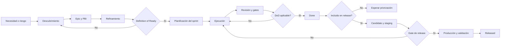

# Flujo de desarrollo

## Estado del documento

- **Estado:** Propuesta
- **Alcance:** Descubrimiento, documentación y futuro desarrollo de SR Taller 2.0.
- **Hecho conocido:** El proyecto está en fundación documental; no se ha autorizado implementación funcional ni el inicio del Sprint 01.
- **Decisión pendiente:** Herramientas concretas de gestión y responsables de aprobación. La estrategia operativa vigente está en la [política de ramas](./BRANCH_POLICY.md).

## Objetivo

Definir un flujo visible y trazable desde una necesidad de producto hasta una liberación. El flujo busca que seguridad, aislamiento multitenant, permisos, datos y operación se evalúen antes de construir, no al final.

## Tipos de trabajo

| Tipo | Identificador | Resultado esperado |
|---|---|---|
| Epic | `EPIC-###` | Agrupa un resultado de producto o capacidad amplia. |
| Product Backlog Item | `PBI-###` | Resultado verificable que aporta valor o aprendizaje. |
| Tarea técnica | `TASK-###` | Trabajo técnico necesario y trazado a un PBI. |
| Defecto | `BUG-###` | Comportamiento observado que contradice una expectativa verificable. |
| Riesgo | `RISK-###` | Incertidumbre que puede afectar valor, seguridad, plazo u operación. |
| Pregunta | `QUESTION-###` | Información faltante que requiere respuesta explícita. |
| Decisión | `DECISION-###` o `ADR-###` | Registro de una elección de producto u arquitectura. |

Las plantillas aplicables son [PBI](./PBI_TEMPLATE.md), [tarea técnica](./TECHNICAL_TASK_TEMPLATE.md) y [bug](./BUG_TEMPLATE.md).

## Flujo propuesto

### 1. Entrada y descubrimiento

1. Registrar la necesidad en el epic correspondiente, sin convertir una conversación informal en compromiso.
2. Crear o actualizar un PBI con problema, valor, alcance, exclusiones, riesgos y preguntas.
3. Identificar impacto por tenant, sucursal, permisos, datos, experiencia visual, integraciones y operación.
4. Registrar alternativas en un ADR `Proposed` cuando el trabajo implique una decisión arquitectónica relevante o difícil de revertir.
5. Mantener las preguntas bloqueantes como abiertas hasta obtener una respuesta verificable.

### 2. Refinamiento y preparación

El PBI se contrasta con la [Definition of Ready](./DEFINITION_OF_READY.md). `Ready` indica que el equipo entiende qué resultado validar; no garantiza que el PBI sea prioritario ni que esté comprometido para un sprint.

La prioridad final y el compromiso requieren aprobación del Product Owner. Estimaciones y responsables permanecen `TBD` hasta que el equipo los acuerde.

### 3. Planificación

- Definir objetivo del sprint y capacidad disponible.
- Seleccionar PBIs `Ready` en función de valor, reducción de riesgo, urgencia, dependencias, esfuerzo y aprendizaje.
- Separar `Committed`, `Candidate`, `Blocked` y `Requires product input`.
- Descomponer en tareas sólo al nivel necesario para ejecutar y verificar.
- Hacer visibles dependencias, riesgos y gates externos.

Sprint 00 sigue el mismo principio, pero sus resultados son documentales. No autoriza scaffolding, dependencias, infraestructura ni código funcional.

### 4. Ejecución y revisión

- Mantener cada cambio pequeño y ligado a un único propósito trazable.
- Actualizar documentación y ADRs junto con el cambio que los afecta.
- No ocultar decisiones críticas únicamente en conversaciones, commits o código.
- Someter los cambios a revisión por pares; revisores y reglas concretas quedan `TBD`.
- Tratar cualquier posible exposición entre tenants como un bloqueo de liberación.

El trabajo de código usa ramas de vida corta vinculadas al PBI o propósito del
cambio y vuelve a la baseline integrada según la
[política de ramas](./BRANCH_POLICY.md).

### 5. Validación y cierre

Todo entregable se contrasta con la
[Definition of Done](./DEFINITION_OF_DONE.md) y el contrato autoritativo de
[DEC-063](../decisions/dec-063-definition-of-done/DECISION_PROPOSAL.md).
Cuando satisface base, tipo y riesgo puede pasar a `Done`. Si después se
incluye en un release, staging, promoción y validación operativa determinan
`Released`; no son requisitos implícitos de todo PBI. La evidencia se conserva
mediante la [plantilla de evidencia QA](../quality/QA_EVIDENCE_TEMPLATE.md) y
el [modelo de trazabilidad](./TRACEABILITY_MODEL.md).

Cerrar un elemento exige:

- criterios de aceptación verificables satisfechos;
- evidencia accesible;
- documentación y decisiones consistentes;
- riesgos residuales explícitos;
- ningún bloqueo crítico abierto;
- aprobación definida para el tipo de cambio.

### 6. Release y aprendizaje

Los cambios liberables siguen el [proceso de release](./RELEASE_PROCESS.md). El mismo artefacto probado en staging se promueve a producción sin reconstrucción. La observación posterior puede generar PBIs, bugs, riesgos o preguntas nuevas.

## Estados sugeridos de un PBI

`Proposed → Ready → In progress → In review → Done`

Estados auxiliares del lifecycle:

- `Blocked`: existe un impedimento explícito con condición de salida.
- `Deferred`: se pospone conservando la razón y las condiciones para reconsiderar.
- `Cancelled`: se conserva la razón; no se elimina el historial.

La **clasificación dentro de un sprint** es un eje separado: `Committed`, `Candidate`, `Blocked` o `Requires product input`. `Committed` no es un estado del PBI; `Requires product input` es una clasificación/flag y el PBI conserva un estado como `Draft` o `Blocked`. Cuando `Blocked` aparezca en ambos ejes deben registrarse por separado.

La semántica normativa de estados pertenece a DEC-063; la representación en
una herramienta concreta continúa pendiente.

## Gates de decisión

| Gate | Condición mínima | Quién aprueba |
|---|---|---|
| Entrada a Sprint 00 | Entregable documental, alcance y evidencia definidos. | TBD |
| Inicio de prototipo técnico | Criterios de salida de Sprint 00 y autorización explícita del Product Owner. | Product Owner; participantes adicionales TBD |
| Entrada a sprint de implementación | DoR de implementación satisfecha. | Product Owner y equipo; mecanismo TBD |
| Entrada a producción | Evidencia QA, seguridad, migración y rollback revisada. | TBD |

## Cambios urgentes

Una urgencia no elimina controles de tenant, seguridad ni trazabilidad. Si un paso debe abreviarse, la excepción, su motivo, aprobador, riesgo y trabajo de seguimiento deben quedar registrados. El proceso específico de hotfix se detalla en [Release Process](./RELEASE_PROCESS.md).

## Preguntas abiertas

- ¿Qué herramienta será la fuente de verdad del backlog y los estados?
- ¿Quién puede aprobar que un PBI en estado `Ready` se seleccione en el bucket `Committed`, y quién aprueba staging a producción?
- ¿Cuándo podrá materializarse la protección técnica de `main` requerida por `DEC051-C02`?
- ¿Qué cambios exigirán revisión especializada de seguridad, datos o experiencia visual?
- ¿Cómo se gestionarán excepciones sin normalizar deuda no trazada?

## Próxima revisión

- **Fecha:** TBD.
- **Disparador:** selección de herramienta de gestión, aprobación del flujo o antes de planificar el primer sprint de implementación.
- **Documentos relacionados:** [Definition of Ready](./DEFINITION_OF_READY.md), [Definition of Done](./DEFINITION_OF_DONE.md), [Sprint Template](./SPRINT_TEMPLATE.md), [Traceability Model](./TRACEABILITY_MODEL.md).
