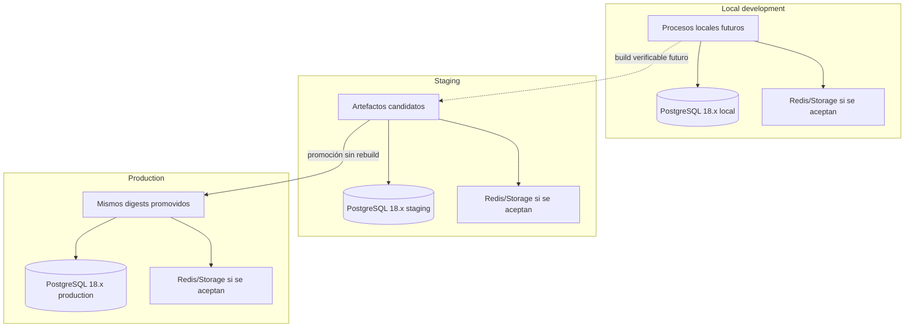

# Ambientes

## Estado del documento

- **Estado:** Propuesta
- **Alcance confirmado para planificación:** `local development`, `staging` y `production`.
- **Baseline de datos aceptada:** PostgreSQL 18.x en todos los ambientes autorizados; versión efectiva inicial 18.4.
- **Decisión pendiente:** Proveedor, topología, dominios concretos, acceso, sizing y estrategia de datos de prueba.

## Principios obligatorios para la planificación

- Local no es staging.
- Cada ambiente tiene base de datos y credenciales separadas.
- Staging no usa datos reales salvo un proceso controlado, autorizado y sanitizado aún por definir.
- El artefacto probado en staging se promueve a production sin reconstruirse.
- API y trabajos diferibles forman un único artefacto backend inicial conforme a ADR-002; cualquier separación futura requiere evidencia y ADR.
- El backend inicial usa la imagen OCI aceptada por ADR-007; cualquier promoción futura debe identificar el digest publicado exacto y no reconstruirlo entre staging y production.
- Las migraciones deben ser compatibles hacia adelante y considerar convivencia con versiones adyacentes.
- Todo cambio con riesgo operativo define rollback antes de producción.
- Feature flags son una opción futura, no un requisito ni decisión aceptada.
- No habrá despliegues manuales por FTP.

## Separación conceptual

El diagrama expresa aislamiento lógico y la baseline PostgreSQL 18.x aceptada; no define proveedor, número de instancias ni acepta Redis o storage.

## Matriz de ambientes

| Aspecto | Local development | Staging | Production |
|---|---|---|---|
| Propósito | Desarrollo y pruebas rápidas por colaborador. | Validar candidato integrado y operación antes de liberar. | Servicio real a tenants. |
| Usuarios | Equipo autorizado. | Equipo y revisores autorizados; acceso TBD. | Usuarios reales y operación autorizada. |
| Datos | Sintéticos, fixtures o copias sanitizadas mediante proceso futuro. | Sintéticos/representativos; datos reales sólo bajo proceso controlado. | Datos reales. |
| Base de datos | Instancia local separada. | Instancia exclusiva de staging. | Instancia exclusiva de production. |
| Credenciales | Locales, sin reutilizar secretos remotos. | Exclusivas de staging. | Exclusivas de production y con acceso mínimo. |
| Integraciones | Mocks, sandboxes o endpoints de desarrollo. | Sandboxes/endpoints de prueba cuando existan. | Endpoints reales aprobados. |
| Artefactos | Cambios locales; fidelidad sujeta a validación. | Versionados y candidatos. | Los mismos digests aprobados en staging. |
| Logs/telemetría | Datos de prueba; retención local. | Separados y etiquetados como staging. | Separados, protegidos y con retención TBD. |
| Despliegue | Comandos/herramientas locales futuras. | Pipeline repetible. | Promoción automatizada con gate y auditoría. |
| Backups | Reproducible desde datos de prueba. | Política según necesidad de QA; TBD. | Política y pruebas de recuperación obligatorias antes de operar. |
| Disponibilidad | Sin objetivo de servicio. | Objetivo TBD; no equivale a production. | Objetivos TBD según planes y riesgo. |

## Resolución de tenant y dominios

La dirección preliminar contempla subdominios wildcard para tenants. En cada ambiente se requieren zonas o dominios distintos para impedir confusión y cruce de cookies, tokens o webhooks. Los nombres concretos y la estrategia de hostname local quedan `TBD` y deberán alinearse con [Multitenancy Model](../architecture/MULTITENANCY_MODEL.md).

La identidad autenticada debe confirmar el tenant resuelto por hostname; cambiar host no debe ser suficiente para obtener acceso.

## Configuración y secretos

- Configuración específica por ambiente se inyectará en despliegue; no se incrustará en el artefacto.
- Secretos no se almacenarán en el repositorio, imágenes, evidencia QA o logs.
- Cuentas de servicio y claves se separarán por ambiente e integración.
- Acceso seguirá mínimo privilegio, autenticación reforzada para production y auditoría; mecanismos concretos TBD.
- Rotación, vault/proveedor y break-glass quedan pendientes de decisión.

## Datos y movimientos entre ambientes

No se permite conectar local o staging a la base de production para pruebas. Cualquier extracción excepcional deberá tener:

1. propósito y alcance aprobados;
2. minimización y sanitización verificable;
3. canal cifrado y ubicación autorizada;
4. acceso y retención limitados;
5. eliminación comprobable;
6. registro de quién, qué, cuándo y por qué.

El proceso concreto requiere revisión de seguridad y privacidad antes de usarse. Se prefieren generadores de datos sintéticos y escenarios reproducibles.

## Paridad y diferencias permitidas

Staging debe reproducir contratos, versiones y rutas operativas relevantes, pero no se asume idéntico en escala o disponibilidad. Cada diferencia conocida debe documentarse porque puede limitar la confianza de una prueba. Local optimiza aprendizaje, pero Docker Compose u otra opción preliminar no convierte local en representación exacta de staging.

## Promoción y rollback

- El pipeline debe mostrar ambiente origen, destino, versión y digest.
- Sólo se promueven artefactos aprobados y evidencia vinculada.
- Configuración de production se valida sin revelar secretos.
- Migraciones se ensayan en staging con volumen y casos representativos.
- El criterio y procedimiento de rollback siguen [Rollback Policy](../operations/ROLLBACK_POLICY.md).
- Las acciones manuales break-glass se limitan a contención, revocación de acceso, aislamiento de tráfico, cambio de configuración mediante un mecanismo aprobado o rollback a un artefacto previamente probado. Deben registrarse, revisarse y reconciliarse; la autoridad queda TBD. No permiten editar código, imagen, contenedor o servidor vivo, ni usar FTP o promover un build que no pasó por staging.

## Preguntas abiertas

- ¿Qué proveedores y regiones alojarán staging y production?
- ¿Qué dominios y certificados se usarán por ambiente para subdominios wildcard?
- ¿Qué grado de paridad de escala necesita staging?
- ¿Quién tendrá acceso a cada ambiente y mediante qué mecanismo?
- ¿Cómo se generarán datos representativos sin copiar información real?
- ¿Qué integraciones ofrecen sandbox y cómo se evitará enviar mensajes o cobros reales desde staging?
- ¿Se requerirá un ambiente efímero de preview en el futuro?

## Próxima revisión

- **Fecha:** TBD.
- **Disparador:** aprobación de [Deployment Strategy](../architecture/DEPLOYMENT_STRATEGY.md), selección de proveedor o antes de crear infraestructura.
- **Documentos relacionados:** [Release Process](./RELEASE_PROCESS.md), [Security Baseline](../architecture/SECURITY_BASELINE.md), [Backup and Recovery](../operations/BACKUP_AND_RECOVERY.md).
