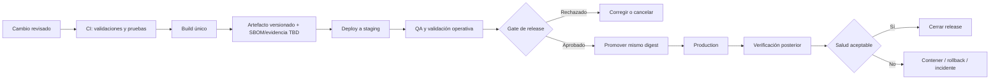

# Proceso de release

## Estado del documento

- **Estado:** Contrato parcial; Preview es ejecutable y la promoción Staging/Production permanece planificada.
- **Alcance:** Artefacto OCI actual de Preview y releases futuros de aplicaciones, workers y cambios de datos de SR Taller 2.0.
- **Hecho conocido:** `main` produce un artefacto OCI desplegable en Dokploy Preview; no existen Staging ni Production.
- **Decisión pendiente:** Registry/digest promovible, CI/CD, aprobadores, ventanas, rollout y objetivos operativos para Staging/Production.

## Objetivo

Lograr releases repetibles, trazables y recuperables entre los
[ambientes](./ENVIRONMENTS.md), sin copiar archivos manualmente ni reconstruir
el artefacto que ya fue probado. Para el flujo actual de Preview manda el
[workflow canónico](./DEVELOPMENT_AND_DELIVERY_WORKFLOW.md).

## Flujo actual de Preview

Preview se despliega manualmente desde `main` con el `Dockerfile` del
repositorio. Autodeploy está desactivado. Un cambio sólo llega a Preview tras
validación local, commit, integración explícita, push de `main`, deployment
manual en Dokploy y verificación remota. Este flujo no equivale todavía a una
promoción por digest ni autoriza Staging o Production.

## Principios propuestos

- Construir una vez y promover el mismo artefacto inmutable.
- Identificar cada artefacto mediante versión y digest; no desplegar tags ambiguos como `latest`.
- Mantener bases de datos, credenciales y configuración separadas por ambiente.
- Desplegar aplicaciones independientes por separado cuando sus contratos sean compatibles.
- Tratar migraciones como cambios versionados, revisados, compatibles hacia adelante y verificables.
- Preparar rollback antes de aprobar producción.
- Bloquear release ante sospecha de exposición entre tenants, pérdida de datos o bypass de autorización.
- Prohibir despliegues manuales por FTP.

## Flujo de release futuro

## Preparación del candidato

1. Confirmar que PBIs y bugs incluidos están `Done` conforme a su base, tipo y
   riesgo en la [Definition of Done](./DEFINITION_OF_DONE.md). Un release puede
   agrupar trabajo `Done`; staging y promoción determinan el estado separado
   `Released`.
2. Registrar alcance, exclusiones, cambios incompatibles, riesgos, migraciones y dependencias.
3. Ejecutar lint, type checking, pruebas unitarias, integración, end-to-end, seguridad y aislamiento según el riesgo.
4. Generar artefactos versionados para cada desplegable afectado.
5. Generar un manifiesto de release que vincule versiones/digests de API, workers y clientes, migraciones, PRs y evidencia.
6. Preparar comunicación, runbook y [plan de rollback](../operations/ROLLBACK_POLICY.md).

## Validación en staging

- Desplegar los mismos artefactos candidatos que se promoverán.
- Usar credenciales y base de datos exclusivas de staging.
- No usar datos reales salvo proceso controlado, autorizado y sanitizado aún por definir.
- Ejecutar smoke tests, recorridos críticos, permisos, aislamiento multitenant y compatibilidad con migraciones.
- Verificar logs, métricas, alertas, jobs, conexiones realtime e integraciones simuladas o de prueba.
- Conservar evidencia mediante [QA Evidence Template](../quality/QA_EVIDENCE_TEMPLATE.md).

## Gate de producción

| Entrada | Condición |
|---|---|
| Alcance | Manifiesto y changelog completos. |
| Calidad | Pruebas requeridas aprobadas y evidencia vinculada. |
| Seguridad | Sin hallazgos bloqueantes; riesgo residual explícito. |
| Tenant | Casos negativos de aislamiento aprobados cuando aplica. |
| Datos | Migraciones ensayadas, backup/recovery considerados y compatibilidad confirmada. |
| Operación | Alertas, dashboards, runbook y soporte preparados según riesgo. |
| Recuperación | Rollback practicable y criterios de activación definidos. |
| Aprobación | Product Owner y aprobadores técnicos/operativos: mecanismo TBD. |

Antes de aprobar producción, completar el checklist de release de DEC-063 con
la evidencia obtenida en staging y el vínculo al candidato. El gate no cambia
el estado `Done` de los PBIs: decide si el artefacto puede pasar a `Released`.

## Despliegue a producción

1. Confirmar identidad del ambiente, versión actual, objetivo y digest.
2. Evaluar backup o punto de recuperación según [Backup and Recovery](../operations/BACKUP_AND_RECOVERY.md).
3. Aplicar migraciones compatibles hacia adelante en el orden ensayado.
4. Promover por separado los desplegables necesarios, respetando compatibilidad de contratos.
5. Ejecutar smoke tests no destructivos y verificar métricas, logs y colas.
6. Observar durante un periodo `TBD`; no declarar éxito sólo por finalizar el pipeline.
7. Registrar resultado, diferencias, aprobaciones e incidentes.

La posibilidad de canary, blue/green o feature flags se mantiene como opción futura; no se considera seleccionada.

## Migraciones durante un release

- Preferir secuencias expandir–migrar–contraer cuando un cambio de esquema pueda convivir con versiones adyacentes.
- No mezclar eliminación irreversible con el primer release que deja de usar un campo.
- Jobs de backfill deben incluir tenant, idempotencia, checkpoint, límites y observabilidad.
- Un rollback de aplicación no debe depender de revertir inmediatamente datos ya escritos por la nueva versión.
- El proceso completo se rige por [Migration Policy](../operations/MIGRATION_POLICY.md).

## Hotfix futuro

Un hotfix reduce alcance y tiempo, no controles esenciales:

1. Vincular bug e incidente si aplica.
2. Aislar el cambio mínimo y definir rollback.
3. Ejecutar pruebas de regresión focalizadas y controles de tenant/seguridad.
4. Construir un nuevo artefacto versionado; nunca modificar uno existente.
5. Validar en staging y promover exactamente ese mismo digest. La indisponibilidad de staging bloquea una nueva promoción a production.
6. Promover y verificar; completar análisis y documentación de seguimiento.

Durante un incidente activo, las acciones break-glass se limitan a contención, revocación de acceso, aislamiento de tráfico o rollback a un artefacto previamente probado. No permiten parchear un contenedor/servidor vivo ni desplegar un build sin staging. Cualquier acción excepcional se rige por [Incident Management](../operations/INCIDENT_MANAGEMENT.md), queda auditada y exige reconciliación posterior.

## Evidencia del release

- ID/versión y estado (`Planned`, `Candidate`, `Released`, `Rolled back`, `Cancelled`).
- Artefactos y digests.
- PBIs, bugs, PRs y ADRs incluidos.
- Migraciones y orden de ejecución.
- Evidencia QA y seguridad.
- Aprobaciones.
- Hora de inicio/fin `TBD` al ejecutar, sin inventarla anticipadamente.
- Resultado de verificación y rollback/incident ID cuando corresponda.

## Preguntas abiertas

- ¿Qué plataforma de CI/CD y registro de imágenes/digests se aprobarán para promoción?
- ¿Quién puede aprobar producción y quién puede ordenar rollback?
- ¿Qué estrategia de rollout se usará por desplegable y riesgo?
- ¿Qué tiempo de observación y señales definen un release saludable?
- ¿Cómo se firmarán y conservarán artefactos y evidencia de supply chain?
- ¿Qué cambios necesitarán ventana de mantenimiento o comunicación al cliente?

## Próxima revisión

- **Fecha:** TBD.
- **Disparador:** materialización de Staging o antes del primer release a Production.
- **Documentos relacionados:** [Versioning Strategy](./VERSIONING_STRATEGY.md), [Environments](./ENVIRONMENTS.md), [Rollback Policy](../operations/ROLLBACK_POLICY.md), [Incident Management](../operations/INCIDENT_MANAGEMENT.md).
