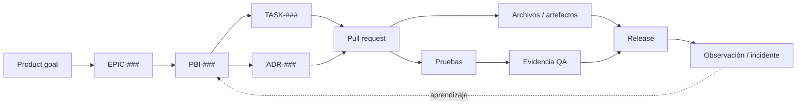

# Modelo de trazabilidad

## Estado del documento

- **Estado:** Propuesta
- **Objetivo:** Relacionar necesidad, decisión, cambio, validación y liberación sin depender de memoria o conversaciones privadas.
- **Decisión pendiente:** Herramientas fuente de verdad, automatizaciones y política de retención.

## Cadena objetivo



Para el MVP Operativo, esta cadena vive además dentro de una única selección
activa:

`Roadmap → Sprint activo → PBI actual → PR/evidencia → Done → PR documental de avance → siguiente PBI seleccionado`

Debe existir como máximo un Sprint `Active` y un PBI actual. El puntero
`Selected/current` no cambia el estado del PBI ni concede autorización.

Un PBI puede no requerir tarea, ADR, PR o release, especialmente en Sprint 00. La ausencia debe ser explícita y justificada, no un enlace vacío.

## Relaciones mínimas por elemento

| Elemento | Debe vincular | Motivo |
|---|---|---|
| Objetivo de producto | Epics y métricas/resultado cuando se definan | Explicar dirección. |
| Epic | Objetivo, PBIs, dependencias y riesgos | Mantener agrupación por valor. |
| PBI | Epic, decisiones, documentación, tareas, archivos/PR, pruebas, QA y release | Seguir el resultado de extremo a extremo. |
| Tarea | PBI padre, cambios, pruebas y evidencia | Evitar trabajo técnico huérfano. |
| ADR | contexto/PBI que lo exige, alternativas, documentos y cambios que aplican la decisión | Evitar decisiones desconectadas. |
| Pull request | PBI/bug/tarea, archivos, pruebas y ADR | Explicar por qué existe el cambio. |
| Prueba | criterio/riesgo, ambiente, versión y resultado | Demostrar qué se verificó. |
| Evidencia QA | PBI/bug, build, ambiente, datos, criterios y hallazgos | Hacer reproducible la aceptación. |
| Release | artefactos/digests, PBIs/bugs, migraciones, evidencia y aprobaciones | Saber qué llegó a cada ambiente. |
| Incidente | servicio/release, impacto, timeline, mitigación y trabajo de seguimiento | Convertir operación en aprendizaje. |
| Roadmap | Sprint activo, PBI actual, siguiente PBI y gates | Evitar prioridades implícitas o trabajo paralelo no autorizado. |
| Sprint | PBI actual, candidatos, cambios y evidencia de cierre | Mantener WIP=1 y el objetivo visible. |

## Identificadores

Se usan las convenciones globales:

- `EPIC-###`
- `PBI-###`
- `TASK-###`
- `BUG-###`
- `ADR-###`
- `SPRINT-##`
- `RISK-###`
- `DECISION-###`
- `QUESTION-###`

Los IDs asignados son únicos y no se reutilizan aunque el elemento se cancele. Los marcadores `###` de plantillas no son IDs asignados.

## Trazabilidad de un PBI

Cada PBI conserva, como mínimo:

```markdown
## Trazabilidad
- Objetivo de producto: [enlace o TBD]
- Epic: EPIC-###
- Decisiones/ADRs: ADR-### / No aplica justificado
- Documentación relacionada: [enlaces]
- Tareas: TASK-### / No aplica
- Archivos o pull requests: [enlaces] / No aplica documental
- Pruebas: [enlaces o IDs]
- Evidencia QA: [enlace]
- Release: [versión/manifiesto] / No aplica
```

La [PBI Template](./PBI_TEMPLATE.md) incorpora estos campos.

## Trazabilidad documental en Sprint 00

Para un resultado documental, la cadena esperada es:

`Product goal → Epic → PBI → archivo(s) Markdown → ADR Proposed/preguntas → revisión → evidencia documental → Sprint Review`

La evidencia puede incluir validación de enlaces, consistencia de IDs, revisión de contenido y comprobación de que no se creó implementación. Un ADR `Proposed` registra alternativa; no prueba aprobación.

## Trazabilidad futura de implementación

Para cambios funcionales se debe registrar:

- commit/PR y lista de archivos;
- versión exacta del artefacto y digest;
- criterios cubiertos por pruebas unitarias, integración, end-to-end y aislamiento;
- ambiente, configuración no sensible y dataset de QA;
- hallazgos y su resolución;
- migraciones y compatibilidad;
- release que promovió el artefacto;
- verificación posterior e incidentes relacionados.

Al cerrar un PBI, un PR documental separado debe enlazar el merge funcional,
el run de CI de `main`, la aceptación Owner y la evidencia DoD. El mismo PR
actualiza roadmap, sprint, backlog y Current State, y selecciona el siguiente
PBI sin marcarlo `In progress`.

## Matriz de criterio a evidencia

La evidencia no debe ser sólo una captura del camino feliz.

| Criterio o riesgo | Nivel de prueba | Caso | Resultado | Evidencia |
|---|---|---|---|---|
| AC-1 | Integración | Escenario permitido | TBD | Enlace TBD |
| AC-2 | E2E | Acceso denegado | TBD | Enlace TBD |
| Aislamiento tenant | Integración/E2E | Tenant A intenta recurso de B | TBD | Enlace TBD |
| Rollback | Operación | Versión objetivo a previa compatible | TBD | Enlace TBD |

Los identificadores locales `AC-1`, `AC-2` viven dentro del PBI y no sustituyen IDs globales.

## Fuente de verdad y enlaces

Mientras la documentación viva en el repositorio, los enlaces relativos son la referencia principal para documentos. Al adoptar herramientas externas:

- el repositorio conserva enlaces estables al registro externo;
- el PBI externo enlaza documentación y PR;
- no se duplican estados manualmente sin definir cuál prevalece;
- exportabilidad y retención forman parte de la selección de herramienta.

## Validaciones propuestas

- unicidad y formato de IDs;
- enlaces relativos resolubles;
- PBI con epic existente;
- sprint backlog con PBI existente y estado compatible;
- ADR citado existente y con estado explícito;
- PR con PBI/bug/tarea asociado;
- release con digests, evidencia y migraciones;
- evidencia QA asociada a versión y ambiente exactos.

La automatización de estas comprobaciones se planificará después de la fundación documental; este documento no autoriza implementarla.

## Cambios y excepciones

Si una relación no aplica, registrar `No aplica` y motivo. Si el enlace aún no existe, usar `TBD` y tratarlo como pendiente; no usar referencias ficticias. Cambios urgentes conservan vínculo mínimo a bug/incidente, artefacto, validación y release.

## Preguntas abiertas

- ¿Qué herramienta será fuente de verdad para backlog, pruebas y releases?
- ¿Cómo se validará automáticamente unicidad de IDs entre Markdown y herramientas externas?
- ¿Qué evidencia se conservará, dónde y por cuánto tiempo?
- ¿Cómo se relacionarán versiones independientes de API, workers y clientes en un único release?
- ¿Qué cambios podrán usar una excepción de trazabilidad y quién la aprobará?

## Próxima revisión

- **Fecha:** TBD.
- **Disparador:** selección de herramientas de gestión/CI o antes del primer pull request funcional.
- **Documentos relacionados:** [Development Workflow](./DEVELOPMENT_WORKFLOW.md), [Release Process](./RELEASE_PROCESS.md), [QA Evidence Template](../quality/QA_EVIDENCE_TEMPLATE.md), [decisiones](../decisions/README.md).
