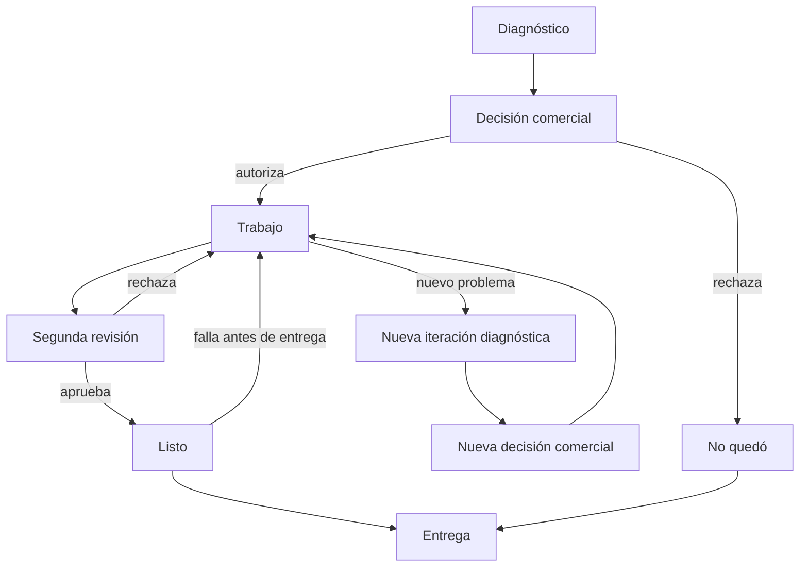

# Ciclo de vida integrado de la Orden de Servicio

## Alcance

Este ciclo integra los hitos validados sin imponer un catálogo definitivo de estados. Las etapas son agrupaciones conceptuales y no pantallas ni transacciones.

## Recorrido principal

| Etapa | Actor dominante | Entrada | Resultado | Clasificación |
|---|---|---|---|---|
| 1. Consulta previa | atención/cliente | necesidad del cliente | deja o no deja el equipo | HOV de Current State; fuera de custodia |
| 2. Recepción mínima | recepción | decisión de dejarlo | datos mínimos y contexto listos | DDV/HOV |
| 3. Creación e identificación | recepción/sistema | mínimos satisfechos | orden + custodia + folio físico | DDV |
| 4. Pendiente/toma técnica | taller/técnico | equipo identificado | contexto abierto y evaluación iniciada | HOV |
| 5. Diagnóstico | técnico | equipo disponible | conclusión y recomendaciones | DDV/HOV |
| 6. Decisión comercial | recepción/cliente | recomendación | cotización y decisiones por concepto | DDV/HOV |
| 7. Ejecución | técnico | trabajo autorizado | trabajo terminado o nuevo hallazgo | DDV/HOV |
| 8. Segunda revisión | revisor | trabajo vigente terminado | aprobado o rechazado | DDV/RCA |
| 9. Disponibilidad | recepción | QC aprobado o resultado No quedó | Listo/No quedó bajo custodia | DDV/HOV |
| 10. Entrega | recepción/receptor | equipo, legitimación y cobro | entrega válida y fin de custodia | DDV/HOV |

## Bucles válidos

- **DDV:** puede haber múltiples iteraciones diagnósticas en la misma orden.
- **DDV:** un nuevo hallazgo después de autorización requiere nueva conclusión/recomendación y decisión cuando cambia el alcance.
- **HOV:** QC rechazado devuelve a Taller; Listo puede volver a Taller si falla antes de entregar.
- **DDV:** ningún bucle borra las versiones o resultados previos.

## Salidas posibles del diagnóstico

| Resultado | Continuación típica | Clasificación |
|---|---|---|
| Quedó únicamente con servicio | trabajo documentado → QC | DDV/HOV |
| Requiere una o más piezas | recomendación → cotización/autorización | DDV |
| Requiere trabajo especializado | decisión comercial y ruta externa pendiente | DDV/PA |
| Reparación no recomendable | comunicación y decisión de devolución | DDV |
| Irreparable | comunicación, No quedó y entrega | DDV |
| Diagnóstico no concluyente | iteración, especialista o devolución según decisión | DDV/PA |

## Precondiciones relevantes

| Transición | Precondición mínima | Inconsistencia a evitar |
|---|---|---|
| Crear orden | mínimos y contexto válidos | custodia sin orden o orden parcial |
| Tomar equipo | orden/custodia/identificación vigentes | equipo sin correlación física |
| Cotizar | recomendación o alcance comercial explícito | precio tratado como diagnóstico |
| Iniciar trabajo | autorización vigente o excepción válida | trabajo no autorizado |
| Solicitar QC | trabajo vigente terminado | revisar una versión obsoleta |
| Marcar Listo | QC aplicable aprobado | Listo con rechazo vigente |
| Entregar | custodia activa, receptor y cobro/excepción válidos | doble entrega o salida sin legitimación |

**Clasificación:** DDV para reglas validadas; PM para la forma de evaluar precondiciones.

## Después de la entrega

**DDV:** la entrega termina el ciclo de custodia. Un regreso posterior inicia nueva orden. **PA:** la relación de garantía o posventa con la orden anterior requiere discovery y no autoriza reutilizar la misma identidad de orden.
