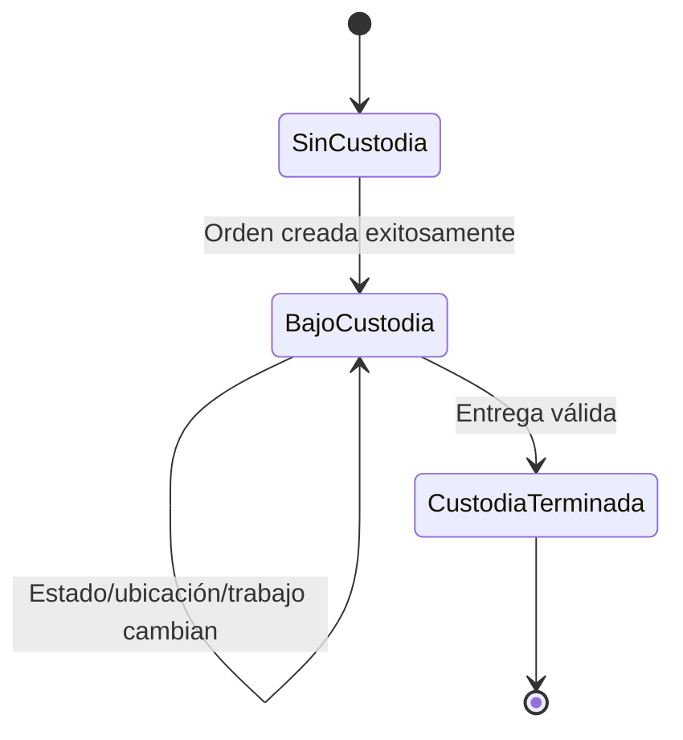

# Estados, ubicaciones, custodia y responsabilidad

## Separación obligatoria

**DDV:** estado de negocio, ubicación física, condición de custodia, asignación técnica y responsabilidad actual son dimensiones distintas. Ninguna debe inferirse automáticamente de otra.

| Dimensión | Ejemplo | Fuente de verdad conceptual candidata | Cambio independiente |
|---|---|---|---|
| Estado | Pendiente, Listo, No quedó | transición de negocio atribuible | Sí |
| Ubicación | Pendientes, Taller, caja de listos | movimiento físico registrado | Sí |
| Custodia | activa/terminada | creación exitosa/entrega válida | Sí, con reglas estrictas |
| Asignación | técnico A asignado | historial de asignaciones | Sí |
| Responsabilidad | recepción debe llamar | workflow/siguiente acción | Sí |

**Clasificación:** DDV para la separación; PM para las fuentes candidatas.

## Estados conocidos y candidatos

| Estado o término | Tipo | Significado | Madurez |
|---|---|---|---|
| Pendiente | Estado legacy usado | orden disponible o pendiente de toma | HOV; significado exacto a cerrar |
| En espera de refacción | Estado legacy usado | trabajo detenido por pieza | HOV; precondiciones abiertas |
| En espera de anticipo | Estado legacy usado | operación espera movimiento financiero | HOV; no ubicación |
| En espera de autorización | Estado legacy usado | espera decisión comercial | HOV; no ubicación |
| Listo | Estado validado de negocio | equipo habilitado para entrega tras QC aplicable | HOV/DDV; custodia continúa |
| No quedó | Estado validado de negocio | resultado no resuelto bajo alcance actual | HOV/DDV; custodia continúa |
| En diagnóstico | Estado candidato | evaluación técnica activa | PM |
| En reparación | Estado candidato | trabajo autorizado en ejecución | PM |
| En segunda revisión | Estado candidato | QC pendiente/activo | PM |
| Entregado | Hito/salida | entrega válida y fin de custodia | DDV; no ubicación interna ordinaria |

## Ubicaciones físicas candidatas

| Ubicación | Propósito | Clasificación | Pregunta |
|---|---|---|---|
| Recepción | punto de ingreso o atención | HOV/PM | ¿es ubicación de resguardo o sólo punto de interacción? |
| Pendientes | cola/área previa a toma técnica | HOV/RCA | nombre configurable por sucursal |
| Taller | área de diagnóstico y ejecución | HOV/RCA | subáreas y control de acceso |
| Segunda revisión | área de QC | HOV/RCA | si existe físicamente separada en todas las sucursales |
| Caja de listos | resguardo de equipos Listos | HOV/RCA | capacidad, orden y seguridad |
| Punto de entrega | verificación y salida | PM | relación con recepción/caja |
| Proveedor externo | ubicación fuera del taller | PA | cadena de custodia y responsabilidad |
| En traslado | condición/movimiento entre lugares | PA | no necesariamente ubicación estable |

**PC:** cada sucursal puede tener un catálogo de ubicaciones permitido. **DDV:** “En espera de autorización” no es ubicación y “Caja de listos” no es estado.

## Custodia

- **DDV:** antes de crear la orden exitosamente no hay custodia formal aceptada.
- **DDV:** Listo, No quedó, espera de autorización y espera de pieza permanecen bajo custodia.
- **DDV:** entrega válida termina custodia y representa salida física.
- **PA:** salidas temporales, proveedores externos y transferencias requieren una extensión explícita del modelo.

## Responsabilidad y asignación

| Situación | Responsable típico | Asignación técnica | Clasificación |
|---|---|---|---|
| Recepción incompleta | recepción | ninguna | HOV/PM |
| Pendiente de diagnóstico | operación/taller | puede no existir | HOV |
| Diagnóstico activo | técnico participante | activa | HOV/DDV |
| Espera de autorización | recepción/comercial | puede conservarse o pausarse | HOV/PA |
| Trabajo autorizado | técnico/taller | activa o por asignar | HOV/PM |
| Segunda revisión | revisor/recepción en Avicell | técnico no necesariamente responsable actual | RCA |
| Listo y notificación pendiente | recepción/atención | finalizada | HOV/PM |
| Entrega | recepción/actor autorizado | ninguna | HOV/DDV |

## Divergencias detectables

**PM:** el modelo debería hacer visibles, al menos, estas inconsistencias:

- Listo con QC rechazado vigente;
- ubicación Taller con responsabilidad de entrega sin movimiento registrado;
- custodia activa después de una entrega válida;
- custodia terminada con movimiento interno posterior;
- técnico resumen sin participación histórica;
- ubicación desconocida o desactualizada;
- cambio de estado sin causa o actor;
- movimiento físico sin orden/custodia vigente.
