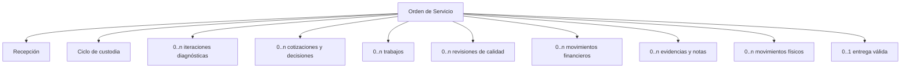

# Modelo conceptual de la Orden de Servicio

## Definición

**DDV:** la Orden de Servicio es la identidad estable de un ciclo de atención y custodia sobre un equipo recibido. Coordina hechos ocurridos durante ese ciclo sin apropiarse necesariamente de todos sus detalles internos.

## Identidad y duración

| Aspecto | Definición | Clasificación |
|---|---|---|
| Inicio | creación exitosa con mínimos universales y contexto generado | DDV |
| Identidad legible | folio dentro de un alcance explícito | DDV; PM en su estrategia de unicidad |
| Identidad conceptual | permanece aunque se reimprima etiqueta, cambie estado o participen varios técnicos | DDV |
| Fin de custodia | entrega válida | DDV |
| Cierre administrativo | puede requerir hitos adicionales; no está definido | PA |
| Reingreso posterior | nueva Orden de Servicio para un nuevo ciclo | DDV |

## Composición conceptual

**PM:** las cardinalidades expresan posibilidad conceptual, no esquema. La entrega válida es única; los intentos fallidos o correcciones se conservan como historia separada.

## Lo que la orden es y no es

| Es | No es | Clasificación |
|---|---|---|
| correlación de un ciclo | ficha permanente del dispositivo | DDV |
| marco de custodia | una sola reparación | DDV |
| contenedor conceptual de múltiples iteraciones | diagnóstico sobrescribible | DDV |
| referencia para decisiones y pagos | cotización o factura | DDV |
| fuente de hitos coordinados | agregado monolítico obligatorio | PM |
| contexto para historial | fila mutable que representa todos los hechos | RCL / PM |

## Información mínima universal

**DDV:** nombre del cliente operativo y problema reportado son obligatorios. Nombre y apellido son conceptos separados; el nombre es universalmente obligatorio y el apellido permanece configurable o pendiente.

**DDV:** tenant, sucursal, usuario receptor, fecha, hora y folio son contexto generado por el sistema. **PC:** contacto, marca, modelo, IMEI/serie, color y rasgos pueden depender de política de recepción, sin invalidar la identidad del ciclo.

## Relaciones temporales

| Relación | Regla | Clasificación |
|---|---|---|
| Recepción → custodia | nacen con la creación exitosa | DDV |
| Recepción → evidencia fotográfica | la evidencia puede agregarse después | HOV / DDV |
| Diagnóstico → recomendación | la conclusión sustenta recomendaciones, pero no las sustituye | DDV |
| Recomendación → cotización | recepción/comercial transforma necesidad en propuesta | HOV / DDV |
| Autorización → ejecución | sólo habilita alcance concreto | DDV |
| Trabajo → QC | trabajo terminado se somete a segunda revisión | HOV / RCA |
| QC → Listo | aprobación habilita, no termina custodia | DDV / HOV |
| Entrega → custodia | la entrega válida termina custodia | DDV |

## Historial e identidad

- **DDV:** las iteraciones diagnósticas, recomendaciones y decisiones anteriores no se borran ni sobrescriben.
- **DDV:** la participación de varios técnicos se conserva aunque exista un “técnico principal” derivado.
- **DDV:** correcciones financieras no eliminan el movimiento original.
- **PM:** los resúmenes actuales son proyecciones calculadas desde hechos atribuibles.
- **RCL:** `estado`, `técnico`, `presupuesto` y `entregado` como campos mutables son insuficientes para demostrar el ciclo.

## Preguntas de frontera

- **PA:** ¿qué hito cierra administrativamente una orden después de terminar custodia?
- **PA:** ¿cómo se representa una salida temporal o trabajo con proveedor externo?
- **PA:** ¿qué relación mantiene una garantía con órdenes anteriores?
- **PA:** ¿qué acciones excepcionales permiten trabajo sin autorización explícita?
- **PA:** ¿qué catálogo de estados describe la orden sin duplicar ubicación, custodia o responsabilidad?
