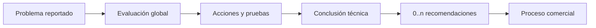

# Modelo técnico integrado

## Propósito del diagnóstico

**DDV:** el diagnóstico produce una conclusión técnica suficiente para orientar la operación. No exige registrar cada prueba individual como hallazgo estructurado y no determina el precio.

## Flujo conceptual de una iteración

**DDV:** el técnico revisa globalmente, realiza pruebas y produce información técnica. **PM:** “iteración diagnóstica” es una unidad explícita candidata para conservar múltiples ciclos.

## Acciones diagnósticas

| Acción | Significado | Regla | Clasificación |
|---|---|---|---|
| Inspección global | revisar más allá del síntoma declarado | no promete registrar cada prueba | HOV/DDV |
| Desmontaje | acceder a componentes para evaluar | requiere orden/custodia y criterio técnico | HOV |
| Limpieza por humedad | acción que puede diagnosticar y resolver | resultado debe quedar claro | HOV/DDV |
| Prueba funcional | comprobar comportamiento | puede ser actividad interna | DDV |
| Pieza temporal | probar hipótesis con un componente | no es venta, reserva ni instalación definitiva | DDV |
| Consulta/especialista | buscar certeza adicional | ruta y custodia externas abiertas | PA |

## Conclusión técnica

**DDV:** la conclusión expresa qué se determinó con la certeza disponible y puede ser no concluyente. Observaciones complementarias no deben reemplazarla. No contiene precio ni autorización.

## Recomendación técnica

**DDV:** una recomendación propone trabajo, pieza o atención técnica a partir de la conclusión. Puede contener varios componentes y distinguir necesidad de mejora en el futuro, pero no se impone todavía una prioridad obligatoria que agregue fricción.

## Resultados validados

| Resultado | Significado operativo | Continuación |
|---|---|---|
| Quedó únicamente con servicio | la acción de servicio resolvió | documentar trabajo y pasar a QC |
| Requiere piezas | la reparación depende de componentes | recomendar y cotizar |
| Requiere trabajo especializado | necesita capacidad adicional | ruta comercial/externa pendiente |
| Reparación no recomendable | técnicamente posible pero no aconsejable | comunicar razones y decidir |
| Irreparable | no existe reparación viable bajo conocimiento actual | comunicar, No quedó y entregar |
| Diagnóstico no concluyente | no se alcanzó certeza suficiente | nueva evaluación, especialista o devolución |

**Clasificación de todas las filas:** DDV (DTR-DEC-037 a DTR-DEC-041 y resultado adicional validado); las continuaciones externas conservan PA.

## Iteraciones y descubrimientos posteriores

- **DDV:** una misma orden puede tener múltiples evaluaciones.
- **DDV:** un problema nuevo después de reparar pantalla puede abrir otra conclusión y recomendaciones.
- **DDV:** si cambia el alcance, se requiere otra decisión comercial antes de ejecutar.
- **DDV:** las versiones anteriores se conservan.
- **PM:** cada iteración podría enlazar observaciones, conclusión, recomendaciones, trabajo que la motivó y decisiones derivadas.

## Responsabilidades del técnico

1. **DDV:** evaluar antes de concluir.
2. **DDV:** producir información técnica suficiente y atribuible.
3. **HOV:** normalmente diagnosticar y reparar, sin asumir que siempre es la misma persona.
4. **DDV:** no conducir necesariamente la negociación principal.
5. **DDV:** respetar el alcance autorizado.
6. **DDV:** cerrar el resultado del trabajo ejecutado.

## Riesgos y preguntas

- **RCL:** diagnóstico, seguimiento y presupuesto pueden mezclarse en texto/campos mutables.
- **RCL:** una sola columna de técnico borra participación distribuida.
- **PA:** estructura mínima de una iteración sin imponer fricción.
- **PA:** tratamiento de piezas temporales respecto de inventario.
- **PA:** trabajo de bajo costo, emergencias y autorización excepcional.
- **PA:** clasificación futura de necesidad, recomendación y riesgo.
