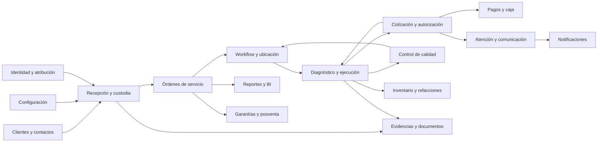

# Relaciones entre contextos

## Principio de colaboración

**PM:** cada contexto protege su lenguaje y hechos, y comparte sólo la información necesaria para completar el recorrido. Las relaciones aquí son conceptuales; no definen llamadas, eventos técnicos, colas ni dependencias de código.

## Mapa conceptual

## Contratos conceptuales de relación

| Origen | Destino | Información compartida | Regla de relación | Clasificación |
|---|---|---|---|---|
| Clientes | Recepción | cliente operativo, contacto y entregante | No inferir propiedad ni autoridad universal | DDV |
| Configuración | Recepción | requisitos vigentes por alcance | Los mínimos universales no pueden desactivarse | DDV / PC |
| Recepción | Órdenes | creación exitosa, folio y equipo recibido | Orden y custodia nacen juntas | DDV |
| Recepción | Workflow | disponibilidad inicial y ubicación | Pendientes es área/cola, no contexto ni estado universal | HOV / IDO |
| Workflow | Técnico | orden disponible, ubicación y responsabilidad | Escanear abre contexto; no cambia estado por sí solo | HOV |
| Técnico | Comercial | conclusión y recomendaciones | Necesidad técnica no fija precio | DDV |
| Comercial | Técnico | trabajo y alcance autorizados | Sólo se ejecuta lo autorizado salvo excepción pendiente | DDV / PA |
| Técnico | Inventario | pieza necesaria y trabajo previsto | Pieza de prueba no equivale a venta o consumo | DDV |
| Técnico | Calidad | trabajo vigente y resultado técnico | QC es independiente del acto de reparación | DDV |
| Calidad | Workflow | aprobación o rechazo | Aprobación habilita Listo; rechazo devuelve a Taller | HOV / RCA |
| Comercial | Pagos | obligación y conceptos autorizados | Pago no crea autorización implícita | DDV |
| Comercial | Comunicación | propuesta y decisión requerida | Comunicación no sustituye decisión estructurada | DDV |
| Órdenes | Evidencias | contexto y propósito | Evidencia complementa; no sustituye el hecho estructurado | DDV |
| Órdenes | Garantías | entrega y trabajo previo | Relación futura no implica reutilizar la misma orden | DDV / PA |
| Todos | Identidad | actor y contexto | PIN atribuye operativamente, no prueba identidad absoluta | HOV / RCA |
| Todos | Reportes | hechos y proyecciones autorizadas | Una vista derivada no es fuente de verdad | PM |

## Ownership y traducción

| Concepto compartido | Contexto propietario candidato | Uso por otros contextos | Riesgo |
|---|---|---|---|
| Identidad de la orden | Órdenes | referencia estable | Duplicar estado interno en cada contexto |
| Custodia | Recepción y Custodia | precondición de trabajo/entrega | Inferirla desde `estado` o `entregado` |
| Conclusión técnica | Técnico | insumo comercial y de QC | Convertirla en texto sobrescribible |
| Cotización y decisión | Comercial | habilitación técnica y obligación financiera | Autorizar una versión obsoleta |
| Ubicación física | Workflow | localización por operación | Confundir con estado |
| Resultado QC | Calidad | habilitación de Listo | Reducirlo a comentario |
| Movimiento financiero | Pagos | saldo y entrega | Anticipo como campo mutable |
| Evidencia | Evidencias | referencia por propósito | Creer que archivo equivale a decisión |
| Política vigente | Configuración | evaluación contextual | Aplicar configuración nueva a hechos históricos |

**Clasificación:** PM para ownership; RCL para los riesgos derivados del legado.

## Secuencias que requieren coordinación

1. **DDV:** crear orden e iniciar custodia forman un resultado indivisible para el negocio.
2. **DDV:** registrar una decisión comercial debe identificar concepto y propuesta vigentes.
3. **HOV:** terminar trabajo, aprobar QC y marcar Listo son hitos distintos, aunque consecutivos.
4. **DDV:** completar cobro y entrega son hechos distintos; la entrega termina custodia.
5. **PM:** las demás relaciones pueden coordinarse por procesos visibles con pendientes, idempotencia conceptual y reconciliación, sin seleccionar tecnología.

## Relaciones que permanecen abiertas

- **PA:** frontera exacta entre Órdenes y Workflow.
- **PA:** si Cliente operativo y Contacto pertenecen a un contexto común o a capacidades diferentes.
- **PA:** relación entre Pagos básicos de reparación y Caja/contabilidad futura.
- **PA:** ownership de reserva y consumo de refacciones.
- **PA:** relación entre una reclamación de garantía, la orden original y una nueva orden de custodia.
- **PA:** si Evidencias y Notificaciones justifican contextos propios en el MVP.
