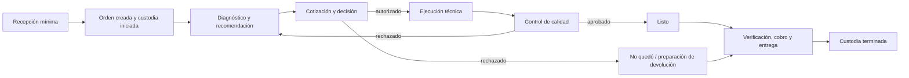

# Visión integrada del dominio de reparaciones

## Tesis central

**DDV:** una Orden de Servicio representa un único ciclo de servicio y custodia de un equipo, desde su creación exitosa hasta su entrega válida. Puede contener múltiples evaluaciones, recomendaciones, cotizaciones, decisiones, trabajos, revisiones y movimientos financieros sin cambiar de identidad.

**DDV:** si el mismo dispositivo regresa después de entregado, inicia otra orden y otro ciclo. La orden no es el dispositivo y una reparación individual no es la orden completa.

## Resultado de negocio buscado

| Resultado | Clasificación | Significado integrado |
|---|---|---|
| Custodia demostrable | DDV | Conocer desde cuándo, hasta cuándo y bajo qué orden el taller responde físicamente por el equipo. |
| Decisión comercial explicable | DDV | Relacionar propuesta, concepto, versión, decisor y autorización o rechazo. |
| Trabajo técnicamente trazable | DDV | Distinguir problema reportado, conclusión, recomendación y ejecución sin sobrescribir historia. |
| Operación observable | DDV | Separar estado, ubicación, custodia, asignación y responsabilidad actual. |
| Calidad antes de disponibilidad | HOV / RCA | En Avicell, la segunda revisión filtra el resultado antes de marcar Listo. Su política exacta puede variar. |
| Entrega segura | DDV | Terminar custodia sólo mediante una entrega válida y atribuible. |
| Evolución multi-tenant | PC / PM | Permitir políticas por tenant o sucursal sin debilitar invariantes universales. |

## Recorrido conceptual

**HOV:** el diagrama resume el flujo validado de Avicell. **PM:** no fija estados técnicos, automatizaciones ni transacciones.

## Cinco dimensiones que no deben confundirse

| Dimensión | Pregunta que responde | Clasificación |
|---|---|---|
| Estado de negocio | ¿En qué fase o condición operativa está la orden? | DDV |
| Ubicación física | ¿Dónde está físicamente el equipo? | DDV |
| Custodia | ¿El taller conserva responsabilidad física aceptada? | DDV |
| Asignación técnica | ¿Quién tiene trabajo técnico encargado? | DDV |
| Responsabilidad actual | ¿Qué actor o área debe ejecutar la siguiente acción? | PM basada en HOV |

Un cambio en una dimensión no demuestra un cambio en las demás. Un equipo puede estar Listo, en caja de listos, bajo custodia y sin técnico activo al mismo tiempo.

## Fronteras conceptuales esenciales

- **DDV:** problema reportado no equivale a conclusión técnica.
- **DDV:** conclusión técnica no equivale a recomendación técnica.
- **DDV:** recomendación técnica no equivale a cotización.
- **DDV:** cotización no equivale a autorización.
- **DDV:** autorización no equivale a pago.
- **DDV:** pago no equivale a entrega.
- **DDV:** Listo y No quedó no terminan la custodia.
- **DDV:** nota narrativa no sustituye un hecho estructurado de autorización, pago, control de calidad o entrega.

## Núcleo, soporte y capacidades posteriores

| Horizonte | Capacidades | Clasificación |
|---|---|---|
| Núcleo MVP de reparaciones | Orden, recepción/custodia, diagnóstico, comercial, workflow/ubicación, QC, comunicación mínima, pagos básicos, clientes/contactos, identidad/atribución, configuración mínima y evidencia | PM sustentada por DDV |
| Soporte cercano | Inventario/refacciones, notificaciones robustas y reportes operativos | PM; dependencia parcial del MVP |
| Posterior o por descubrir | Garantías/posventa, BI avanzado, caja y contabilidad completas, proveedores externos y operación multisucursal compleja | PA / PM |

## Principios de evolución

1. **DDV:** preservar hechos anteriores; corregir mediante una acción trazable, no borrado silencioso.
2. **DDV:** mantener atribuibles actor, momento, tenant, sucursal y contexto de acciones relevantes.
3. **PC:** separar invariantes universales de reglas configurables.
4. **RCA:** no convertir prácticas de Avicell en reglas universales sin decisión explícita.
5. **PM:** favorecer límites conceptuales pequeños y colaboración explícita en vez de una Orden monolítica.
6. **PM:** usar proyecciones para lectura, sin confundirlas con fuente de verdad.
7. **PA:** resolver catálogo de estados, excepciones, garantías, inventario y finanzas antes de cerrar arquitectura.

## Nivel de confianza

La identidad y custodia de la orden, la separación técnica/comercial, la trazabilidad de participantes, la segunda revisión y la entrega tienen confianza alta dentro del alcance validado. Los límites de agregados, contextos, transacciones, proyecciones y consistencia son propuestas con confianza media. Garantías, inventario, impuestos, crédito, proveedores externos y operación multisucursal conservan confianza baja o preguntas abiertas.
