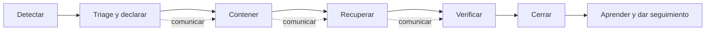

# Gestión de incidentes

## Estado del documento

- **Estado:** Propuesta
- **Alcance:** Incidentes operativos, de datos, seguridad, disponibilidad e integraciones.
- **Decisión pendiente:** Niveles de severidad, canales, guardias, responsables, tiempos de comunicación y obligaciones regulatorias.

## Objetivo

Reducir impacto mediante detección, coordinación, contención, recuperación y aprendizaje, protegiendo evidencia y evitando acciones improvisadas que agraven una exposición entre tenants o pérdida de datos.

## Qué es un incidente

Evento que afecta o amenaza de forma material confidencialidad, integridad, disponibilidad u operación de la plataforma. Ejemplos:

- acceso o posible acceso entre tenants;
- bypass de permisos, PIN o revocación;
- pérdida, corrupción o duplicación relevante de datos;
- indisponibilidad o degradación de flujos críticos;
- mensajes, pagos, jobs o webhooks incorrectos/repetidos;
- compromiso de credenciales, backups o integración;
- despliegue/migración con impacto activo.

Un bug sin impacto activo puede seguir el backlog. Si el impacto está ocurriendo o requiere coordinación urgente, se gestiona como incidente y se vincula al bug.

## Severidad

La escala definitiva y sus tiempos son `TBD`. El triage debe considerar:

- tenants, sucursales y usuarios afectados o potenciales;
- confidencialidad, integridad y disponibilidad;
- sensibilidad de datos y posibilidad de abuso;
- flujo operativo afectado y existencia de workaround seguro;
- duración, crecimiento y detectabilidad;
- obligaciones contractuales/legales pendientes de identificar.

Una sospecha creíble de exposición cruzada se trata inicialmente con alta precaución hasta delimitarla; no se minimiza por falta de confirmación inmediata.

## Roles propuestos

| Rol | Responsabilidad |
|---|---|
| Incident Commander | Coordinar, priorizar y mantener panorama; no ejecutar todo. |
| Operations/Technical Lead | Diagnóstico, contención y recuperación técnica. |
| Security Lead | Alcance, evidencia y respuesta ante confidencialidad/abuso. |
| Communications Lead | Actualizaciones internas/externas coherentes y aprobadas. |
| Scribe | Timeline, decisiones, hipótesis, acciones y evidencia. |
| Product/Business | Impacto operativo, prioridad y relación con tenants. |

Una persona puede cubrir varios roles al inicio, pero la asignación debe ser explícita. Disponibilidad, escalación y autoridad quedan `TBD`.

## Ciclo de respuesta



### 1. Detectar y declarar

- Registrar hora real, fuente, síntoma, ambiente, versión y primer impacto conocido.
- Asignar identificador según convención futura, severidad provisional y commander.
- Abrir canal restringido apropiado; no pegar secretos o datos reales en canales amplios.
- Vincular alertas, traces, release y cambios recientes.

### 2. Triage

- Confirmar si el problema continúa y qué capacidades están afectadas.
- Distinguir hechos, hipótesis y preguntas.
- Delimitar tenants/sucursales sin consultar datos ajenos informalmente.
- Priorizar seguridad de personas/datos e integridad sobre explicación perfecta.
- Definir siguiente actualización; cadencia exacta TBD.

### 3. Contener

Opciones según riesgo: detener promoción, deshabilitar una ruta/integración, revocar credenciales/sesiones, pausar jobs, limitar tráfico o aislar un tenant. Cada acción debe registrar autoridad, alcance, posible daño secundario y forma de revertir.

No ejecutar consultas globales, borrados, replay masivo o restore sin runbook y validación correspondiente.

### 4. Recuperar

- Elegir rollback, roll-forward, restore o reconciliación de manera explícita.
- Usar artefactos versionados y procedimientos ensayados.
- Validar migraciones, datos, jobs, realtime e integraciones.
- Escalar a proveedor cuando corresponda, conservando timeline propio.

### 5. Verificar

- Confirmar recorridos críticos y señales de salud.
- Verificar por tenant y sucursal afectada sin exponer otros datos.
- Asegurar que contenciones temporales no dejen acceso excesivo.
- Mantener observación durante periodo TBD.
- Obtener confirmación operativa/producto cuando aplique.

### 6. Cerrar y aprender

El incidente se cierra cuando el impacto activo terminó, salud es estable, comunicaciones están actualizadas y acciones urgentes tienen owner. El análisis posterior incluye:

- impacto real y detección;
- timeline basado en evidencia;
- factores técnicos y organizacionales, no una única “culpa”;
- controles que funcionaron/fallaron;
- causa confirmada versus hipótesis pendiente;
- acciones priorizadas con evidencia de cierre;
- actualización de pruebas, alertas, documentación y runbooks.

## Registro de incidente

| Campo | Valor |
|---|---|
| ID | TBD según convención futura |
| Estado | Investigating / Identified / Monitoring / Resolved / Closed |
| Severidad provisional/final | TBD |
| Inicio/detección/resolución | Timestamps reales TBD |
| Ambientes/versiones | TBD |
| Capacidades y tenants afectados | TBD; usar alcance seguro |
| Commander y roles | TBD |
| Síntomas/impacto | TBD |
| Release/changes relacionados | TBD |
| Canal y evidencia restringida | TBD |
| Próxima actualización | TBD |

## Comunicación

- Separar actualizaciones internas, de clientes y regulatorias.
- Comunicar hechos confirmados, impacto conocido, mitigación y próxima actualización.
- No especular sobre causa ni afirmar seguridad antes de verificar.
- No revelar datos de otro tenant, detalles explotables o información personal.
- Plantillas, status page, autoridad y tiempos son decisiones pendientes.

### Actualización breve

```text
Estado: TBD
Impacto confirmado: TBD
Inicio/detección: TBD
Acciones en curso: TBD
Workaround seguro: TBD / No disponible
Próxima actualización: TBD
```

## Incidente multitenant o de seguridad

- Restringir canal y acceso a evidencia.
- Preservar logs, artefactos y configuración antes de alterar cuando sea seguro.
- Revocar/aislar con mínimo impacto posible.
- No contactar a tenants ni asumir alcance sin coordinación y obligaciones revisadas.
- Identificar todos los caminos equivalentes, no sólo endpoint inicial.
- Crear pruebas de regresión para API, repositorio y superficies asincrónicas afectadas.
- Evaluar credenciales, backups, caches, URLs de archivos y sockets relacionados.

## Acceso de emergencia

El mecanismo `break-glass` aún no está diseñado. Antes de production deberá incluir:

- autenticación reforzada y razón obligatoria;
- alcance y tiempo limitados;
- registro inmutable y alerta;
- revisión posterior y revocación;
- prohibición de credenciales compartidas permanentes.

## Métricas candidatas

- tiempo hasta detección, declaración, contención y recuperación;
- recurrencia y acciones vencidas;
- porcentaje detectado por observabilidad versus reporte externo;
- exactitud de severidad/alcance inicial;
- impacto y duración por capacidad.

No se fijan metas numéricas todavía.

## Preguntas abiertas

- ¿Quién cubre guardia y quién tiene autoridad de declarar/cerrar?
- ¿Qué niveles, tiempos y canales se aprobarán?
- ¿Qué status page y canales de clientes existirán?
- ¿Qué obligaciones de notificación aplican por mercado y tipo de dato?
- ¿Cómo funcionará break-glass y dónde se preservará evidencia?
- ¿Qué plazo y formato tendrá el análisis posterior?

## Próxima revisión

- **Fecha:** TBD.
- **Disparador:** definición de equipo operativo/seguridad o antes de habilitar production.
- **Documentos relacionados:** [Rollback Policy](./ROLLBACK_POLICY.md), [Backup and Recovery](./BACKUP_AND_RECOVERY.md), [Security Testing](../quality/SECURITY_TESTING.md), [Runbook Template](./RUNBOOK_TEMPLATE.md).
