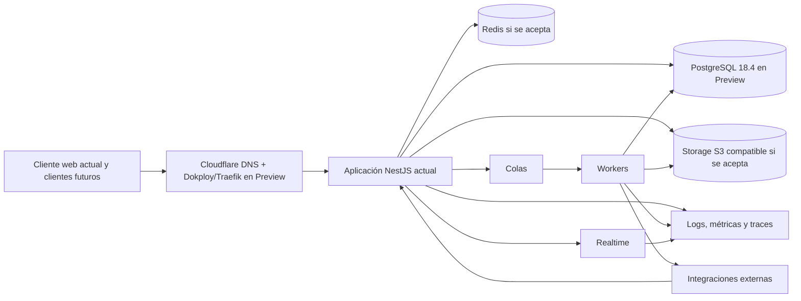

# Panorama de operaciones

## Estado del documento

- **Estado:** Contrato operativo parcial; Preview existe y Staging/Production permanecen planificados.
- **Alcance:** Operación actual de Preview y preparación operativa de los ambientes futuros de SR Taller 2.0.
- **Hecho conocido:** Preview ejecuta una aplicación NestJS/React-Vite y PostgreSQL 18.4 en Dokploy; workers, Redis, storage S3-compatible, realtime e integraciones no están materializados.
- **Decisión pendiente:** Topología y gates de Staging/Production, objetivos de servicio, guardias, herramientas y responsables.

## Objetivo

Definir cómo operar la baseline existente y cómo evolucionarla de forma segura,
observable, repetible y recuperable, sin presentar infraestructura planificada
como si ya existiera. El workflow end-to-end canónico está en
[Development and Delivery Workflow](../delivery/DEVELOPMENT_AND_DELIVERY_WORKFLOW.md).

## Principios operativos

- Automatizar cambios repetibles y conservar auditoría.
- Separar ambientes, credenciales, datos y telemetría.
- Identificar versión y digest exactos de cada desplegable.
- Incluir contexto de tenant en señales sin registrar contenido sensible.
- Detectar fallos por impacto en usuarios, no sólo por salud de procesos.
- Diseñar backup, restore y rollback antes de depender del sistema.
- Ejecutar acciones privilegiadas con mínimo acceso, doble validación según riesgo y evidencia.
- Convertir incidentes en mejoras trazables sin buscar culpables.
- No realizar despliegues manuales por FTP.

## Mapa operativo

El diagrama mezcla la ruta actual de Preview con responsabilidades previstas.
La aplicación, su UI, el routing y PostgreSQL existen en Preview. Redis,
storage, realtime, colas, workers e integraciones son planificados y requieren
decisiones propias antes de materializarse.

## Catálogo de servicios

La aplicación `srtaller-app` y PostgreSQL `srtaller-postgres` constituyen el
catálogo mínimo actual de Preview. Antes de Production, cada componente deberá
tener además una ficha completa:

Antes de producción, cada componente debe tener una ficha:

| Campo | Ejemplo conceptual |
|---|---|
| Servicio/desplegable | API / worker / web / realtime TBD |
| Propósito y capacidades | TBD |
| Owner técnico y operativo | TBD |
| Dependencias aguas arriba/abajo | TBD |
| Datos y clasificación | TBD |
| Tenancy y alcance de sucursal | TBD |
| Health/readiness | TBD |
| Logs, métricas, traces y alertas | TBD |
| SLO/SLI y soporte | TBD |
| Runbooks, backup y rollback | TBD |
| Versión/digest por ambiente | TBD |

## Ambientes

Se opera [Local y Preview; Staging y Production están planificados](../delivery/ENVIRONMENTS.md):

- local no es staging;
- Preview usa su propia base y credenciales; cada ambiente futuro deberá usar
  las suyas;
- staging no usa datos reales salvo proceso controlado y sanitizado;
- el artefacto probado se promueve sin rebuild;
- production requiere acceso mínimo y auditado.

Preview existe actualmente en `https://preview.srtaller.dev`. Disaster
recovery y soporte especializado permanecen como decisiones futuras.

## Observabilidad operativa

### Señales

- **Disponibilidad:** éxito por endpoint/flujo, conexiones realtime y procesamiento de jobs.
- **Latencia:** por operación, dependencia y percentiles/objetivos TBD.
- **Errores:** clasificación, tasa, códigos y fallos por integración.
- **Saturación:** CPU, memoria, conexiones DB, lag/cola, storage y límites de terceros.
- **Integridad:** duplicados, jobs fallidos, reconciliación y migraciones.
- **Tenant:** distribución y outliers mediante IDs no sensibles, evitando alta cardinalidad incontrolada.

### Contexto mínimo

Logs/traces deberían correlacionar request/event/job, servicio, versión, ambiente y tenant no sensible cuando exista. PIN, tokens, secretos, contenido de mensajes y datos personales no se registran. Retención y accesos son `TBD`.

### Alertas

Una alerta debe ser accionable, tener severidad/impacto, owner, runbook y criterio de cierre. No se fijan umbrales sin datos. Se evitarán alertas basadas sólo en infraestructura si no reflejan impacto o riesgo real.

## Operaciones recurrentes

| Operación | Control esperado |
|---|---|
| Deploy de Preview | Merge/push a `main`, deployment manual en Dokploy y verificación remota conforme al [workflow canónico](../delivery/DEVELOPMENT_AND_DELIVERY_WORKFLOW.md). |
| Promoción futura | Build único, gate, digest y [Release Process](../delivery/RELEASE_PROCESS.md). |
| Migración/backfill | Plan, tenant context, idempotencia y [Migration Policy](./MIGRATION_POLICY.md). |
| Rollback | Trigger, autoridad, compatibilidad y [Rollback Policy](./ROLLBACK_POLICY.md). |
| Backup/restore | Objetivos, cifrado, prueba y [Backup and Recovery](./BACKUP_AND_RECOVERY.md). |
| Incidente | Triage, contención, comunicación y [Incident Management](./INCIDENT_MANAGEMENT.md). |
| Rotación de secretos | Inventario, mínimo privilegio, verificación y procedimiento TBD. |
| Acceso de soporte | Alcance explícito, tiempo limitado, auditoría y política TBD. |
| Reproceso de job/webhook | Contexto tenant, idempotencia, límites y evidencia. |
| Mantenimiento de tenant | No usar consultas globales informales; runbook y autorización. |

## Capacidad y escala

La arquitectura debe prepararse para 1,000 o más tenants, pero el número no define por sí solo carga. Se necesitan hipótesis por:

- usuarios/sucursales/dispositivos activos;
- requests, sockets y mensajes concurrentes;
- inventario, reparaciones, archivos y retención;
- jobs, webhooks y picos por campañas/canales;
- tenants grandes versus cola larga de pequeños;
- regiones, latencia y crecimiento.

Se establecerán baselines, pruebas y alertas después de confirmar escenarios. No se inventan límites ni sizing.

## Continuidad y recuperación

- Identificar fuentes de verdad y dependencias reconstruibles.
- Definir RPO/RTO por capacidad antes de producción.
- Probar restauraciones, no sólo creación de backups.
- Mantener runbooks accesibles aun cuando el servicio principal falle.
- Realizar ejercicios de incidentes y recuperación con frecuencia TBD.
- Distinguir rollback de despliegue, roll-forward y restore de datos.

## Seguridad operativa

- Mínimo privilegio y credenciales separadas por ambiente/servicio.
- Autenticación reforzada para acciones sensibles, método TBD.
- Acceso de emergencia temporal, auditado y revisado.
- Secretos fuera del repositorio, imágenes, logs y evidencia QA.
- Cambios y acciones globales con alcance, preview/dry-run, confirmación y registro.
- Respuesta coordinada a sospecha de acceso cruzado entre tenants.

## Preparación para producción

- [ ] Catálogo y ownership de servicios completos.
- [ ] SLI/SLO y soporte aprobados.
- [ ] Dashboards, alertas y runbooks validados en staging.
- [ ] Backup y restore probados con evidencia.
- [ ] Release, migración y rollback ensayados.
- [ ] Gestión de incidentes y canales definidos.
- [ ] Accesos, secretos, rotación y break-glass revisados.
- [ ] Capacidad y límites de dependencias evaluados.
- [ ] Aislamiento multitenant observado en API, jobs, caché, realtime y archivos.
- [ ] Riesgos residuales y aprobaciones registrados.

## Preguntas abiertas

- ¿Quién operará la plataforma y qué cobertura/guardia existirá?
- ¿Qué SLO y niveles de soporte ofrecerán los planes?
- ¿Qué proveedor, regiones y herramientas se usarán?
- ¿Qué acciones globales de plataforma serán necesarias y cómo se aprobarán?
- ¿Cómo se observarán outliers por tenant sin exponer datos ni generar cardinalidad excesiva?
- ¿Qué dependencias requieren plan de degradación o reconciliación?
- ¿Qué ejercicios de recuperación e incidentes serán obligatorios?

## Próxima revisión

- **Fecha:** TBD.
- **Disparador:** cambio operativo de Preview, materialización de Staging o antes de crear Production.
- **Documentos relacionados:** [Observability Strategy](../architecture/OBSERVABILITY_STRATEGY.md), [Security Baseline](../architecture/SECURITY_BASELINE.md), [Runbook Template](./RUNBOOK_TEMPLATE.md).
