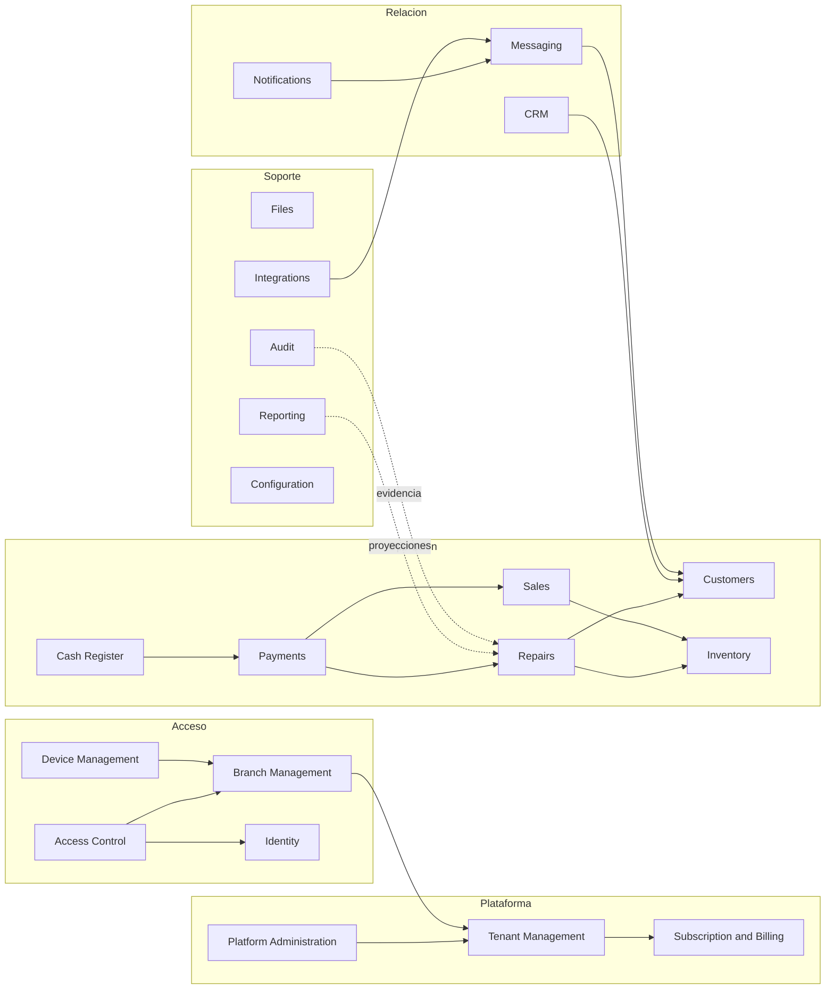

# Mapa preliminar de módulos

## Estado del documento

- **Estado:** Borrador inicial.
- **Naturaleza:** Propuesta conceptual de límites y ownership; no es diseño de tablas, paquetes, endpoints ni despliegues.
- **Aprobación:** mapa general pendiente; la frontera Catalog/Pricing está
  aceptada específicamente en `PRICE_LIST_ARCHITECTURE` y prevalece para ese
  alcance.
- **Arquitectura de referencia:** Monolito modular orientado al dominio, aceptado en ADR-002; cada módulo no equivale a un microservicio ni a un desplegable.

## Convenciones

- **Datos propios** significa fuente autoritativa conceptual. No define almacenamiento físico ni impide proyecciones de lectura.
- **Eventos posibles** son ejemplos para descubrir colaboración entre módulos; no son contratos aceptados ni garantizan mensajería distribuida.
- **Dependencias permitidas** indica colaboración deseada mediante contratos explícitos; no autoriza acceso directo a persistencia ajena.
- Los módulos operativos reciben contexto ADR-010/011/014. Los casos de
  Tenant Administration usan el contexto separado propuesto por ADR-015.
  Ambos exigen capacidades/alcance ADR-012 y clasifican acciones sensibles
  conforme a ADR-013; no se modelan como un contexto parcialmente vacío.
- Identity, Access Control, Audit, Files, Notifications e Integrations pueden ser capacidades transversales sin convertirse en dependencias indiscriminadas del dominio.

## Límites generales propuestos

El diagrama muestra relaciones candidatas, no direcciones finales de dependencias ni llamadas síncronas obligatorias.

### Semántica de dependencias y colaboraciones

“Dependencias permitidas” identifica colaboraciones mediante contratos públicos, eventos o proyecciones; no autoriza imports recíprocos, acceso a tablas ajenas ni una dependencia de código en ambas direcciones. Cuando dos módulos participan en un mismo flujo, el productor publica un hecho o contrato y el consumidor depende de ese contrato; una capa de aplicación puede orquestar el caso. Cualquier colaboración recíproca aparente debe resolverse así y revisarse para mantener el grafo de módulos acíclico.

## Platform Administration

- **Responsabilidad principal — propuesta:** ofrecer funciones globales para operar la plataforma, gobernar acciones administrativas y coordinar soporte sin asumir acceso rutinario a datos del tenant.
- **Datos propios — propuesta:** identidades o asignaciones administrativas de plataforma, solicitudes de intervención, estados operativos globales y evidencia de acciones globales. La configuración global podría pertenecer a Configuration; el límite está abierto.
- **Eventos posibles:** administración de plataforma autorizada o revocada, intervención iniciada/finalizada, acción global ejecutada.
- **Dependencias permitidas:** Tenant Management para ciclo de vida; Subscription and Billing para consulta comercial; Identity y Access Control para autenticación/autorización; Audit para evidencia. Debe usar contratos públicos de módulos de tenant.
- **Preguntas abiertas:** acciones permitidas, separación de funciones y acceso excepcional a tenants. Véanse [QUESTION-005](./OPEN_QUESTIONS.md#question-005) y [QUESTION-029](./OPEN_QUESTIONS.md#question-029).

## Tenant Management

- **Responsabilidad principal — propuesta:** administrar identidad, estado y ciclo de vida del tenant como límite organizacional de la plataforma.
- **Datos propios — dirección MVP:** tenant, nombre del taller, estado
  `ONBOARDING`/`ACTIVE`, moneda operativa Tenant aceptada para Price List y
  metadatos de bootstrap/activación. Suspensión comercial, cierre y eliminación
  están fuera del MVP. El Registration Attempt pre-tenant pertenece al borde
  público de onboarding, no al Tenant ya creado.
- **Eventos posibles MVP:** tenant bootstrap completed, tenant activado.
- **Dependencias permitidas:** Configuration para valores del tenant y Audit para trazabilidad. Publica su ciclo de vida para Subscription and Billing; no lo consulta directamente para decidir elegibilidad comercial. Identity y Access Control participan en el alta inicial mediante contratos, sin fusionar ownership.
- **Decisión vigente:** bootstrap atómico crea Tenant `ONBOARDING`, primer
  Tenant User y starter Tenant Admin authority; una primera Branch válida y
  Admin efectivo activan el Tenant. Véase el
  [contrato Tenant Lifecycle MVP](../architecture/TENANT_LIFECYCLE_MVP.md).
- **Preguntas abiertas:** semántica post-MVP de suspensión/cierre/exportación/
  eliminación y decisiones `TLD-001–009`; QUESTION-005 está cerrada para MVP.

## Subscription and Billing

- **Responsabilidad principal — propuesta:** gestionar planes de plataforma, suscripción de cada tenant y relación con cobro/facturación SaaS.
- **Datos propios — propuesta:** catálogo de planes, entitlements comerciales, suscripción, periodos, estado de facturación y referencias del proveedor. Precio, impuestos e invoices dependen del modelo comercial por validar.
- **Eventos posibles:** plan publicado/cambiado, suscripción iniciada/renovada/suspendida/cancelada, cobro SaaS confirmado o fallido.
- **Dependencias permitidas:** Tenant Management; Integrations para proveedor de cobro; Notifications para avisos. No debe usar Payments ni Cash Register para cobros de suscripción salvo una decisión explícita.
- **Preguntas abiertas:** planes, trial, gracia, medición, cambio de plan, países y proveedor. Véanse [QUESTION-023](./OPEN_QUESTIONS.md#question-023) y [QUESTION-024](./OPEN_QUESTIONS.md#question-024).

## Branch Management

- **Responsabilidad principal — propuesta:** administrar sucursales de un tenant y su ciclo de vida operativo.
- **Datos propios — dirección Branch V1:** sucursal tenant-scoped, nombre,
  timezone IANA, estado `ACTIVE`/`INACTIVE`, versión y timestamps. Dirección,
  teléfono, horarios, geocoding y jerarquías permanecen fuera de V1. El usuario
  no pertenece permanentemente a una sucursal; Device Management gobierna la
  vinculación de estación.
- **Eventos posibles:** sucursal creada, actualizada, activada, desactivada o cerrada.
- **Dependencias permitidas:** Tenant Management como límite padre; Configuration para valores de sucursal; Audit. Los módulos operativos pueden referenciar sucursales válidas por identificador, no modificar sus datos.
- **Preguntas abiertas:** transferencias de negocio, cierre con operación pendiente y capacidades administrativas sobre varias sucursales. Véanse [QUESTION-006](./OPEN_QUESTIONS.md#question-006) y [QUESTION-007](./OPEN_QUESTIONS.md#question-007).

## Identity

- **Responsabilidad principal — propuesta de titularidad:** representar Tenant
  Users e identidades separadas de plataforma, y administrar credenciales/
  sesiones separadas para Tenant Administration y operación.
- **Datos propios — propuesta:** usuario con tenant único, preferencias
  personales (incluida presentación de costo, sin conceder capability),
  credencial PIN, credencial administrativa no reversible, estados de
  bloqueo/desactivación/revocación, Admin Session, Operational Session y
  metadatos de autenticación/recovery. Password/PIN y sus sesiones no se
  intercambian. No se decide aquí el algoritmo de protección, diseño físico ni
  la correlación de una persona entre tenants.
- **Eventos posibles:** identidad registrada, identificador verificado, autenticación completada/fallida, identidad bloqueada, recuperada o revocada.
- **Dependencias permitidas:** servicios técnicos de autenticación y Audit para eventos sensibles. Publica una intención de recuperación para que Notifications la consuma; Identity no depende de Notifications ni de módulos operativos.
- **Preguntas abiertas:** cardinalidad del email entre tenants, política de
  Admin Session, último Admin, recovery detallado y correlación de persona.
  Véanse `TLD-001–003` y [QUESTION-009](./OPEN_QUESTIONS.md#question-009).

## Access Control

- **Responsabilidad principal — decisión conceptual de ADR-012/013:** resolver autorización ordinaria y evaluar el control requerido para acciones sensibles dentro del contexto de ADR-010/011.
- **Datos propios — propuesta de titularidad:** roles, composición de capacidades y asignaciones vigentes tenant-wide o restringidas por sucursal. No es propietario del usuario, de la sucursal efectiva ni de permisos/denegaciones directos por usuario en R0.
- **Eventos posibles:** rol asignado/retirado/desactivado, composición de rol o alcance cambiado.
- **Dependencias permitidas:** Identity, Tenant Management y Branch Management. Todos los módulos consultan decisiones de autorización mediante un contrato común; Access Control no necesita conocer reglas internas de cada módulo más allá de recursos y acciones publicados.
- **Preguntas abiertas:** composición y clasificación concreta por rebanada, mecanismos y permisos de plataforma; los modelos se rigen por ADR-012/013. Véanse [QUESTION-004](./OPEN_QUESTIONS.md#question-004) y [QUESTION-010](./OPEN_QUESTIONS.md#question-010).

## Device Management

- **Responsabilidad principal — propuesta:** inventariar, vincular, activar,
  reconocer, desvincular y revocar estaciones y sus sesiones técnicas conforme
  a ADR-010, usando autoridad administrativa ADR-015 cuando se acepte.
- **Datos propios — propuesta:** identidad de estación, sucursal vinculada, tenant derivado, estado, evidencia de activación, última actividad y sesiones técnicas. El PIN se asocia al usuario del tenant; su ownership criptográfico/político permanece pendiente y no pertenece a la estación. Device Management sólo aporta su contexto validado.
- **Eventos posibles:** vinculación solicitada/completada, estación activada/desvinculada/revocada/perdida, nueva vinculación y sesión cerrada remotamente.
- **Dependencias permitidas:** Tenant Management, Branch Management, Identity y Access Control; Audit y Notifications para acciones sensibles sin confundir decisión con evidencia.
- **Dirección MVP de enrollment:** challenge Admin-authorized de alta entropía,
  un uso y TTL de 10 minutos, scoped a Tenant/Branch y consumido atómicamente.
- **Preguntas abiertas:** clasificación ADR-013 y reauth, efecto de revocar la
  Admin Session emisora, credencial técnica, pérdida y modo offline. Véanse
  `TLD-006`, [QUESTION-008](./OPEN_QUESTIONS.md#question-008),
  [QUESTION-011](./OPEN_QUESTIONS.md#question-011) y
  [QUESTION-012](./OPEN_QUESTIONS.md#question-012).

## Customers

- **Responsabilidad principal — propuesta:** mantener la representación autoritativa del cliente del taller y sus medios de contacto dentro del tenant.
- **Datos propios — propuesta:** cliente, contactos, identificadores de negocio y posibles preferencias o consentimientos. Ownership de consentimiento por canal frente a CRM/Messaging sigue abierto.
- **Eventos posibles:** cliente creado, actualizado, fusionado, contacto agregado/verificado o preferencia cambiada.
- **Dependencias permitidas:** Branch Management cuando exista ownership o procedencia por sucursal; Files para evidencia autorizada; Audit. Los demás módulos referencian al cliente mediante contratos.
- **Preguntas abiertas:** duplicados, tenant vs sucursal, personas/organizaciones, consentimiento, exportación y eliminación. Véanse [QUESTION-006](./OPEN_QUESTIONS.md#question-006), [QUESTION-018](./OPEN_QUESTIONS.md#question-018) y [QUESTION-025](./OPEN_QUESTIONS.md#question-025).

## Repairs

- **Responsabilidad principal — propuesta:** coordinar el ciclo operativo de un equipo recibido para diagnóstico, trabajo y entrega.
- **Datos propios — propuesta:** equipo del cliente, reparación, orden de trabajo si es separada, diagnóstico, estados, asignaciones operativas, autorizaciones y relación con partes utilizadas. Los importes podrían pertenecer a Sales; el límite está pendiente.
- **Eventos posibles:** reparación recibida, diagnóstico registrado, autorización solicitada/obtenida, trabajo iniciado/pausado/completado, reparación entregada/reabierta/cancelada.
- **Dependencias permitidas:** Customers, Branch Management, Inventory para reservas/consumos, Files para evidencia, Notifications/Messaging para comunicación, Payments para conocer liquidación mediante contrato. No debe escribir directamente en esos módulos.
- **Preguntas abiertas:** recorrido, estados, presupuestos, autorizaciones, garantías, asignación, reapertura y relación reparación/orden. Véanse [QUESTION-013](./OPEN_QUESTIONS.md#question-013) y [QUESTION-014](./OPEN_QUESTIONS.md#question-014).

## Catalog / Pricing

- **Responsabilidad principal — aceptada para EPIC-015:** gobernar identidad y
  clasificación comercial Tenant-wide, precio base, override de Branch, costo
  de referencia e importación/reconciliación. `Lista de precios` es su
  proyección de lectura.
- **Topología inicial:** un módulo físico futuro `catalog` con Catalog y Pricing
  como responsabilidades internas explícitas; no son microservicios ni módulos
  vacíos separados.
- **Datos propios:** CatalogItem, tipo/capabilities, CommercialCategory,
  CommercialBrand, ItemIdentifier, revisiones de precio/costo/override,
  SupplierSource mínimo, SupplierCatalogVersion/Listing/Resolution,
  SupplierReconciliationMemory y CatalogUpdateBatch/RowDecision.
- **Dependencias permitidas:** Tenancy para moneda; Branch/Station/Session para
  scope confiable; Users para preferencia personal; Access/Audit mediante
  contratos existentes. Publica readers/resolvers/snapshots mínimos.
- **No posee:** Supplier maestro/contactos/compras/recepción/cuentas por pagar,
  existencia/valuación, Repair Concept, venta/quote, pago/Caja, pedidos,
  solicitudes ni reportes. Procurement futuro podrá relacionar su Supplier con
  SupplierSource sólo mediante contrato.
- **Contrato:** [Arquitectura de Lista de precios](../architecture/PRICE_LIST_ARCHITECTURE.md).

## Inventory

- **Responsabilidad principal — propuesta:** administrar existencias,
  ubicaciones, reservas, movimientos y valuación autorizada de artículos
  referenciados desde Catalog.
- **Datos propios — propuesta:** unidades de manejo, ubicaciones, saldo derivado,
  movimientos, reservas, lotes/series si se requieren y datos de costo
  autoritativo. No posee identidad comercial, precio ni costo de referencia.
- **Eventos posibles:** artículo creado, existencia recibida/ajustada/transferida/reservada/liberada/consumida, umbral alcanzado.
- **Dependencias permitidas:** CatalogItemReader, Branch Management; Repairs y
  Sales solicitan reservas/movimientos mediante contratos; Files y Audit. La
  valuación y compras no se asumen dentro del alcance inicial.
- **Preguntas abiertas:** unidades, ubicaciones, transferencias, reservas,
  valuación, lotes, series y existencias negativas. Véanse QUESTION-015/016.

## Sales

- **Responsabilidad principal — propuesta:** representar ventas de productos o servicios del taller, distintas del cobro de suscripciones SaaS.
- **Datos propios — propuesta:** venta, líneas, importes comerciales, descuentos autorizados, estado y devoluciones comerciales. La definición fiscal no está confirmada.
- **Eventos posibles:** venta iniciada/confirmada/cancelada, línea agregada, descuento autorizado, devolución registrada.
- **Dependencias permitidas:** Customers cuando el comprador se identifique; Inventory para disponibilidad y salida; Repairs para conceptos asociados; Files para documentos. Publica la obligación comercial para Payments y consume hechos de pago mediante una proyección/orquestación, sin llamar a Payments ni compartir ownership.
- **Preguntas abiertas:** si la venta independiente entra al recorrido inicial, impuestos, descuentos, devoluciones y relación con reparación. Véanse [QUESTION-003](./OPEN_QUESTIONS.md#question-003), [QUESTION-016](./OPEN_QUESTIONS.md#question-016) y [QUESTION-021](./OPEN_QUESTIONS.md#question-021).

## Payments

- **Responsabilidad principal — propuesta:** registrar cobros, aplicaciones y devoluciones de la operación del taller.
- **Datos propios — propuesta:** pago, medio, estado, aplicación a obligaciones, devolución y referencia de proveedor. No es propietario de ventas, reparaciones ni suscripciones.
- **Eventos posibles:** pago iniciado/confirmado/fallido/aplicado, devolución solicitada/completada, conciliación discrepante.
- **Dependencias permitidas:** contratos públicos de Sales y Repairs para obligaciones; Integrations para procesadores; Audit y Files. Publica los pagos en efectivo para que Cash Register registre su movimiento; no depende directamente de Cash Register. Debe permanecer separado de Subscription and Billing.
- **Preguntas abiertas:** medios, parcialidades, anticipos, aplicación, devoluciones, conciliación y reglas fiscales. Véanse [QUESTION-021](./OPEN_QUESTIONS.md#question-021) y [QUESTION-022](./OPEN_QUESTIONS.md#question-022).

## Cash Register

- **Responsabilidad principal — propuesta:** controlar apertura, operación, movimientos y conciliación de cajas o sesiones de caja del taller.
- **Datos propios — propuesta:** caja, sesión, operador responsable, movimientos de control, conteos, diferencias y cierre. La definición exacta de “caja” está pendiente.
- **Eventos posibles:** caja abierta, movimiento registrado, conteo capturado, diferencia detectada, caja cerrada/reabierta.
- **Dependencias permitidas:** Branch Management, Identity/Access Control para operador, eventos públicos de Payments para movimientos originados por cobros y Audit. No debe convertirse en fuente de verdad del pago ni de la venta.
- **Preguntas abiertas:** relación caja-terminal-persona-sucursal, turnos, retiros, gastos, diferencias, supervisión y monedas. Véase [QUESTION-022](./OPEN_QUESTIONS.md#question-022).

## CRM

- **Responsabilidad principal — propuesta:** organizar seguimiento de la relación con clientes más allá del registro transaccional, una vez validado el problema específico.
- **Datos propios — hipótesis:** actividades de seguimiento, segmentos, oportunidades o campañas; ninguno está comprometido. Customers conserva la identidad autoritativa del cliente.
- **Eventos posibles:** seguimiento programado/completado, segmento actualizado, oportunidad cambiada; sólo ejemplos sujetos a descubrimiento.
- **Dependencias permitidas:** Customers, Repairs y Sales como fuentes de contexto; Messaging y Notifications para ejecución autorizada; Reporting para análisis.
- **Preguntas abiertas:** objetivo inicial, frontera con Customers/Messaging, consentimiento y criterios de segmentación. Véanse [QUESTION-017](./OPEN_QUESTIONS.md#question-017) y [QUESTION-018](./OPEN_QUESTIONS.md#question-018).

## Messaging

- **Responsabilidad principal — propuesta:** recibir, normalizar, persistir y entregar conversaciones y mensajes de canales autorizados.
- **Datos propios — propuesta:** conversación, participantes referenciados, mensaje normalizado, identidad externa, estados de entrega, deduplicación y vínculo de canal. Archivos binarios pertenecen a Files.
- **Eventos posibles:** mensaje recibido/aceptado/enviado/entregado/leído/fallido, conversación vinculada, participante escribiendo como evento efímero.
- **Dependencias permitidas:** Customers para identidad de negocio; Integrations para adaptadores y webhooks; Files; Redis/colas como infraestructura propuesta, no decisión de producto. Publica hechos de mensaje/conversación para que Notifications decida si corresponde alertar; Messaging no llama a Notifications.
- **Preguntas abiertas:** canales iniciales, ownership de conversaciones, consentimiento, retención, estados, idempotencia, presencia y WAHA futuro. Véanse [QUESTION-019](./OPEN_QUESTIONS.md#question-019) y [QUESTION-020](./OPEN_QUESTIONS.md#question-020).

## Files

- **Responsabilidad principal — propuesta:** almacenar y recuperar archivos con metadatos, autorización, aislamiento y ciclo de vida explícitos.
- **Datos propios — propuesta:** identidad del archivo, ubicación de objeto, tenant, tipo, tamaño, integridad, estado de análisis, retención y metadatos técnicos. El módulo de origen conserva el significado y la asociación de negocio.
- **Eventos posibles:** archivo solicitado/cargado/validado/rechazado/eliminado o retención vencida.
- **Dependencias permitidas:** almacenamiento compatible con S3 como opción técnica propuesta; Access Control, Audit y módulo de origen mediante contratos.
- **Preguntas abiertas:** tipos, tamaño, malware, acceso temporal, residencia, retención, eliminación y archivos compartidos por canal. Véanse [QUESTION-025](./OPEN_QUESTIONS.md#question-025), [QUESTION-026](./OPEN_QUESTIONS.md#question-026) y [QUESTION-030](./OPEN_QUESTIONS.md#question-030).

## Notifications

- **Responsabilidad principal — propuesta:** transformar eventos autorizados en avisos dirigidos y registrar intentos de entrega por canales no conversacionales o internos.
- **Datos propios — propuesta:** intención de notificación, plantilla/versionado si se aprueba, destinatario referenciado, preferencia, intento y resultado de entrega.
- **Eventos posibles:** notificación solicitada/programada/enviada/entregada/fallida/cancelada.
- **Dependencias permitidas:** eventos/intenciones y proyecciones autorizadas de módulos productores, incluidos Customers, Identity o Messaging; Integrations para proveedores. No llama de regreso al productor durante la entrega. Si un canal conversacional entregara notificaciones, su frontera y dirección requerirían decisión explícita.
- **Preguntas abiertas:** canales, prioridades, preferencias, consentimiento, plantillas, reintentos y frontera con Messaging. Véanse [QUESTION-018](./OPEN_QUESTIONS.md#question-018), [QUESTION-019](./OPEN_QUESTIONS.md#question-019) y [QUESTION-020](./OPEN_QUESTIONS.md#question-020).

## Reporting

- **Responsabilidad principal — propuesta:** producir consultas, agregados, exportaciones y vistas analíticas sin asumir ownership de datos operativos.
- **Datos propios — propuesta:** definiciones de reportes, ejecuciones, proyecciones derivadas, artefactos de exportación y metadatos de actualización. Los datos fuente siguen en sus módulos.
- **Eventos posibles:** reporte solicitado/generado/fallido/expirado, proyección actualizada.
- **Dependencias permitidas:** contratos de lectura o eventos publicados por módulos fuente; Files para exportaciones; Access Control; Audit. No debe escribir estados de negocio para “corregir” reportes.
- **Preguntas abiertas:** audiencias, reportes prioritarios, frescura, filtros de sucursal, datos sensibles, exportación y retención. Véanse [QUESTION-002](./OPEN_QUESTIONS.md#question-002) y [QUESTION-025](./OPEN_QUESTIONS.md#question-025).

## Audit

- **Responsabilidad principal — propuesta:** conservar evidencia de acciones y cambios relevantes con actor, contexto, tiempo y resultado.
- **Datos propios — propuesta:** registro de auditoría, actor, tenant/sucursal, acción, recurso referenciado, correlación y resultado. Contenido anterior/posterior y garantías de integridad están pendientes.
- **Eventos posibles:** evento auditable registrado, exportación solicitada/completada, retención aplicada, alerta de integridad.
- **Dependencias permitidas:** recibe hechos de todos los módulos por un contrato uniforme; Access Control restringe consulta; Files puede almacenar exportaciones. No debe ser usado como base operativa primaria.
- **Preguntas abiertas:** catálogo, nivel de detalle, fallos al auditar, integridad, acceso, retención, privacidad y soporte. Véanse [QUESTION-025](./OPEN_QUESTIONS.md#question-025), [QUESTION-029](./OPEN_QUESTIONS.md#question-029) y [QUESTION-030](./OPEN_QUESTIONS.md#question-030).

## Integrations

- **Responsabilidad principal — propuesta:** administrar conectores, credenciales referenciadas, mapeos técnicos y resiliencia de intercambio con servicios externos.
- **Datos propios — propuesta:** instancia de conector, estado, referencias seguras de credenciales, cursor, mapeo, recepción de webhook y deduplicación técnica. El dato normalizado pertenece al módulo de dominio correspondiente.
- **Eventos posibles:** integración conectada/desconectada/degradada, webhook recibido/descartado, sincronización iniciada/completada/fallida.
- **Dependencias permitidas:** módulo de dominio propietario —por ejemplo Messaging o Payments—, colas/trabajos asíncronos, Audit y Notifications. No debe imponer modelos de proveedor al dominio.
- **Preguntas abiertas:** integraciones prioritarias, ownership, aislamiento de credenciales, límites, reintentos, contratos y soporte. Véanse [QUESTION-019](./OPEN_QUESTIONS.md#question-019), [QUESTION-021](./OPEN_QUESTIONS.md#question-021) y [QUESTION-028](./OPEN_QUESTIONS.md#question-028).

## Configuration

- **Responsabilidad principal — propuesta:** gobernar valores configurables y sus alcances de plataforma, tenant o sucursal sin permitir personalización ilimitada.
- **Datos propios — propuesta:** definición de configuración, tipo, valor por alcance, versión, vigencia y validación. Las reglas centrales del dominio no deben convertirse silenciosamente en configuración.
- **Eventos posibles:** configuración definida/cambiada/activada/revertida, valor inválido rechazado.
- **Dependencias permitidas:** Tenant Management y Branch Management para alcances; Access Control y Audit. Los módulos consumen únicamente configuraciones que declaran y poseen semánticamente.
- **Preguntas abiertas:** qué es configurable, precedencia, cambios sensibles, versionado, defaults y feature flags futuros. Véanse [QUESTION-006](./OPEN_QUESTIONS.md#question-006) y [QUESTION-028](./OPEN_QUESTIONS.md#question-028).

## Reglas de dependencia propuestas

1. Un módulo modifica únicamente sus propios datos mediante su contrato de aplicación.
2. Una lectura cruzada utiliza contrato o proyección explícita; no una consulta improvisada a tablas ajenas.
3. Las colaboraciones que deban sobrevivir fallos parciales identifican idempotencia, reintentos y compensación.
4. Un evento describe un hecho pasado; no se usa como comando ambiguo.
5. Un trabajo asíncrono conserva tenant, actor técnico, correlación y política de error.
6. Reporting, Audit y búsqueda no se convierten en fuentes alternativas de verdad operativa.
7. Los adaptadores externos traducen modelos de proveedor sin filtrarlos hacia el dominio.
8. Las dependencias cíclicas se consideran señal de límites incorrectos y requieren revisión.

## Preguntas abiertas

- ¿Qué módulos forman el recorrido inicial y cuáles sólo necesitan conservar límites futuros? Véase [QUESTION-003](./OPEN_QUESTIONS.md#question-003).
- ¿Dónde pertenecen consentimiento, configuración de canales, precios de reparación, catálogo y documentos fiscales?
- ¿Reparación y orden de trabajo son conceptos distintos? Véase [Glosario](./DOMAIN_GLOSSARY.md).
- ¿Qué colaboraciones deben ser síncronas y cuáles toleran consistencia eventual?
- ¿Qué módulos necesitan proyecciones por sucursal y cuáles operan siempre a nivel tenant? Véase [QUESTION-006](./OPEN_QUESTIONS.md#question-006).
- ¿Qué evidencia permitiría extraer un módulo a un servicio independiente en el futuro? Véase el ADR aceptado [monolito modular](../decisions/proposed/ADR-002-modular-monolith-first.md).

## Documentos relacionados

- [Alcance de producto](./PRODUCT_SCOPE.md)
- [Glosario de dominio](./DOMAIN_GLOSSARY.md)
- [Arquitectura de aplicaciones](../architecture/APPLICATION_ARCHITECTURE.md)
- [Arquitectura de datos](../architecture/DATA_ARCHITECTURE.md)
- [Modelo multitenant](../architecture/MULTITENANCY_MODEL.md)

## Próxima revisión

Revisar después de validar el recorrido operativo inicial y antes de convertir módulos en paquetes o contratos ejecutables. Cada frontera discutida debe quedar ligada a un PBI o ADR. **Fecha: TBD.**
