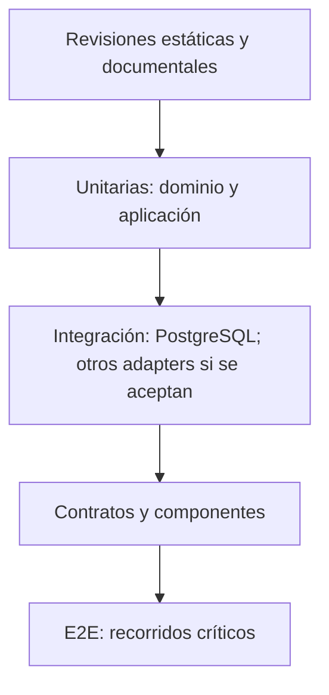

# Estrategia de pruebas

## Estado del documento

- **Estado:** Propuesta
- **Alcance:** Pruebas documentales actuales y futura plataforma web/API/workers/móviles.
- **Decisión pendiente:** Frameworks, herramientas, cobertura objetivo, navegadores/dispositivos y presupuesto de rendimiento.
- **Baseline aceptada:** ADR-001 exige TypeScript, Node.js `24.x`, strictness conceptual y validación de runtime; ADR-003 exige PostgreSQL 18.x. No seleccionan test runner, driver, ORM ni migrador.

## Objetivo

Obtener feedback temprano y evidencia proporcional al riesgo mediante capas complementarias. Ningún nivel por sí solo demuestra aislamiento, autorización, integridad y valor de producto.

## Modelo de capas

Se favorece una base amplia de pruebas rápidas y un conjunto E2E reducido pero crítico. La distribución exacta depende del riesgo y no se fija aún.

## Niveles propuestos

### Revisión documental y estática

- En Sprint 00: enlaces, IDs, consistencia entre visión/epics/PBIs/sprint/ADRs y ausencia de código funcional.
- En implementación futura: formato, lint, type checking, análisis de secretos, dependencias y patrones inseguros.
- Verificar ausencia de `implicit any`, escape hatches injustificados y código fuente JavaScript de producto no autorizado.
- Validar contratos y diagramas sin asumir que sustituyen pruebas ejecutables.

### Unitarias

- Reglas de dominio, decisiones de aplicación y transformaciones deterministas.
- Casos permitidos, denegados, límites y errores.
- No simular tanto contexto que se oculte la propagación real de tenant.

### Integración

- Repositorios con PostgreSQL 18.x; namespace de Redis, storage, colas y otros adaptadores sólo cuando exista una decisión que los incorpore.
- Propagación de tenant/sucursal y transacciones.
- Validación en runtime de entradas aunque exista un tipo TypeScript equivalente.
- Idempotencia, reintentos, concurrencia y fallos parciales.
- Migraciones hacia adelante y convivencia de versiones cuando aplica.

### Contratos

- API central consumida por clientes web y móviles futuros.
- Eventos de dominio, jobs, WebSockets, webhooks e integraciones externas.
- Compatibilidad de productor/consumidor y campos opcionales.

### End-to-end

- Recorridos operativos críticos desde interfaz/API hasta persistencia.
- Roles, sucursales, dispositivos y sesiones diferentes; niveles 1–4 y actor/aprobador distintos cuando aplique.
- Estados de carga, vacío, error y denegación.
- Un conjunto explícito de pruebas negativas multitenant.

### No funcionales

- Seguridad y abuso: [Security Testing](./SECURITY_TESTING.md).
- Accesibilidad: [Accessibility Strategy](./ACCESSIBILITY_STRATEGY.md).
- Rendimiento, carga y volumen: escenarios y objetivos `TBD`; incluir crecimiento hacia 1,000+ tenants sin asumir carga uniforme.
- Recuperación, backup y rollback: ejercicios definidos por riesgo.
- Resiliencia: latencia, timeout, pérdida/reordenamiento, dependencia caída y reintentos.

## Cobertura por superficie

| Superficie | Casos esenciales |
|---|---|
| API | autenticación, autorización, tenant, validación, errores, idempotencia y contratos. |
| PostgreSQL 18.x | propiedad tenant/sucursal, restricciones conceptuales, concurrencia, migración, pooling y consultas globales controladas. |
| Redis/caché, si se acepta | namespace de tenant, invalidación, TTL y ausencia de fuga por claves. |
| Jobs futuros, mecanismo pendiente | payload con contexto, validación runtime, reintento, idempotencia, dead-letter/recovery TBD y tenant correcto. |
| WebSockets/realtime | autenticación, rooms por tenant/conversación, revocación, reconexión, orden y duplicados. |
| Archivos/S3-compatible, si se acepta | claves aisladas, URLs/autorización, tipo/tamaño, malware TBD y eliminación. |
| Web | permisos, estados, responsive, accesibilidad y errores recuperables. |
| Móvil futuro | contratos, versiones antiguas, conectividad intermitente como descubrimiento; no requisito actual. |
| Integraciones | firmas/autenticidad, deduplicación, rate limits, sandbox, reintentos y reconciliación. |

## Datos de prueba

El dataset base debe ser sintético, versionable y reproducible e incluir:

- al menos dos tenants no relacionados;
- múltiples sucursales en uno y una sucursal en otro;
- identidades ordinarias separadas por tenant, con roles/capacidades contrastantes, asignaciones tenant-wide y restringidas por sucursal; probar que una identidad de otro tenant, una asignación revocada y una capacidad ausente fallan sin filtrar datos;
- actores y aprobadores distintos, aprobador sin capacidad, autoaprobación, control consumido/revocado y cambio material de operación conforme a ADR-013;
- dispositivos activos, revocados y asignados a sucursales distintas, más desafíos de vinculación vigentes/vencidos/reutilizados, transferencia y activaciones concurrentes sintéticas;
- recursos con IDs opacos distintos y escenarios de referencia ajena;
- datos vacíos, límites, Unicode, zonas horarias y estados inválidos relevantes;
- mensajes/jobs duplicados y fuera de orden para casos asincrónicos.

No se copian datos reales a local o staging salvo el proceso controlado descrito en [Environments](../delivery/ENVIRONMENTS.md).

## Ambientes y fidelidad

- Local ofrece feedback rápido con dependencias locales o emuladas.
- CI ejecuta suites reproducibles y aisladas; topología `TBD`.
- Staging valida el candidato integrado y el mismo digest que se promoverá.
- Production sólo recibe smoke tests seguros y observación; no pruebas destructivas.
- Diferencias entre ambientes y sus limitaciones deben quedar en la evidencia.

## Automatización y frecuencia propuestas

| Momento | Pruebas |
|---|---|
| Cambio local | unitarias/estáticas focalizadas. |
| Pull request | estáticas, unitarias, integración relevante, contratos y aislamiento esencial. |
| Merge/candidato | suite ampliada, E2E críticos, seguridad automatizada y migraciones. |
| Staging | smoke, exploratoria, recorridos críticos, permisos, aislamiento y operación. |
| Programada | dependencia, seguridad, carga, resiliencia y suites largas según riesgo. |
| Post-deploy | smoke no destructivo, métricas y alertas. |

Los gates exactos se aprobarán antes de configurar CI.

## Pruebas de regresión y exploratorias

Todo bug corregido debe aportar prueba automatizada al nivel más bajo capaz de reproducirlo y, si el impacto cruza capas, una prueba adicional apropiada. Las sesiones exploratorias registran alcance, heurísticas, build, datos, hallazgos y límites; no sustituyen evidencia reproducible para controles críticos.

## Flakiness y cuarentena

Una prueba inestable es un defecto de la suite. Si se pone en cuarentena, registrar razón, impacto, responsable y condición de salida; no mantener un gate verde ocultando indefinidamente la señal. Los controles de tenant y autorización no deben retirarse del gate sin mitigación explícita.

## Criterios de salida

- Resultados vinculados a criterios y riesgos.
- Suites requeridas aprobadas en la versión exacta.
- Cero hallazgos bloqueantes abiertos; clasificación exacta TBD.
- Evidencia de aislamiento para cambios que tocan datos o contexto.
- Riesgo residual y pruebas no ejecutadas explícitos.
- QA evidence revisada conforme a [Definition of Done](../delivery/DEFINITION_OF_DONE.md).

## Preguntas abiertas

- ¿Qué herramientas se elegirán por capa dentro de la dirección técnica propuesta?
- ¿Qué objetivos de cobertura se usarán sin incentivar pruebas de bajo valor?
- ¿Qué recorridos formarán la suite E2E crítica?
- ¿Qué volumen, concurrencia y distribución de tenants representan escenarios realistas?
- ¿Qué navegadores, tamaños y dispositivos serán soportados?
- ¿Qué integraciones dispondrán de sandbox estable?

## Próxima revisión

- **Fecha:** TBD.
- **Disparador:** aprobación de arquitectura de aplicación y stack de pruebas o antes de implementar CI.
- **Documentos relacionados:** [Quality Strategy](./QUALITY_STRATEGY.md), [Multitenant Isolation Testing](./MULTITENANT_ISOLATION_TESTING.md), [Environments](../delivery/ENVIRONMENTS.md), [QA Evidence Template](./QA_EVIDENCE_TEMPLATE.md).
