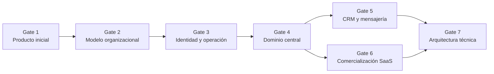

# Secuencia de decisiones de Sprint 00

## Estado del documento

- **Estado:** Borrador para revisión dirigida.
- **Naturaleza:** Orden propuesto de decisiones; no registra respuestas ni acepta ADRs.
- **Aprobación:** Pendiente del Product Owner y de las revisiones técnica, operativa, legal o de seguridad que correspondan.
- **Regla de avance:** un gate puede preparar el siguiente, pero no se considera superado hasta cumplir su criterio de salida con evidencia registrada.

**Actualización posterior:** [ADR-002](../../decisions/proposed/ADR-002-modular-monolith-first.md) fue revisado y aceptado el 2026-07-21. Las menciones posteriores a su revisión se conservan como parte de la secuencia histórica; no reabren la decisión ni cierran los demás gates.

## Propósito

Esta secuencia reduce las incertidumbres de Sprint 00 en el orden en que condicionan el producto. Empieza por cliente, operación y dominio; sólo después evalúa frameworks, persistencia y despliegue. Las preguntas se responden en el [cuestionario para el Product Owner](./PRODUCT_OWNER_QUESTIONNAIRE.md).

Una respuesta verbal no cierra una pregunta. Deben registrarse la decisión resultante, su evidencia, los documentos afectados y, cuando corresponda, el ADR o prototipo que la valida.

## Reglas de la sesión

1. Separar hechos, hipótesis, propuestas y decisiones aprobadas.
2. Elegir un recorrido completo antes de agregar capacidades adyacentes.
3. No usar una preferencia técnica para resolver una regla de producto.
4. Tratar las recomendaciones de este paquete como propuestas, no como autorización.
5. Mantener en `Proposed` todo ADR que conserve una dependencia abierta.
6. Escalar a revisión especializada las respuestas legales, regulatorias o de seguridad.
7. Posponer una decisión no necesaria para el primer alcance en vez de decidirla por anticipación.

## Vista de dependencias

Gate 5 puede cerrarse mediante una exclusión explícita de CRM y mensajería del primer release. Gate 6 puede diferir automatización comercial para un piloto controlado, pero debe definir qué habilita y suspende a un tenant antes de operar un SaaS real.

## Gate 1 — Producto inicial

### Decisiones requeridas

- segmento inicial y tipo de taller prioritario;
- problema operativo que merece resolverse primero;
- recorrido completo que demostrará valor;
- punto inicial y final de ese recorrido;
- alcance mínimo del primer release y capacidades explícitamente posteriores;
- mercado o país inicial que se usará para investigar restricciones;
- resultado observable que permitirá evaluar el release, sin inventar metas numéricas.

### Preguntas relacionadas

- [QUESTION-001](../../product/OPEN_QUESTIONS.md#question-001): segmento inicial;
- [QUESTION-002](../../product/OPEN_QUESTIONS.md#question-002): resultados y métricas;
- [QUESTION-003](../../product/OPEN_QUESTIONS.md#question-003): recorrido prioritario;
- [QUESTION-030](../../product/OPEN_QUESTIONS.md#question-030): mercado y obligaciones aplicables;
- dependencia transversal: [QUESTION-026](../../product/OPEN_QUESTIONS.md#question-026), cuya decisión técnica final pertenece al Gate 7.

### Documentos afectados

- [Visión de producto](../../product/PRODUCT_VISION.md)
- [Principios de producto](../../product/PRODUCT_PRINCIPLES.md)
- [Alcance](../../product/PRODUCT_SCOPE.md) y [fuera de alcance](../../product/OUT_OF_SCOPE.md)
- [Actores y personas](../../product/ACTORS_AND_PERSONAS.md)
- [Mapa de módulos](../../product/MODULE_MAP.md)
- [Epics](../../backlog/EPICS.md) y [Product Backlog](../../backlog/PRODUCT_BACKLOG.md)
- [Contexto del sistema](../../architecture/SYSTEM_CONTEXT.md)

### ADRs bloqueados o condicionados

- ADR-002 y ADR-005 necesitan un recorrido que pruebe límites y casos de uso reales.
- ADR-006 necesita conocer audiencias y aplicaciones web necesarias.
- ADR-007 y ADR-009 dependen de las unidades que realmente habrá que construir y desplegar.
- Los nueve ADRs pueden analizarse, pero ninguno debe aceptarse usando una visión amplia como sustituto del primer alcance.

### Riesgos

- diseñar para todos los talleres y no servir bien a un segmento concreto;
- confundir el mapa de capacidades con un compromiso de release;
- construir módulos parciales sin un recorrido utilizable;
- descubrir tarde una restricción del mercado inicial;
- medir actividad técnica en vez de resultado operativo.

### Criterio de salida

- un segmento y un tipo de taller están descritos con ejemplos y exclusiones;
- existe un problema prioritario y un recorrido con inicio, final y actor principal;
- el primer release enumera capacidades incluidas y posteriores;
- el mercado inicial o la hipótesis de mercado tiene responsable de validación `TBD`;
- los resultados esperados tienen señales observables, aunque líneas base y metas sigan `TBD`;
- la decisión está reflejada en visión, alcance y backlog.

## Gate 2 — Modelo organizacional

### Decisiones requeridas

- significado operativo y ciclo inicial del tenant;
- cardinalidad tenant–sucursal y necesidad de una sucursal predeterminada;
- matriz por entidad de datos tenant-wide y branch-scoped;
- acceso de una membresía a una, varias o todas las sucursales;
- selección y cambio de sucursal activa;
- transferencias entre sucursales separadas de la reasignación de dispositivos;
- configuración global, por tenant y por sucursal, incluida su precedencia.

### Preguntas relacionadas

- [QUESTION-005](../../product/OPEN_QUESTIONS.md#question-005): ciclo de vida del tenant;
- [QUESTION-006](../../product/OPEN_QUESTIONS.md#question-006): datos por tenant o sucursal;
- [QUESTION-007](../../product/OPEN_QUESTIONS.md#question-007): asignaciones y operación multisucursal;
- [QUESTION-008](../../product/OPEN_QUESTIONS.md#question-008): cambio de sucursal y transferencia de contexto.

QUESTION-005 también condiciona el Gate 6; aquí se resuelven identidad organizacional, alta y estados operativos, no precios ni cobro.

### Documentos afectados

- [Glosario](../../product/DOMAIN_GLOSSARY.md)
- [Alcance](../../product/PRODUCT_SCOPE.md)
- [Mapa de módulos](../../product/MODULE_MAP.md)
- [Modelo multitenant](../../architecture/MULTITENANCY_MODEL.md)
- [Identidad, acceso y permisos](../../architecture/IDENTITY_ACCESS_AND_PERMISSIONS.md)
- [Modelo de sucursal y dispositivo](../../architecture/BRANCH_AND_DEVICE_MODEL.md)
- [Arquitectura de datos](../../architecture/DATA_ARCHITECTURE.md)

### ADRs bloqueados o condicionados

- ADR-004 no puede fijar constraints ni alcance de `branch_id` sin la matriz por entidad.
- ADR-008 depende de saber qué contexto representa el hostname y cómo cambia el usuario de sucursal.
- Cualquier ADR futuro de identidad o configuración necesita estos límites organizacionales.

### Riesgos

- usar sucursal como frontera de seguridad equivalente a tenant;
- duplicar clientes o catálogos innecesariamente por sucursal;
- permitir acceso transversal implícito;
- mezclar transferencia de un dispositivo con transferencia de inventario o reparación;
- crear configuraciones con precedencia imposible de explicar.

### Criterio de salida

- existe una matriz revisada para clientes, equipos, reparaciones, inventario, pagos, cajas, conversaciones, archivos, configuración y auditoría;
- se documentan cardinalidad, sucursal activa y acceso transversal;
- se distingue reasignación de dispositivo de transferencia de datos de negocio;
- la precedencia de configuración queda definida conceptualmente;
- cada excepción tiene owner y pregunta o decisión trazable.

## Gate 3 — Identidad y operación

### Decisiones requeridas

- identidad global o identidad separada por tenant, con reglas de unicidad y privacidad;
- membresía, invitación, recuperación, revocación y primer administrador;
- roles base, roles personalizados, permisos directos, denegaciones y alcance;
- catálogo inicial de acciones sensibles y autoridad de aprobación;
- flujos que exigen dispositivo autorizado;
- tipos de dispositivo, vinculación, confianza, pérdida y revocación;
- propósito del PIN, duración de sesión, bloqueo y recuperación;
- autenticación reforzada y latencia de revocación;
- acceso excepcional de soporte y administración de plataforma.

### Preguntas relacionadas

- [QUESTION-004](../../product/OPEN_QUESTIONS.md#question-004): acciones sensibles y aprobación;
- [QUESTION-009](../../product/OPEN_QUESTIONS.md#question-009): identidad y varios tenants;
- [QUESTION-010](../../product/OPEN_QUESTIONS.md#question-010): roles y permisos;
- [QUESTION-011](../../product/OPEN_QUESTIONS.md#question-011): dispositivos;
- [QUESTION-012](../../product/OPEN_QUESTIONS.md#question-012): PIN y refuerzo;
- [QUESTION-029](../../product/OPEN_QUESTIONS.md#question-029): amenazas y acceso excepcional.

### Documentos afectados

- [Actores y personas](../../product/ACTORS_AND_PERSONAS.md)
- [Glosario](../../product/DOMAIN_GLOSSARY.md)
- [Modelo multitenant](../../architecture/MULTITENANCY_MODEL.md)
- [Identidad, acceso y permisos](../../architecture/IDENTITY_ACCESS_AND_PERMISSIONS.md)
- [Modelo de sucursal y dispositivo](../../architecture/BRANCH_AND_DEVICE_MODEL.md)
- [Línea base de seguridad](../../architecture/SECURITY_BASELINE.md)
- PBIs de identidad, acceso y dispositivo en el [índice de PBIs](../../backlog/pbis/README.md)

### ADRs bloqueados o condicionados

- ADR-008 no puede evaluarse completamente sin estrategia de sesión, cookies, orígenes y cambio de contexto.
- ADR-006 depende de las superficies de autenticación y de las audiencias web.
- ADR-004 depende de una fuente confiable de tenant y de contextos administrativos separados.
- Se necesita una decisión futura específica de identidad/acceso; no debe quedar implícita en ADRs de framework.

### Riesgos

- convertir una propuesta de identidad global en hecho no aprobado;
- tratar dispositivo o PIN como autorización suficiente;
- dejar tokens con permisos obsoletos;
- crear un superadministrador sin alcance ni tiempo limitado;
- bloquear operación legítima con un modelo imposible de recuperar;
- diseñar la experiencia antes del threat model.

### Criterio de salida

- hay diagramas de contexto para flujo humano, dispositivo, job, webhook y plataforma;
- existe una matriz inicial actor–acción–alcance–refuerzo;
- identidad, membresía, rol, permiso y asignación tienen significados aprobados;
- el PIN y los dispositivos tienen propósito, límites y revocación definidos;
- el acceso excepcional falla cerrado y deja evidencia;
- se decide si [SPIKE-005](./PROTOTYPE_CANDIDATES.md#spike-005) es obligatorio antes de implementar acceso.

## Gate 4 — Dominio central

### Decisiones requeridas

- cliente persona u organización, contactos, duplicados y ownership por sucursal;
- equipo recibido, identificación, accesorios, condición y datos sensibles;
- diferencia entre reparación y orden de trabajo;
- diagnóstico, cotización versionada, aprobación y cambios;
- estados, asignación, pausas, cancelación, entrega y reapertura;
- garantía como reapertura, caso relacionado u otro concepto;
- inventario mínimo requerido por el recorrido;
- catálogo, existencias, ubicaciones, reservas, movimientos y excepciones;
- pagos, parcialidades, devoluciones y condición de entrega;
- significado de caja, sesión, turno, arqueo y supervisión;
- datos legacy necesarios y estrategia de coexistencia/corte.

### Preguntas relacionadas

- [QUESTION-013](../../product/OPEN_QUESTIONS.md#question-013): flujo de reparación;
- [QUESTION-014](../../product/OPEN_QUESTIONS.md#question-014): diagnóstico, cotización, aprobación y garantía;
- [QUESTION-015](../../product/OPEN_QUESTIONS.md#question-015): catálogo y existencias;
- [QUESTION-016](../../product/OPEN_QUESTIONS.md#question-016): movimientos y costos;
- [QUESTION-021](../../product/OPEN_QUESTIONS.md#question-021): pagos del taller;
- [QUESTION-022](../../product/OPEN_QUESTIONS.md#question-022): cajas;
- [QUESTION-033](../../product/OPEN_QUESTIONS.md#question-033): datos legacy;
- [QUESTION-034](../../product/OPEN_QUESTIONS.md#question-034): coexistencia y corte.

Las subpreguntas de revisión de QUESTION-013 hacen visible el vacío actual sobre cliente, equipo recibido y orden de trabajo sin crear identificadores canónicos nuevos.

### Documentos afectados

- [Glosario](../../product/DOMAIN_GLOSSARY.md)
- [Alcance](../../product/PRODUCT_SCOPE.md)
- [Mapa de módulos](../../product/MODULE_MAP.md)
- [Arquitectura de aplicaciones](../../architecture/APPLICATION_ARCHITECTURE.md)
- [Arquitectura de datos](../../architecture/DATA_ARCHITECTURE.md)
- [Lecciones legacy](../../product/LEGACY_SR_TALLER_LESSONS.md)
- [Product Backlog](../../backlog/PRODUCT_BACKLOG.md) y [mapa de dependencias](../../backlog/DEPENDENCY_MAP.md)

### ADRs bloqueados o condicionados

- ADR-002 está aceptado; un recorrido debe comprobar sus límites modulares.
- ADR-003 está aceptado; sus patrones físicos de datos y transacción todavía dependen del dominio y de DEC-049/050.
- ADR-004 está aceptado; aplicación, cardinalidades y restauración/migración todavía requieren evidencia.
- ADR-005 necesita casos de uso, consistencia y trabajos asíncronos representativos.

### Riesgos

- implementar una máquina de estados inventada;
- confundir reparación, orden y equipo del cliente;
- hacer obligatorio Inventory, Payments o Cash Register sin que el recorrido lo necesite;
- perder trazabilidad de aprobaciones y cambios de cotización;
- trasladar anomalías del legado al nuevo modelo;
- comprometer cutover sin reconciliación ni rollback.

### Criterio de salida

- existe un ejemplo completo, uno excepcional y uno cancelado del recorrido elegido;
- cliente, equipo, reparación, orden, cotización, aprobación, entrega y garantía están delimitados;
- se decide el mínimo de inventario, pagos y caja incluido o se excluyen explícitamente;
- estados y transiciones tienen actor, precondición, evidencia y resultado;
- se conocen categorías legacy a inventariar y la unidad posible de piloto/corte;
- los PBIs del primer recorrido pueden obtener criterios verificables sin reglas inventadas.

## Gate 5 — CRM y mensajería

### Decisiones requeridas

- inclusión o exclusión explícita de CRM y Messaging del primer release;
- problema concreto que resolvería CRM más allá de Customers y Repairs;
- propósito y base autorizada para usar datos de contacto;
- canales iniciales y diferencia entre conversación y notificación;
- proveedor o criterio de selección, sin asumir WAHA;
- ownership, asignación, participantes e historial de conversación;
- conversación por canal o continuidad entre canales;
- estados, orden, reintento, retención y experiencia ante ambigüedad;
- separación entre eventos durables e indicadores efímeros;
- necesidad real de tiempo real.

### Preguntas relacionadas

- [QUESTION-017](../../product/OPEN_QUESTIONS.md#question-017): límite de CRM;
- [QUESTION-018](../../product/OPEN_QUESTIONS.md#question-018): consentimiento y preferencias;
- [QUESTION-019](../../product/OPEN_QUESTIONS.md#question-019): canal y proveedor;
- [QUESTION-020](../../product/OPEN_QUESTIONS.md#question-020): semántica y entrega.

### Documentos afectados

- [Alcance](../../product/PRODUCT_SCOPE.md)
- [Glosario](../../product/DOMAIN_GLOSSARY.md)
- [Mapa de módulos](../../product/MODULE_MAP.md)
- [Tiempo real y mensajería](../../architecture/REALTIME_AND_MESSAGING.md)
- [Arquitectura de integraciones](../../architecture/INTEGRATION_ARCHITECTURE.md)
- [Arquitectura de datos](../../architecture/DATA_ARCHITECTURE.md)

### ADRs bloqueados o condicionados

- ADR-002 y ADR-005 sólo necesitan validar mensajería si entra al recorrido seleccionado.
- ADR-006 depende de las experiencias de conversación realmente necesarias.
- Harán falta decisiones futuras de protocolo realtime, cola y proveedor únicamente si el alcance las activa.
- La extracción de Messaging a otro servicio no se evalúa en esta etapa.

### Riesgos

- construir “CRM” sin problema ni usuario;
- seleccionar WAHA antes de revisar legalidad, soporte y operación;
- mezclar conversación, notificación y presencia;
- persistir o transmitir contenido sin propósito ni retención;
- filtrar mensajes mediante rooms demasiado amplias;
- adoptar infraestructura realtime para una necesidad que podía resolverse por consulta.

### Criterio de salida

- CRM y Messaging están incluidos con recorrido concreto o excluidos de forma explícita;
- si están incluidos, existen canal, ownership, consentimiento, semántica e historial acordados;
- se distingue estado durable de señal efímera;
- WAHA permanece candidato hasta superar evaluación;
- se decide si [SPIKE-004](./PROTOTYPE_CANDIDATES.md#spike-004) es recomendado, obligatorio o prematuro.

## Gate 6 — Comercialización del SaaS

### Decisiones requeridas

- oferta inicial y unidad simple de cobro o provisión;
- límites y capacidades por plan;
- trial, activación, renovación, gracia, mora, suspensión y cancelación;
- efecto de cada estado sobre acceso y trabajos en curso;
- acceso de sólo lectura, exportación, reactivación y eliminación;
- conservación de datos después de suspensión o cierre;
- funciones mínimas de administración central;
- proveedor de cobro sólo si la primera etapa necesita automatización.

### Preguntas relacionadas

- [QUESTION-023](../../product/OPEN_QUESTIONS.md#question-023): ciclo de suscripción;
- [QUESTION-024](../../product/OPEN_QUESTIONS.md#question-024): planes y límites;
- [QUESTION-025](../../product/OPEN_QUESTIONS.md#question-025): ciclo de vida de datos;
- dependencia transversal: [QUESTION-005](../../product/OPEN_QUESTIONS.md#question-005), tratada primariamente en Gate 2.

### Documentos afectados

- [Visión](../../product/PRODUCT_VISION.md) y [alcance](../../product/PRODUCT_SCOPE.md)
- [Mapa de módulos](../../product/MODULE_MAP.md)
- [Modelo multitenant](../../architecture/MULTITENANCY_MODEL.md)
- [Arquitectura de datos](../../architecture/DATA_ARCHITECTURE.md)
- [Arquitectura de integraciones](../../architecture/INTEGRATION_ARCHITECTURE.md)
- [Product Backlog](../../backlog/PRODUCT_BACKLOG.md)

### ADRs bloqueados o condicionados

- ADR-004 está aceptado, pero cierre, exportación, retención y posible restauración por tenant siguen abiertos.
- ADR-003 está aceptado; retención y requisitos comerciales condicionan proveedor y operación, no reabren automáticamente el motor.
- ADR-007 depende de SLO, disponibilidad y operación que se prometa a clientes.
- Un proveedor de cobro SaaS requerirá una decisión separada; no pertenece al ADR de Payments del taller.

### Riesgos

- incrustar entitlements hipotéticos en todos los módulos;
- suspender un tenant y perder acceso legítimo a exportación o recuperación;
- mezclar pagos del taller con cobro de suscripción;
- prometer planes antes de conocer costos y valor;
- conservar datos indefinidamente por falta de política.

### Criterio de salida

- existe una oferta inicial o una regla explícita de provisión manual para piloto;
- los estados comerciales y su efecto operativo están definidos;
- límites, medición y administración tienen owner conceptual;
- cierre, exportación, reactivación y retención son coherentes con Gate 2 y revisión legal;
- automatización de cobro se incluye o se pospone expresamente.

## Gate 7 — Arquitectura técnica

### Decisiones requeridas

- restricciones de residencia, clasificación de datos, escala, disponibilidad, recuperación, presupuesto y operación;
- número de aplicaciones y unidades desplegables;
- lenguaje, backend y frontend por tipo de cliente;
- persistencia primaria y estrategia multitenant;
- necesidad de RLS, Redis, cola, tiempo real y objetos según el alcance;
- estrategia de monorepo sin convertir Turborepo en requisito automático;
- papel de contenedores en desarrollo y producción;
- subdominios, dominios, cookies, autenticación, orígenes y ambientes;
- promoción del mismo artefacto, migraciones, rollback y observabilidad;
- identidad visual, accesibilidad y evidencia mínima para clientes incluidos.

### Preguntas relacionadas

- [QUESTION-026](../../product/OPEN_QUESTIONS.md#question-026): jurisdicción y residencia;
- [QUESTION-027](../../product/OPEN_QUESTIONS.md#question-027): perfil de carga;
- [QUESTION-028](../../product/OPEN_QUESTIONS.md#question-028): hosting y ambientes;
- [QUESTION-031](../../product/OPEN_QUESTIONS.md#question-031): design system;
- [QUESTION-032](../../product/OPEN_QUESTIONS.md#question-032): accesibilidad y evidencia;
- dependencia transversal: [QUESTION-029](../../product/OPEN_QUESTIONS.md#question-029), tratada primariamente en Gate 3.

### Orden de evaluación técnica

1. Confirmar restricciones de calidad y operación de QUESTION-026 a QUESTION-032.
2. Aplicar ADR-002 para límites y unidad inicial, sin asumir microservicios.
3. Aplicar ADR-003 separando PostgreSQL 18.x de proveedor, ORM, migrador, pooler y extensiones.
4. Validar la aplicación de ADR-004 con aislamiento, restore por tenant y [SPIKE-002](./PROTOTYPE_CANDIDATES.md#spike-002); ejecutar [SPIKE-003](./PROTOTYPE_CANDIDATES.md#spike-003) sólo antes de adoptar RLS.
5. ADR-001/003 ya están `Accepted`; revisar ADR-005 con un caso de uso representativo y sus baselines, recordando que el framework no valida el dominio.
6. Revisar ADR-006 por aplicación concreta, no como obligación para toda web.
7. Revisar ADR-008 después del modelo de identidad mediante [SPIKE-001](./PROTOTYPE_CANDIDATES.md#spike-001).
8. Revisar ADR-009 distinguiendo monorepo de pnpm o Turborepo y apoyándose, si aporta evidencia, en [SPIKE-008](./PROTOTYPE_CANDIDATES.md#spike-008).
9. Revisar ADR-007 distinguiendo desarrollo, build y runtime; validar jobs y promoción mediante [SPIKE-006](./PROTOTYPE_CANDIDATES.md#spike-006) y [SPIKE-007](./PROTOTYPE_CANDIDATES.md#spike-007) cuando correspondan.

### Documentos afectados

- todos los documentos de [arquitectura](../../architecture/)
- [Registro de ADRs](../../decisions/README.md) y ADR-001 a ADR-009
- [Estrategias de calidad](../../quality/QUALITY_STRATEGY.md) y [pruebas](../../quality/TESTING_STRATEGY.md)
- [Ambientes](../../delivery/ENVIRONMENTS.md)
- [Operaciones](../../operations/OPERATIONS_OVERVIEW.md)
- PBIs técnicos y mapa de dependencias

### ADRs bloqueados o condicionados

ADR-001 a ADR-004 están `Accepted`; ADR-005 a ADR-009 permanecen `Proposed`. El gate debe registrar para cada propuesta pendiente si está lista para revisión, requiere producto, requiere validación técnica o debe dividirse. En particular:

- ADR-001 acepta TypeScript y Node.js `24.x`, pero no acepta automáticamente NestJS, Next.js, monorepo o tooling;
- ADR-003 acepta PostgreSQL 18.x, pero no elige proveedor, ORM, migrador, pooler, extensiones ni RLS;
- ADR-004 no acepta RLS implícitamente;
- ADR-006 no obliga a que todas las aplicaciones web compartan estrategia;
- ADR-007 no decide por sí solo Docker Compose, GitHub Actions ni hosting;
- ADR-008 incluye efectos de seguridad de sesión y ambientes;
- ADR-009 no obliga a adoptar Turborepo.

### Riesgos

- aceptar una pila coherente en papel sin probar los riesgos altos;
- usar 1,000 tenants como perfil de carga;
- asumir que contenedor equivale a promoción reproducible;
- aceptar shared-schema sin restore ni aislamiento demostrados;
- vincular autenticación a wildcard routing sin revisar cookies y orígenes;
- instalar infraestructura no requerida por el primer alcance.

### Criterio de salida

- cada ADR tiene recomendación y dependencias explícitas, sin cambio automático de estado;
- las decisiones técnicas seleccionadas trazan a un recorrido y atributo de calidad;
- los prototipos obligatorios para el alcance elegido tienen evidencia y criterio de éxito;
- ORM, cola, realtime, almacenamiento y proveedor permanecen abiertos si todavía no son necesarios;
- los PBIs de implementación cumplen Definition of Ready con producto, seguridad, datos y pruebas;
- existe autorización explícita antes de crear scaffolding o código funcional.

## Registro de avance

| Gate | Estado | Evidencia de salida | Decisión registrada por | Fecha |
|---|---|---|---|---|
| Gate 1 — Producto inicial | Pendiente | TBD | TBD | TBD |
| Gate 2 — Modelo organizacional | Pendiente | TBD | TBD | TBD |
| Gate 3 — Identidad y operación | Pendiente | TBD | TBD | TBD |
| Gate 4 — Dominio central | Pendiente | TBD | TBD | TBD |
| Gate 5 — CRM y mensajería | Pendiente | TBD | TBD | TBD |
| Gate 6 — Comercialización SaaS | Pendiente | TBD | TBD | TBD |
| Gate 7 — Arquitectura técnica | Pendiente | TBD | TBD | TBD |

## Próxima revisión

Usar este documento durante la sesión con el Product Owner. Actualizarlo únicamente cuando una decisión tenga respuesta, evidencia, documentos afectados y autoridad registrada. **Fecha: TBD.**
