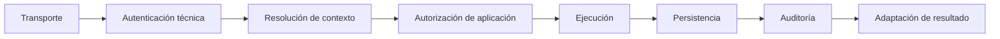

# Candidatos de prototipo técnico de SPRINT-00

## Estado del documento

- **Estado:** Registro de candidatos y mandatos. Sólo [SPIKE-009](#spike-009) está autorizado para ejecución futura; esta autorización no permite ejecutarlo en la iteración documental que formaliza el mandato, implementar producto ni cambiar automáticamente un ADR.
- **Propósito:** Identificar experimentos mínimos que reduzcan riesgos arquitectónicos reales antes de comprometer diseño ejecutable.
- **Duración:** `TBD` para todos los candidatos; no se asignan estimaciones sin capacidad y autorización.
- **Gate vigente:** Todo spike requiere autorización explícita de su autoridad. Arquitectura + Ingeniería autorizaron el 2026-07-22 la ejecución futura de SPIKE-009 bajo el mandato de este documento; los demás candidatos conservan sus gates y no quedan autorizados por esa decisión.
- **Regla de decisión:** Un spike produce evidencia; un resultado favorable no acepta automáticamente el ADR relacionado y un resultado desfavorable debe conservarse como evidencia.

## Clasificaciones

- `Mandatory before implementation`: la incertidumbre debe resolverse antes de implementar la capacidad indicada; puede concluir descartando la hipótesis.
- `Mandatory before acceptance`: la evidencia debe existir antes de aceptar o rechazar el ADR relacionado; autorizar el experimento no acepta la tecnología ni habilita implementación de producto.
- `Recommended`: reduce un riesgo importante, pero su momento depende de que exista un caso de uso autorizado.
- `Optional`: aporta evidencia sólo si se confirma una condición de complejidad o escala.
- `Premature`: no debe ejecutarse todavía porque faltan decisiones de producto que definen qué probar.

## Vista resumida

| Spike | Clasificación actual | Riesgo principal | ADR relacionado | PBI relacionado | Condición de ejecución |
|---|---|---|---|---|---|
| SPIKE-001 | `Mandatory before implementation` | Resolución/cookies/caché cross-tenant | ADR-008; informa ADR-004 | PBI-007, PBI-008, PBI-013, PBI-015, PBI-017 | Antes de implementar routing o sesión tenant-aware, después de definir identidad y dominios. |
| SPIKE-002 | `Mandatory before implementation` | Acceso cross-tenant por omisión de contexto | ADR-004 | PBI-007, PBI-011, PBI-017, PBI-018 | Antes de la primera persistencia shared-schema tenant-scoped. |
| SPIKE-003 | `Mandatory before adopting RLS` | Bypass o contaminación de contexto RLS | ADR-003/004; posible ADR futuro de RLS | PBI-007, PBI-011, PBI-017, PBI-018 | Después de SPIKE-002 y sólo si se considera adoptar RLS. |
| SPIKE-004 | `Premature` | Rooms o eventos cross-tenant | ADR-004 y ADR futuro de realtime | PBI-014, PBI-017, PBI-019 | Sólo si el Gate 5 confirma realtime; entonces será obligatorio antes de sockets. |
| SPIKE-005 | `Mandatory before implementation` si dispositivo/PIN entra al release | PIN como identidad completa o sesión huérfana | ADR futuro de identidad/dispositivo; informa ADR-004/008 | PBI-008, PBI-009, PBI-017, PBI-018 | Después de resolver operación, acciones sensibles y revocación. |
| SPIKE-006 | `Recommended` | Pérdida o mezcla de tenant context en jobs | ADR-002/004 y ADR futuro de colas | PBI-007, PBI-014, PBI-017, PBI-019 | Antes del primer job tenant-scoped autorizado. |
| SPIKE-007 | `Recommended` | Rebuild, artefacto mutable o secretos en imagen | ADR-007 | PBI-015, PBI-019 | Antes del primer release productivo, con un desplegable representativo. |
| SPIKE-008 | `Deferred/conditional` | Grafo acoplado, builds costosos o caché insegura | ADR-009 Accepted; informa ADR-007 | PBI-010, PBI-015, PBI-016, PBI-019 | Sólo al autorizar varios proyectos, packages justificados u orquestación. |
| SPIKE-009 | `Mandatory before acceptance` | Dominio acoplado a NestJS o controles transversales incompletos | ADR-005; informa ADR-001/002/003/004/009–013 | PBI-007, PBI-010, PBI-012, PBI-017 | Autorizado para ejecución futura; debe concluir y revisarse antes de aceptar o rechazar ADR-005. |

## SPIKE-001 — Resolución de tenant mediante wildcard subdomain

| Campo | Propuesta de revisión |
|---|---|
| Identificador | `SPIKE-001` |
| Clasificación | `Mandatory before implementation` del routing y de la sesión tenant-aware de clientes web. |
| Hipótesis | Un hostname wildcard normalizado y permitido puede producir sólo un tenant candidato; al contrastarlo con identidad y membresía, dos tenants permanecen aislados sin cruce de cookies, caché ni ambientes. |
| Riesgo que reduce | [RISK-001](../../sprints/sprint-00/RISKS_AND_BLOCKERS.md#riesgos): confiar en una sola defensa multitenant; riesgos de [ADR-008](../../decisions/proposed/ADR-008-wildcard-subdomain-routing.md) sobre Host header, subdomain takeover y cookies demasiado amplias. |
| Pregunta que responde | ¿Wildcard DNS/TLS y el modelo de sesión permiten resolver un tenant candidato de forma segura para hosts válidos, desconocidos, suspendidos o renombrados, incluida la separación entre usuarios ordinarios de un solo tenant, identidades excepcionales de plataforma y ambientes? |
| Alcance mínimo | Dos tenants con datos sintéticos; un edge/resolver, una API y un cliente web mínimos; host A con credencial B y viceversa; host inválido/suspendido; normalización y allowlist; cookies host-only frente a dominio compartido; `Secure`, `SameSite`, CSRF/CORS; caché/CDN; DNS/TLS; dominios distintos para local, staging y producción. |
| Fuera de alcance | Dominios personalizados, infraestructura productiva, branding final, cliente móvil, onboarding completo y selección de proveedor definitivo. |
| Evidencia esperada | Diagrama del flujo probado, configuración mínima sin secretos, matriz allow/deny, resultados de host/cookie/cache, amenazas observadas y límites por ambiente. |
| Criterio de éxito | Host no permitido falla cerrado; pertenencia, estación e identidad válidas —no el hostname aislado— determinan acceso; credencial A/host B no mezcla contexto; cookies y caché no cruzan tenants; los ambientes son inequívocos; cualquier flujo excepcional de plataforma permanece separado. |
| Criterio de fracaso | El diseño necesita una cookie de alcance inseguro, permite spoof/takeover, mezcla caché, confía en un header controlado por cliente o no ofrece un cambio de tenant seguro y operable. |
| Duración | `TBD` |
| ADR relacionado | [ADR-008](../../decisions/proposed/ADR-008-wildcard-subdomain-routing.md); informa [ADR-004](../../decisions/proposed/ADR-004-shared-schema-multitenancy.md). |
| PBI relacionado | [PBI-007](../../backlog/pbis/PBI-007.md), [PBI-008](../../backlog/pbis/PBI-008.md), [PBI-013](../../backlog/pbis/PBI-013.md), [PBI-015](../../backlog/pbis/PBI-015.md) y [PBI-017](../../backlog/pbis/PBI-017.md). |
| Dependencias | Gates 2 y 3; [QUESTION-009](../../product/OPEN_QUESTIONS.md#question-009), [QUESTION-011](../../product/OPEN_QUESTIONS.md#question-011) y [QUESTION-012](../../product/OPEN_QUESTIONS.md#question-012); superficies web, política de sesión y dominios candidatos. |

## SPIKE-002 — Aislamiento shared-schema con tenant context

| Campo | Propuesta de revisión |
|---|---|
| Identificador | `SPIKE-002` |
| Clasificación | `Mandatory before implementation` de la primera persistencia shared-schema tenant-scoped. |
| Hipótesis | Un `TenantContext` inmutable, repositorios tenant-aware y constraints compuestos hacen difícil omitir el alcance y bloquean CRUD y referencias cruzadas sin depender de filtros recordados manualmente. |
| Riesgo que reduce | [RISK-001](../../sprints/sprint-00/RISKS_AND_BLOCKERS.md#riesgos) y el riesgo central de [ADR-004](../../decisions/proposed/ADR-004-shared-schema-multitenancy.md): una consulta sin scoping puede exponer o modificar otro tenant. |
| Pregunta que responde | ¿La ruta caso de uso–repositorio–base de datos falla cerrada cuando falta o se manipula el contexto, incluso con concurrencia, sucursales y jobs? |
| Alcance mínimo | Dos tenants con datos deliberadamente similares; dos o tres agregados representativos; `list/read/create/update/delete`, joins y relación de sucursal; request y job concurrentes; interfaz de repositorio sin consulta global ordinaria; constraints que impidan referencias tenant/branch incoherentes. |
| Fuera de alcance | Modelo de dominio completo, UI, proveedor definitivo, benchmark de escala, migraciones productivas y políticas RLS. |
| Evidencia esperada | Threat cases, contrato del repositorio, mecanismo de propagación, constraints evaluados, pruebas negativas reproducibles y registro de cualquier bypass requerido. |
| Criterio de éxito | Contexto ausente o incoherente se deniega; no existe lectura, escritura ni referencia cruzada; jobs concurrentes no comparten estado mutable; las operaciones globales usan una ruta separada y explícita. |
| Criterio de fracaso | El filtro es opcional, existe una consulta global reutilizable desde operación ordinaria, se aceptan IDs/branches de otro tenant o el contexto se contamina entre requests/jobs. |
| Duración | `TBD` |
| ADR relacionado | [ADR-004](../../decisions/proposed/ADR-004-shared-schema-multitenancy.md). |
| PBI relacionado | [PBI-007](../../backlog/pbis/PBI-007.md), [PBI-011](../../backlog/pbis/PBI-011.md), [PBI-017](../../backlog/pbis/PBI-017.md) y [PBI-018](../../backlog/pbis/PBI-018.md). |
| Dependencias | Gate 2 y [QUESTION-006](../../product/OPEN_QUESTIONS.md#question-006); ADR-003 como dirección evaluada; agregado representativo y candidato de acceso a datos, sin aceptar todavía un ORM. |

## SPIKE-003 — PostgreSQL Row-Level Security como defensa adicional

| Campo | Propuesta de revisión |
|---|---|
| Identificador | `SPIKE-003` |
| Clasificación | `Mandatory before adopting RLS`. No es obligatorio antes de cualquier persistencia de R0 y el resultado válido puede ser rechazar RLS. |
| Hipótesis | Un rol de aplicación sin bypass, contexto establecido por transacción/conexión y políticas RLS —incluido `FORCE ROW LEVEL SECURITY` cuando corresponda— agregan una barrera sin filtrar contexto ni volver inoperables jobs, migraciones o soporte. |
| Riesgo que reduce | [RISK-001](../../sprints/sprint-00/RISKS_AND_BLOCKERS.md#riesgos), bypass por roles privilegiados y falsa confianza en RLS descritos en el [modelo multitenant](../../architecture/MULTITENANCY_MODEL.md#evaluación-de-row-level-security). |
| Pregunta que responde | ¿RLS deniega `SELECT/INSERT/UPDATE/DELETE` y joins cuando falta o no coincide el tenant, limpia el contexto al reutilizar conexiones y permite operaciones excepcionales explícitas? |
| Alcance mínimo | Dos tenants; roles de aplicación, migración y soporte; pool reutilizado; contexto por transacción; lecturas, escrituras y joins; ausencia/fallo de contexto; job; migración; operación administrativa explícita; ORM o query builder candidato. |
| Fuera de alcance | Políticas para todo el dominio, tuning final, proveedor administrado, esquema productivo y permiso global permanente. |
| Evidencia esperada | Matriz de roles/policies/bypass, pruebas negativas y concurrentes, resultado con el pool y acceso de datos candidato, y guía de operación/diagnóstico. |
| Criterio de éxito | Falta de contexto falla cerrado; no queda tenant residual en el pool; el rol de aplicación no omite políticas; el camino administrativo está separado y es auditable; jobs y migraciones tienen comportamiento explícito. |
| Criterio de fracaso | Existe fuga por reutilización, ownership o privilegio; un bypass es silencioso; el mecanismo de datos no permite contexto seguro; o migración/diagnóstico requieren desactivar rutinariamente la barrera. |
| Duración | `TBD` |
| ADR relacionado | [ADR-004](../../decisions/proposed/ADR-004-shared-schema-multitenancy.md); puede originar un ADR futuro específico de RLS. |
| PBI relacionado | [PBI-007](../../backlog/pbis/PBI-007.md), [PBI-011](../../backlog/pbis/PBI-011.md), [PBI-017](../../backlog/pbis/PBI-017.md) y [PBI-018](../../backlog/pbis/PBI-018.md). |
| Dependencias | Resultado y patrón de [SPIKE-002](#spike-002), ADR-003 `Accepted`, candidato de ORM/query builder y pooling, threat model, operaciones cross-tenant legítimas definidas y autorización explícita del spike. |

## SPIKE-004 — WebSocket y rooms aisladas por tenant

| Campo | Propuesta de revisión |
|---|---|
| Identificador | `SPIKE-004` |
| Clasificación | `Premature` mientras el Gate 5 no confirme realtime. Si se incluye, pasa a ser obligatorio antes de implementar sockets. |
| Hipótesis | Un handshake autenticado, rooms construidas por servidor con namespace tenant y revalidación de membresía/revocación impiden entrega cross-tenant y permiten resincronización desde la API. |
| Riesgo que reduce | [RISK-001](../../sprints/sprint-00/RISKS_AND_BLOCKERS.md#riesgos), [RISK-003](../../sprints/sprint-00/RISKS_AND_BLOCKERS.md#riesgos) y riesgo de rooms amplias documentado en [Realtime and Messaging](../../architecture/REALTIME_AND_MESSAGING.md#rooms-y-aislamiento). |
| Pregunta que responde | ¿Dos tenants con IDs similares permanecen aislados durante handshake, join, publish, pub/sub, reconexión y revocación? |
| Alcance mínimo | Tenants A/B; rooms de tenant, sucursal, conversación y usuario; join manipulado; publicación a audiencia; revocación; reconexión; adaptador pub/sub candidato; resincronización por API. |
| Fuera de alcance | WAHA, WhatsApp, chat completo, presencia como requisito, historial completo, SLA y benchmark de conexiones. |
| Evidencia esperada | Matriz de conexión/join/publish/revoke, prueba de no entrega cross-tenant, trazas correlacionadas sin contenido sensible y comportamiento de resync. |
| Criterio de éxito | B nunca recibe A; conocer un nombre/ID no permite join; cada evento revalida audiencia; revocación retira acceso; reconexión recupera estado desde fuente autoritativa. |
| Criterio de fracaso | La autorización ocurre sólo al handshake, una room carece de tenant, se entregan eventos tras revocación o la conexión se convierte en fuente de verdad. |
| Duración | `TBD` |
| ADR relacionado | Informa [ADR-004](../../decisions/proposed/ADR-004-shared-schema-multitenancy.md) y un ADR futuro de realtime/colas; [ADR-002](../../decisions/proposed/ADR-002-modular-monolith-first.md) conserva el gateway como responsabilidad inicialmente no extraída. |
| PBI relacionado | [PBI-014](../../backlog/pbis/PBI-014.md), [PBI-017](../../backlog/pbis/PBI-017.md) y [PBI-019](../../backlog/pbis/PBI-019.md). |
| Dependencias | Gate 5; [QUESTION-019](../../product/OPEN_QUESTIONS.md#question-019) y [QUESTION-020](../../product/OPEN_QUESTIONS.md#question-020); modelo de identidad/revocación, necesidad realtime confirmada y protocolo candidato. |

## SPIKE-005 — Sesión de dispositivo y acceso operativo mediante PIN

| Campo | Propuesta de revisión |
|---|---|
| Identificador | `SPIKE-005` |
| Clasificación | `Mandatory before implementation` si dispositivo/PIN forma parte del release inicial. |
| Hipótesis | Una credencial revocable de dispositivo separada de la persona y un PIN validado por backend pueden crear una sesión operativa atribuible y limitada a tenant/sucursal, con step-up para acciones sensibles. |
| Riesgo que reduce | Riesgos de [PBI-008](../../backlog/pbis/PBI-008.md) y [PBI-009](../../backlog/pbis/PBI-009.md): PIN como identidad completa, sesión huérfana o compartida, reasignación que conserva acceso y revocación tardía; también aislamiento tenant/branch de [RISK-001](../../sprints/sprint-00/RISKS_AND_BLOCKERS.md#riesgos). |
| Pregunta que responde | ¿Vinculación, cambio de turno, rate limiting, revocación, asignación de sucursal y step-up funcionan sin compartir credenciales ni enumerar empleados? |
| Alcance mínimo | Dos dispositivos en sucursales distintas; dos membresías; enrolamiento mínimo; PIN correcto/incorrecto; selección/cambio de operador; inactividad; revocación; intento desde equipo/sucursal ajenos; acción sensible con step-up; concurrencia. |
| Fuera de alcance | Algoritmo criptográfico final, proveedor IAM, UX pulida, MDM, fingerprint de hardware, recuperación completa y operación offline. |
| Evidencia esperada | Threat model, secuencia de vinculación/sesión/revocación, estados mínimos, matriz allow/deny/revoke y auditoría sin PIN ni secretos. |
| Criterio de éxito | El PIN no funciona fuera de dispositivo/tenant/sucursal autorizados; el actor queda atribuido; el turno previo no conserva datos/permisos; revocación server-side es efectiva; acción sensible exige step-up; límites no bloquean injustamente a todo el tenant. |
| Criterio de fracaso | PIN global o reutilizable, dispositivo tratado como persona, sesión anterior conserva acceso, revocación sólo cierra UI, el flujo enumera empleados o supervisor comparte PIN. |
| Duración | `TBD` |
| ADR relacionado | ADR futuro de identidad/dispositivo; informa [ADR-004](../../decisions/proposed/ADR-004-shared-schema-multitenancy.md) y [ADR-008](../../decisions/proposed/ADR-008-wildcard-subdomain-routing.md). |
| PBI relacionado | [PBI-008](../../backlog/pbis/PBI-008.md), [PBI-009](../../backlog/pbis/PBI-009.md), [PBI-017](../../backlog/pbis/PBI-017.md) y [PBI-018](../../backlog/pbis/PBI-018.md). |
| Dependencias | Gate 3; [QUESTION-004](../../product/OPEN_QUESTIONS.md#question-004) y [QUESTION-007](../../product/OPEN_QUESTIONS.md#question-007) a [QUESTION-012](../../product/OPEN_QUESTIONS.md#question-012); acciones sensibles, política de revocación y observación del cambio de turno. |

## SPIKE-006 — Jobs asíncronos con tenant context

| Campo | Propuesta de revisión |
|---|---|
| Identificador | `SPIKE-006` |
| Clasificación | `Recommended`; se vuelve gate técnico antes del primer job tenant-scoped autorizado. |
| Hipótesis | Un envelope versionado con tenant, correlación e idempotency key, más revalidación en el worker, conserva aislamiento durante retry, concurrencia, dead-letter, replay y scheduling. |
| Riesgo que reduce | [RISK-001](../../sprints/sprint-00/RISKS_AND_BLOCKERS.md#riesgos) y riesgos de duplicación, pérdida y pérdida de contexto descritos en [PBI-014](../../backlog/pbis/PBI-014.md). |
| Pregunta que responde | ¿Jobs A/B concurrentes, duplicados y reintentados evitan contaminación de contexto, colisiones de idempotencia y replay no autorizado? |
| Alcance mínimo | Productor, cola candidata y worker; tenants A/B; job sin tenant, tenant inválido o conflictivo; retry; duplicado; timeout; dead-letter/replay; shutdown; correlación con persistencia. |
| Fuera de alcance | Proveedor definitivo de cola, todos los jobs, UI operativa completa, throughput/SLA definitivo y lógica de mensajería de negocio. |
| Evidencia esperada | Contrato del envelope, matriz de fallos, resultados idempotentes, trazas end-to-end y procedimiento mínimo de replay autorizado. |
| Criterio de éxito | Falta/conflicto falla cerrado; retry conserva tenant original; claves no colisionan; no existe contexto global mutable; replay exige permiso/motivo y queda auditado; duplicado no repite el efecto. |
| Criterio de fracaso | El job puede redefinir tenant, DLQ pierde contexto, jobs A/B comparten estado, una idempotency key colisiona o el replay ejecuta sin autorización. |
| Duración | `TBD` |
| ADR relacionado | Informa [ADR-004](../../decisions/proposed/ADR-004-shared-schema-multitenancy.md), [ADR-002](../../decisions/proposed/ADR-002-modular-monolith-first.md) y un ADR futuro de tecnología de colas. |
| PBI relacionado | [PBI-007](../../backlog/pbis/PBI-007.md), [PBI-014](../../backlog/pbis/PBI-014.md), [PBI-017](../../backlog/pbis/PBI-017.md) y [PBI-019](../../backlog/pbis/PBI-019.md). |
| Dependencias | Primer caso asíncrono validado por producto, modelo tenant, persistencia/idempotencia y cola candidata. Si el primer release no necesita jobs, debe diferirse. |

## SPIKE-007 — Promoción del mismo artefacto entre staging y producción

| Campo | Propuesta de revisión |
|---|---|
| Identificador | `SPIKE-007` |
| Clasificación | `Recommended`; debe completarse antes del primer release productivo, no antes de todo desarrollo. |
| Hipótesis | Un artefacto OCI identificado por digest puede recibir configuración y secretos externos y promoverse entre staging y producción sin rebuild, incluida una unidad web representativa cuando aplique. |
| Riesgo que reduce | [RISK-004](../../sprints/sprint-00/RISKS_AND_BLOCKERS.md#riesgos), [RISK-005](../../sprints/sprint-00/RISKS_AND_BLOCKERS.md#riesgos) y riesgos de drift, tags mutables y secretos de [ADR-007](../../decisions/proposed/ADR-007-containerized-deployments.md). |
| Pregunta que responde | ¿El mismo digest funciona en dos ambientes con configuración distinta, sin incorporar secretos y con rollback verificable? |
| Alcance mínimo | Un desplegable representativo; incluir web si una estrategia como Next.js puede introducir configuración de build; registry y dos destinos de prueba; digest; configuración/secreto externo; verificación; promoción y rollback. |
| Fuera de alcance | Infraestructura productiva completa, HA, proveedor definitivo, pipeline endurecido, rollout canary y operación 24/7. |
| Evidencia esperada | Manifiesto con digests idénticos, configuración por ambiente, trazabilidad build/deploy, inspección de secretos y ensayo de rollback a un artefacto conocido. |
| Criterio de éxito | No existe rebuild ni mutación; staging y producción referencian el mismo digest; secretos quedan fuera; configuración cambia externamente; rollback usa artefacto compatible y trazable. |
| Criterio de fracaso | Variables obligan rebuild por ambiente, el tag es mutable, se incluyen secretos, el digest difiere o el artefacto no tolera configuración/migración compatible. |
| Duración | `TBD` |
| ADR relacionado | [ADR-007](../../decisions/proposed/ADR-007-containerized-deployments.md). |
| PBI relacionado | [PBI-015](../../backlog/pbis/PBI-015.md) y [PBI-019](../../backlog/pbis/PBI-019.md). |
| Dependencias | Unidad desplegable aprobada, registry/runtime candidatos, estrategia de configuración, matriz de compatibilidad y ADR-006 si se incluye una web Next.js. |

## SPIKE-008 — Workspaces y orquestación ante un grafo real

| Campo | Propuesta de revisión |
|---|---|
| Identificador | `SPIKE-008` |
| Clasificación | `Deferred/conditional`; ADR-009 no requiere el spike para aceptar la topología. Sólo procede al confirmar varias unidades reales. |
| Hipótesis | Ante varias unidades autorizadas, workspaces y un grafo selectivo permiten cambios atómicos de contratos y builds reproducibles sin imports prohibidos ni caché de secretos. |
| Riesgo que reduce | [RISK-005](../../sprints/sprint-00/RISKS_AND_BLOCKERS.md#riesgos) y riesgos de [ADR-009](../../decisions/proposed/ADR-009-monorepo-strategy.md): grafo acoplado, imports indebidos, CI costoso y caché remota sensible. |
| Pregunta que responde | ¿Dos o más proyectos autorizados, o un proyecto y un package justificado, pueden construir y probarse con un grafo correcto sin convertir responsabilidades lógicas en desplegables implícitos? |
| Alcance mínimo | Dos unidades reales autorizadas y un contrato público; cambio aislado y compartido; grafo afectado; límites de importación; lockfile; caché sólo si se autoriza; medición relativa de builds. Comparar orquestador únicamente si aporta evidencia. |
| Fuera de alcance | Scaffolding del producto, caché remota productiva, seleccionar Turborepo o pnpm por defecto, CI final y todos los paquetes futuros. |
| Evidencia esperada | Grafo, matriz de builds/tests/deploys afectados, reglas de frontera, resultados reproducibles, tiempos relativos y threat assessment de caché. |
| Criterio de éxito | Un cambio aislado no fuerza unidades no afectadas; un contrato activa a sus consumidores; los límites detectan imports prohibidos; los builds son reproducibles y el tooling es proporcional. |
| Criterio de fracaso | El grafo no identifica afectados, aparecen desplegables implícitos, se comparten internals, la caché contiene material sensible o el overhead supera el valor para el equipo. |
| Duración | `TBD` |
| ADR relacionado | [ADR-009](../../decisions/proposed/ADR-009-monorepo-strategy.md) `Accepted`; informa [ADR-007](../../decisions/proposed/ADR-007-containerized-deployments.md). |
| PBI relacionado | [PBI-010](../../backlog/pbis/PBI-010.md), [PBI-015](../../backlog/pbis/PBI-015.md), [PBI-016](../../backlog/pbis/PBI-016.md) y [PBI-019](../../backlog/pbis/PBI-019.md). |
| Dependencias | Superficies/unidades confirmadas, ownership del equipo, [estrategia de versionado](../../delivery/VERSIONING_STRATEGY.md) y CI candidata. No depende de elegir Turborepo inmediatamente. |

## SPIKE-009 — NestJS como shell desacoplado

### Estado y mandato

| Campo | Mandato vigente |
|---|---|
| Identificador canónico | `SPIKE-009` |
| Clasificación | `Mandatory before acceptance` de ADR-005. |
| Estado anterior | `Recommended`; sin mandato formal de ejecución. |
| Estado vigente | Autorizado el 2026-07-22 para ejecución futura como experimento técnico obligatorio. No ejecutado. |
| Autoridad que autoriza | Arquitectura + Ingeniería. |
| Decisión posterior | Arquitectura + Ingeniería decidirán con evidencia revisada si aceptan ADR-005, lo aceptan con condiciones, exigen otra iteración o rechazan NestJS y evalúan una alternativa más ligera. |
| Duración | `TBD`; deberá acotarse antes de iniciar sin reducir las pruebas obligatorias. |
| Riesgo que reduce | [RISK-004](../../sprints/sprint-00/RISKS_AND_BLOCKERS.md#riesgos) y riesgos de [PBI-012](../../backlog/pbis/PBI-012.md): aceptar el framework por familiaridad, acoplar dominio, ocultar dependencias o usar el transporte como única barrera tenant o de autorización. |
| ADR relacionado | [ADR-005](../../decisions/proposed/ADR-005-nestjs-backend.md), que permanece `Proposed`; informa la aplicación de ADR-001 a ADR-004 y ADR-009 a ADR-013 sin reabrirlos. |
| PBI relacionado | [PBI-007](../../backlog/pbis/PBI-007.md), [PBI-010](../../backlog/pbis/PBI-010.md), [PBI-012](../../backlog/pbis/PBI-012.md) y [PBI-017](../../backlog/pbis/PBI-017.md). |

La autorización alcanza sólo la ejecución futura del experimento descrito aquí. No autoriza su ejecución durante esta actualización documental, scaffold de producto, adopción de NestJS, creación de endpoints reales, selección permanente de tooling ni cierre de [DEC-004](../../architecture-readiness/blocker-closure/DEC-004_BASELINE_TECNICA.md).

### Hipótesis autorizada

NestJS puede actuar como shell técnico de transporte y composición del backend de R0 sin convertirse en arquitectura de dominio, autoridad tenant o de autorización, fuente de acciones sensibles, dueño de persistencia, service locator, frontera modular artificial, mecanismo que oculte dependencias ni causa de contaminación de contexto entre requests o jobs.

La baseline experimental autorizada es:

| Elemento | Hipótesis del spike |
|---|---|
| Runtime | Node.js `24.x` |
| Framework | NestJS `11.x`; versión efectiva de referencia `11.1.28`, que deberá revalidarse inmediatamente antes de ejecutar |
| Adaptador HTTP | Express |
| Interfaz inicial | REST/HTTP JSON mínima |
| Persistencia | PostgreSQL `18.x`; versión efectiva de referencia `18.4`, que deberá revalidarse inmediatamente antes de ejecutar |
| Lenguaje | TypeScript estricto |
| Unidad ejecutable | Una aplicación backend y un artefacto desplegable |
| Repositorio | Repositorio único sin workspaces |
| Dominio experimental | Un módulo de negocio sintético y desechable |

NestJS `11.1.28`, Express y REST/HTTP JSON son hipótesis de SPIKE-009, no decisiones aceptadas. Node.js `24.x`, PostgreSQL `18.x`, el monolito modular y el repositorio único conservan la autoridad de sus ADR aceptados; su uso aquí no amplía esas decisiones.

### Alcance obligatorio

El experimento deberá demostrar conjuntamente:

1. bootstrap reproducible con Node.js `24.x`, NestJS `11.x`, Express y TypeScript estricto;
2. PostgreSQL `18.x` real;
3. dos tenants y dos sucursales sintéticos;
4. contexto sintético de estación, usuario y sesión;
5. un módulo de negocio mínimo y desechable;
6. dominio y aplicación sin imports de NestJS;
7. controller delgado, caso de uso independiente y política de autorización en aplicación;
8. puerto de persistencia propietario, adaptador PostgreSQL sustituible y transacción explícita;
9. auditoría de resultado y mapeo seguro de errores;
10. una entrada HTTP y una entrada diferida o job dentro del mismo artefacto;
11. propagación explícita de contexto y revocación;
12. pruebas cross-tenant y de concurrencia entre tenants;
13. health mínimo seguro; y
14. arranque y shutdown limpios.

### Exclusiones

Quedan fuera del experimento:

- funcionalidad real de Reparaciones, recepción, órdenes o clientes;
- UI, frontend y Next.js;
- GraphQL, WebSockets, `@nestjs/microservices`, CQRS y EventEmitter;
- Redis, BullMQ y cualquier cola definitiva;
- ORM o migrador definitivos;
- proveedor cloud, infraestructura o despliegue productivo;
- RLS obligatoria;
- package manager como decisión permanente;
- workspaces, contenedores y código reutilizable como producto.

### Reglas arquitectónicas obligatorias

#### Dominio y aplicación

- Cero imports `@nestjs/*`, decorators de Nest, excepciones de Nest, DTOs de transporte y metadata del framework.
- Sin acceso al contenedor DI, HTTP o PostgreSQL.
- Dependencias explícitas y testables sin iniciar NestJS.

#### Controllers

Sólo reciben entrada, invocan validación estructural, mapean a comando o consulta, delegan al caso de uso y adaptan la salida. No contienen negocio, no evalúan autorización final, no abren transacciones, no consultan repositorios u ORM y no construyen contexto efectivo a partir de datos del cliente.

#### Autorización

Un caso de uso invocado directamente debe seguir evaluando autorización. Guards, metadata o decorators del transporte no pueden ser la única defensa ni la autoridad final.

#### Contexto tenant

- Headers, tokens, hostname y parámetros son sólo candidatos; el contexto efectivo se resuelve server-side.
- El contexto efectivo es inmutable durante la operación y se pasa explícitamente a casos de uso y repositorios.
- Un `tenant_id` arbitrario del cliente nunca se acepta como autoridad.
- El contexto no puede sobrevivir accidentalmente entre requests o jobs; la concurrencia A/B entre tenants debe probarlo.

#### Persistencia

- El puerto pertenece al módulo propietario y el adaptador PostgreSQL debe ser sustituible.
- Toda consulta tenant-scoped recibe contexto autorizado.
- La transacción es explícita desde aplicación y su rollback debe ser verificable.
- No se permite acceso a tablas de otro módulo ni un repository cross-module.

#### Errores y auditoría

- Dominio y aplicación no lanzan excepciones Nest; el adaptador traduce errores.
- Ninguna respuesta filtra stack, SQL, IDs internos, existencia cross-tenant, configuración o secretos.
- La auditoría registra como mínimo actor, tenant, sucursal, sesión, operación, recurso, resultado y control aplicado.
- Logs técnicos y auditoría permanecen separados.

### Pruebas obligatorias

| Nivel | Evidencia mínima |
|---|---|
| Unidad | Dominio y caso de uso sin Nest; política de autorización; reglas de contexto; mapeos. |
| Arquitectura | Imports `@nestjs/*` prohibidos en dominio/aplicación; ciclos, acceso a internals, repository cross-module y DTOs usados como entidades rechazados. |
| Integración | Composition root, wiring de puertos, transacción, adaptador PostgreSQL, error mapping, auditoría y revocación. |
| End-to-end | HTTP permitido y denegado; contexto faltante; tenant incorrecto; sucursal no autorizada; capacidad ausente; revocación; cross-tenant; concurrencia A/B; rollback; health seguro; shutdown limpio. |
| Job | Reconstrucción y revalidación de contexto; mismo caso de uso, autorización, persistencia y auditoría que HTTP; ausencia de contaminación. |

### Criterios de éxito

SPIKE-009 sólo será exitoso si toda la evidencia demuestra que:

- dominio y aplicación tienen cero imports de NestJS;
- los controllers son adaptadores delgados;
- NestJS no es la única defensa tenant;
- invocar el caso de uso directamente no omite autorización;
- todo contexto inválido falla cerrado y no hay contaminación entre tenants concurrentes;
- HTTP y job comparten casos de uso y políticas;
- los repositorios reciben contexto explícito;
- aplicación puede expresar transacciones y el rollback funciona;
- errores y health son seguros;
- auditoría, revocación y propagación de contexto son coherentes;
- shutdown cierra listener, conexiones y trabajo pendiente;
- el wiring es comprensible y el costo del framework es proporcional;
- no se necesita `ModuleRef` ni otro service locator; y
- la alternativa ligera no demuestra menor riesgo total.

### Criterios de fracaso

SPIKE-009 falla si aparece cualquiera de estas condiciones sin mitigación clara, verificable y revisada:

- decorators Nest en dominio o aplicación;
- controllers con lógica de negocio;
- guard o metadata como única autoridad tenant, de autorización o de una acción sensible;
- tenant aceptado directamente desde el cliente;
- request scope obligatorio y transversal sin control;
- contaminación de contexto entre operaciones;
- jobs con políticas distintas de HTTP;
- pruebas unitarias que requieren iniciar Nest;
- DI que oculta dependencias o `ModuleRef` usado como service locator;
- transacciones que no pueden expresarse limpiamente desde aplicación;
- errores de framework que cruzan al dominio;
- repository cross-module;
- shutdown incompleto o health inseguro;
- complejidad mayor que una alternativa ligera; o
- dependencia adicional necesaria para fundamentos básicos sin control suficiente.

### Evidencia requerida

La entrega futura deberá incluir:

- commit o rama desechable y versiones exactas;
- lockfile utilizado y comandos reproducibles;
- diagrama del flujo y árbol de dependencias;
- lista y comprobación de imports prohibidos;
- resultados completos de pruebas, incluidos fallos;
- tiempos observados de arranque y cierre;
- evidencia de concurrencia tenant A/B, rollback, revocación, error seguro y auditoría;
- defectos encontrados y deuda introducida;
- comparación contra una alternativa ligera bajo el mismo recorrido;
- recomendación final; y
- propuesta explícita de decisión para ADR-005.

No se usarán datos ni secretos reales. El experimento deberá permanecer desechable y no podrá convertirse silenciosamente en scaffold de producto.

### Evaluación y resultado permitido

Seguridad, Operaciones y Calidad revisarán obligatoriamente la evidencia. Arquitectura + Ingeniería conservarán la autoridad de decisión y sólo podrán registrar uno de estos resultados:

1. aceptar ADR-005;
2. aceptar ADR-005 con condiciones;
3. exigir una segunda iteración acotada; o
4. rechazar NestJS y evaluar una alternativa más ligera.

Hasta esa decisión, ADR-005 permanece `Proposed`, DEC-004 permanece abierta y el primer cambio ejecutable de producto continúa bloqueado.

## Orden de autorización recomendado

1. Resolver primero los gates de producto que delimitan tenant/sucursal, identidad, dominio central y superficies.
2. Autorizar SPIKE-002 y SPIKE-003 para la decisión shared-schema; no diseñar tablas productivas antes de sus resultados.
3. Autorizar SPIKE-001 después de definir identidad/sesión y dominios; su resultado informa routing, no concede acceso.
4. Autorizar SPIKE-005 sólo si dispositivos/PIN permanecen en alcance y ya existen decisiones operativas.
5. Ejecutar SPIKE-009 bajo el mandato autorizado y revisar su evidencia antes de decidir ADR-005.
6. Ejecutar SPIKE-006, SPIKE-007 y SPIKE-008 cuando exista el primer caso representativo que active su condición.
7. Mantener SPIKE-004 como `Premature` hasta que producto confirme realtime en el primer release.

## Reglas para conservar evidencia

- Vincular la autorización, hipótesis, versión experimental, datos sintéticos y resultado.
- Registrar tanto casos exitosos como fallidos; no conservar sólo la demostración favorable.
- No usar datos ni secretos de producción.
- Descartar o aislar el código experimental; un spike no se convierte silenciosamente en base productiva.
- Actualizar el ADR relacionado con la evidencia, sin cambiarlo a `Accepted` salvo aprobación explícita.
- Crear un PBI o tarea técnica autorizada antes de ejecutar, conforme al [workflow de ADRs](../../decisions/README.md#flujo-propuesto).

## Próxima revisión

- **Momento:** Antes de iniciar cualquier candidato no autorizado y, para SPIKE-009, inmediatamente antes de ejecutar para revalidar versiones, condiciones y responsable.
- **Evidencia esperada:** Para SPIKE-009, mandato vigente, baseline revalidada, entorno aislado y responsable asignado; para otros candidatos, clasificación, dependencias y autorización explícita.
- **Responsable:** Arquitectura + Ingeniería para SPIKE-009; `TBD` para los demás candidatos.
